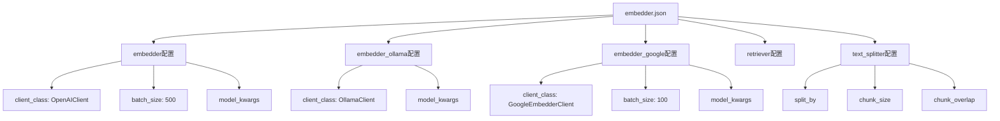
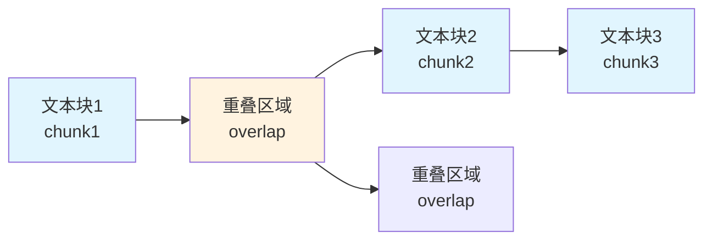
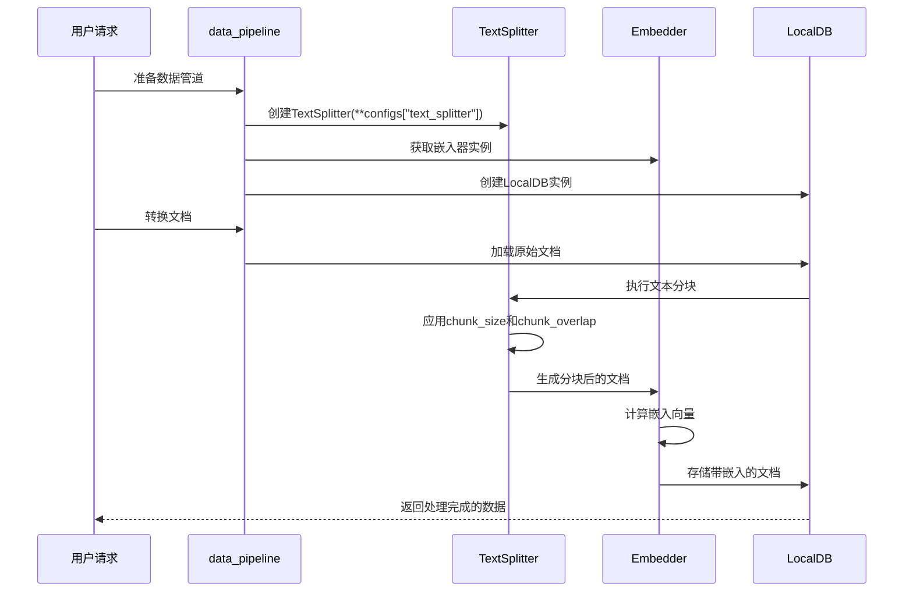
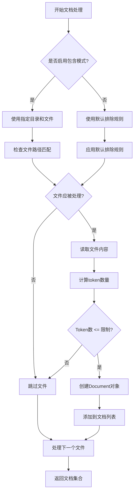
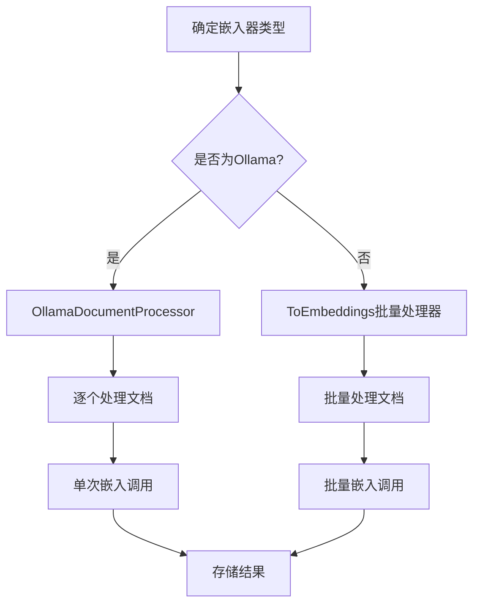
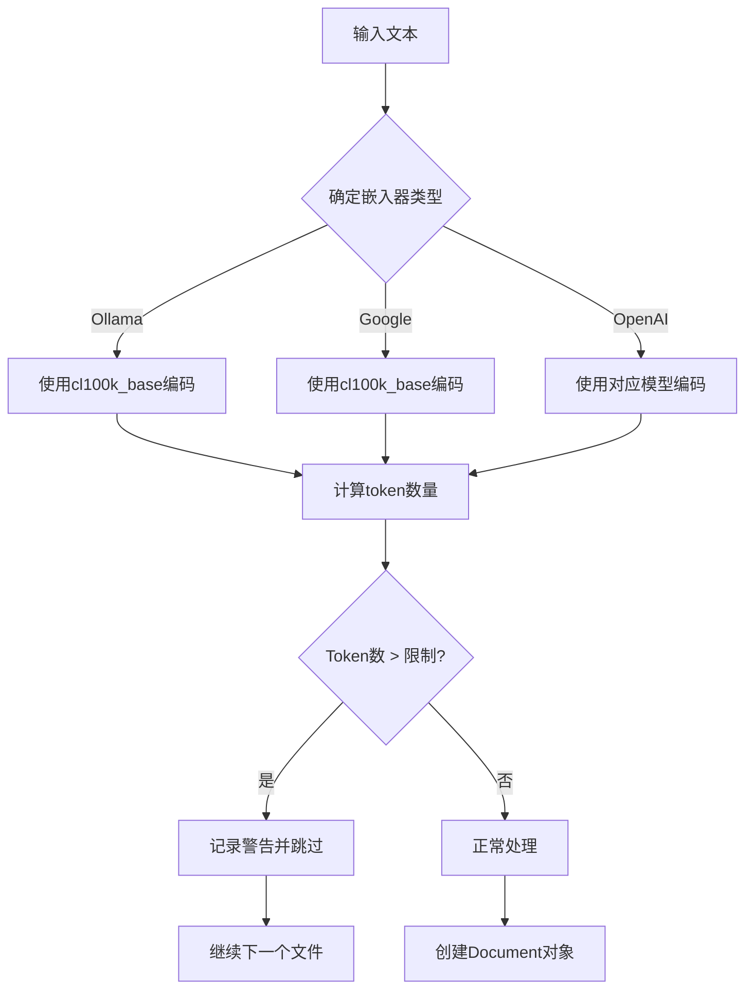
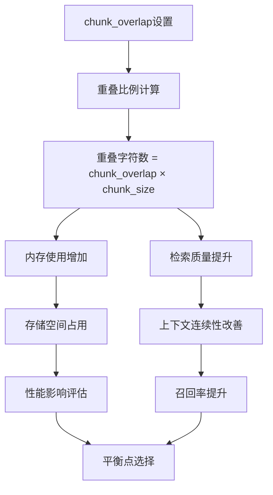
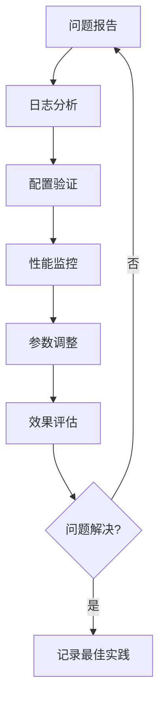

# 文本分块配置

<cite>
**本文档引用的文件**
- [embedder.json](file://api/config/embedder.json)
- [data_pipeline.py](file://api/data_pipeline.py)
- [embedder.py](file://api/tools/embedder.py)
- [config.py](file://api/config.py)
- [test_all_embedders.py](file://tests/unit/test_all_embedders.py)
- [websocket_wiki.py](file://api/websocket_wiki.py)
- [ollama_patch.py](file://api/ollama_patch.py)
</cite>

## 目录
1. [简介](#简介)
2. [配置文件结构](#配置文件结构)
3. [核心参数详解](#核心参数详解)
4. [文档处理流程](#文档处理流程)
5. [分块算法实现](#分块算法实现)
6. [配置优化建议](#配置优化建议)
7. [实际应用示例](#实际应用示例)
8. [性能影响分析](#性能影响分析)
9. [故障排除指南](#故障排除指南)
10. [总结](#总结)

## 简介

deepwiki-open项目采用基于Adalflow框架的文本分块策略，通过精心设计的text_splitter配置来优化嵌入质量和检索准确性。文本分块是RAG（检索增强生成）系统中的关键环节，直接影响向量数据库的存储效率和查询质量。

本文档深入解析embedder.json中text_splitter配置的各项参数，结合data_pipeline.py中的具体实现，为开发者提供全面的配置指导和最佳实践建议。

## 配置文件结构

### embedder.json配置架构



**图表来源**
- [embedder.json](file://api/config/embedder.json#L1-L33)

**章节来源**
- [embedder.json](file://api/config/embedder.json#L1-L33)

## 核心参数详解

### split_by - 分块依据定义

`split_by`参数定义了文本分块的基本单位，支持以下选项：

| 参数值 | 含义 | 适用场景 | 特点 |
|--------|------|----------|------|
| `"word"` | 按单词分块 | 默认配置，通用性强 | 保持语义完整性，适合大多数文档类型 |
| `"sentence"` | 按句子分块 | 科技文档、学术论文 | 句子边界明确，语义清晰 |
| `"paragraph"` | 按段落分块 | 文章、博客 | 保持完整段落，适合阅读理解 |
| `"character"` | 按字符分块 | 特殊需求场景 | 精确控制，但可能破坏语义 |

### chunk_size - 块大小控制

`chunk_size`参数控制每个文本块的最大长度，单位为token或字符：

| 配置值 | 推荐用途 | 性能特点 | 适用文档类型 |
|--------|----------|----------|--------------|
| 100-200 | 小型函数、类定义 | 高精度，低覆盖度 | 代码片段、API文档 |
| 250-400 | 中等模块、方法 | 平衡性能与质量 | 业务逻辑、算法实现 |
| 400-600 | 完整功能模块 | 高覆盖度，适度精度 | 整体功能、设计文档 |
| 600+ | 大型文档、教程 | 最大覆盖度 | 用户手册、架构文档 |

### chunk_overlap - 重叠区域设置

`chunk_overlap`参数设置相邻文本块之间的重叠字符数，确保上下文连续性：



**图表来源**
- [data_pipeline.py](file://api/data_pipeline.py#L396)

**章节来源**
- [embedder.json](file://api/config/embedder.json#L28-L32)

## 文档处理流程

### 数据管道架构



**图表来源**
- [data_pipeline.py](file://api/data_pipeline.py#L373-L415)

### 文档读取与过滤机制

系统采用智能的文档读取策略，支持包含模式和排除模式：



**图表来源**
- [data_pipeline.py](file://api/data_pipeline.py#L144-L371)

**章节来源**
- [data_pipeline.py](file://api/data_pipeline.py#L144-L371)

## 分块算法实现

### TextSplitter初始化

系统通过`prepare_data_pipeline`函数创建文本分块器：

```python
# 关键代码路径
splitter = TextSplitter(**configs["text_splitter"])
```

这行代码从配置文件中读取text_splitter参数，并传递给Adalflow的TextSplitter组件。

### 嵌入器选择策略

根据不同的嵌入器类型，系统采用不同的处理策略：



**图表来源**
- [data_pipeline.py](file://api/data_pipeline.py#L401-L410)
- [ollama_patch.py](file://api/ollama_patch.py#L62-L83)

### Token计数机制

系统使用tiktoken库进行精确的token计数：



**图表来源**
- [data_pipeline.py](file://api/data_pipeline.py#L27-L67)

**章节来源**
- [data_pipeline.py](file://api/data_pipeline.py#L27-L67)
- [data_pipeline.py](file://api/data_pipeline.py#L373-L415)

## 配置优化建议

### 代码文件配置策略

对于代码文件，推荐使用较小的chunk_size以保持语义完整性：

```json
{
  "text_splitter": {
    "split_by": "word",
    "chunk_size": 250,
    "chunk_overlap": 50
  }
}
```

**配置特点：**
- 较小的chunk_size确保函数和类定义不被分割
- 适当的chunk_overlap保留上下文信息
- word级别的分割符合编程语言的语法结构

### Markdown文档配置策略

对于Markdown文档，可以使用较大的chunk_size：

```json
{
  "text_splitter": {
    "split_by": "paragraph",
    "chunk_size": 500,
    "chunk_overlap": 100
  }
}
```

**配置特点：**
- paragraph级别的分割保持段落完整性
- 较大的chunk_size提高检索覆盖率
- 适中的chunk_overlap确保上下文连贯

### 动态配置调整

系统支持运行时动态调整分块参数：


**图表来源**
- [websocket_wiki.py](file://api/websocket_wiki.py#L85-L96)

**章节来源**
- [websocket_wiki.py](file://api/websocket_wiki.py#L85-L96)

## 实际应用示例

### 示例1：Python代码分块

假设有一个Python函数：

```python
def calculate_sum(a, b):
    """计算两个数字的和"""
    result = a + b
    return result
```

使用当前配置（chunk_size=350, chunk_overlap=100）的分块效果：


### 示例2：Markdown文档分块

对于一段Markdown文档：

```markdown
# API文档

## 用户认证

用户需要提供有效的API密钥才能访问服务。

## 请求格式

所有请求必须使用JSON格式：
```json
{
  "method": "POST",
  "url": "/api/v1/users"
}
```
```

分块策略会将标题、段落和代码块分别处理，确保语义完整性。

**章节来源**
- [data_pipeline.py](file://api/data_pipeline.py#L144-L371)

## 性能影响分析

### chunk_size对性能的影响

| chunk_size范围 | 上下文碎片化风险 | 信息冗余程度 | 检索准确性 | 存储开销 |
|----------------|------------------|--------------|------------|----------|
| 50-150 | 高 | 低 | 极高 | 低 |
| 150-300 | 中 | 中 | 高 | 中 |
| 300-500 | 低 | 中 | 中 | 高 |
| 500+ | 低 | 高 | 低 | 高 |

### chunk_overlap的权衡



### 嵌入计算复杂度

不同嵌入器的性能特征：

| 嵌入器类型 | 批处理大小 | 单次延迟 | 并发能力 | 适用场景 |
|------------|------------|----------|----------|----------|
| OpenAI | 500 | 中等 | 高 | 大规模文档处理 |
| Google | 100 | 低 | 中等 | 中等规模处理 |
| Ollama | 1 | 高 | 低 | 本地部署、小规模 |

**章节来源**
- [data_pipeline.py](file://api/data_pipeline.py#L25)
- [embedder.py](file://api/tools/embedder.py#L49-L54)

## 故障排除指南

### 常见问题诊断

#### 问题1：分块后语义不完整

**症状：** 检索结果出现语义断裂

**解决方案：**
1. 增加chunk_overlap值
2. 调整split_by参数
3. 检查chunk_size是否过小

#### 问题2：内存使用过高

**症状：** 系统内存占用异常

**解决方案：**
1. 减少chunk_size
2. 降低chunk_overlap
3. 使用更高效的嵌入器

#### 问题3：检索质量下降

**症状：** 相关文档召回率低

**解决方案：**
1. 增加chunk_size
2. 优化split_by策略
3. 调整检索参数

### 调试工具和技巧



**章节来源**
- [data_pipeline.py](file://api/data_pipeline.py#L21-L23)

## 总结

deepwiki-open项目的文本分块配置展现了现代RAG系统的最佳实践。通过精心设计的text_splitter参数，系统能够在以下方面取得平衡：

### 关键优势

1. **灵活性**：支持多种分块策略适应不同文档类型
2. **可扩展性**：动态配置支持运行时调整
3. **性能优化**：智能的token管理和批处理策略
4. **质量保证**：完善的错误处理和日志记录

### 最佳实践建议

1. **根据文档类型选择合适的配置**：代码文件使用较小的chunk_size，文档使用较大的chunk_size
2. **合理设置chunk_overlap**：通常为chunk_size的20-30%作为起始点
3. **定期评估和调整**：根据实际使用效果持续优化配置
4. **监控性能指标**：关注内存使用、处理速度和检索质量

通过深入理解和正确配置文本分块参数，开发者可以显著提升RAG系统的整体性能和用户体验。建议在实际部署前进行充分的测试和调优，以找到最适合特定应用场景的配置组合。