# 检索器配置

<cite>
**本文档引用的文件**
- [embedder.json](file://api/config/embedder.json)
- [rag.py](file://api/rag.py)
- [config.py](file://api/config.py)
- [embedder.py](file://api/tools/embedder.py)
- [data_pipeline.py](file://api/data_pipeline.py)
- [prompts.py](file://api/prompts.py)
- [websocket_wiki.py](file://api/websocket_wiki.py)
- [simple_chat.py](file://api/simple_chat.py)
</cite>

## 目录
1. [简介](#简介)
2. [项目结构概览](#项目结构概览)
3. [核心配置文件分析](#核心配置文件分析)
4. [RAG系统架构](#rag系统架构)
5. [top_k参数详解](#top_k参数详解)
6. [检索器初始化流程](#检索器初始化流程)
7. [上下文拼接机制](#上下文拼接机制)
8. [性能优化策略](#性能优化策略)
9. [配置调优指南](#配置调优指南)
10. [最佳实践建议](#最佳实践建议)

## 简介

deepwiki-open是一个基于RAG（检索增强生成）技术的智能问答系统，专门用于处理GitHub仓库内容的语义理解和回答。本文档重点分析系统中`embedder.json`配置文件中retriever节点的`top_k`参数，探讨其在向量检索过程中的关键作用以及对问答系统精度和性能的影响。

该系统采用FAISS作为向量检索引擎，通过精心设计的检索器配置实现高效的文档片段检索，为后续的生成式问答提供高质量的上下文信息。

## 项目结构概览

deepwiki-open项目采用模块化架构设计，主要包含以下核心组件：

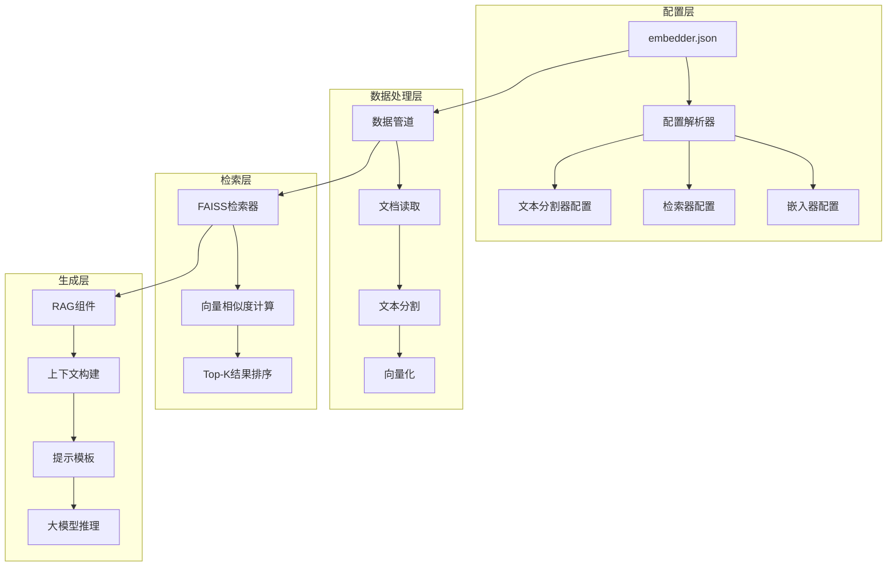

**图表来源**
- [embedder.json](file://api/config/embedder.json#L1-L34)
- [rag.py](file://api/rag.py#L1-L50)

## 核心配置文件分析

### embedder.json配置结构

系统的核心配置位于`api/config/embedder.json`文件中，该文件定义了嵌入器、检索器和文本分割器的各项参数：

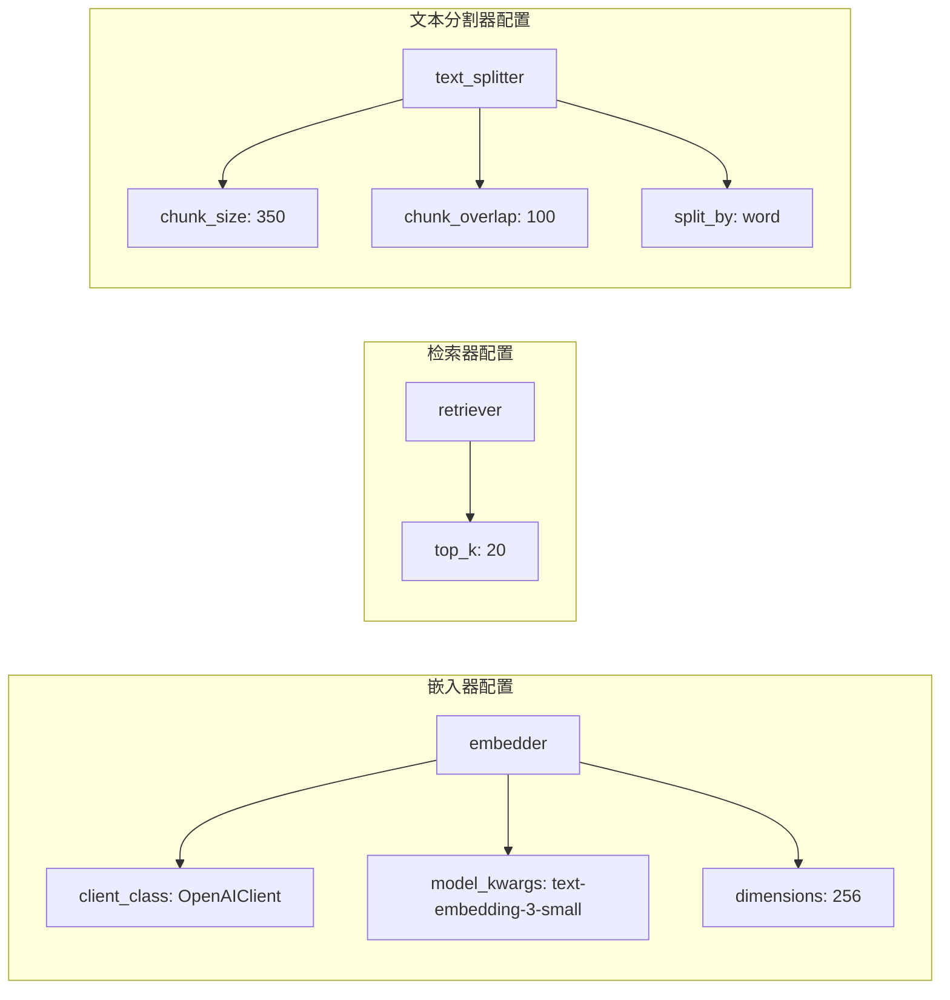

**图表来源**
- [embedder.json](file://api/config/embedder.json#L1-L34)

**节来源**
- [embedder.json](file://api/config/embedder.json#L1-L34)

### 配置加载机制

系统通过配置管理模块动态加载和验证配置参数：

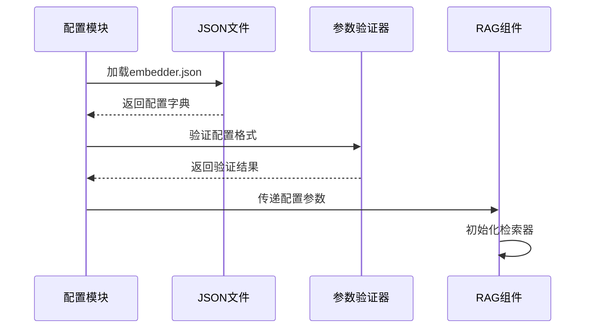

**图表来源**
- [config.py](file://api/config.py#L96-L118)
- [rag.py](file://api/rag.py#L171-L175)

**节来源**
- [config.py](file://api/config.py#L96-L118)
- [rag.py](file://api/rag.py#L171-L175)

## RAG系统架构

### 整体工作流程

RAG系统遵循标准的检索增强生成流程，但在深度代码分析场景下进行了特殊优化：

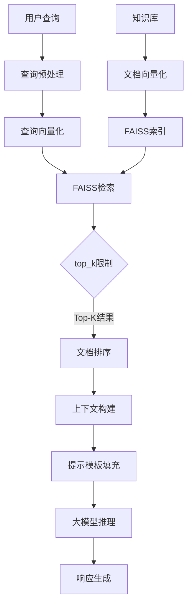

**图表来源**
- [rag.py](file://api/rag.py#L416-L446)
- [data_pipeline.py](file://api/data_pipeline.py#L373-L416)

### RAG类核心功能

RAG类是系统的核心组件，负责协调各个子模块的工作：

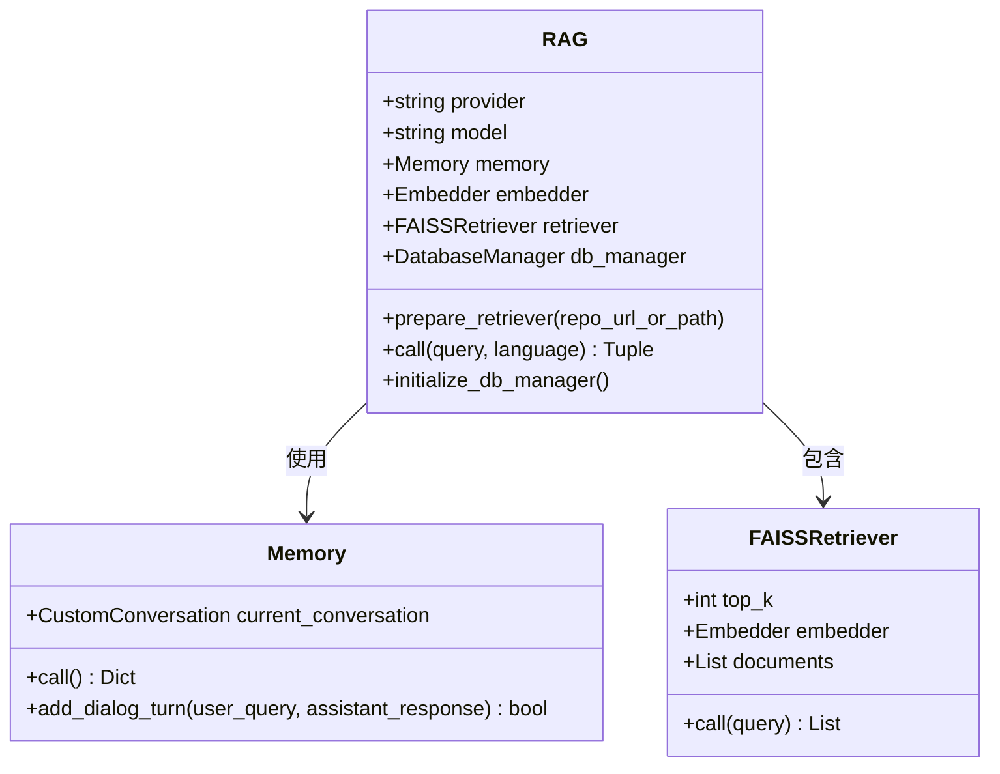

**图表来源**
- [rag.py](file://api/rag.py#L153-L250)

**节来源**
- [rag.py](file://api/rag.py#L153-L250)

## top_k参数详解

### 参数定义与默认值

在`embedder.json`配置文件中，`top_k`参数定义为：

```json
{
  "retriever": {
    "top_k": 20
  }
}
```

这个参数直接控制FAISS检索器返回的最相关文档片段数量，默认值为20。

### top_k的作用机制

top_k参数在检索过程中的作用机制如下：

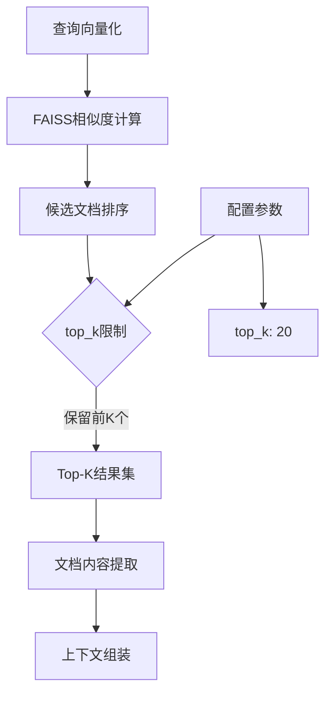

**图表来源**
- [rag.py](file://api/rag.py#L385-L390)

### 权衡策略分析

#### top_k值过低的影响

当`top_k`设置过小时（如5或10），可能导致以下问题：

1. **上下文缺失**：重要信息可能被排除在检索结果之外
2. **回答质量下降**：缺乏足够的上下文支持，导致回答不够准确
3. **覆盖范围不足**：对于复杂查询，单一文档可能无法涵盖所有相关信息

#### top_k值过高的影响

当`top_k`设置过大时（如50或更高），可能产生：

1. **噪声增加**：低相关性的文档混入，干扰主要信息
2. **性能下降**：更多的文档需要处理，增加计算开销
3. **上下文冗余**：重复信息增多，降低信息密度

**节来源**
- [rag.py](file://api/rag.py#L385-L390)

## 检索器初始化流程

### FAISS检索器创建

检索器的初始化过程涉及多个关键步骤：

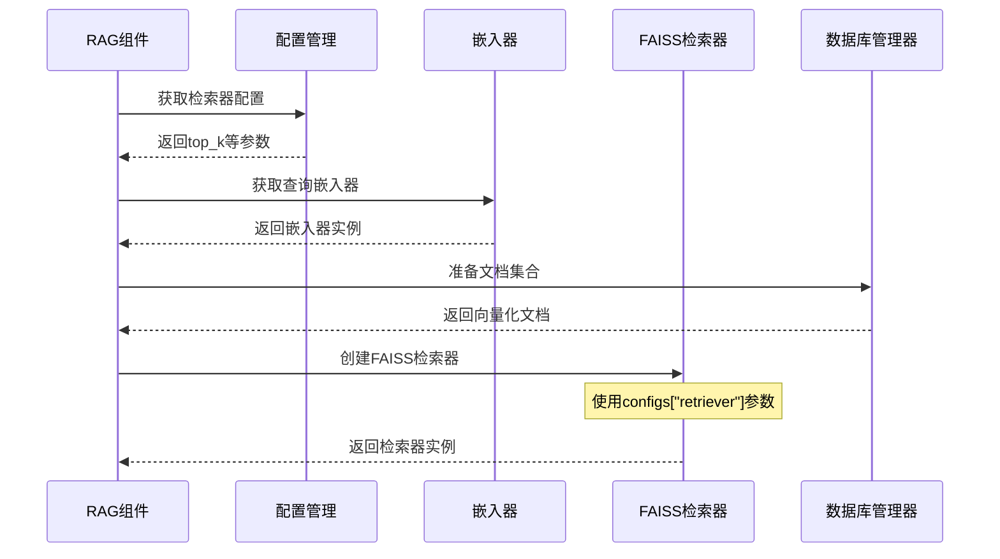

**图表来源**
- [rag.py](file://api/rag.py#L382-L415)

### 参数传递机制

top_k参数通过以下路径传递到FAISS检索器：

1. **配置加载阶段**：从`embedder.json`读取配置
2. **RAG初始化阶段**：通过`configs["retriever"]`访问
3. **检索器创建阶段**：作为关键字参数传递给FAISSRetriever构造函数

**节来源**
- [rag.py](file://api/rag.py#L382-L415)

## 上下文拼接机制

### 文档分组策略

系统采用基于文件路径的文档分组策略，提高上下文的组织性和可读性：

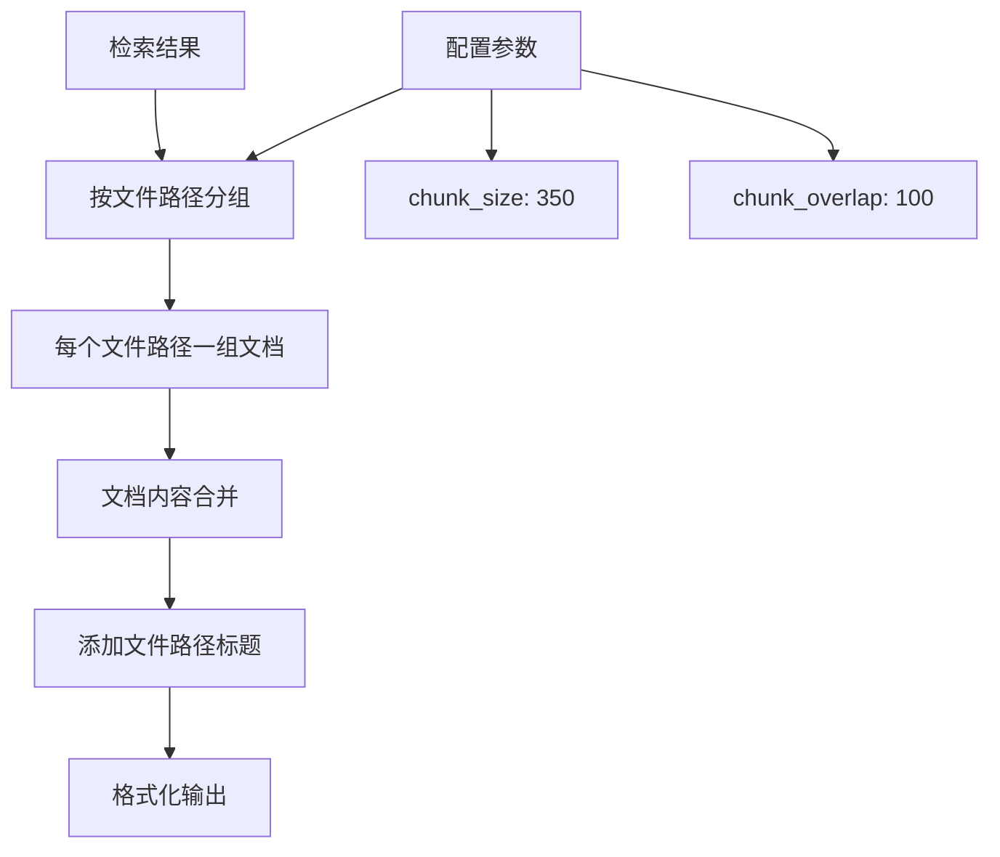

**图表来源**
- [simple_chat.py](file://api/simple_chat.py#L209-L228)

### 提示模板集成

检索到的上下文信息被整合到RAG模板中：

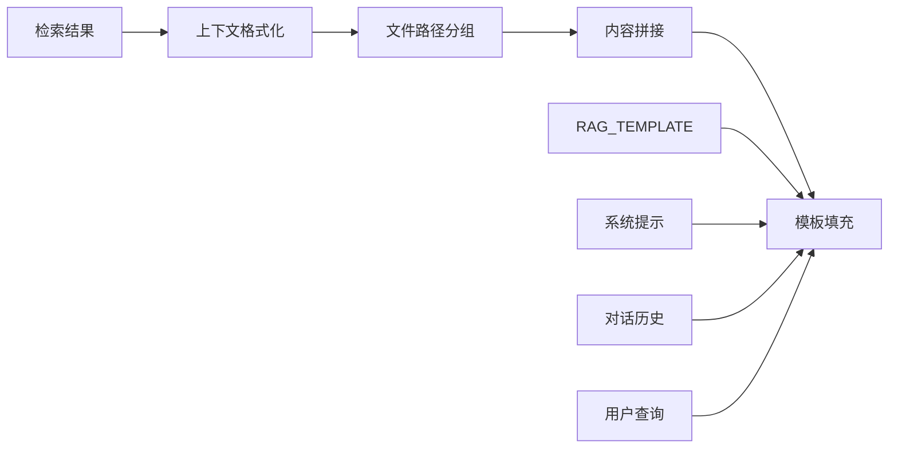

**图表来源**
- [prompts.py](file://api/prompts.py#L30-L65)

**节来源**
- [simple_chat.py](file://api/simple_chat.py#L209-L228)
- [prompts.py](file://api/prompts.py#L30-L65)

## 性能优化策略

### 向量验证机制

系统实现了严格的向量验证机制，确保检索质量：

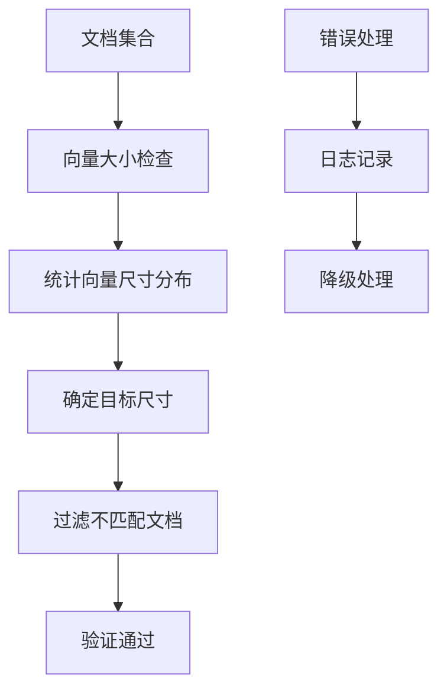

**图表来源**
- [rag.py](file://api/rag.py#L251-L343)

### 批处理优化

对于不同的嵌入器类型，系统采用相应的批处理策略：

- **Ollama嵌入器**：使用单文档处理模式
- **OpenAI/Google嵌入器**：采用批量处理提升效率

**节来源**
- [rag.py](file://api/rag.py#L251-L343)
- [data_pipeline.py](file://api/data_pipeline.py#L373-L416)

## 配置调优指南

### 不同场景的推荐配置

#### 小型项目（< 100 文件）

```json
{
  "retriever": {
    "top_k": 10
  },
  "text_splitter": {
    "chunk_size": 500,
    "chunk_overlap": 100
  }
}
```

#### 中型项目（100-1000 文件）

```json
{
  "retriever": {
    "top_k": 20
  },
  "text_splitter": {
    "chunk_size": 350,
    "chunk_overlap": 100
  }
}
```

#### 大型项目（> 1000 文件）

```json
{
  "retriever": {
    "top_k": 30
  },
  "text_splitter": {
    "chunk_size": 250,
    "chunk_overlap": 80
  }
}
```

### 调优原则

1. **知识库规模**：文件数量越多，适当增加top_k值
2. **查询复杂度**：复杂查询需要更多上下文支持
3. **性能要求**：高并发场景应适当降低top_k值
4. **准确性优先**：对于关键应用，可以适当增加top_k值

## 最佳实践建议

### 配置监控与评估

建议建立以下监控指标：

| 指标名称 | 计算方法 | 目标值 |
|---------|---------|--------|
| 检索准确率 | 相关文档占比 | > 80% |
| 平均检索时间 | 检索耗时统计 | < 2秒 |
| 上下文长度 | 拼接后上下文字符数 | 5000-10000 |
| 回答质量评分 | 用户满意度调查 | > 4.0/5.0 |

### 迭代优化流程

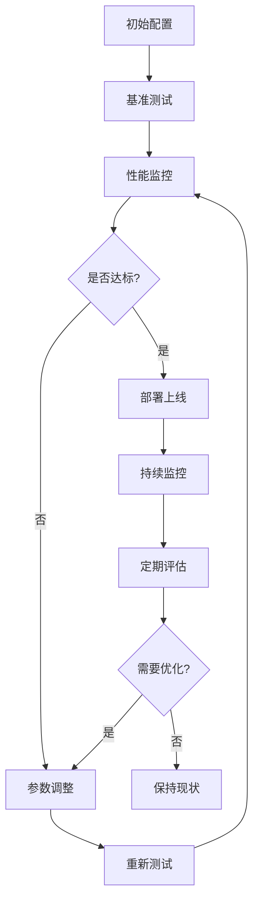

### 与其他配置的协同

top_k参数需要与以下配置参数协同优化：

1. **chunk_size**：较小的chunk_size配合较高的top_k值
2. **chunk_overlap**：适当的重叠确保上下文连续性
3. **嵌入维度**：高维向量可能需要更高的top_k值

**节来源**
- [embedder.json](file://api/config/embedder.json#L25-L34)

## 结论

`embedder.json`中retriever节点的`top_k`参数是RAG系统的关键配置项，直接影响检索质量和系统性能。通过合理的配置和持续的优化，可以在准确性、性能和资源消耗之间找到最佳平衡点。建议根据具体的应用场景和需求，采用本文档提供的调优指南和最佳实践，实现最优的检索效果。