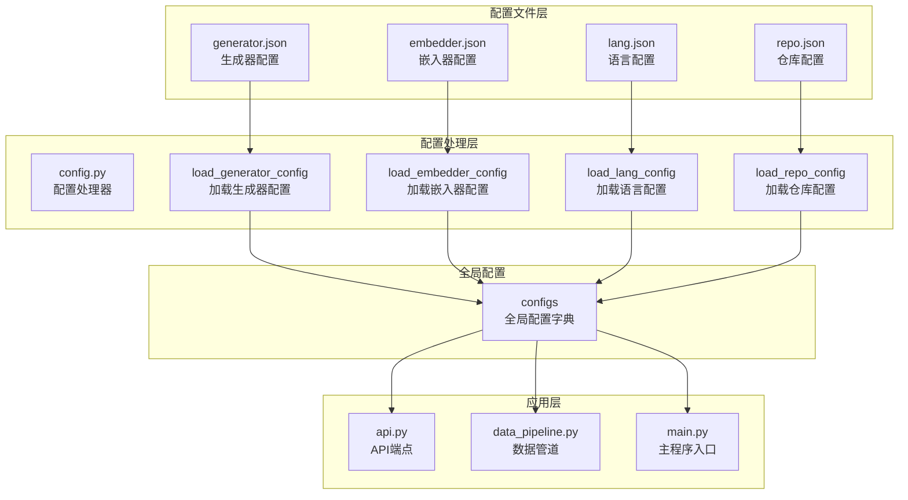
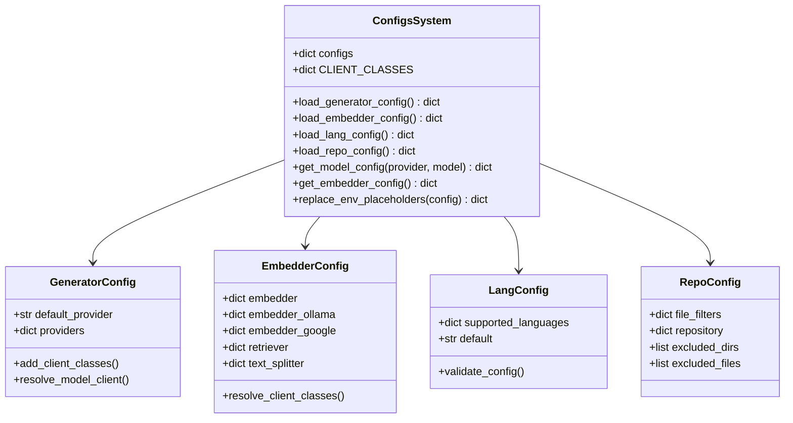
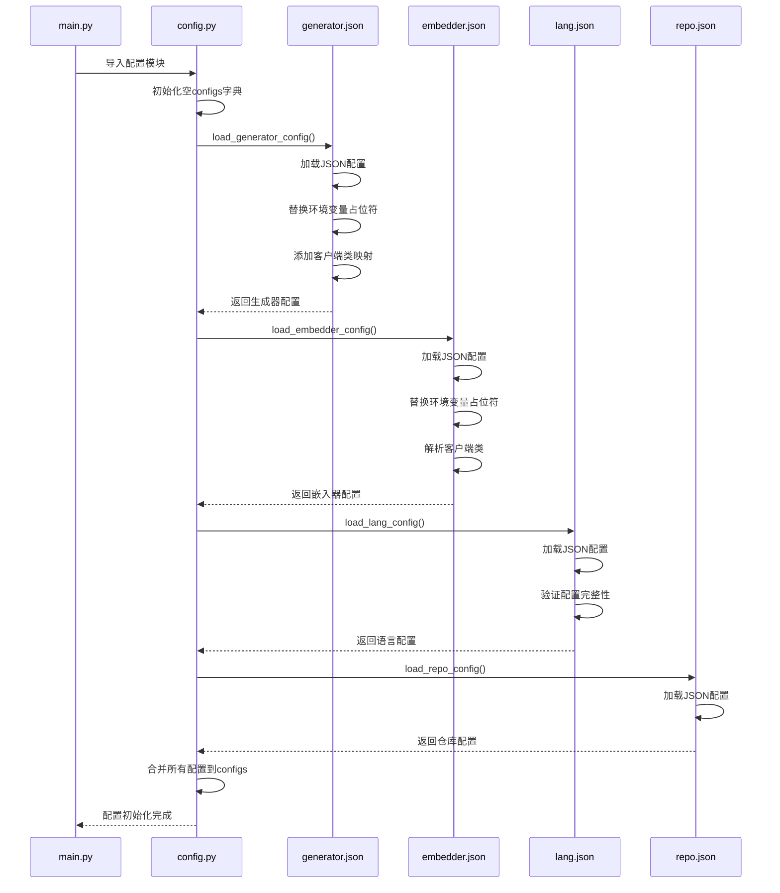
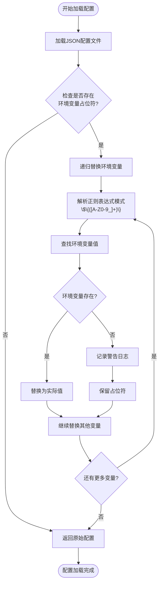
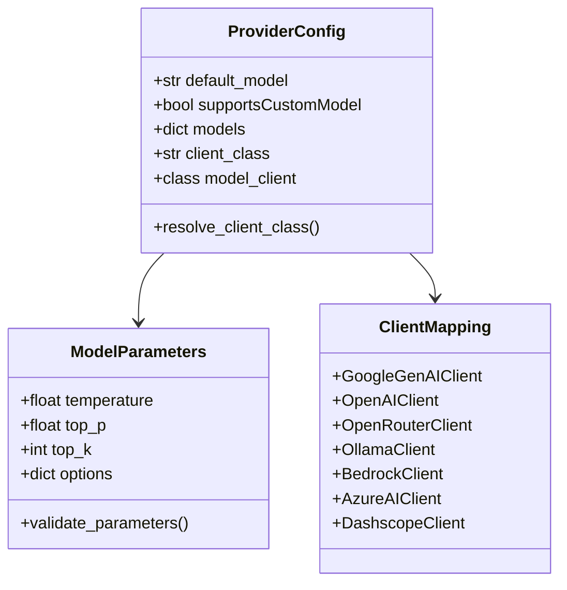
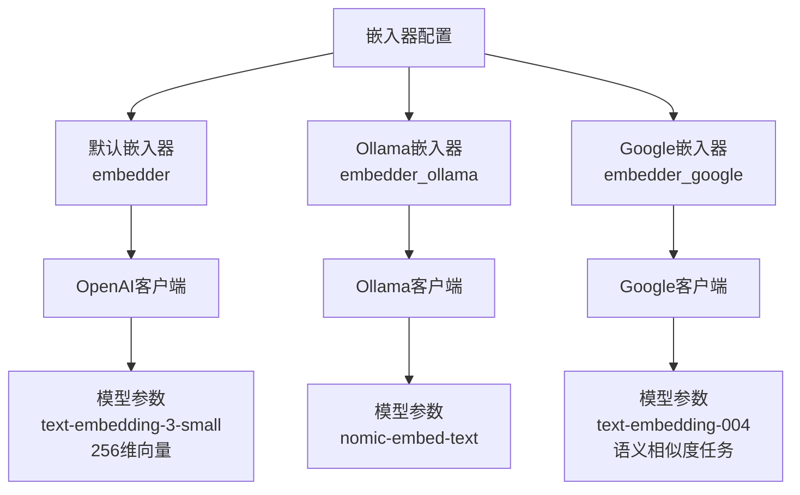
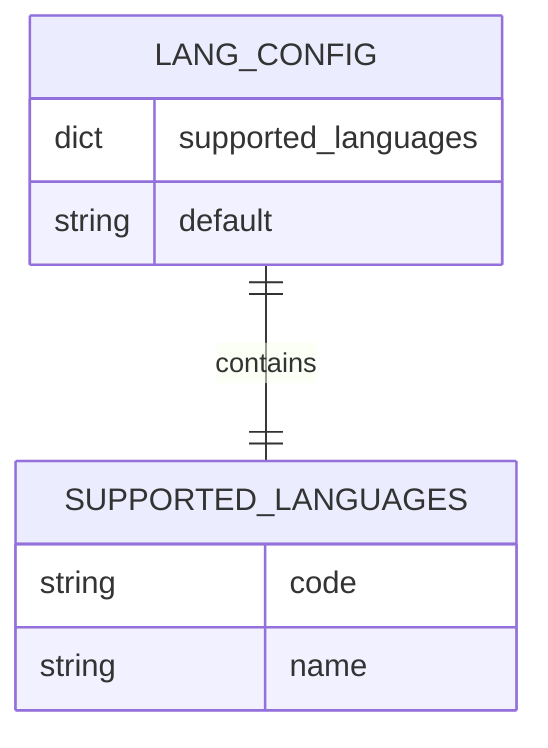
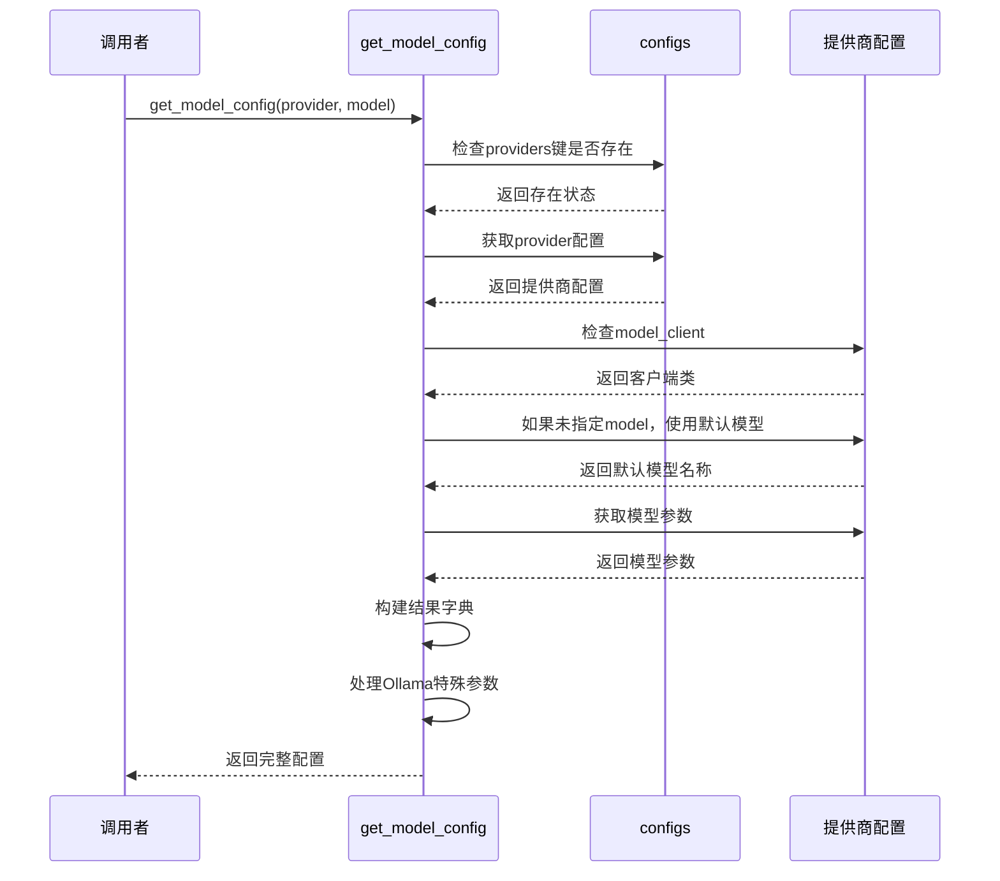
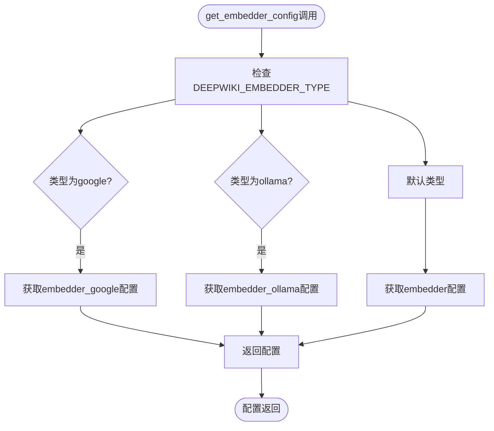
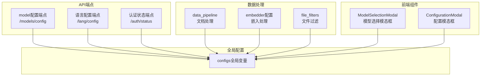

# 全局配置对象

<cite>
**本文档中引用的文件**
- [api/config.py](file://api/config.py)
- [api/main.py](file://api/main.py)
- [api/api.py](file://api/api.py)
- [api/config/generator.json](file://api/config/generator.json)
- [api/config/embedder.json](file://api/config/embedder.json)
- [api/config/lang.json](file://api/config/lang.json)
- [api/config/repo.json](file://api/config/repo.json)
- [api/data_pipeline.py](file://api/data_pipeline.py)
</cite>

## 目录
1. [简介](#简介)
2. [项目结构概述](#项目结构概述)
3. [configs全局变量设计](#configs全局变量设计)
4. [配置文件加载机制](#配置文件加载机制)
5. [核心配置组件分析](#核心配置组件分析)
6. [配置查询与使用](#配置查询与使用)
7. [系统集成与依赖关系](#系统集成与依赖关系)
8. [性能考虑](#性能考虑)
9. [故障排除指南](#故障排除指南)
10. [总结](#总结)

## 简介

deepwiki-open项目中的`configs`全局变量是一个精心设计的配置管理系统的核心组件，它作为整个应用程序运行时的单一配置源，统一管理所有类型的配置信息。该系统采用模块化设计，支持多种AI提供商、嵌入器类型、语言设置和仓库过滤规则，为深度知识图谱构建提供了灵活且可扩展的配置框架。

configs系统的核心价值在于：
- **统一性**：将分散在各个配置文件中的设置集中到一个全局字典对象中
- **灵活性**：支持动态配置加载和环境变量替换
- **可扩展性**：易于添加新的配置类型和提供商
- **一致性**：确保整个应用使用一致的配置数据

## 项目结构概述

deepwiki-open项目的配置系统采用分层架构设计，主要包含以下组件：

**图表来源**
- [api/config.py](file://api/config.py#L303-L332)
- [api/api.py](file://api/api.py#L147)
- [api/data_pipeline.py](file://api/data_pipeline.py#L199-L205)

## configs全局变量设计

### 基本架构

configs全局变量是一个空字典，在程序启动时通过一系列配置加载函数逐步填充。这种设计遵循了延迟初始化原则，确保只有在需要时才加载相应的配置。

**图表来源**
- [api/config.py](file://api/config.py#L55-L64)
- [api/config.py](file://api/config.py#L120-L145)
- [api/config.py](file://api/config.py#L147-L158)

### 初始化流程

configs的初始化遵循严格的顺序，确保依赖关系得到正确处理：

**图表来源**
- [api/config.py](file://api/config.py#L307-L332)
- [api/main.py](file://api/main.py#L58-L61)

**章节来源**
- [api/config.py](file://api/config.py#L303-L332)

## 配置文件加载机制

### 环境变量处理

configs系统实现了强大的环境变量替换功能，支持在配置文件中使用`${ENV_VAR}`语法引用环境变量：

**图表来源**
- [api/config.py](file://api/config.py#L66-L94)

### 配置文件结构

每个配置文件都有特定的结构和用途：

| 配置文件 | 主要内容 | 关键字段 | 用途 |
|---------|---------|---------|------|
| generator.json | AI生成器配置 | providers, default_provider | 定义可用的AI提供商和模型参数 |
| embedder.json | 嵌入器配置 | embedder, embedder_ollama, embedder_google | 设置文本嵌入服务配置 |
| lang.json | 语言配置 | supported_languages, default | 定义支持的语言和默认语言 |
| repo.json | 仓库配置 | file_filters, repository | 控制文件过滤和仓库大小限制 |

**章节来源**
- [api/config.py](file://api/config.py#L96-L118)
- [api/config/generator.json](file://api/config/generator.json#L1-L200)
- [api/config/embedder.json](file://api/config/embedder.json#L1-L34)
- [api/config/lang.json](file://api/config/lang.json#L1-L16)
- [api/config/repo.json](file://api/config/repo.json#L1-L129)

## 核心配置组件分析

### 生成器配置（Providers）

生成器配置是configs系统中最复杂的部分，支持多个AI提供商：

**图表来源**
- [api/config.py](file://api/config.py#L120-L145)
- [api/config/generator.json](file://api/config/generator.json#L22-L196)

#### 支持的AI提供商

configs系统支持以下AI提供商：

| 提供商 | 默认模型 | 特殊功能 | 客户端类 |
|--------|---------|---------|----------|
| google | gemini-2.5-flash | 支持top_k参数 | GoogleGenAIClient |
| openai | gpt-5-nano | 支持o1系列模型 | OpenAIClient |
| openrouter | openai/gpt-5-nano | 模型路由功能 | OpenRouterClient |
| ollama | qwen3:1.7b | 本地模型支持 | OllamaClient |
| bedrock | anthropic.claude-3-sonnet-20240229-v1:0 | AWS云服务 | BedrockClient |
| azure | gpt-4o | Azure云服务 | AzureAIClient |
| dashscope | qwen-plus | 阿里云服务 | DashscopeClient |

### 嵌入器配置

嵌入器配置负责管理文本嵌入服务，支持多种嵌入器类型：

**图表来源**
- [api/config.py](file://api/config.py#L147-L158)
- [api/config/embedder.json](file://api/config/embedder.json#L1-L34)

### 语言配置

语言配置定义了系统支持的语言集合和默认语言设置：

**图表来源**
- [api/config.py](file://api/config.py#L233-L260)
- [api/config/lang.json](file://api/config/lang.json#L2-L14)

**章节来源**
- [api/config.py](file://api/config.py#L120-L158)
- [api/config/generator.json](file://api/config/generator.json#L1-L200)
- [api/config/embedder.json](file://api/config/embedder.json#L1-L34)
- [api/config/lang.json](file://api/config/lang.json#L1-L16)

## 配置查询与使用

### get_model_config函数

`get_model_config`函数是configs系统的核心查询接口，负责从配置中提取指定AI提供商的完整客户端配置：

**图表来源**
- [api/config.py](file://api/config.py#L334-L387)

#### 配置提取过程详解

get_model_config函数的执行流程体现了configs系统的智能配置管理：

1. **验证配置完整性**：检查providers字典是否存在
2. **获取提供商配置**：根据provider参数定位具体配置
3. **验证客户端类**：确保model_client已正确设置
4. **处理默认模型**：如果未指定模型，则使用提供商的默认模型
5. **提取模型参数**：从models字典中获取指定模型的参数
6. **构建最终配置**：根据提供商类型调整参数结构

### get_embedder_config函数

嵌入器配置查询函数提供了灵活的嵌入器选择机制：

**图表来源**
- [api/config.py](file://api/config.py#L160-L173)

**章节来源**
- [api/config.py](file://api/config.py#L334-L387)
- [api/config.py](file://api/config.py#L160-L173)

## 系统集成与依赖关系

### 应用层集成

configs系统在多个应用层面发挥关键作用：

**图表来源**
- [api/api.py](file://api/api.py#L149-L166)
- [api/api.py](file://api/api.py#L167-L225)
- [api/data_pipeline.py](file://api/data_pipeline.py#L199-L205)

### 配置使用示例

configs在不同模块中的典型使用模式：

| 使用场景 | 配置访问方式 | 主要用途 |
|---------|-------------|----------|
| API端点响应 | `configs["lang_config"]` | 提供语言配置信息 |
| 模型选择 | `get_model_config()` | 获取AI模型配置 |
| 嵌入处理 | `get_embedder_config()` | 获取嵌入器配置 |
| 文件过滤 | `configs["file_filters"]` | 控制文件处理范围 |
| 语言检测 | `configs["lang_config"]["supported_languages"]` | 支持的语言列表 |

**章节来源**
- [api/api.py](file://api/api.py#L149-L166)
- [api/api.py](file://api/api.py#L167-L225)
- [api/data_pipeline.py](file://api/data_pipeline.py#L199-L205)

## 性能考虑

configs系统在设计时充分考虑了性能优化：

### 延迟加载策略

- **按需初始化**：configs字典在模块导入时为空，仅在首次使用时加载配置
- **缓存机制**：配置一旦加载就保留在内存中，避免重复读取文件
- **环境变量优化**：只在必要时解析环境变量占位符

### 内存使用优化

- **最小化占用**：只存储必要的配置数据，不包含冗余信息
- **类型安全**：使用强类型定义确保配置数据的一致性
- **错误隔离**：单个配置文件加载失败不会影响其他配置

### 并发安全性

configs系统在多线程环境下的安全性保证：
- **不可变性**：配置加载完成后不再修改，确保线程安全
- **原子操作**：配置更新是原子性的，避免部分更新问题
- **异常处理**：完善的错误处理机制防止配置加载失败

## 故障排除指南

### 常见配置问题

| 问题类型 | 症状 | 可能原因 | 解决方案 |
|---------|------|---------|----------|
| 配置文件缺失 | 配置为空字典 | 文件不存在或路径错误 | 检查文件路径和权限 |
| 环境变量未设置 | 占位符未替换 | 环境变量未定义 | 设置必要的环境变量 |
| 客户端类未找到 | 客户端映射失败 | 客户端类名错误 | 检查CLIENT_CLASSES映射 |
| 模型参数无效 | 参数验证失败 | 参数格式错误 | 检查模型参数配置 |

### 调试技巧

1. **启用调试日志**：设置日志级别为DEBUG查看详细加载过程
2. **检查配置结构**：验证configs字典的键结构是否符合预期
3. **测试环境变量**：确认环境变量替换是否正常工作
4. **验证客户端类**：检查模型客户端类是否正确映射

**章节来源**
- [api/config.py](file://api/config.py#L79-L83)
- [api/config.py](file://api/config.py#L117-L118)

## 总结

deepwiki-open项目的configs全局变量设计体现了现代软件架构的最佳实践。通过统一的配置管理机制，系统实现了：

### 核心优势

1. **集中化管理**：将分散的配置文件整合到单一的全局字典中
2. **灵活扩展**：支持新提供商和配置类型的轻松添加
3. **环境适应**：强大的环境变量替换功能
4. **类型安全**：强类型定义确保配置数据的正确性
5. **性能优化**：延迟加载和缓存机制提升系统性能

### 设计亮点

- **模块化架构**：清晰的职责分离和依赖关系
- **错误处理**：完善的异常处理和回退机制
- **向后兼容**：支持配置格式的平滑演进
- **可测试性**：良好的模块化设计便于单元测试

configs系统不仅为deepwiki-open提供了稳定可靠的配置管理基础，也为类似项目的配置系统设计提供了有价值的参考。其设计理念和实现方式充分体现了软件工程中的关注点分离、开闭原则和单一职责原则等核心概念。