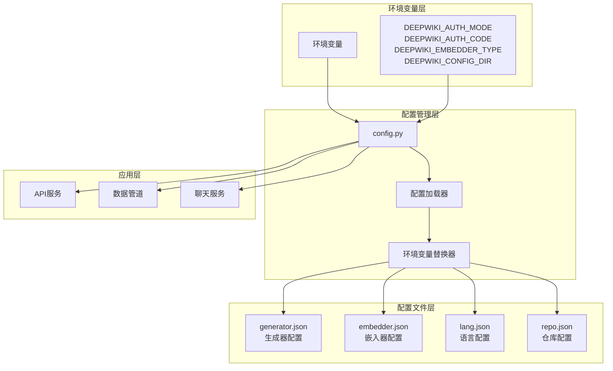
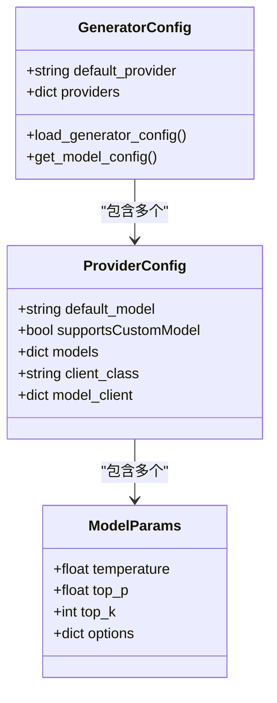
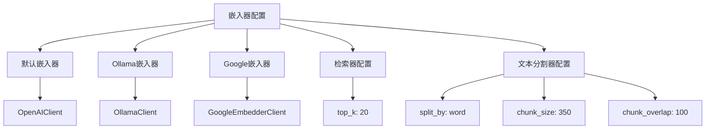
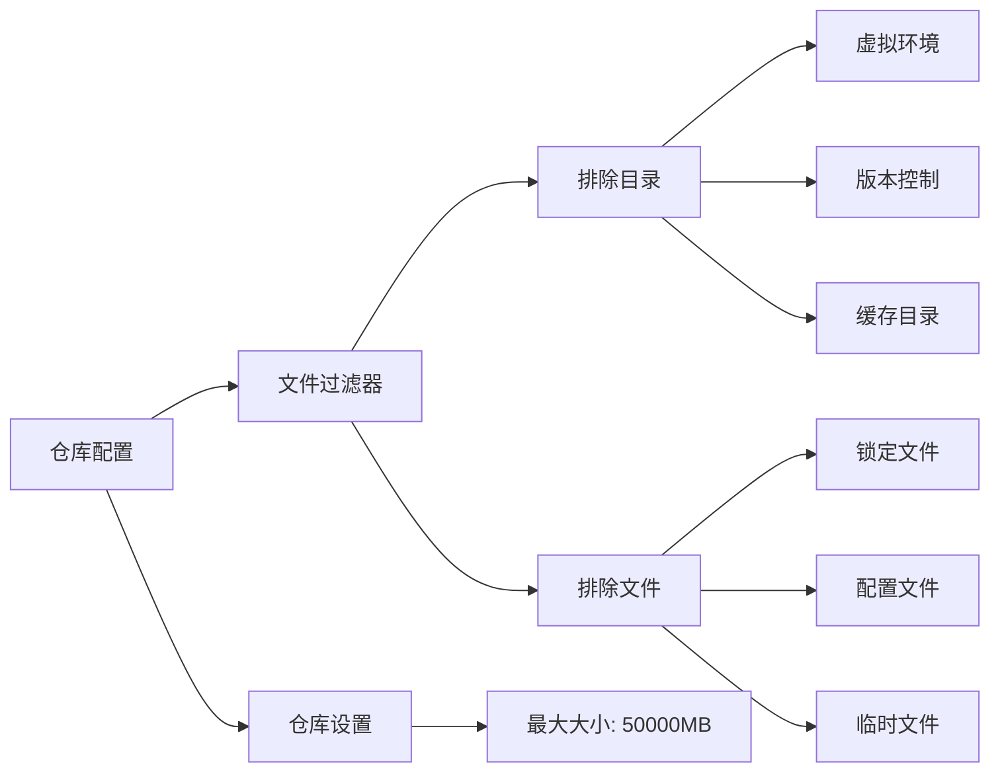
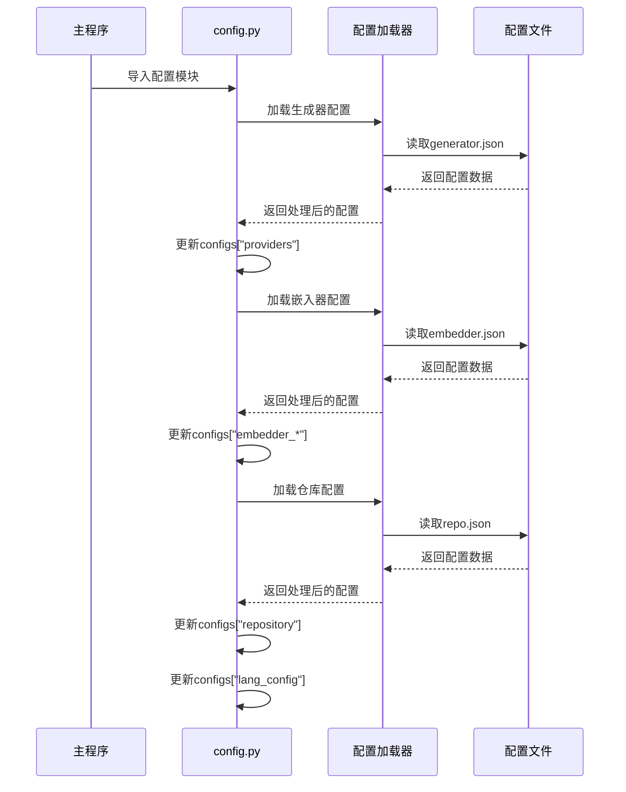
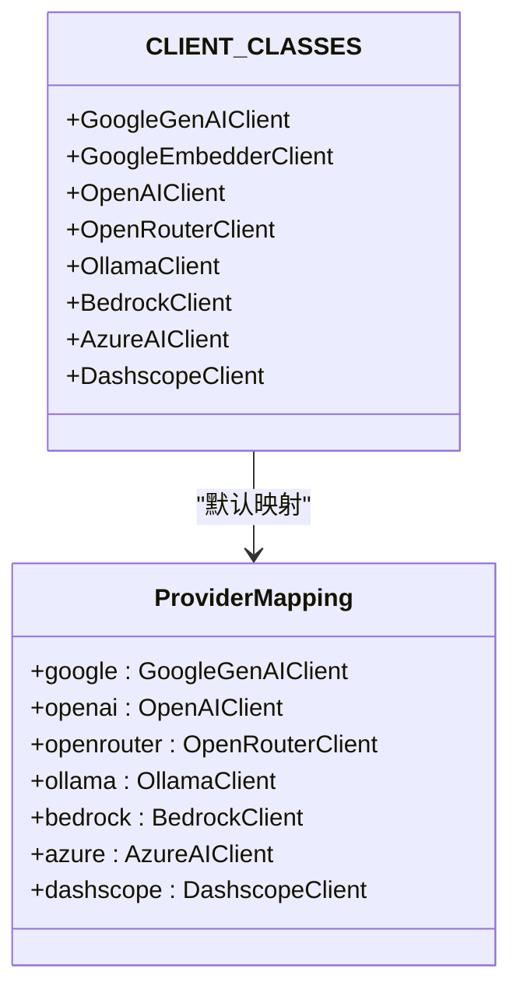
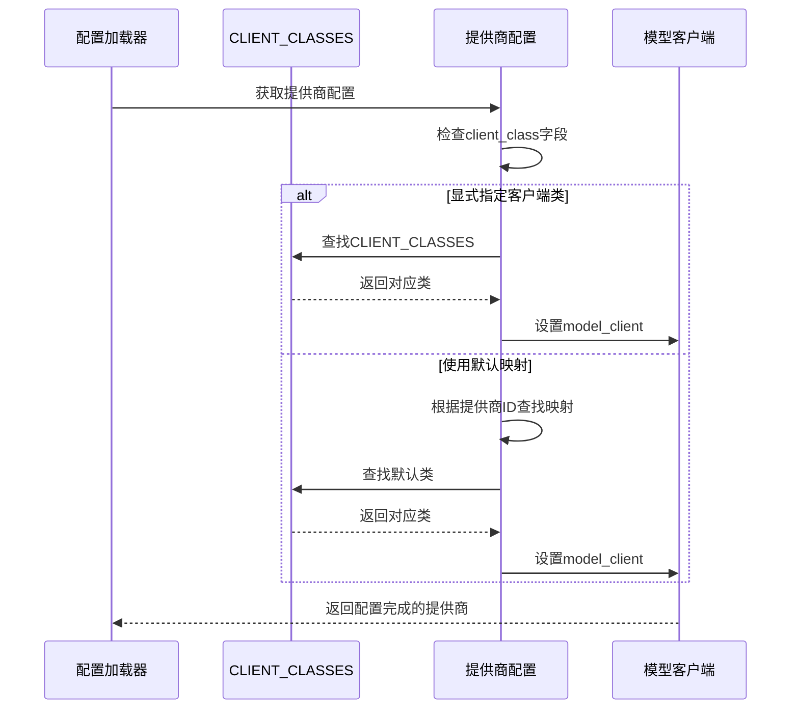
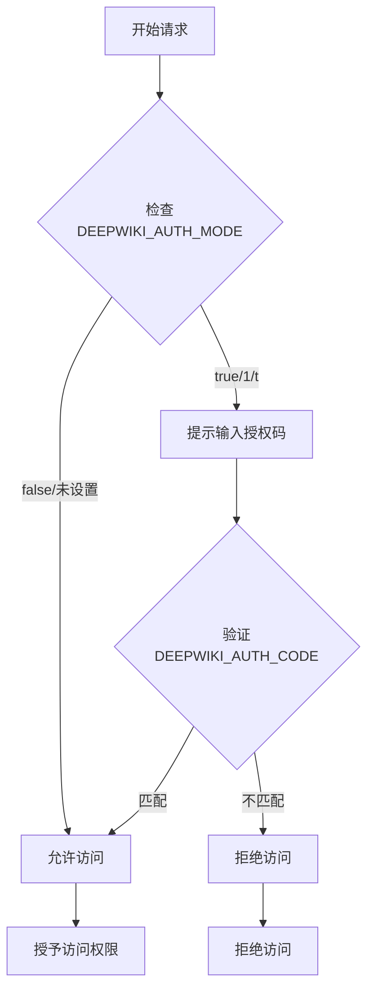
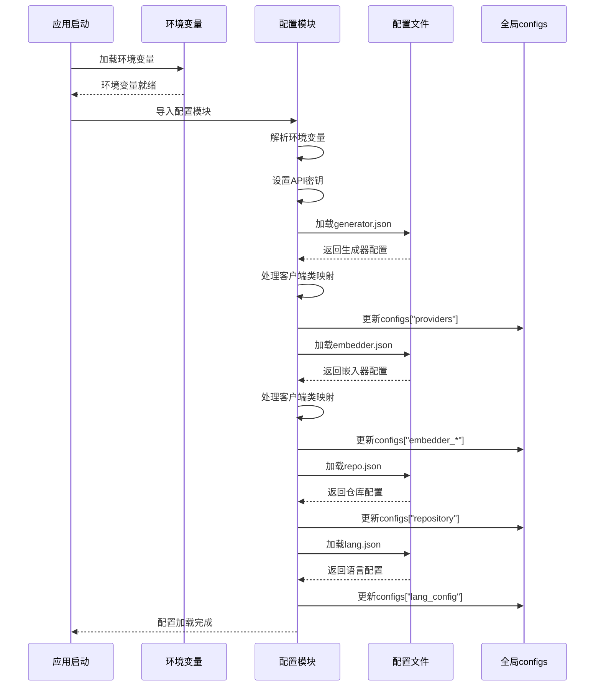

# 核心配置

<cite>
**本文档中引用的文件**
- [api/config.py](file://api/config.py)
- [api/config/embedder.json](file://api/config/embedder.json)
- [api/config/generator.json](file://api/config/generator.json)
- [api/config/lang.json](file://api/config/lang.json)
- [api/config/repo.json](file://api/config/repo.json)
- [api/main.py](file://api/main.py)
- [api/api.py](file://api/api.py)
- [api/data_pipeline.py](file://api/data_pipeline.py)
</cite>

## 目录
1. [简介](#简介)
2. [配置系统架构](#配置系统架构)
3. [环境变量配置](#环境变量配置)
4. [配置文件结构](#配置文件结构)
5. [全局配置管理](#全局配置管理)
6. [环境变量占位符替换](#环境变量占位符替换)
7. [插件化AI提供商支持](#插件化ai提供商支持)
8. [访问权限控制](#访问权限控制)
9. [配置加载流程](#配置加载流程)
10. [最佳实践](#最佳实践)

## 简介

deepwiki-open采用了一套完整的配置管理系统，通过环境变量和JSON配置文件实现灵活的全局配置管理。该系统支持多种AI提供商、嵌入模型类型、语言配置和访问权限控制，为不同部署场景提供了强大的定制能力。

## 配置系统架构



**图表来源**
- [api/config.py](file://api/config.py#L1-L64)
- [api/config/generator.json](file://api/config/generator.json#L1-L200)
- [api/config/embedder.json](file://api/config/embedder.json#L1-L34)

## 环境变量配置

### 核心环境变量

系统通过以下环境变量实现全局配置控制：

#### 访问权限控制变量
- **`DEEPWIKI_AUTH_MODE`**: 控制维基访问权限模式
  - 值为`true`、`1`或`t`时启用认证模式
  - 默认值：`False`
- **`DEEPWIKI_AUTH_CODE`**: 维基生成授权码
  - 在认证模式下必需
  - 用于验证用户身份

#### 嵌入模型配置变量
- **`DEEPWIKI_EMBEDDER_TYPE`**: 嵌入模型类型选择
  - 可选值：`openai`（默认）、`google`、`ollama`
  - 决定使用哪种嵌入服务提供商

#### 配置目录变量
- **`DEEPWIKI_CONFIG_DIR`**: 自定义配置文件目录路径
  - 当未设置时，默认使用`api/config/`目录
  - 支持绝对路径和相对路径

#### API密钥变量
- **`OPENAI_API_KEY`**: OpenAI API密钥
- **`GOOGLE_API_KEY`**: Google API密钥
- **`OPENROUTER_API_KEY`**: OpenRouter API密钥
- **`AWS_ACCESS_KEY_ID`**: AWS访问密钥ID
- **`AWS_SECRET_ACCESS_KEY`**: AWS秘密访问密钥
- **`AWS_REGION`**: AWS区域
- **`AWS_ROLE_ARN`**: AWS角色ARN

**章节来源**
- [api/config.py](file://api/config.py#L18-L47)
- [api/main.py](file://api/main.py#L47-L52)

## 配置文件结构

### 生成器配置 (generator.json)

生成器配置定义了各种AI模型提供商的参数和可用模型：



**图表来源**
- [api/config.py](file://api/config.py#L120-L145)
- [api/config/generator.json](file://api/config/generator.json#L1-L200)

#### 支持的提供商
- **Google**: Gemini系列模型
- **OpenAI**: GPT系列模型
- **OpenRouter**: 多家提供商的统一接口
- **Ollama**: 本地模型推理
- **AWS Bedrock**: Amazon Bedrock服务
- **Azure OpenAI**: Microsoft Azure服务
- **Dashscope**: 阿里云通义千问

#### 模型参数配置
每个模型支持以下参数：
- **temperature**: 温度参数，控制输出随机性
- **top_p**: 核采样参数
- **top_k**: 最高k个词汇采样
- **options**: Ollama特有的选项参数

### 嵌入器配置 (embedder.json)

嵌入器配置管理文本嵌入和向量检索相关的设置：



**图表来源**
- [api/config.py](file://api/config.py#L147-L158)
- [api/config/embedder.json](file://api/config/embedder.json#L1-L34)

#### 配置项说明
- **batch_size**: 批处理大小
- **model_kwargs**: 模型特定参数
- **retriever**: 向量检索配置
- **text_splitter**: 文本分割配置

### 语言配置 (lang.json)

语言配置定义支持的语言和默认语言设置：

| 配置项 | 类型 | 描述 | 默认值 |
|--------|------|------|--------|
| `supported_languages` | dict | 支持的语言列表 | 包含10种语言 |
| `default` | string | 默认语言代码 | `"en"` |

支持的语言包括：
- 英语 (en)
- 日语 (ja)
- 中文 (zh, zh-tw)
- 西班牙语 (es)
- 韩语 (kr)
- 越南语 (vi)
- 巴西葡萄牙语 (pt-br)
- 法语 (fr)
- 俄语 (ru)

### 仓库配置 (repo.json)

仓库配置管理文件过滤和仓库处理规则：



**图表来源**
- [api/config.py](file://api/config.py#L229-L232)
- [api/config/repo.json](file://api/config/repo.json#L1-L129)

**章节来源**
- [api/config/generator.json](file://api/config/generator.json#L1-L200)
- [api/config/embedder.json](file://api/config/embedder.json#L1-L34)
- [api/config/lang.json](file://api/config/lang.json#L1-L16)
- [api/config/repo.json](file://api/config/repo.json#L1-L129)

## 全局配置管理

### configs全局变量

系统通过`configs`全局字典集中存储所有加载的配置：



**图表来源**
- [api/config.py](file://api/config.py#L303-L333)

### 配置更新流程

配置加载遵循以下顺序和优先级：

1. **生成器配置** (`generator.json`)
   - 设置默认提供商
   - 注册所有可用提供商
   - 添加客户端类映射

2. **嵌入器配置** (`embedder.json`)
   - 处理不同类型嵌入器
   - 添加客户端类映射
   - 更新检索器和分割器配置

3. **仓库配置** (`repo.json`)
   - 设置文件过滤规则
   - 配置仓库处理参数

4. **语言配置** (`lang.json`)
   - 设置支持的语言
   - 配置默认语言

**章节来源**
- [api/config.py](file://api/config.py#L306-L333)

## 环境变量占位符替换

### replace_env_placeholders函数

系统实现了强大的环境变量占位符替换机制：

```mermaid
flowchart TD
INPUT[输入配置] --> TYPE_CHECK{检查类型}
TYPE_CHECK --> |字典| DICT_LOOP[遍历键值对]
TYPE_CHECK --> |列表| LIST_LOOP[遍历列表项]
TYPE_CHECK --> |字符串| STRING_MATCH[正则匹配]
TYPE_CHECK --> |其他| RETURN[直接返回]
STRING_MATCH --> PATTERN[正则: \${ENV_VAR}]
PATTERN --> MATCH_FOUND{找到匹配?}
MATCH_FOUND --> |是| GET_ENV[获取环境变量]
MATCH_FOUND --> |否| KEEP_ORIGINAL[保留原始占位符]
GET_ENV --> ENV_EXISTS{环境变量存在?}
ENV_EXISTS --> |是| REPLACE_VALUE[替换为环境变量值]
ENV_EXISTS --> |否| LOG_WARNING[记录警告]
DICT_LOOP --> RECURSE_DICT[递归处理子项]
LIST_LOOP --> RECURSE_LIST[递归处理子项]
REPLACE_VALUE --> OUTPUT[返回替换结果]
LOG_WARNING --> KEEP_ORIGINAL
KEEP_ORIGINAL --> OUTPUT
RECURSE_DICT --> OUTPUT
RECURSE_LIST --> OUTPUT
RETURN --> OUTPUT
```

**图表来源**
- [api/config.py](file://api/config.py#L66-L94)

### 占位符语法

- **语法格式**: `${ENV_VAR_NAME}`
- **支持类型**: 字符串、字典、列表
- **错误处理**: 环境变量不存在时记录警告并保留原始占位符

### 使用示例

假设配置文件中有以下内容：
```json
{
  "endpoint": "${API_ENDPOINT}",
  "headers": {
    "Authorization": "Bearer ${API_TOKEN}"
  }
}
```

如果环境变量设置为：
```bash
export API_ENDPOINT="https://api.example.com/v1"
export API_TOKEN="secret-token-123"
```

替换后的配置将变为：
```json
{
  "endpoint": "https://api.example.com/v1",
  "headers": {
    "Authorization": "Bearer secret-token-123"
  }
}
```

**章节来源**
- [api/config.py](file://api/config.py#L66-L94)

## 插件化AI提供商支持

### CLIENT_CLASSES字典

系统通过`CLIENT_CLASSES`字典实现插件化的AI提供商支持：



**图表来源**
- [api/config.py](file://api/config.py#L55-L63)

### 客户端类映射机制

#### 显式映射
- 通过`client_class`字段直接指定客户端类名
- 支持的类名：`GoogleGenAIClient`、`GoogleEmbedderClient`、`OpenAIClient`等

#### 默认映射
当未指定`client_class`时，系统根据提供商ID自动映射：
- `google` → `GoogleGenAIClient`
- `openai` → `OpenAIClient`
- `openrouter` → `OpenRouterClient`
- `ollama` → `OllamaClient`
- `bedrock` → `BedrockClient`
- `azure` → `AzureAIClient`
- `dashscope` → `DashscopeClient`

#### 动态客户端注入



**图表来源**
- [api/config.py](file://api/config.py#L125-L144)

**章节来源**
- [api/config.py](file://api/config.py#L55-L63)
- [api/config.py](file://api/config.py#L120-L145)

## 访问权限控制

### WIKI_AUTH_MODE和WIKI_AUTH_CODE

系统通过两个环境变量实现灵活的访问权限控制：



**图表来源**
- [api/config.py](file://api/config.py#L44-L46)
- [api/api.py](file://api/api.py#L154-L165)

### 权限控制特性

#### 前端限制
- 在认证模式下，前端会显示授权码输入框
- 限制前端发起的wiki生成请求

#### 缓存保护
- 保护已生成页面的缓存不被随意删除
- 防止未经授权的缓存清理操作

#### 后端防护
- 不完全阻止直接API调用
- 仅限制前端交互层面的访问控制

### 配置示例

#### 启用认证模式
```bash
export DEEPWIKI_AUTH_MODE=true
export DEEPWIKI_AUTH_CODE=my-secret-code-123
```

#### 禁用认证模式
```bash
export DEEPWIKI_AUTH_MODE=false
# 或不设置DEEPWIKI_AUTH_MODE
```

**章节来源**
- [api/config.py](file://api/config.py#L44-L46)
- [api/api.py](file://api/api.py#L154-L165)

## 配置加载流程

### 初始化顺序



**图表来源**
- [api/config.py](file://api/config.py#L306-L333)
- [api/main.py](file://api/main.py#L1-L80)

### 错误处理机制

#### 文件不存在处理
- 如果配置文件不存在，记录警告并返回空字典
- 系统继续运行，使用内置默认值

#### 加载失败处理
- 捕获文件读取异常
- 记录错误日志
- 返回空配置对象

#### 环境变量缺失处理
- 记录警告信息
- 使用默认值或空值
- 继续执行关键功能

**章节来源**
- [api/config.py](file://api/config.py#L97-L118)
- [api/config.py](file://api/config.py#L306-L333)

## 最佳实践

### 环境变量管理

1. **使用.env文件**
   ```bash
   # 创建.env文件
   echo "GOOGLE_API_KEY=your-google-api-key" >> .env
   echo "OPENAI_API_KEY=your-openai-api-key" >> .env
   ```

2. **生产环境安全**
   - 不要将.env文件提交到版本控制系统
   - 使用环境变量覆盖敏感配置
   - 定期轮换API密钥

3. **开发环境配置**
   ```bash
   # 开发环境专用配置
   export DEEPWIKI_AUTH_MODE=false
   export DEEPWIKI_CONFIG_DIR=./dev-config/
   ```

### 配置文件组织

1. **多环境配置**
   ```
   config/
   ├── production/
   │   ├── generator.json
   │   ├── embedder.json
   │   └── repo.json
   ├── staging/
   │   ├── generator.json
   │   ├── embedder.json
   │   └── repo.json
   └── development/
       ├── generator.json
       ├── embedder.json
       └── repo.json
   ```

2. **自定义配置目录**
   ```bash
   export DEEPWIKI_CONFIG_DIR=/path/to/custom/config
   ```

### 性能优化建议

1. **嵌入器选择**
   - 生产环境推荐使用`openai`或`google`嵌入器
   - 开发测试可使用`ollama`减少成本

2. **文件过滤优化**
   - 根据项目特点调整`repo.json`中的排除规则
   - 避免处理大型二进制文件

3. **语言配置优化**
   - 仅启用需要的语言支持
   - 减少不必要的翻译开销

### 故障排除

1. **配置加载问题**
   - 检查配置文件路径是否正确
   - 验证JSON格式是否有效
   - 确认环境变量是否正确设置

2. **API密钥问题**
   - 验证API密钥的有效性
   - 检查网络连接状态
   - 确认API配额限制

3. **权限问题**
   - 检查`DEEPWIKI_AUTH_MODE`设置
   - 验证授权码配置
   - 确认前端认证流程

**章节来源**
- [api/main.py](file://api/main.py#L6-L8)
- [api/config.py](file://api/config.py#L51-L53)