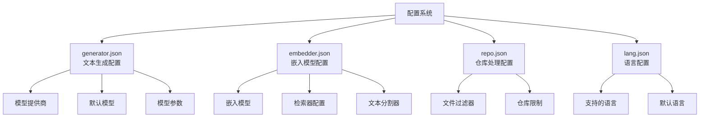
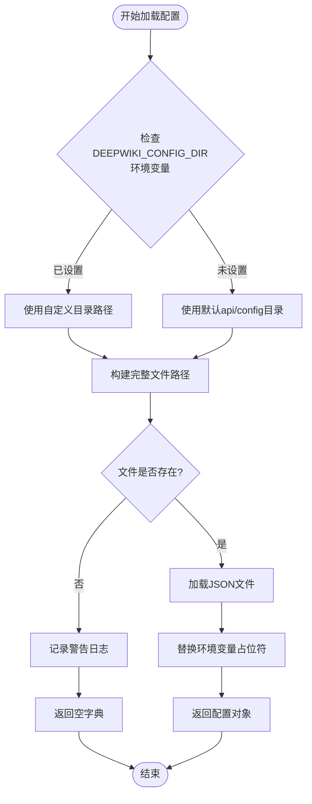
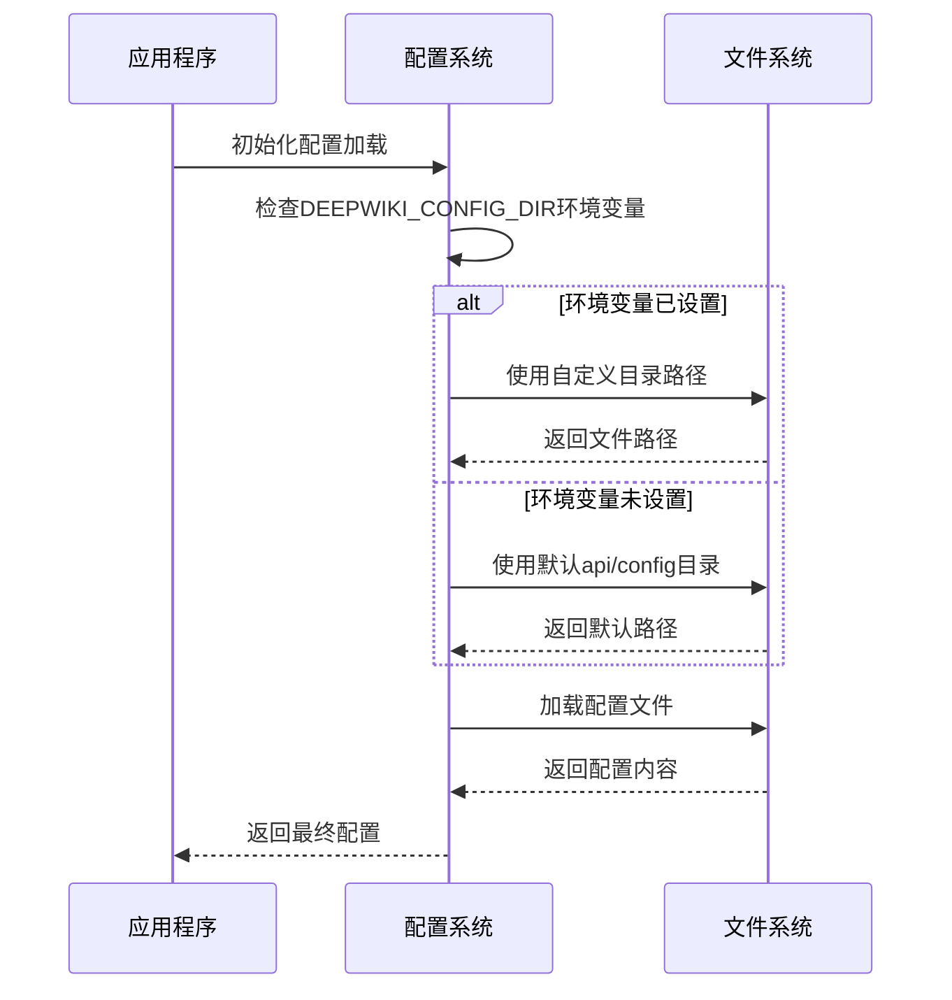
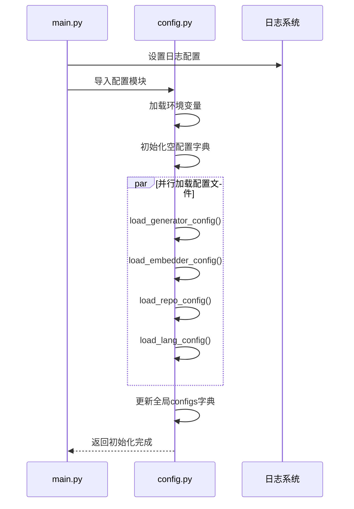
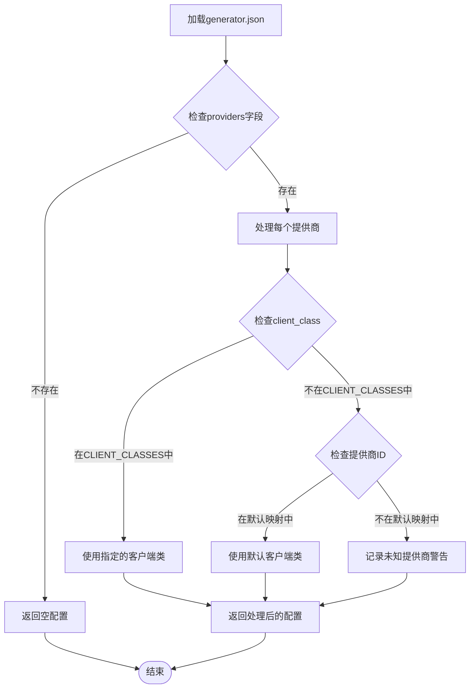
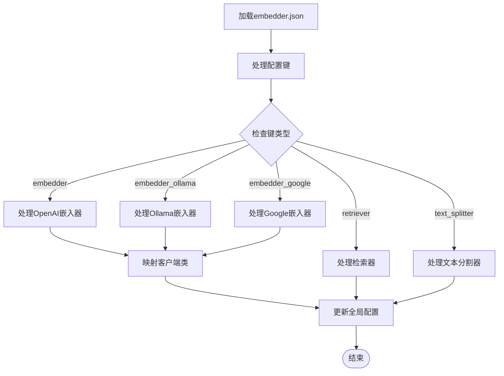
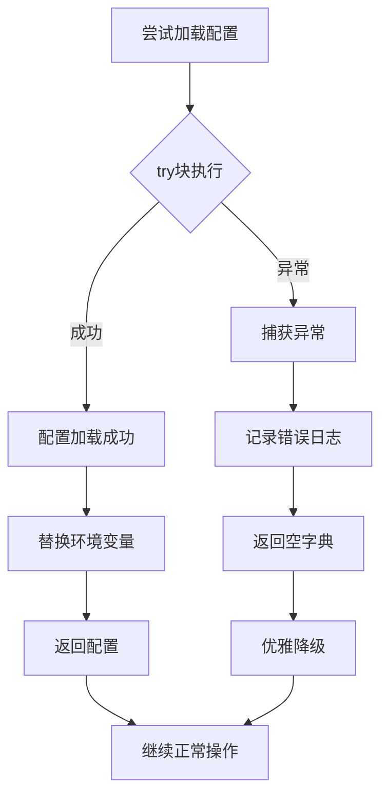
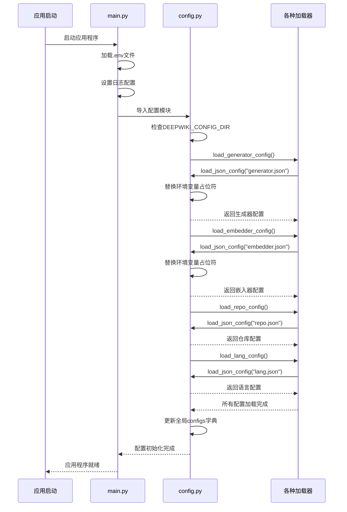
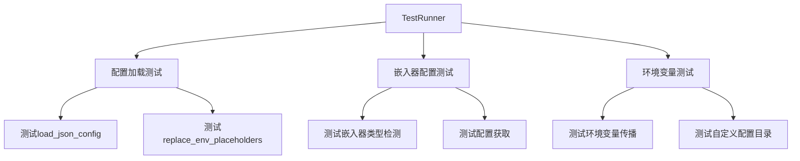

# 配置加载机制

<cite>
**本文档引用的文件**
- [api/config.py](file://api/config.py)
- [api/config/generator.json](file://api/config/generator.json)
- [api/config/embedder.json](file://api/config/embedder.json)
- [api/config/repo.json](file://api/config/repo.json)
- [api/config/lang.json](file://api/config/lang.json)
- [api/main.py](file://api/main.py)
- [tests/unit/test_all_embedders.py](file://tests/unit/test_all_embedders.py)
</cite>

## 目录
1. [概述](#概述)
2. [配置文件架构](#配置文件架构)
3. [核心配置加载函数](#核心配置加载函数)
4. [环境变量处理机制](#环境变量处理机制)
5. [配置加载流程详解](#配置加载流程详解)
6. [错误处理与日志记录](#错误处理与日志记录)
7. [实际调用链示例](#实际调用链示例)
8. [最佳实践与故障排除](#最佳实践与故障排除)

## 概述

deepwiki-open采用基于JSON的配置系统，通过多个专用配置文件管理不同组件的设置。该系统支持灵活的配置文件位置定制，通过环境变量`DEEPWIKI_CONFIG_DIR`指定自定义配置目录，同时提供强大的环境变量占位符替换功能。

### 核心特性

- **模块化配置**：分离的配置文件管理不同功能模块
- **环境变量支持**：动态配置注入和路径定制
- **容错设计**：文件缺失时的安全降级机制
- **递归占位符替换**：复杂的JSON结构环境变量注入

## 配置文件架构

系统包含四个核心配置文件，每个负责特定的功能领域：



**图表来源**
- [api/config/generator.json](file://api/config/generator.json#L1-L200)
- [api/config/embedder.json](file://api/config/embedder.json#L1-L34)
- [api/config/repo.json](file://api/config/repo.json#L1-L129)
- [api/config/lang.json](file://api/config/lang.json#L1-L16)

### 配置文件详情

| 文件名 | 功能 | 主要配置项 |
|--------|------|-----------|
| `generator.json` | 文本生成模型配置 | 提供商、默认模型、模型参数 |
| `embedder.json` | 嵌入模型和RAG配置 | 嵌入模型、检索器、文本分割器 |
| `repo.json` | 仓库处理规则 | 文件过滤器、大小限制 |
| `lang.json` | 多语言支持配置 | 支持的语言列表、默认语言 |

**章节来源**
- [api/config/generator.json](file://api/config/generator.json#L1-L200)
- [api/config/embedder.json](file://api/config/embedder.json#L1-L34)
- [api/config/repo.json](file://api/config/repo.json#L1-L129)
- [api/config/lang.json](file://api/config/lang.json#L1-L16)

## 核心配置加载函数

### load_json_config函数

这是配置加载的核心函数，负责根据环境变量确定配置文件路径并安全加载配置：



**图表来源**
- [api/config.py](file://api/config.py#L97-L118)

#### 关键实现细节

1. **路径解析逻辑**：
   - 优先使用`DEEPWIKI_CONFIG_DIR`环境变量
   - 回退到默认的`api/config/`目录
   - 使用`Path`对象确保跨平台兼容性

2. **安全加载机制**：
   - 文件存在性检查
   - 异常捕获和优雅降级
   - 日志记录详细的错误信息

**章节来源**
- [api/config.py](file://api/config.py#L97-L118)

### replace_env_placeholders函数

该函数实现了递归的环境变量占位符替换功能：

```mermaid
flowchart TD
Start([开始替换]) --> CheckType{检查配置类型}
CheckType --> |字典| RecurseDict[递归处理字典值]
CheckType --> |列表| RecurseList[递归处理列表项]
CheckType --> |字符串| CheckPattern{匹配${ENV_VAR}模式?}
CheckType --> |其他| ReturnOriginal[返回原始值]
CheckPattern --> |是| LookupEnv[查找环境变量]
CheckPattern --> |否| ReturnOriginal
LookupEnv --> EnvFound{环境变量存在?}
EnvFound --> |是| ReturnValue[返回环境变量值]
EnvFound --> |否| LogWarning[记录警告并返回原占位符]
RecurseDict --> ReturnModified[返回修改后的字典]
RecurseList --> ReturnModified[返回修改后的列表]
ReturnValue --> End([结束])
LogWarning --> End
ReturnOriginal --> End
ReturnModified --> End
```

**图表来源**
- [api/config.py](file://api/config.py#L66-L94)

#### 占位符格式规范

- **标准格式**：`${ENV_VAR_NAME}`
- **正则表达式匹配**：`r"\$\{([A-Z0-9_]+)\}"`
- **递归处理**：支持嵌套的字典和列表结构

**章节来源**
- [api/config.py](file://api/config.py#L66-L94)

## 环境变量处理机制

### DEEPWIKI_CONFIG_DIR环境变量

该环境变量控制配置文件的根目录位置：



**图表来源**
- [api/config.py](file://api/config.py#L51-L52)
- [api/config.py](file://api/config.py#L99-L104)

### 环境变量传播机制

系统自动将关键API密钥传播到环境变量中：

| 环境变量 | 来源 | 用途 |
|----------|------|------|
| `OPENAI_API_KEY` | `OPENAI_API_KEY` | OpenAI API认证 |
| `GOOGLE_API_KEY` | `GOOGLE_API_KEY` | Google API认证 |
| `OPENROUTER_API_KEY` | `OPENROUTER_API_KEY` | OpenRouter API认证 |
| `AWS_ACCESS_KEY_ID` | `AWS_ACCESS_KEY_ID` | AWS认证 |
| `AWS_SECRET_ACCESS_KEY` | `AWS_SECRET_ACCESS_KEY` | AWS认证 |

**章节来源**
- [api/config.py](file://api/config.py#L18-L41)

## 配置加载流程详解

### 初始化加载顺序

系统按照特定顺序加载所有配置文件：



**图表来源**
- [api/config.py](file://api/config.py#L306-L332)
- [api/main.py](file://api/main.py#L1-L80)

### 特殊配置处理

#### 生成器配置处理

生成器配置需要额外的客户端类映射处理：



**图表来源**
- [api/config.py](file://api/config.py#L121-L145)

#### 嵌入器配置处理

嵌入器配置支持多种类型的嵌入模型：



**图表来源**
- [api/config.py](file://api/config.py#L148-L158)

**章节来源**
- [api/config.py](file://api/config.py#L121-L145)
- [api/config.py](file://api/config.py#L148-L158)

## 错误处理与日志记录

### 配置加载异常处理

系统实现了多层次的错误处理机制：



**图表来源**
- [api/config.py](file://api/config.py#L116-L118)

### 日志记录策略

| 日志级别 | 记录场景 | 示例消息 |
|----------|----------|----------|
| INFO | 配置文件加载 | `"Loading configuration from /path/to/config.json"` |
| WARNING | 文件不存在或配置不完整 | `"Configuration file /path/to/config.json does not exist"` |
| ERROR | 配置加载失败 | `"Error loading configuration file config.json: FileNotFoundError"` |
| WARNING | 环境变量占位符未找到 | `"Environment variable placeholder '${MISSING_VAR}' was not found in the environment"` |

### 容错设计原则

1. **文件缺失容错**：配置文件不存在时返回空字典
2. **格式错误容错**：JSON解析失败时记录错误并返回空配置
3. **环境变量缺失容错**：占位符保留原样而非抛出异常
4. **部分配置缺失容错**：只影响对应部分的功能

**章节来源**
- [api/config.py](file://api/config.py#L108-L118)

## 实际调用链示例

### 完整配置加载调用链

以下是典型的配置加载调用链示例：



**图表来源**
- [api/main.py](file://api/main.py#L63-L80)
- [api/config.py](file://api/config.py#L306-L332)

### 具体函数调用示例

#### load_generator_config调用链

1. **调用入口**：`load_generator_config()`
2. **内部调用**：`load_json_config("generator.json")`
3. **环境变量处理**：`replace_env_placeholders(config)`
4. **客户端映射**：添加`model_client`字段
5. **返回结果**：完整的生成器配置

#### load_embedder_config调用链

1. **调用入口**：`load_embedder_config()`
2. **内部调用**：`load_json_config("embedder.json")`
3. **环境变量处理**：`replace_env_placeholders(config)`
4. **客户端映射**：处理各个嵌入器的`client_class`
5. **返回结果**：完整的嵌入器配置

**章节来源**
- [api/config.py](file://api/config.py#L121-L145)
- [api/config.py](file://api/config.py#L148-L158)

## 最佳实践与故障排除

### 配置文件最佳实践

1. **保持配置简洁**：避免过度复杂的嵌套结构
2. **使用有意义的键名**：便于理解和维护
3. **提供合理的默认值**：确保基本功能可用
4. **文档化配置选项**：为复杂配置提供注释说明

### 环境变量使用建议

1. **敏感信息保护**：使用环境变量存储API密钥
2. **动态配置**：利用占位符实现环境特定配置
3. **版本控制**：不要将包含敏感信息的配置文件提交到版本控制系统
4. **命名规范**：使用一致的环境变量命名约定

### 常见问题排查

#### 配置文件未找到

**症状**：应用程序启动时出现配置文件不存在警告

**解决方案**：
1. 检查`DEEPWIKI_CONFIG_DIR`环境变量设置
2. 验证配置文件是否存在于指定目录
3. 确认文件权限设置正确

#### 环境变量占位符未替换

**症状**：配置中`${ENV_VAR}`占位符未被替换

**解决方案**：
1. 检查环境变量是否已正确设置
2. 验证占位符格式是否符合`${VAR_NAME}`规范
3. 查看日志确认是否记录了占位符未找到警告

#### 配置加载性能问题

**症状**：应用程序启动缓慢

**解决方案**：
1. 减少配置文件大小
2. 优化JSON结构复杂度
3. 考虑使用配置缓存机制

### 测试配置加载

系统提供了完整的测试框架验证配置加载功能：



**图表来源**
- [tests/unit/test_all_embedders.py](file://tests/unit/test_all_embedders.py#L84-L138)

**章节来源**
- [tests/unit/test_all_embedders.py](file://tests/unit/test_all_embedders.py#L84-L138)

## 总结

deepwiki-open的配置加载机制通过精心设计的多层架构，实现了灵活、可靠且易于维护的配置管理系统。该系统的核心优势包括：

1. **模块化设计**：分离关注点，便于管理和扩展
2. **环境变量支持**：提供动态配置能力和部署灵活性
3. **容错机制**：确保系统在配置缺失或损坏时仍能正常运行
4. **递归处理**：支持复杂的JSON结构和嵌套配置
5. **完善的日志记录**：便于调试和问题诊断

这种设计使得deepwiki-open能够适应不同的部署环境和使用场景，同时保持良好的开发体验和系统稳定性。