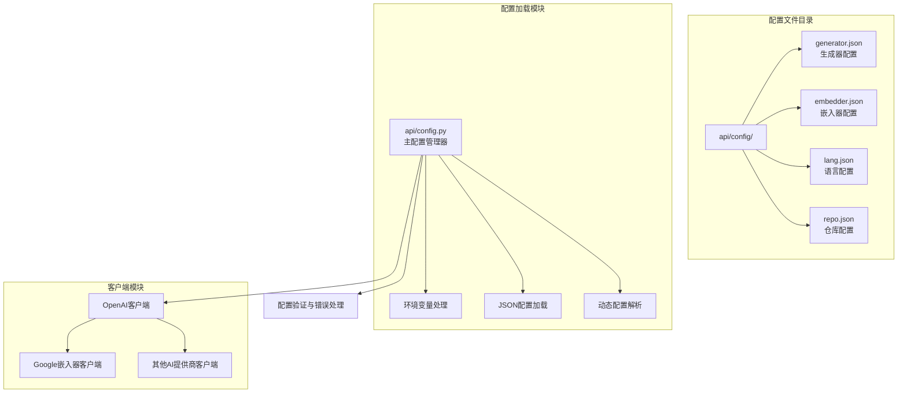
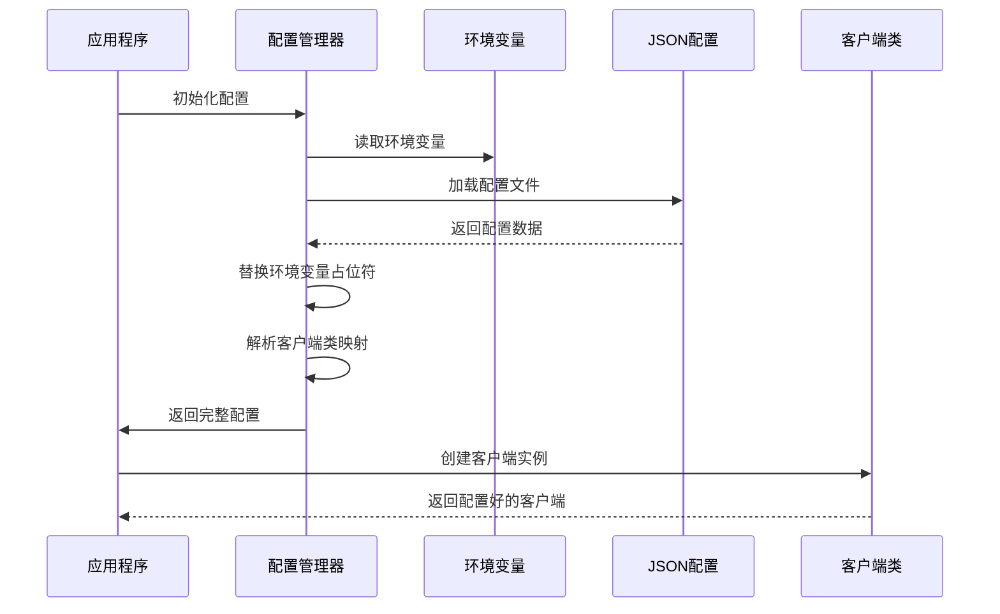
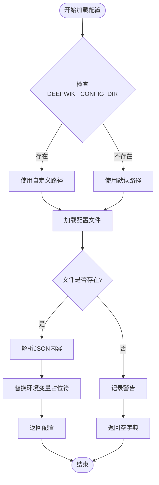
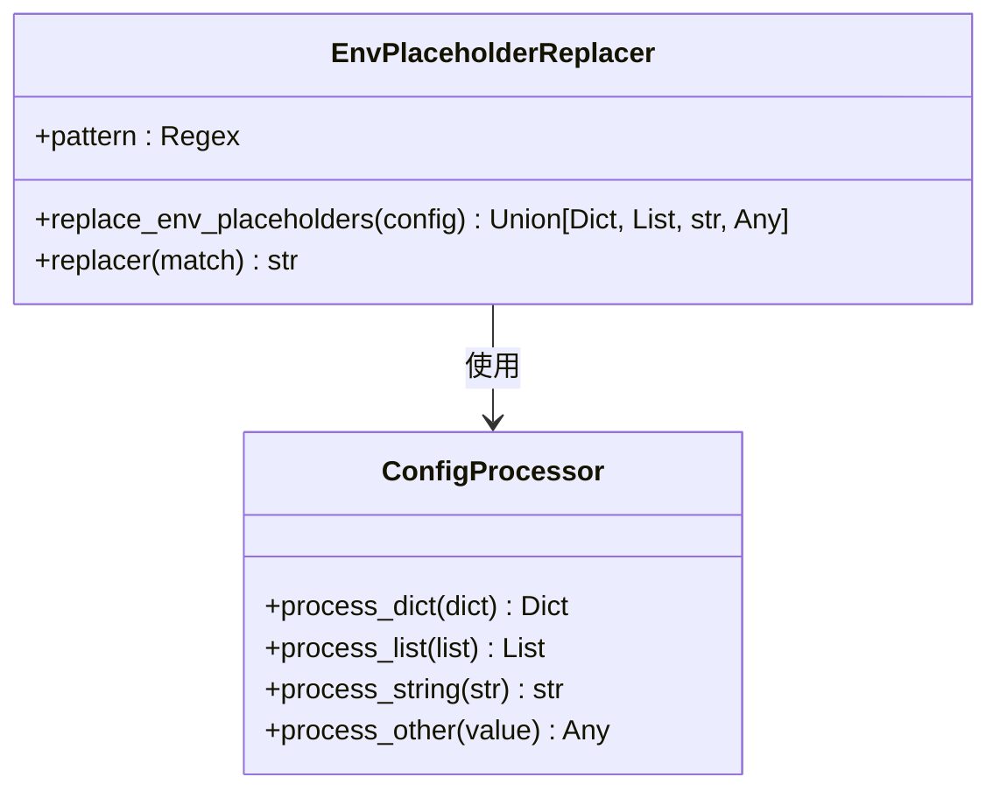
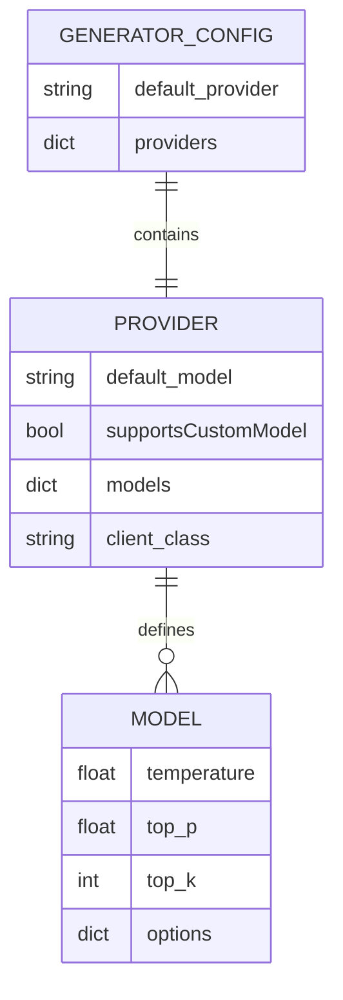
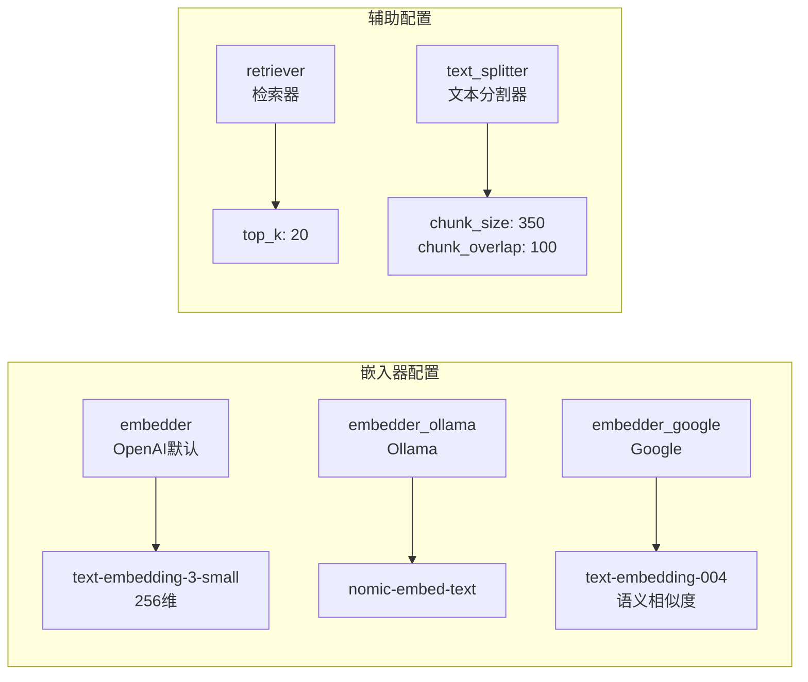
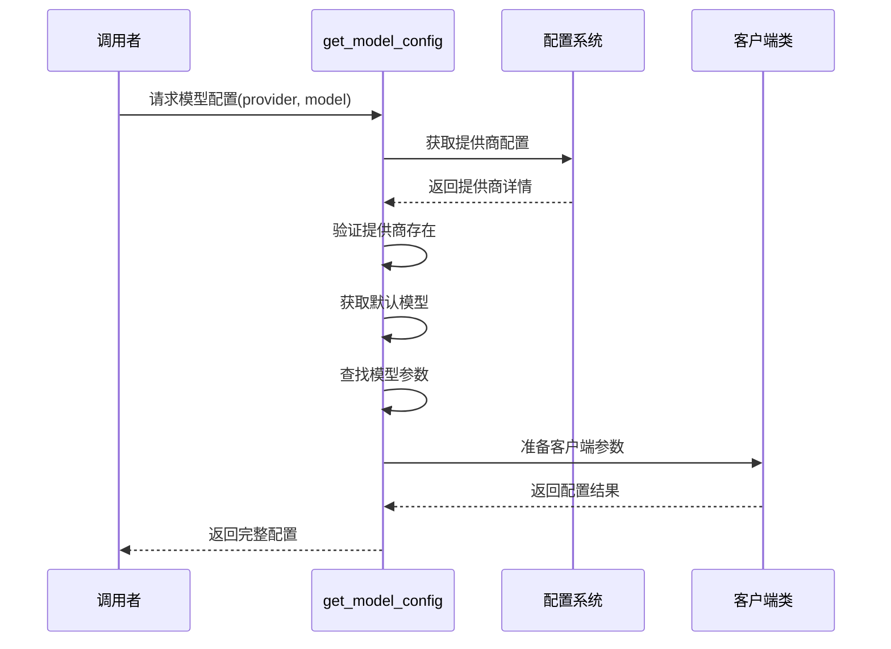
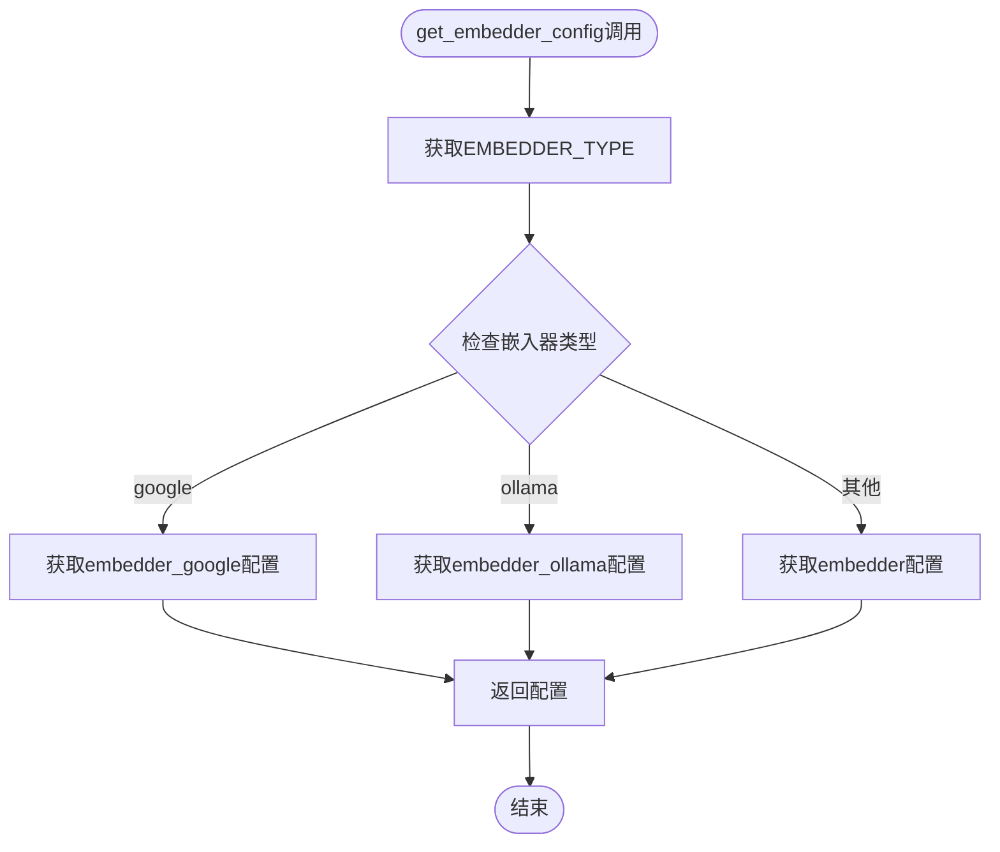
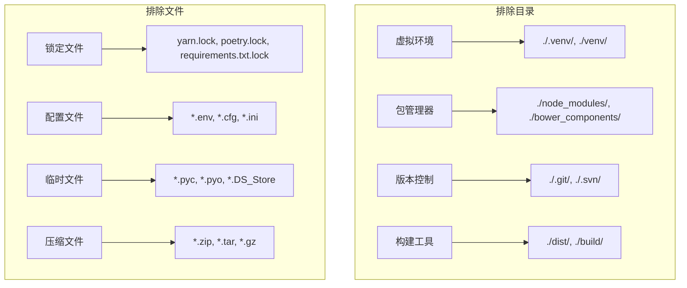
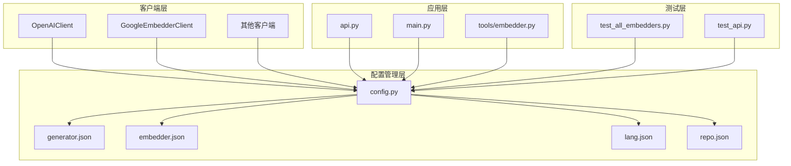

# 配置管理

<cite>
**本文档中引用的文件**
- [api/config.py](file://api/config.py)
- [api/config/generator.json](file://api/config/generator.json)
- [api/config/embedder.json](file://api/config/embedder.json)
- [api/config/lang.json](file://api/config/lang.json)
- [api/config/repo.json](file://api/config/repo.json)
- [api/openai_client.py](file://api/openai_client.py)
- [api/google_embedder_client.py](file://api/google_embedder_client.py)
- [api/main.py](file://api/main.py)
</cite>

## 目录
1. [简介](#简介)
2. [项目结构](#项目结构)
3. [核心组件](#核心组件)
4. [架构概览](#架构概览)
5. [详细组件分析](#详细组件分析)
6. [依赖关系分析](#依赖关系分析)
7. [性能考虑](#性能考虑)
8. [故障排除指南](#故障排除指南)
9. [结论](#结论)

## 简介

DeepWiki-open采用了一套高度灵活的配置管理系统，通过环境变量和JSON配置文件实现了强大的配置驱动设计。该系统支持多种AI提供商（Google、OpenAI、OpenRouter、Ollama等），能够根据运行时环境动态调整配置，为不同的部署场景提供最佳的适配能力。

配置管理系统的核心特点包括：
- 基于环境变量的灵活配置机制
- JSON配置文件的层次化组织
- 动态环境变量占位符替换
- 插件化的AI提供商支持
- 运行时配置热更新

## 项目结构

配置管理系统在项目中的组织结构如下：

**图表来源**
- [api/config.py](file://api/config.py#L1-L50)
- [api/config/generator.json](file://api/config/generator.json#L1-L20)
- [api/config/embedder.json](file://api/config/embedder.json#L1-L15)

**章节来源**
- [api/config.py](file://api/config.py#L1-L388)
- [api/config/generator.json](file://api/config/generator.json#L1-L200)
- [api/config/embedder.json](file://api/config/embedder.json#L1-L34)

## 核心组件

### 环境变量配置系统

配置系统通过环境变量实现灵活的运行时配置：

| 环境变量 | 默认值 | 描述 |
|---------|--------|------|
| `DEEPWIKI_CONFIG_DIR` | `None` | 自定义配置文件目录路径 |
| `DEEPWIKI_EMBEDDER_TYPE` | `'openai'` | 嵌入器类型选择（openai/google/ollama） |
| `DEEPWIKI_AUTH_MODE` | `'False'` | 是否启用授权模式 |
| `DEEPWIKI_AUTH_CODE` | `''` | 授权码 |

### 配置文件类型

系统包含四个核心配置文件：

1. **generator.json**: 文本生成模型配置
2. **embedder.json**: 嵌入模型配置
3. **lang.json**: 多语言支持配置
4. **repo.json**: 仓库处理配置

**章节来源**
- [api/config.py](file://api/config.py#L43-L53)
- [api/config/lang.json](file://api/config/lang.json#L1-L16)
- [api/config/repo.json](file://api/config/repo.json#L1-L129)

## 架构概览

配置管理系统采用分层架构设计，实现了配置的统一管理和动态加载：

**图表来源**
- [api/config.py](file://api/config.py#L97-L118)
- [api/config.py](file://api/config.py#L120-L145)

## 详细组件分析

### 环境变量处理机制

#### load_json_config函数

`load_json_config`函数负责加载JSON配置文件并处理环境变量占位符：

**图表来源**
- [api/config.py](file://api/config.py#L97-L118)

#### replace_env_placeholders函数

该函数实现了递归的环境变量占位符替换机制：

**图表来源**
- [api/config.py](file://api/config.py#L66-L94)

**章节来源**
- [api/config.py](file://api/config.py#L66-L118)

### AI提供商配置管理

#### generator.json配置结构

generator.json定义了多个AI提供商的配置：

**图表来源**
- [api/config/generator.json](file://api/config/generator.json#L2-L198)

#### 支持的AI提供商

| 提供商 | 默认模型 | 客户端类 | 特殊功能 |
|--------|----------|----------|----------|
| Google | gemini-2.5-flash | GoogleGenAIClient | Vision支持 |
| OpenAI | gpt-5-nano | OpenAIClient | 多模态 |
| OpenRouter | openai/gpt-5-nano | OpenRouterClient | 第三方代理 |
| Ollama | qwen3:1.7b | OllamaClient | 本地部署 |
| Bedrock | anthropic.claude-3-sonnet-20240229-v1:0 | BedrockClient | AWS云服务 |
| Azure | gpt-4o | AzureAIClient | 微软云平台 |
| Dashscope | qwen-plus | DashscopeClient | 阿里云 |

**章节来源**
- [api/config.py](file://api/config.py#L120-L145)
- [api/config/generator.json](file://api/config/generator.json#L1-L200)

### 嵌入器配置管理

#### embedder.json配置结构

embedder.json提供了三种嵌入器配置：

**图表来源**
- [api/config/embedder.json](file://api/config/embedder.json#L1-L34)

**章节来源**
- [api/config.py](file://api/config.py#L147-L158)
- [api/config/embedder.json](file://api/config/embedder.json#L1-L34)

### 动态配置获取机制

#### get_model_config函数

该函数根据运行时配置动态返回正确的模型配置：

**图表来源**
- [api/config.py](file://api/config.py#L334-L387)

#### get_embedder_config函数

该函数根据DEEPWIKI_EMBEDDER_TYPE环境变量动态选择嵌入器配置：

**图表来源**
- [api/config.py](file://api/config.py#L160-L173)

**章节来源**
- [api/config.py](file://api/config.py#L334-L387)
- [api/config.py](file://api/config.py#L160-L173)

### 多语言支持配置

lang.json提供了完整的国际化支持：

| 语言代码 | 语言名称 | 本地化格式 |
|----------|----------|------------|
| `en` | English | 英语 |
| `ja` | Japanese (日本語) | 日语 |
| `zh` | Mandarin Chinese (中文) | 中文简体 |
| `zh-tw` | Traditional Chinese (繁體中文) | 中文繁体 |
| `es` | Spanish (Español) | 西班牙语 |
| `kr` | Korean (한국어) | 韩语 |
| `vi` | Vietnamese (Tiếng Việt) | 越南语 |
| `pt-br` | Brazilian Portuguese (Português Brasileiro) | 巴西葡萄牙语 |
| `fr` | Français (French) | 法语 |
| `ru` | Русский (Russian) | 俄语 |

**章节来源**
- [api/config.py](file://api/config.py#L234-L260)
- [api/config/lang.json](file://api/config/lang.json#L1-L16)

### 文件过滤规则配置

repo.json定义了仓库处理的文件过滤规则：

**图表来源**
- [api/config/repo.json](file://api/config/repo.json#L2-L123)

**章节来源**
- [api/config.py](file://api/config.py#L262-L301)
- [api/config/repo.json](file://api/config/repo.json#L1-L129)

## 依赖关系分析

配置管理系统与其他模块的依赖关系：

**图表来源**
- [api/config.py](file://api/config.py#L10-L17)
- [api/main.py](file://api/main.py#L1-L80)

**章节来源**
- [api/config.py](file://api/config.py#L10-L17)
- [api/config.py](file://api/config.py#L303-L332)

## 性能考虑

配置管理系统在设计时充分考虑了性能优化：

1. **延迟加载**: 配置文件仅在需要时加载
2. **缓存机制**: 配置结果被缓存避免重复计算
3. **环境变量优先**: 环境变量配置无需文件IO操作
4. **增量更新**: 支持运行时配置热更新

## 故障排除指南

### 常见配置问题

1. **环境变量未设置**
   - 检查必要的API密钥是否正确设置
   - 验证DEEPWIKI_CONFIG_DIR路径是否存在

2. **配置文件缺失**
   - 确认配置文件位于正确位置
   - 检查文件权限和可读性

3. **客户端初始化失败**
   - 验证客户端类映射是否正确
   - 检查API密钥的有效性

**章节来源**
- [api/config.py](file://api/config.py#L117-L118)
- [api/config.py](file://api/config.py#L48-L53)

## 结论

DeepWiki-open的配置管理系统通过环境变量和JSON配置文件的结合，实现了高度灵活和可扩展的配置驱动架构。该系统的主要优势包括：

1. **灵活性**: 支持多种部署场景和运行时配置
2. **可维护性**: 配置与代码分离，便于维护和更新
3. **可扩展性**: 易于添加新的AI提供商和配置选项
4. **可靠性**: 完善的错误处理和回退机制

这种设计使得DeepWiki-open能够在不同的环境中稳定运行，同时为开发者提供了丰富的定制选项。配置管理系统的模块化设计也为未来的功能扩展奠定了良好的基础。