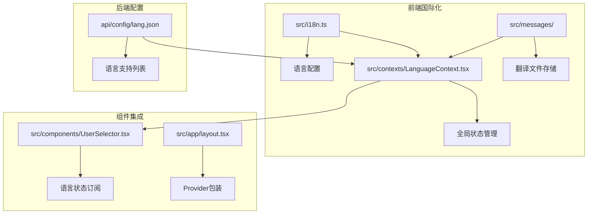
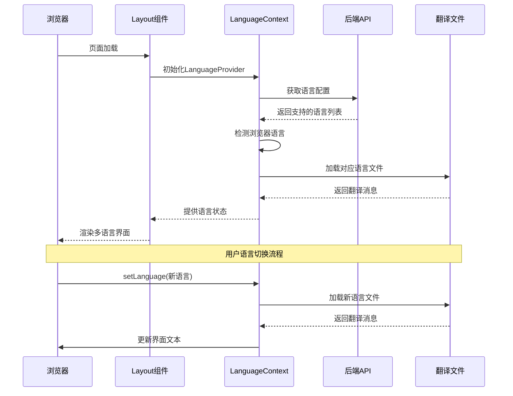
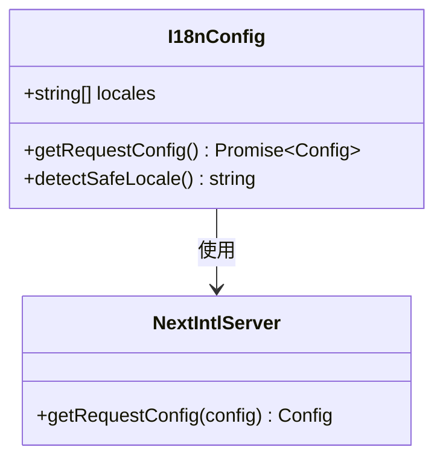
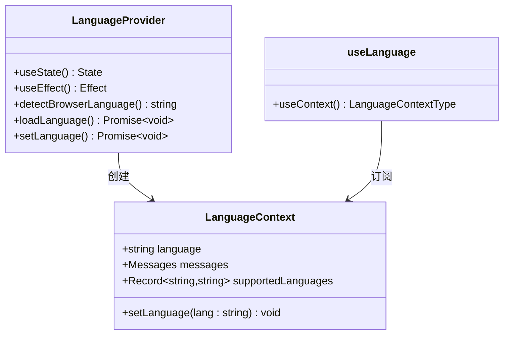
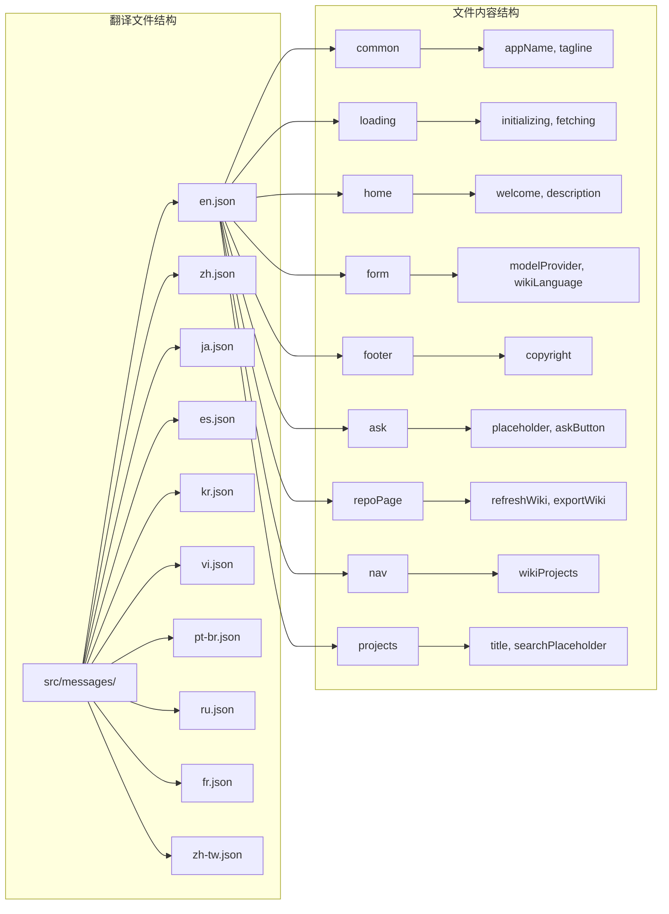
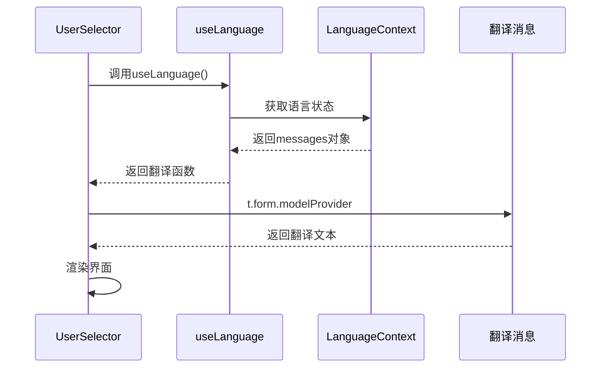
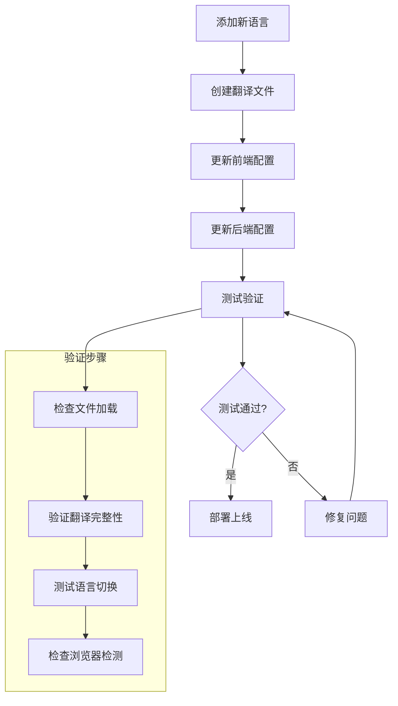
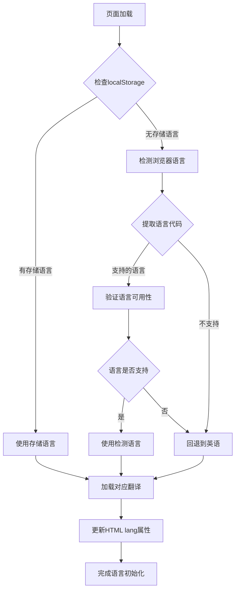

# 多语言支持

<cite>
**本文档中引用的文件**
- [src/i18n.ts](file://src/i18n.ts)
- [src/contexts/LanguageContext.tsx](file://src/contexts/LanguageContext.tsx)
- [src/messages/en.json](file://src/messages/en.json)
- [src/messages/zh.json](file://src/messages/zh.json)
- [src/messages/es.json](file://src/messages/es.json)
- [api/config/lang.json](file://api/config/lang.json)
- [src/components/UserSelector.tsx](file://src/components/UserSelector.tsx)
- [src/app/layout.tsx](file://src/app/layout.tsx)
- [src/app/api/models/config/route.ts](file://src/app/api/models/config/route.ts)
</cite>

## 目录
1. [简介](#简介)
2. [项目结构概览](#项目结构概览)
3. [核心组件分析](#核心组件分析)
4. [架构概览](#架构概览)
5. [详细组件分析](#详细组件分析)
6. [翻译流程](#翻译流程)
7. [用户体验设计](#用户体验设计)
8. [局限性与未来扩展](#局限性与未来扩展)
9. [总结](#总结)

## 简介

DeepWiki-Open是一个基于Next.js和React的AI驱动文档生成工具，提供了完整的多语言支持功能。该系统通过统一的国际化框架实现了前端界面的多语言翻译，支持超过10种语言，包括英语、中文、日语、西班牙语等主流语言。系统采用React Context模式管理全局语言状态，结合Next.js的国际化中间件，为用户提供流畅的多语言体验。

## 项目结构概览

多语言支持功能的核心文件分布在以下关键目录中：

**图表来源**
- [src/i18n.ts](file://src/i18n.ts#L1-L15)
- [src/contexts/LanguageContext.tsx](file://src/contexts/LanguageContext.tsx#L1-L203)
- [src/messages/](file://src/messages/)
- [api/config/lang.json](file://api/config/lang.json#L1-L16)

**节来源**
- [src/i18n.ts](file://src/i18n.ts#L1-L15)
- [src/contexts/LanguageContext.tsx](file://src/contexts/LanguageContext.tsx#L1-L203)
- [api/config/lang.json](file://api/config/lang.json#L1-L16)

## 核心组件分析

### 语言配置系统

系统的核心语言配置通过多个层次实现：

1. **前端语言配置** (`src/i18n.ts`)
   - 定义支持的语言列表
   - 配置Next.js国际化中间件
   - 动态加载翻译文件

2. **全局语言上下文** (`src/contexts/LanguageContext.tsx`)
   - 管理语言状态和消息
   - 处理语言切换逻辑
   - 实现浏览器语言检测

3. **翻译文件存储** (`src/messages/`)
   - 键值对形式的翻译文本
   - 支持10+种语言的完整翻译

4. **后端语言配置** (`api/config/lang.json`)
   - 定义支持的语言列表
   - 提供语言元数据信息
   - 支持动态配置更新

**节来源**
- [src/i18n.ts](file://src/i18n.ts#L1-L15)
- [src/contexts/LanguageContext.tsx](file://src/contexts/LanguageContext.tsx#L1-L203)
- [api/config/lang.json](file://api/config/lang.json#L1-L16)

## 架构概览

多语言支持系统采用分层架构设计，确保前后端协调一致：

**图表来源**
- [src/app/layout.tsx](file://src/app/layout.tsx#L38-L46)
- [src/contexts/LanguageContext.tsx](file://src/contexts/LanguageContext.tsx#L17-L203)
- [src/app/api/models/config/route.ts](file://src/app/api/models/config/route.ts#L1-L49)

## 详细组件分析

### i18n.ts - 前端国际化配置

`i18n.ts`文件是整个国际化系统的核心配置文件，负责定义支持的语言列表并配置Next.js的国际化中间件。

**图表来源**
- [src/i18n.ts](file://src/i18n.ts#L1-L15)

该配置文件的主要功能：
- 定义支持的语言代码数组（en, ja, zh, es, kr, vi, pt-br）
- 实现安全的语言检测机制
- 动态导入对应的翻译文件

**节来源**
- [src/i18n.ts](file://src/i18n.ts#L1-L15)

### LanguageContext.tsx - 全局语言状态管理

`LanguageContext.tsx`实现了React Context模式，提供全局语言状态管理和语言切换功能。

**图表来源**
- [src/contexts/LanguageContext.tsx](file://src/contexts/LanguageContext.tsx#L7-L13)
- [src/contexts/LanguageContext.tsx](file://src/contexts/LanguageContext.tsx#L17-L203)

核心特性：
- **浏览器语言检测**：自动检测用户的首选语言
- **本地存储持久化**：将用户选择的语言保存到localStorage
- **动态语言切换**：支持运行时切换语言而不刷新页面
- **错误恢复机制**：语言加载失败时自动回退到英语

**节来源**
- [src/contexts/LanguageContext.tsx](file://src/contexts/LanguageContext.tsx#L17-L203)

### 翻译文件结构

翻译文件采用JSON格式存储，每个语言对应一个独立的文件：

**图表来源**
- [src/messages/en.json](file://src/messages/en.json#L1-L143)
- [src/messages/zh.json](file://src/messages/zh.json#L1-L134)
- [src/messages/es.json](file://src/messages/es.json#L1-L134)

**节来源**
- [src/messages/en.json](file://src/messages/en.json#L1-L143)
- [src/messages/zh.json](file://src/messages/zh.json#L1-L134)
- [src/messages/es.json](file://src/messages/es.json#L1-L134)

### UserSelector.tsx - 组件级语言集成

`UserSelector.tsx`展示了如何在具体组件中使用语言上下文，实现动态文本更新。

**图表来源**
- [src/components/UserSelector.tsx](file://src/components/UserSelector.tsx#L71-L71)

该组件的关键特性：
- **实时语言更新**：组件会随着语言切换自动更新显示文本
- **结构化翻译键**：使用层次化的键名组织翻译内容
- **条件渲染**：根据语言环境显示相应的文本

**节来源**
- [src/components/UserSelector.tsx](file://src/components/UserSelector.tsx#L71-L71)

### 后端语言配置

后端通过`api/config/lang.json`文件定义支持的语言列表和默认语言设置。

| 字段 | 类型 | 描述 | 示例值 |
|------|------|------|--------|
| supported_languages | Object | 支持的语言映射表 | {"en": "English", "zh": "Mandarin Chinese (中文)"} |
| default | String | 默认语言代码 | "en" |

**节来源**
- [api/config/lang.json](file://api/config/lang.json#L1-L16)

## 翻译流程

### 新增语言的完整流程

1. **创建翻译文件**
   - 在`src/messages/`目录下添加新的JSON文件
   - 文件命名为语言代码（如`fr.json`、`de.json`）
   - 确保文件结构与现有语言文件一致

2. **更新前端配置**
   - 修改`src/i18n.ts`中的`locales`数组
   - 添加新的语言代码到支持列表

3. **更新后端配置**
   - 在`api/config/lang.json`中添加语言映射
   - 更新`supported_languages`对象

4. **测试验证**
   - 启动应用验证新语言是否正常加载
   - 检查所有界面元素的语言显示
   - 验证语言切换功能

## 用户体验设计

### 自动语言检测机制

系统实现了智能的浏览器语言检测功能：

**图表来源**
- [src/contexts/LanguageContext.tsx](file://src/contexts/LanguageContext.tsx#L25-L66)

### 用户偏好持久化

系统通过localStorage实现语言偏好的持久化存储：

- **存储键名**：`language`
- **存储内容**：用户选择的语言代码
- **过期策略**：永久存储，直到用户手动清除浏览器数据
- **同步机制**：语言切换时自动更新存储

### 语言切换交互设计

语言切换采用平滑的用户体验设计：

1. **即时反馈**：切换时立即更新界面文本
2. **状态保持**：切换过程中保持界面布局稳定
3. **错误处理**：加载失败时自动回退到英语
4. **加载指示**：语言切换时显示加载动画

**节来源**
- [src/contexts/LanguageContext.tsx](file://src/contexts/LanguageContext.tsx#L152-L176)

## 局限性与未来扩展

### 当前局限性

1. **AI生成内容翻译限制**
   - AI生成的文档内容本身未进行翻译
   - 只翻译前端界面和用户交互文本
   - 技术上需要额外的翻译服务集成

2. **翻译完整性**
   - 部分技术术语可能需要专门的翻译
   - 文化差异可能导致某些表达不够自然
   - 需要人工审核和优化

3. **性能考虑**
   - 每次语言切换都需要重新加载翻译文件
   - 大量翻译文件可能影响初始加载速度

### 未来扩展方向

1. **AI内容翻译集成**
   - 集成机器翻译API
   - 实现文档内容的自动翻译
   - 支持多种翻译质量级别

2. **动态翻译管理**
   - 后台管理系统
   - 实时翻译编辑功能
   - 翻译版本控制

3. **文化适配增强**
   - 地区特定的界面调整
   - 文化敏感内容处理
   - 多语言排版优化

4. **性能优化**
   - 翻译文件预加载策略
   - 按需加载翻译模块
   - 缓存机制优化

## 总结

DeepWiki-Open的多语言支持系统通过精心设计的架构实现了完整的国际化功能。系统采用React Context管理模式，结合Next.js的国际化中间件，为用户提供了流畅的多语言体验。翻译文件采用标准化的JSON格式，便于维护和扩展。浏览器语言检测和本地存储持久化确保了良好的用户体验。

该系统不仅支持当前的10+种语言，还具备良好的扩展性，可以轻松添加新的语言支持。虽然AI生成内容本身的翻译仍需进一步开发，但现有的界面翻译已经为全球用户提供了友好的使用体验。未来的扩展方向包括AI内容翻译集成、动态翻译管理和性能优化，将进一步提升系统的国际化能力。