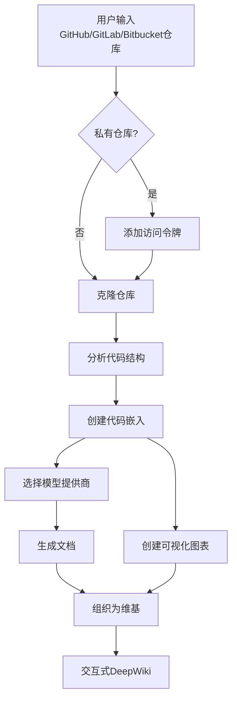
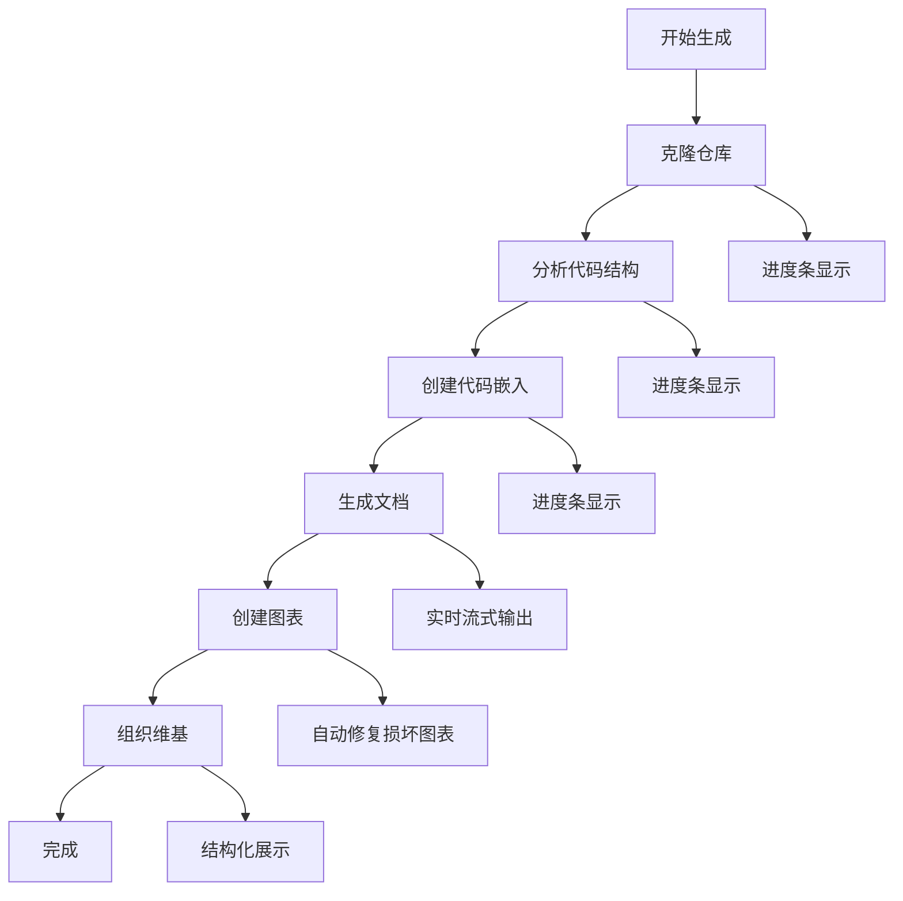
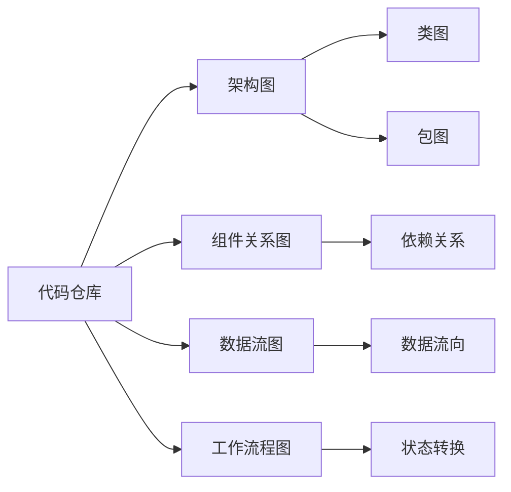

# 快速入门

<cite>
**本文档中引用的文件**
- [README.md](file://README.md)
- [run.sh](file://run.sh)
- [docker-compose.yml](file://docker-compose.yml)
- [Dockerfile](file://Dockerfile)
- [package.json](file://package.json)
- [api/main.py](file://api/main.py)
- [src/app/page.tsx](file://src/app/page.tsx)
- [api/config.py](file://api/config.py)
- [api/config/generator.json](file://api/config/generator.json)
- [api/config/embedder.json](file://api/config/embedder.json)
</cite>

## 目录
1. [简介](#简介)
2. [系统要求](#系统要求)
3. [安装方式](#安装方式)
4. [配置步骤](#配置步骤)
5. [首次运行](#首次运行)
6. [功能体验](#功能体验)
7. [常见问题排查](#常见问题排查)
8. [进阶使用](#进阶使用)

## 简介

DeepWiki-Open 是一个强大的自动化工具，能够为任何 GitHub、GitLab 或 BitBucket 仓库自动生成美观、交互式的维基文档。只需输入仓库地址，DeepWiki 将：
- 分析代码结构
- 生成全面的文档
- 创建可视化图表解释工作原理
- 整理成易于导航的维基格式



**图表来源**
- [README.md](file://README.md#L116-L166)

## 系统要求

### 基础环境
- **Python 3.10+**: 用于运行后端 API 服务器
- **Node.js 18+**: 用于构建和运行前端应用
- **Docker (可选)**: 用于容器化部署（推荐）

### API 密钥要求
根据您选择的模型提供商，需要以下 API 密钥之一：

| 提供商 | 必需密钥 | 获取方式 |
|--------|----------|----------|
| Google AI | `GOOGLE_API_KEY` | [Google AI Studio](https://makersuite.google.com/app/apikey) |
| OpenAI | `OPENAI_API_KEY` | [OpenAI Platform](https://platform.openai.com/api-keys) |
| OpenRouter | `OPENROUTER_API_KEY` | [OpenRouter](https://openrouter.ai/) |
| Azure OpenAI | `AZURE_OPENAI_API_KEY` | [Azure Portal](https://portal.azure.com/) |

### 可选配置
- **Ollama**: 本地运行开源模型（无需 API 密钥）
- **Google AI 嵌入**: 使用 Google 的最新嵌入模型
- **自定义证书**: 支持企业环境的自签名证书

**章节来源**
- [README.md](file://README.md#L31-L62)
- [api/config.py](file://api/config.py#L18-L47)

## 安装方式

### 方法一：使用 Docker（推荐）

这是最简单的方式，适合大多数用户。

#### 步骤 1：克隆仓库
```bash
git clone https://github.com/AsyncFuncAI/deepwiki-open.git
cd deepwiki-open
```

#### 步骤 2：配置环境变量
创建 `.env` 文件并填入您的 API 密钥：

```bash
# 复制示例配置文件
cp .env.example .env

# 编辑 .env 文件（或直接添加 API 密钥）
echo "GOOGLE_API_KEY=your_google_api_key" > .env
echo "OPENAI_API_KEY=your_openai_api_key" >> .env
# 可选：使用 Google AI 嵌入
echo "DEEPWIKI_EMBEDDER_TYPE=google" >> .env
# 可选：添加其他提供商密钥
echo "OPENROUTER_API_KEY=your_openrouter_api_key" >> .env
echo "OLLAMA_HOST=your_ollama_host" >> .env
```

#### 步骤 3：启动服务
```bash
docker-compose up
```

#### 验证安装
- 访问 [http://localhost:3000](http://localhost:3000)
- 后端 API 应在 [http://localhost:8001](http://localhost:8001) 运行
- 查看终端日志确认服务正常启动

### 方法二：手动安装

如果您希望完全控制环境，可以选择手动安装。

#### 步骤 1：设置后端
```bash
# 安装 Python 依赖
python -m pip install poetry==1.8.2 && poetry install -C api

# 启动 API 服务器
python -m api.main
```

#### 步骤 2：设置前端
```bash
# 安装 JavaScript 依赖
npm install
# 或
yarn install

# 启动开发服务器
npm run dev
# 或
yarn dev
```

#### 步骤 3：验证安装
- 打开两个终端窗口分别运行前后端
- 访问 [http://localhost:3000](http://localhost:3000)
- 确认页面加载正常且无错误

**章节来源**
- [README.md](file://README.md#L33-L116)
- [docker-compose.yml](file://docker-compose.yml#L1-L30)
- [Dockerfile](file://Dockerfile#L1-L112)

## 配置步骤

### 环境变量配置

DeepWiki 使用 `.env` 文件进行配置管理。以下是完整的配置选项：

#### 核心 API 密钥
```bash
# Google AI API 密钥（必需）
GOOGLE_API_KEY=your_google_api_key

# OpenAI API 密钥（可选）
OPENAI_API_KEY=your_openai_api_key

# OpenRouter API 密钥（可选）
OPENROUTER_API_KEY=your_openrouter_api_key

# Azure OpenAI 凭证（可选）
AZURE_OPENAI_API_KEY=your_azure_openai_api_key
AZURE_OPENAI_ENDPOINT=your_azure_openai_endpoint
AZURE_OPENAI_VERSION=your_azure_openai_version
```

#### 可选配置
```bash
# Ollama 主机（默认：http://localhost:11434）
OLLAMA_HOST=your_ollama_host

# 嵌入器类型（openai/google/ollama，默认：openai）
DEEPWIKI_EMBEDDER_TYPE=google

# 日志级别（DEBUG/INFO/WARNING/ERROR）
LOG_LEVEL=INFO

# 自定义配置目录
DEEPWIKI_CONFIG_DIR=/path/to/custom/config

# 授权模式（启用后需要验证码）
DEEPWIKI_AUTH_MODE=true
DEEPWIKI_AUTH_CODE=your_secret_code
```

### 模型提供商配置

DeepWiki 支持多个模型提供商，每个都有自己的配置特点：

#### Google Gemini 配置
```json
{
  "default_provider": "google",
  "providers": {
    "google": {
      "default_model": "gemini-2.5-flash",
      "supportsCustomModel": true,
      "models": {
        "gemini-2.5-flash": {
          "temperature": 1.0,
          "top_p": 0.8,
          "top_k": 20
        }
      }
    }
  }
}
```

#### OpenAI 配置
```json
{
  "default_provider": "openai",
  "providers": {
    "openai": {
      "default_model": "gpt-5-nano",
      "supportsCustomModel": true,
      "models": {
        "gpt-5": {
          "temperature": 1.0
        }
      }
    }
  }
}
```

**章节来源**
- [README.md](file://README.md#L64-L116)
- [api/config/generator.json](file://api/config/generator.json#L1-L200)
- [api/config/embedder.json](file://api/config/embedder.json#L1-L34)

## 首次运行

### 启动服务

根据您的安装方式，启动服务的方法有所不同：

#### Docker 方式
```bash
# 第一次启动
docker-compose up

# 后续启动（后台运行）
docker-compose up -d

# 查看日志
docker-compose logs -f
```

#### 手动安装
```bash
# 终端 1：启动后端
cd api
python -m api.main

# 终端 2：启动前端
cd ../src
npm run dev
```

### 访问应用

打开浏览器访问 [http://localhost:3000](http://localhost:3000)，您将看到主界面。

### 输入仓库地址

在搜索框中输入以下格式之一的仓库地址：

- **GitHub**: `https://github.com/owner/repo`
- **GitLab**: `https://gitlab.com/owner/repo`
- **BitBucket**: `https://bitbucket.org/owner/repo`
- **简写形式**: `owner/repo`
- **本地路径**: `/path/to/local/repo` 或 `C:\path\to\local\repo`

示例：
```
https://github.com/AsyncFuncAI/deepwiki-open
https://gitlab.com/gitlab-org/gitlab
AsyncFuncAI/deepwiki-open
```

### 配置生成参数

点击"生成 Wiki"后，您将看到配置模态框：

#### 模型选择
- **提供商**: 选择 Google、OpenAI、OpenRouter 等
- **模型**: 根据提供商选择具体模型
- **自定义模型**: 输入自定义模型名称

#### 语言设置
- **文档语言**: 选择生成文档的语言
- **界面语言**: 设置应用界面语言

#### 高级选项
- **全面视图**: 生成更详细的文档
- **排除目录**: 输入要排除的目录列表
- **排除文件**: 输入要排除的文件列表

### 观察生成过程

生成过程分为几个阶段：



**图表来源**
- [README.md](file://README.md#L116-L166)

### 首次运行预期行为

1. **代码克隆**: 系统会克隆指定的仓库到本地
2. **结构分析**: 分析代码文件结构和关系
3. **进度条**: 显示各处理阶段的进度
4. **文档生成**: 实时生成文档内容
5. **图表创建**: 自动生成 Mermaid 图表
6. **最终呈现**: 展示完整的维基页面

**章节来源**
- [src/app/page.tsx](file://src/app/page.tsx#L1-L625)
- [api/main.py](file://api/main.py#L1-L80)

## 功能体验

### 基础维基功能

#### 1. 仓库浏览
- **树状结构**: 清晰的文件和目录结构
- **文件预览**: 支持多种文件类型的预览
- **导航便捷**: 左侧边栏提供快速导航

#### 2. 文档查看
- **Markdown 渲染**: 完整的 Markdown 语法支持
- **代码高亮**: 多语言代码语法高亮
- **响应式设计**: 适配各种设备屏幕

#### 3. 图表可视化
DeepWiki 自动生成多种类型的图表：



**图表来源**
- [src/app/page.tsx](file://src/app/page.tsx#L16-L44)

### 智能问答功能

#### Ask 功能
- **上下文感知**: 基于实际代码内容回答问题
- **RAG 技术**: 使用检索增强生成提供准确答案
- **实时流式**: 看到实时生成的回答
- **对话历史**: 维护上下文连续性

#### 使用方法
1. 在维基页面右上角点击"Ask"按钮
2. 输入您的问题
3. 选择是否启用 DeepResearch
4. 查看 AI 生成的答案

### 深度研究功能

#### DeepResearch 特性
- **多轮研究**: 对复杂主题进行深入调查
- **结构化流程**: 包含研究计划、更新和结论
- **自动延续**: AI 自动继续研究直到得出结论
- **迭代优化**: 基于前一轮结果改进后续研究

#### 研究流程
1. **研究计划**: 制定研究策略和初步发现
2. **研究更新**: 基于新信息不断更新
3. **最终结论**: 提供全面的综合答案

**章节来源**
- [README.md](file://README.md#L573-L597)

## 常见问题排查

### 端口冲突

**问题**: 无法启动服务，提示端口被占用

**解决方案**:
```bash
# 检查端口占用
lsof -i :3000  # 前端端口
lsof -i :8001  # 后端端口

# 修改端口配置
echo "PORT=8002" >> .env  # 更改后端端口
echo "NEXT_PORT=3001" >> .env  # 更改前端端口
```

### 网络超时

**问题**: 生成过程中出现网络超时错误

**解决方案**:
```bash
# 检查网络连接
ping api.openai.com
ping api.gemini.com

# 设置代理（如果需要）
export HTTP_PROXY=http://proxy:port
export HTTPS_PROXY=http://proxy:port

# 增加超时时间（修改配置文件）
```

### API 密钥无效

**问题**: 收到 API 密钥无效的错误

**解决方案**:
```bash
# 验证 API 密钥
curl -H "Authorization: Bearer YOUR_API_KEY" \
     https://api.openai.com/v1/models

# 检查环境变量
cat .env | grep API_KEY

# 重新设置密钥
export OPENAI_API_KEY=new_valid_key
```

### 权限问题

**问题**: 无法访问私有仓库

**解决方案**:
1. 获取个人访问令牌（Personal Access Token）
2. 在 DeepWiki 中点击"+ 添加访问令牌"
3. 粘贴您的令牌
4. 确保令牌具有适当的权限

### 内存不足

**问题**: 处理大型仓库时内存不足

**解决方案**:
```bash
# 增加 Docker 内存限制
docker-compose up --memory 8g

# 或者在 Dockerfile 中调整
# ENV NODE_OPTIONS="--max-old-space-size=4096"
```

### 日志调试

**查看日志**:
```bash
# Docker 日志
docker-compose logs -f api
docker-compose logs -f frontend

# 手动安装日志
tail -f api/logs/application.log
```

**启用调试模式**:
```bash
# 设置环境变量
export LOG_LEVEL=DEBUG
export LOG_FILE_PATH=./debug.log

# 重启服务
docker-compose restart
```

**章节来源**
- [README.md](file://README.md#L615-L652)
- [api/main.py](file://api/main.py#L48-L52)

## 进阶使用

### 私有仓库支持

DeepWiki 支持访问私有仓库，只需提供相应的访问令牌：

1. **GitHub**: 在 GitHub 设置中生成 Personal Access Token
2. **GitLab**: 在 GitLab 设置中生成 Personal Access Token
3. **BitBucket**: 在 BitBucket 设置中生成 App Password

### 自定义配置

#### 修改生成参数
编辑 `api/config/generator.json` 文件来自定义模型参数：

```json
{
  "default_provider": "google",
  "providers": {
    "google": {
      "default_model": "gemini-2.5-flash",
      "models": {
        "gemini-2.5-flash": {
          "temperature": 0.8,  // 调整创造性
          "top_p": 0.9         // 调整多样性
        }
      }
    }
  }
}
```

#### 自定义嵌入器
编辑 `api/config/embedder.json` 文件来自定义嵌入模型：

```json
{
  "embedder": {
    "client_class": "OpenAIClient",
    "model_kwargs": {
      "model": "text-embedding-3-large",  // 使用更大模型
      "dimensions": 1536                   // 调整维度
    }
  }
}
```

### 性能优化

#### 本地 Ollama 部署
对于离线使用或隐私保护需求，可以使用本地 Ollama 模型：

1. 安装 Ollama: [https://ollama.ai/download](https://ollama.ai/download)
2. 下载模型: `ollama pull llama3:8b`
3. 配置 DeepWiki 使用 Ollama:
```bash
echo "DEEPWIKI_EMBEDDER_TYPE=ollama" >> .env
echo "OLLAMA_HOST=http://localhost:11434" >> .env
```

#### 缓存管理
DeepWiki 使用本地缓存提高性能：

- **仓库缓存**: 存储克隆的仓库
- **嵌入缓存**: 存储代码嵌入向量
- **文档缓存**: 存储生成的文档

缓存位置: `~/.adalflow/`

### 部署到生产环境

#### Nginx 反向代理
```nginx
server {
    listen 80;
    server_name your-domain.com;
    
    location / {
        proxy_pass http://localhost:3000;
        proxy_set_header Host $host;
        proxy_set_header X-Real-IP $remote_addr;
    }
    
    location /api/ {
        proxy_pass http://localhost:8001;
        proxy_set_header Host $host;
        proxy_set_header X-Real-IP $remote_addr;
    }
}
```

#### SSL 证书
使用 Let's Encrypt 获取免费 SSL 证书：

```bash
sudo certbot --nginx -d your-domain.com
```

**章节来源**
- [README.md](file://README.md#L196-L262)
- [api/config.py](file://api/config.py#L1-L388)

## 结语

恭喜！您已经成功安装并开始使用 DeepWiki-Open。现在您可以：

1. **探索现有项目**: 浏览已生成的维基文档
2. **生成新文档**: 为您的项目创建专业的维基
3. **体验智能功能**: 使用 AI 问答和深度研究
4. **定制配置**: 根据需求调整设置

遇到问题？请参考故障排除部分或查看项目文档。欢迎加入社区讨论，分享您的使用经验！