# 技术栈

<cite>
**本文档中引用的文件**
- [package.json](file://package.json)
- [next.config.ts](file://next.config.ts)
- [tailwind.config.js](file://tailwind.config.js)
- [tsconfig.json](file://tsconfig.json)
- [postcss.config.mjs](file://postcss.config.mjs)
- [api/pyproject.toml](file://api/pyproject.toml)
- [api/main.py](file://api/main.py)
- [api/api.py](file://api/api.py)
- [api/config.py](file://api/config.py)
- [api/websocket_wiki.py](file://api/websocket_wiki.py)
- [docker-compose.yml](file://docker-compose.yml)
- [Dockerfile](file://Dockerfile)
- [pytest.ini](file://pytest.ini)
- [src/app/layout.tsx](file://src/app/layout.tsx)
- [src/app/page.tsx](file://src/app/page.tsx)
- [src/utils/websocketClient.ts](file://src/utils/websocketClient.ts)
- [eslint.config.mjs](file://eslint.config.mjs)
</cite>

## 目录
1. [概述](#概述)
2. [前端技术栈](#前端技术栈)
3. [后端技术栈](#后端技术栈)
4. [AI/ML技术集成](#aiml技术集成)
5. [容器化与部署](#容器化与部署)
6. [开发工具链](#开发工具链)
7. [技术选型分析](#技术选型分析)
8. [系统架构概览](#系统架构概览)
9. [总结](#总结)

## 概述

deepwiki-open是一个基于现代全栈技术构建的智能代码文档生成平台，采用前后端分离架构，集成了先进的AI技术来分析和生成高质量的代码文档。该项目展示了如何将最新的Web技术和人工智能能力有机结合，为开发者提供智能化的代码理解和文档生成解决方案。

## 前端技术栈

### Next.js 15（服务端渲染与路由）

Next.js 15作为核心前端框架，提供了完整的全栈解决方案：

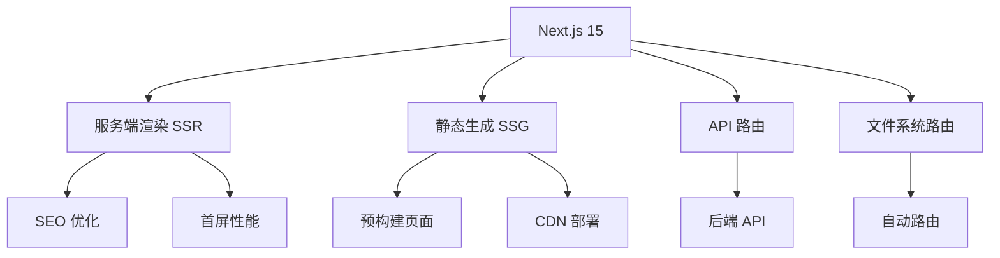

**图表来源**
- [next.config.ts](file://next.config.ts#L1-L71)
- [package.json](file://package.json#L12-L14)

**关键特性：**
- **服务端渲染（SSR）**：提升SEO效果和首屏加载速度
- **API路由**：内置RESTful API支持
- **自动重写规则**：与后端API的无缝集成
- **输出优化**：支持独立部署模式

**节来源**
- [next.config.ts](file://next.config.ts#L1-L71)
- [package.json](file://package.json#L12-L14)

### React 19（组件模型）

React 19提供了现代化的组件开发体验：

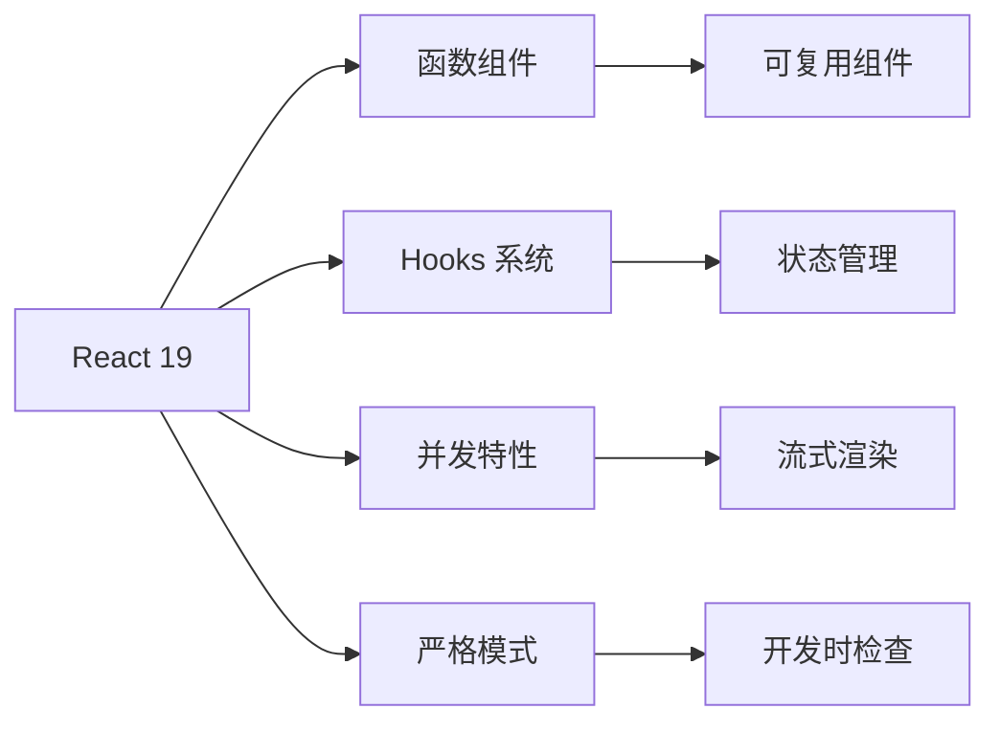

**图表来源**
- [package.json](file://package.json#L16-L17)

**核心优势：**
- **函数式组件**：更简洁的代码结构
- **Hooks系统**：增强的状态管理和副作用处理
- **并发特性**：更好的用户体验
- **严格模式**：提高代码质量

**节来源**
- [package.json](file://package.json#L16-L17)

### Tailwind CSS（原子化样式）

Tailwind CSS提供了实用优先的样式解决方案：

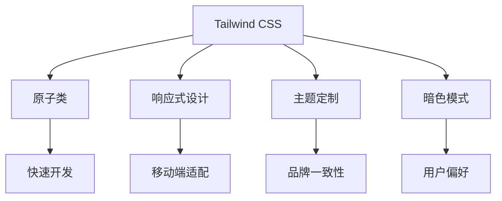

**图表来源**
- [tailwind.config.js](file://tailwind.config.js#L1-L8)
- [postcss.config.mjs](file://postcss.config.mjs#L1-L6)

**配置特点：**
- **暗色模式支持**：基于CSS选择器的自动切换
- **内容扫描**：自动清理未使用的样式
- **PostCSS集成**：与构建流程深度整合

**节来源**
- [tailwind.config.js](file://tailwind.config.js#L1-L8)
- [postcss.config.mjs](file://postcss.config.mjs#L1-L6)

### TypeScript（类型安全）

TypeScript确保了代码的类型安全性和开发体验：

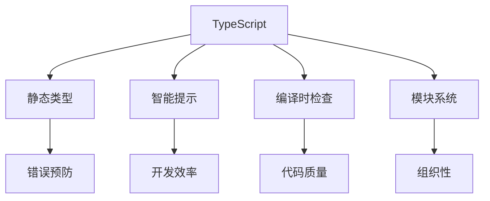

**图表来源**
- [tsconfig.json](file://tsconfig.json#L1-L28)
- [package.json](file://package.json#L35)

**配置要点：**
- **严格模式**：启用所有严格类型检查选项
- **模块解析**：使用Bundler模式
- **插件支持**：集成Next.js插件
- **路径映射**：简化导入路径

**节来源**
- [tsconfig.json](file://tsconfig.json#L1-L28)
- [package.json](file://package.json#L35)

### 构建配置

#### PostCSS配置
PostCSS提供了CSS处理管道：

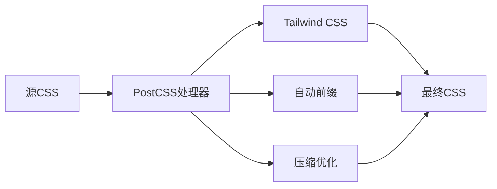

**图表来源**
- [postcss.config.mjs](file://postcss.config.mjs#L1-L6)

#### ESLint配置
ESLint确保代码质量和一致性：

**图表来源**
- [eslint.config.mjs](file://eslint.config.mjs#L1-L17)

**节来源**
- [postcss.config.mjs](file://postcss.config.mjs#L1-L6)
- [eslint.config.mjs](file://eslint.config.mjs#L1-L17)

## 后端技术栈

### FastAPI（高性能异步API框架）

FastAPI提供了现代化的API开发体验：

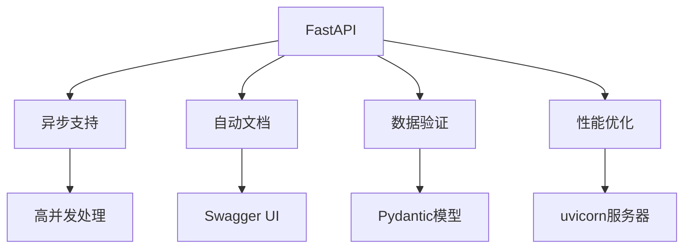

**图表来源**
- [api/pyproject.toml](file://api/pyproject.toml#L12)
- [api/main.py](file://api/main.py#L1-L80)

**核心特性：**
- **异步原生**：支持高并发请求处理
- **自动文档**：自动生成OpenAPI文档
- **数据验证**：基于Pydantic的强类型验证
- **性能优异**：接近Node.js的性能表现

**节来源**
- [api/pyproject.toml](file://api/pyproject.toml#L12)
- [api/main.py](file://api/main.py#L1-L80)

### Pydantic（数据验证）

Pydantic提供了强大的数据验证和序列化功能：

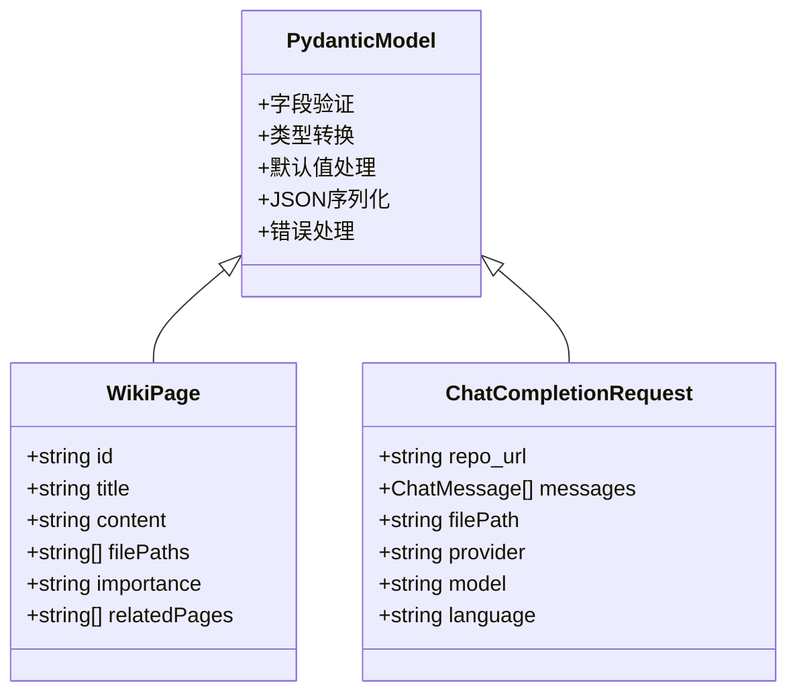

**图表来源**
- [api/api.py](file://api/api.py#L40-L110)
- [api/websocket_wiki.py](file://api/websocket_wiki.py#L28-L51)

**节来源**
- [api/api.py](file://api/api.py#L40-L110)
- [api/websocket_wiki.py](file://api/websocket_wiki.py#L28-L51)

### Uvicorn（ASGI服务器）

Uvicorn提供了高性能的ASGI服务器：

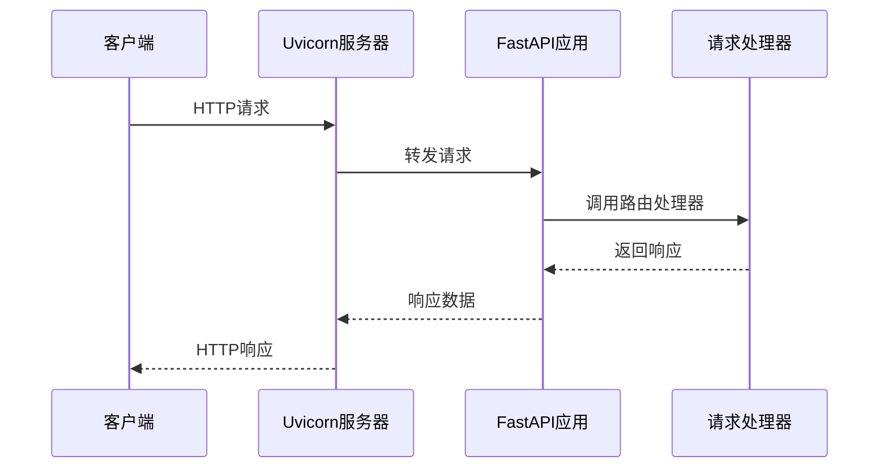

**图表来源**
- [api/main.py](file://api/main.py#L73-L78)

**节来源**
- [api/main.py](file://api/main.py#L73-L78)

### LangChain（AI链式调用）

LangChain提供了AI模型的统一接口和链式调用能力：

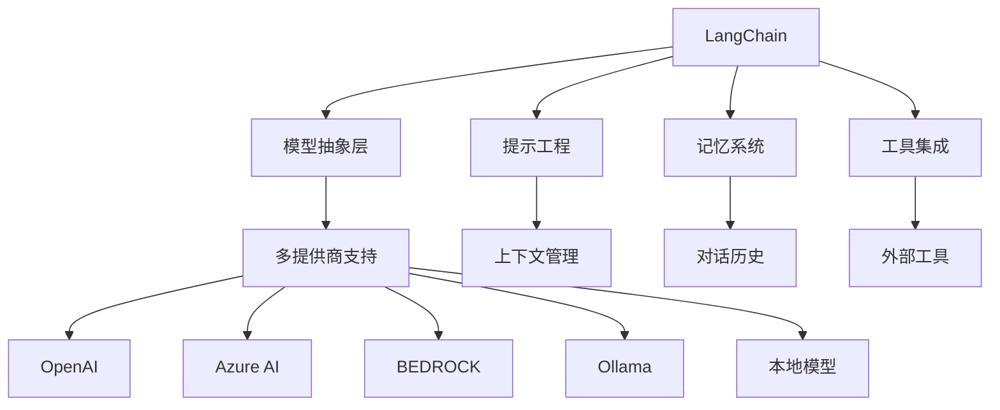

**图表来源**
- [api/config.py](file://api/config.py#L10-L16)

**支持的提供商：**
- **OpenAI**：GPT系列模型
- **Azure AI**：企业级AI服务
- **Amazon Bedrock**：AWS AI服务
- **Ollama**：本地模型运行
- **DashScope**：阿里云通义千问

**节来源**
- [api/config.py](file://api/config.py#L10-L16)

### FAISS（向量相似度检索）

FAISS提供了高效的向量搜索能力：

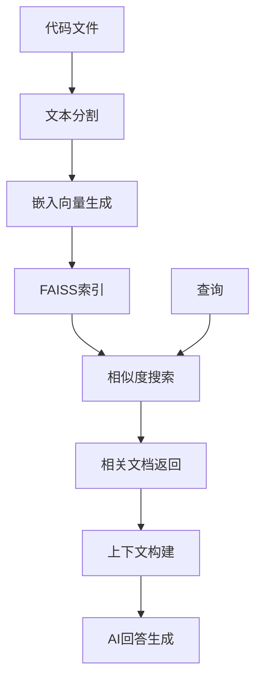

**图表来源**
- [api/config.py](file://api/config.py#L148-L174)

**应用场景：**
- **代码理解**：基于语义的代码相似度匹配
- **文档生成**：智能的内容检索和组装
- **问答系统**：准确的问题答案定位

**节来源**
- [api/config.py](file://api/config.py#L148-L174)

### Pytest（测试框架）

Pytest提供了全面的测试解决方案：

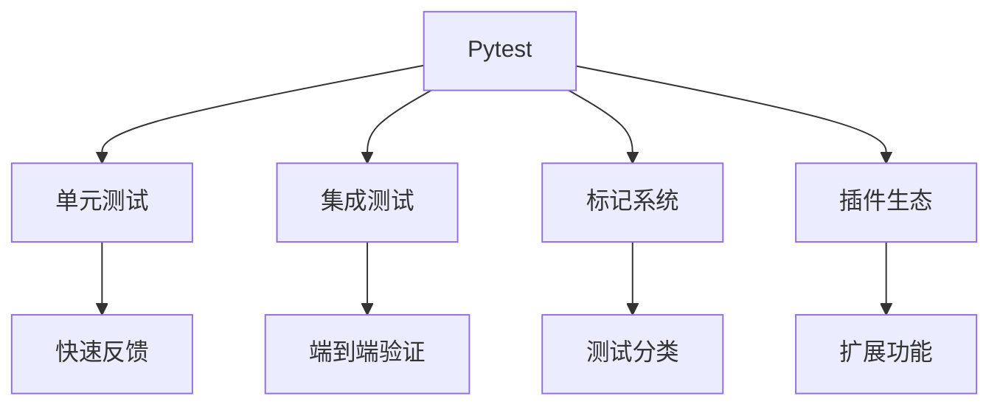

**图表来源**
- [pytest.ini](file://pytest.ini#L1-L16)
- [api/pyproject.toml](file://api/pyproject.toml#L38-L39)

**测试分类：**
- **unit**：单元测试
- **integration**：集成测试
- **slow**：慢速测试
- **network**：网络测试

**节来源**
- [pytest.ini](file://pytest.ini#L1-L16)
- [api/pyproject.toml](file://api/pyproject.toml#L38-L39)

## AI/ML技术集成

### 多LLM提供商集成

系统支持多个大型语言模型提供商：

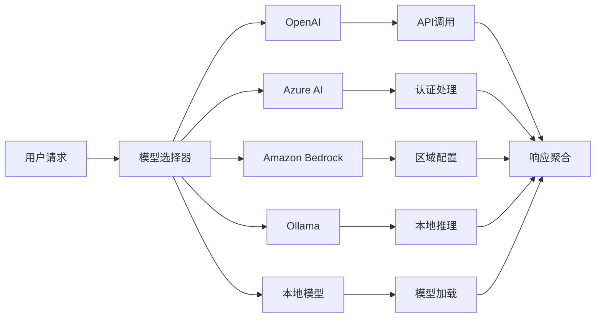

**图表来源**
- [api/config.py](file://api/config.py#L120-L140)
- [api/websocket_wiki.py](file://api/websocket_wiki.py#L430-L530)

**配置管理：**
- **环境变量**：灵活的API密钥管理
- **动态配置**：运行时模型参数调整
- **故障转移**：多提供商的容错机制

**节来源**
- [api/config.py](file://api/config.py#L120-L140)
- [api/websocket_wiki.py](file://api/websocket_wiki.py#L430-L530)

### 实时通信

WebSocket实现了前后端的实时通信：

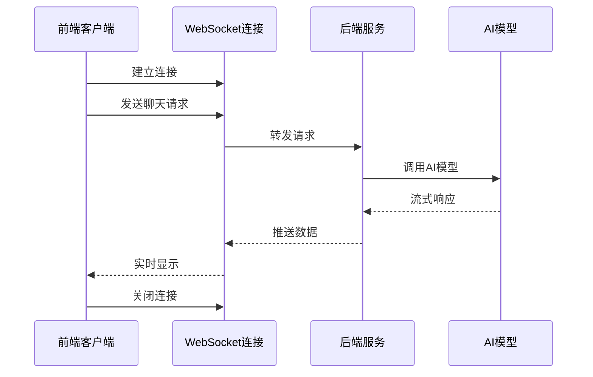

**图表来源**
- [src/utils/websocketClient.ts](file://src/utils/websocketClient.ts#L1-L86)
- [api/websocket_wiki.py](file://api/websocket_wiki.py#L52-L120)

**优势：**
- **即时响应**：无需轮询等待
- **资源高效**：减少不必要的网络请求
- **用户体验**：流畅的交互体验

**节来源**
- [src/utils/websocketClient.ts](file://src/utils/websocketClient.ts#L1-L86)
- [api/websocket_wiki.py](file://api/websocket_wiki.py#L52-L120)

## 容器化与部署

### Docker配置

Docker提供了完整的容器化解决方案：

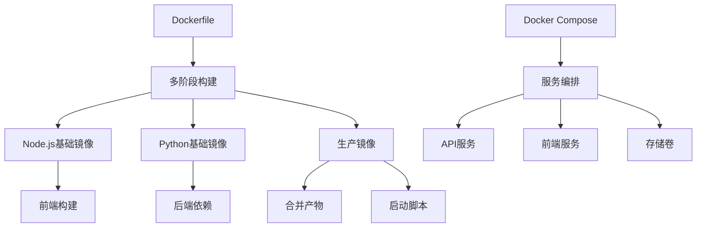

**图表来源**
- [Dockerfile](file://Dockerfile#L1-L112)
- [docker-compose.yml](file://docker-compose.yml#L1-L30)

**构建策略：**
- **多阶段构建**：优化镜像大小
- **缓存策略**：加速构建过程
- **安全配置**：最小权限原则

**节来源**
- [Dockerfile](file://Dockerfile#L1-L112)
- [docker-compose.yml](file://docker-compose.yml#L1-L30)

### 环境隔离

Docker Compose实现了完整的环境隔离：

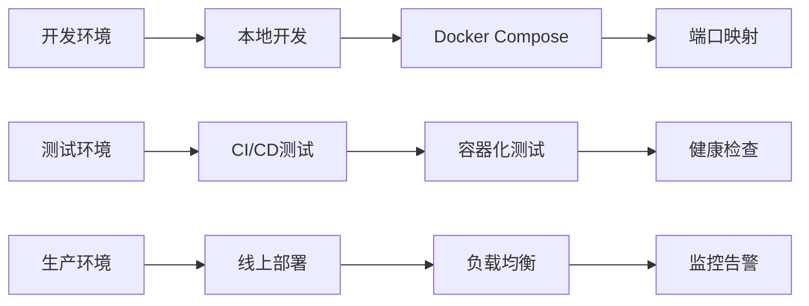

**配置特点：**
- **资源限制**：内存和CPU限制
- **健康检查**：自动故障恢复
- **持久化存储**：数据持久化
- **环境变量**：灵活的配置管理

**节来源**
- [docker-compose.yml](file://docker-compose.yml#L1-L30)

## 开发工具链

### 代码质量保证

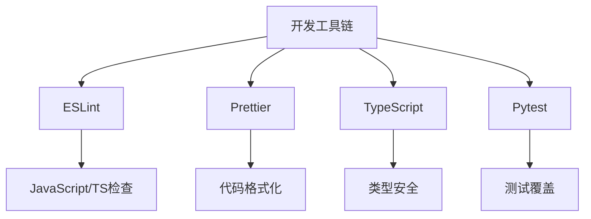

**图表来源**
- [eslint.config.mjs](file://eslint.config.mjs#L1-L17)
- [pytest.ini](file://pytest.ini#L1-L16)

**质量控制：**
- **静态分析**：代码规范检查
- **自动化测试**：持续质量保证
- **类型安全**：减少运行时错误
- **文档生成**：API文档维护

**节来源**
- [eslint.config.mjs](file://eslint.config.mjs#L1-L17)
- [pytest.ini](file://pytest.ini#L1-L16)

## 技术选型分析

### 前端技术选择

**Next.js 15的优势：**
- **全栈一体化**：减少技术栈复杂度
- **性能优化**：内置的优化策略
- **开发体验**：热重载和类型安全
- **SEO友好**：服务端渲染支持

**React 19的改进：**
- **函数式编程**：更直观的组件逻辑
- **并发特性**：更好的用户体验
- **性能提升**：更高效的渲染机制

**TypeScript的必要性：**
- **类型安全**：减少运行时错误
- **开发效率**：智能提示和重构支持
- **团队协作**：代码可读性和维护性

### 后端技术选择

**FastAPI的优越性：**
- **异步原生**：高并发处理能力
- **自动文档**：减少API文档维护成本
- **数据验证**：内置的输入验证
- **性能优异**：接近Go语言的性能

**Python生态的优势：**
- **AI/ML成熟**：丰富的机器学习库
- **社区活跃**：持续的技术更新
- **开发效率**：快速原型开发
- **生态系统**：完善的第三方库支持

### AI技术集成

**LangChain的价值：**
- **统一接口**：屏蔽不同提供商的差异
- **链式调用**：复杂的AI工作流编排
- **扩展性强**：易于添加新的AI服务
- **开发友好**：丰富的示例和文档

**FAISS的性能：**
- **向量搜索**：高效的相似度计算
- **大规模数据**：支持海量文档处理
- **实时查询**：毫秒级响应时间
- **内存优化**：合理的内存使用

## 系统架构概览

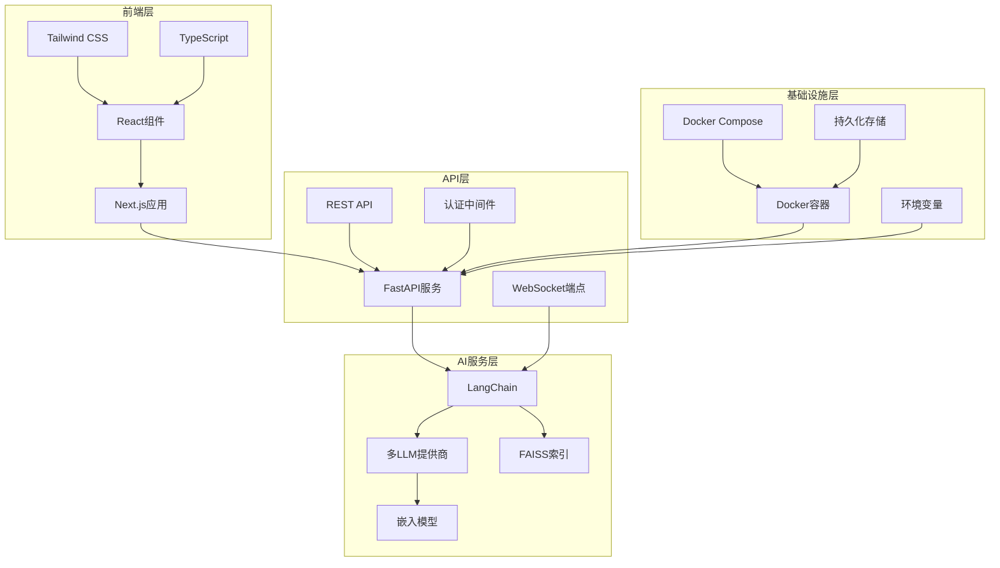

**图表来源**
- [package.json](file://package.json#L1-L39)
- [api/pyproject.toml](file://api/pyproject.toml#L1-L39)
- [Dockerfile](file://Dockerfile#L1-L112)

**架构特点：**
- **分层清晰**：明确的职责分离
- **松耦合**：组件间的低依赖关系
- **可扩展**：易于添加新功能
- **可维护**：清晰的代码结构

## 总结

deepwiki-open展示了现代全栈开发的最佳实践，通过精心选择的技术栈实现了以下目标：

### 技术创新点

1. **全栈TypeScript**：从前端到后端的类型安全保障
2. **实时AI交互**：基于WebSocket的流式响应
3. **多提供商AI集成**：灵活的AI服务选择
4. **容器化部署**：标准化的生产环境配置

### 性能优势

- **首屏加载**：SSR优化的快速页面渲染
- **AI响应**：异步处理的低延迟响应
- **并发处理**：高并发场景下的稳定表现
- **资源利用**：容器化的高效资源管理

### 开发体验

- **类型安全**：从开发到生产的全程保护
- **自动文档**：基于代码的API文档生成
- **热重载**：快速的开发迭代周期
- **测试覆盖**：全面的质量保证体系

这个技术栈的选择体现了对现代Web开发趋势的深刻理解和实际应用价值，为AI驱动的应用程序开发提供了可参考的架构模式和最佳实践。