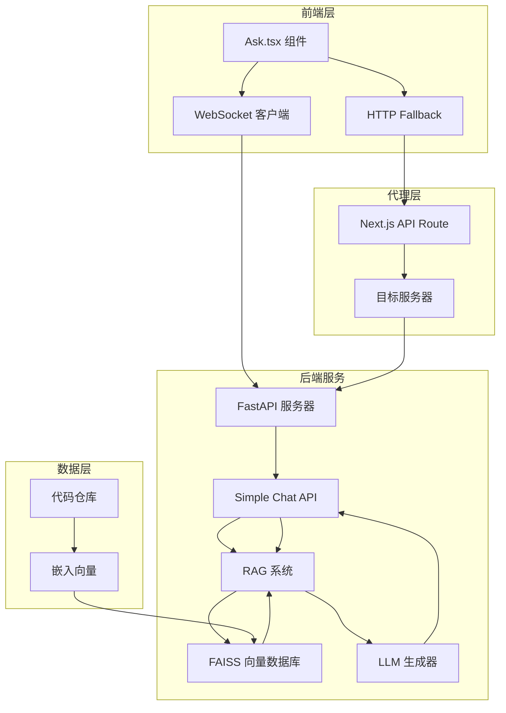
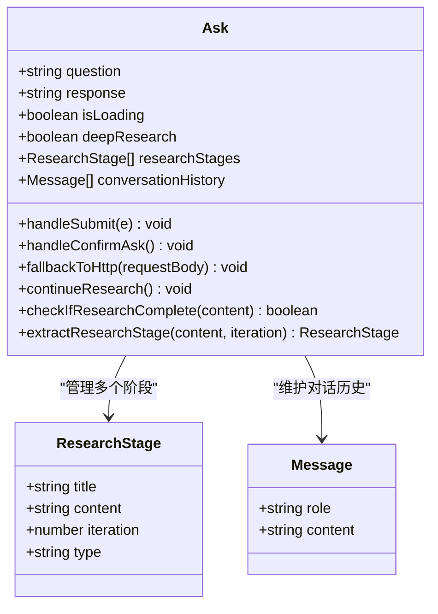
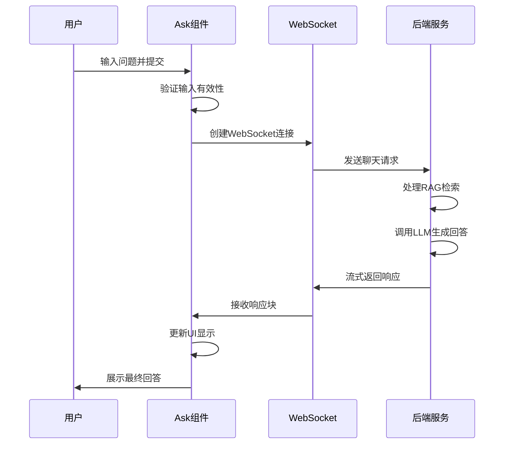
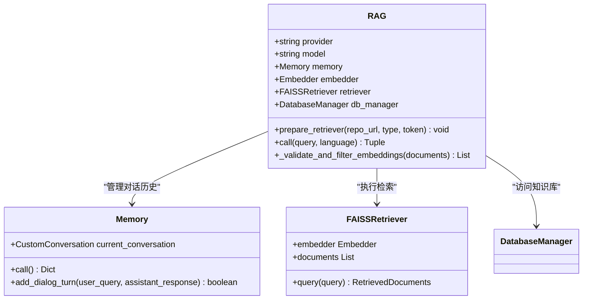
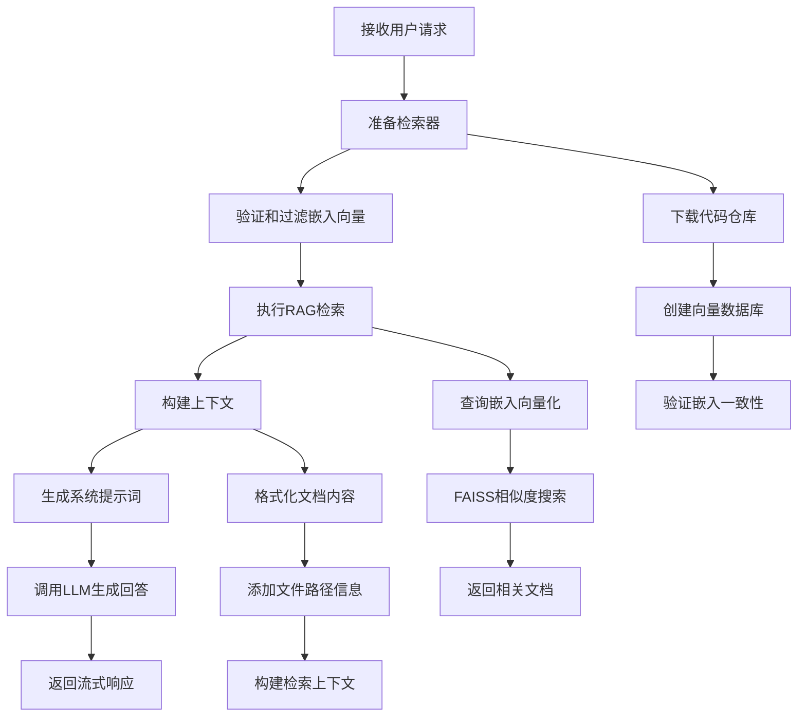
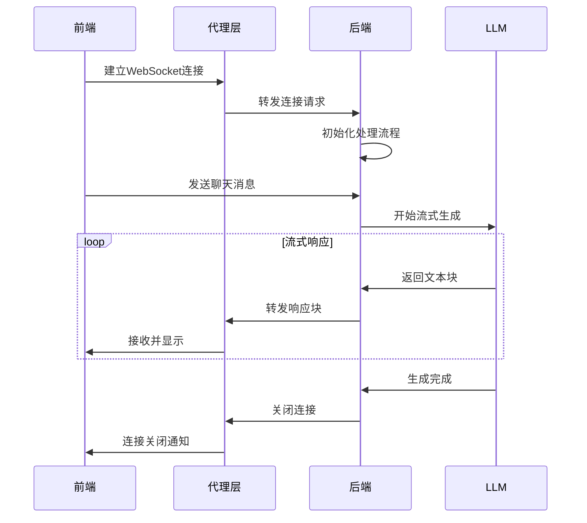
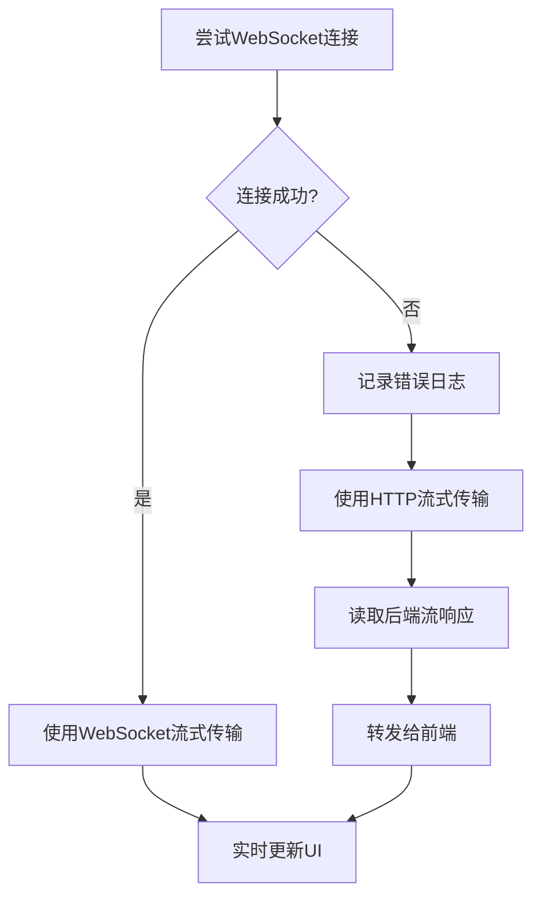
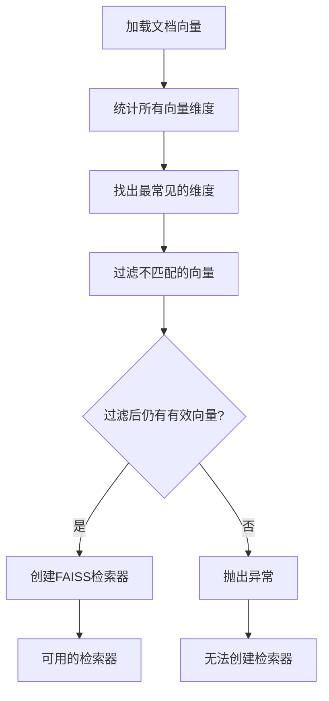
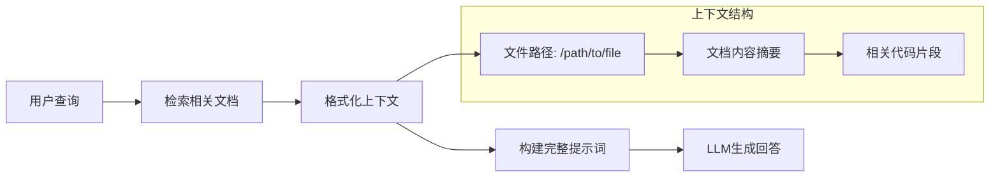

# 智能问答

<cite>
**本文档引用的文件**
- [Ask.tsx](file://src/components/Ask.tsx)
- [simple_chat.py](file://api/simple_chat.py)
- [rag.py](file://api/rag.py)
- [route.ts](file://src/app/api/chat/stream/route.ts)
- [websocketClient.ts](file://src/utils/websocketClient.ts)
- [prompts.py](file://api/prompts.py)
- [data_pipeline.py](file://api/data_pipeline.py)
- [config.py](file://api/config.py)
</cite>

## 目录
1. [简介](#简介)
2. [系统架构概览](#系统架构概览)
3. [前端组件分析](#前端组件分析)
4. [后端RAG系统](#后端rag系统)
5. [流式响应机制](#流式响应机制)
6. [检索策略详解](#检索策略详解)
7. [实际用例分析](#实际用例分析)
8. [局限性与改进方向](#局限性与改进方向)
9. [总结](#总结)

## 简介

智能问答功能是DeepWiki项目的核心特性之一，它通过RAG（检索增强生成）技术实现了上下文感知的问答能力。该系统能够理解用户关于代码仓库的问题，并通过向量数据库检索相关代码片段和文档，结合大语言模型生成准确、详细的回答。

## 系统架构概览

智能问答系统采用前后端分离架构，主要包含以下核心组件：



**图表来源**
- [Ask.tsx](file://src/components/Ask.tsx#L1-L50)
- [route.ts](file://src/app/api/chat/stream/route.ts#L1-L30)
- [simple_chat.py](file://api/simple_chat.py#L1-L50)

## 前端组件分析

### Ask.tsx 组件架构

Ask.tsx 是智能问答功能的主要前端组件，负责捕获用户输入并展示AI生成的回答。



**图表来源**
- [Ask.tsx](file://src/components/Ask.tsx#L24-L45)
- [Ask.tsx](file://src/components/Ask.tsx#L29-L34)

### 用户交互流程

前端组件支持两种问答模式：

1. **简单问答模式**：直接获取LLM生成的回答
2. **深度研究模式**：进行多轮迭代的研究过程



**图表来源**
- [Ask.tsx](file://src/components/Ask.tsx#L532-L620)
- [websocketClient.ts](file://src/utils/websocketClient.ts#L43-L75)

**章节来源**
- [Ask.tsx](file://src/components/Ask.tsx#L532-L620)
- [websocketClient.ts](file://src/utils/websocketClient.ts#L43-L75)

## 后端RAG系统

### RAG类设计

RAG系统是智能问答的核心，负责从向量数据库检索相关信息并生成上下文感知的回答。



**图表来源**
- [rag.py](file://api/rag.py#L153-L244)
- [rag.py](file://api/rag.py#L51-L91)

### RAG处理流程

后端服务接收到用户请求后，按照以下步骤处理：



**图表来源**
- [simple_chat.py](file://api/simple_chat.py#L76-L238)
- [rag.py](file://api/rag.py#L345-L416)

**章节来源**
- [simple_chat.py](file://api/simple_chat.py#L76-L238)
- [rag.py](file://api/rag.py#L345-L416)

## 流式响应机制

### WebSocket流式传输

系统采用WebSocket协议实现实时流式响应，提供更好的用户体验。



**图表来源**
- [websocketClient.ts](file://src/utils/websocketClient.ts#L43-L75)
- [route.ts](file://src/app/api/chat/stream/route.ts#L49-L87)

### HTTP回退机制

当WebSocket连接失败时，系统自动降级到HTTP流式传输：



**图表来源**
- [Ask.tsx](file://src/components/Ask.tsx#L405-L480)
- [route.ts](file://src/app/api/chat/stream/route.ts#L49-L87)

**章节来源**
- [Ask.tsx](file://src/components/Ask.tsx#L405-L480)
- [route.ts](file://src/app/api/chat/stream/route.ts#L49-L87)

## 检索策略详解

### 分块大小优化

RAG系统采用智能分块策略来平衡检索精度和性能：

| 参数 | 默认值 | 说明 |
|------|--------|------|
| 最大令牌数 | 7500 | 避免超过嵌入模型的令牌限制 |
| 嵌入向量验证 | 自动 | 确保所有文档具有相同维度的向量 |
| 重排序机制 | FAISS内建 | 基于余弦相似度排序检索结果 |
| 多查询扩展 | 支持 | 通过不同角度查询提高召回率 |

### 嵌入向量验证

系统实现了严格的嵌入向量验证机制，确保向量数据库的一致性：



**图表来源**
- [rag.py](file://api/rag.py#L251-L343)

### 上下文注入策略

系统将检索到的相关文档作为上下文注入到LLM提示词中：



**图表来源**
- [simple_chat.py](file://api/simple_chat.py#L200-L228)
- [prompts.py](file://api/prompts.py#L30-L56)

**章节来源**
- [rag.py](file://api/rag.py#L251-L343)
- [simple_chat.py](file://api/simple_chat.py#L200-L228)

## 实际用例分析

### 用例1：项目启动命令查询

**用户问题**："这个项目的启动命令是什么？"

**系统处理流程**：
1. **检索阶段**：在FAISS数据库中搜索包含"启动"、"运行"、"启动脚本"关键词的文档
2. **上下文提取**：找到包含package.json、Dockerfile、启动脚本等关键文件
3. **回答生成**：结合多个相关文档生成综合性的启动指南

**预期输出**：
```
## 项目启动指南

根据代码分析，该项目提供了多种启动方式：

### 1. 使用 npm/yarn
```bash
# 安装依赖
npm install
# 或
yarn install

# 启动开发服务器
npm run dev
# 或
yarn dev

# 构建生产版本
npm run build
# 或
yarn build
```

### 2. 使用 Docker
```bash
# 构建镜像
docker build -t project-name .

# 运行容器
docker run -p 3000:3000 project-name
```

### 3. 直接运行
如果项目包含可执行脚本：
```bash
./start.sh
# 或
python main.py
```

请根据您的环境选择合适的启动方式。
```

### 用例2：认证模块实现分析

**用户问题**："auth模块是如何实现的？"

**系统处理流程**：
1. **精确检索**：专门搜索auth相关的文件和目录
2. **代码分析**：提取认证中间件、用户验证逻辑、权限控制等关键代码
3. **架构说明**：结合项目整体架构解释认证流程

**预期输出**：
```
## 认证模块架构分析

该项目的认证系统采用多层次的安全设计：

### 1. 中间件层
在 `src/middleware/auth.ts` 中实现了全局认证中间件：
```typescript
export const authMiddleware = async (req: NextRequest) => {
  const token = req.headers.get('Authorization')?.split(' ')[1];
  if (!token) {
    return new Response('Unauthorized', { status: 401 });
  }
  
  const isValid = await verifyToken(token);
  if (!isValid) {
    return new Response('Invalid token', { status: 403 });
  }
  
  return NextResponse.next();
};
```

### 2. 用户验证逻辑
在 `src/services/auth.service.ts` 中：
```typescript
export class AuthService {
  async validateUser(credentials: Credentials): Promise<User | null> {
    const user = await this.userRepo.findByEmail(credentials.email);
    if (!user || !(await bcrypt.compare(credentials.password, user.passwordHash))) {
      return null;
    }
    return user;
  }
  
  async generateToken(user: User): Promise<string> {
    return jwt.sign(
      { userId: user.id, roles: user.roles },
      process.env.JWT_SECRET!,
      { expiresIn: '24h' }
    );
  }
}
```

### 3. 权限控制系统
实现了基于角色的访问控制（RBAC）：
```typescript
export const requireRole = (roles: string[]) => {
  return async (req: NextRequest, res: NextResponse) => {
    const user = await getCurrentUser(req);
    if (!user || !roles.some(role => user.roles.includes(role))) {
      return new Response('Forbidden', { status: 403 });
    }
    return NextResponse.next();
  };
};
```

该认证系统支持：
- JWT令牌验证
- 密码哈希存储
- 角色基础访问控制
- 中间件级别的统一认证
```

**章节来源**
- [prompts.py](file://api/prompts.py#L1-L192)
- [simple_chat.py](file://api/simple_chat.py#L252-L288)

## 局限性与改进方向

### 当前局限性

1. **模糊问题处理**
   - 对于过于宽泛的问题（如"这个项目怎么样？"），系统可能无法提供有意义的回答
   - 缺乏语义理解能力，难以识别同义问法

2. **上下文窗口限制**
   - LLM的上下文长度限制影响了复杂问题的处理
   - 大型代码库可能导致上下文截断

3. **检索质量**
   - FAISS检索器的准确性依赖于嵌入质量
   - 对于新引入的概念，可能缺乏相关文档

### 改进方向

1. **增强检索能力**
   - 实现多模态检索（代码+文档）
   - 引入图神经网络增强语义理解
   - 添加查询扩展和重写机制

2. **优化上下文管理**
   - 实现动态上下文压缩
   - 添加记忆机制保留重要信息
   - 支持长对话状态管理

3. **提升用户体验**
   - 添加推理过程可视化
   - 实现交互式问答
   - 提供回答质量评分

### 性能优化建议

| 优化项 | 当前状态 | 改进方案 |
|--------|----------|----------|
| 检索速度 | 受限于FAISS索引大小 | 实现增量索引更新 |
| 响应时间 | 受限于LLM生成速度 | 添加缓存机制 |
| 内存使用 | 大型仓库占用较多内存 | 实现懒加载策略 |
| 并发处理 | 单连接限制并发量 | 支持连接池 |

**章节来源**
- [simple_chat.py](file://api/simple_chat.py#L529-L671)
- [rag.py](file://api/rag.py#L251-L343)

## 总结

DeepWiki的智能问答功能通过RAG技术实现了强大的上下文感知问答能力。系统从前端的用户交互到后端的向量检索和LLM生成，形成了完整的问答链路。

### 核心优势

1. **上下文感知**：通过FAISS向量数据库实现精准的语义检索
2. **流式响应**：WebSocket协议提供实时的流式回答体验
3. **多模态支持**：支持代码、文档等多种类型的信息检索
4. **灵活部署**：支持多种LLM提供商和本地部署选项

### 技术亮点

- **智能分块策略**：平衡检索精度和性能
- **严格验证机制**：确保嵌入向量的一致性
- **优雅降级**：WebSocket失败时自动回退到HTTP
- **深度研究模式**：支持复杂的多轮问答场景

该系统为开发者提供了强大的代码库理解和问答能力，是现代AI驱动开发工具的重要实践案例。