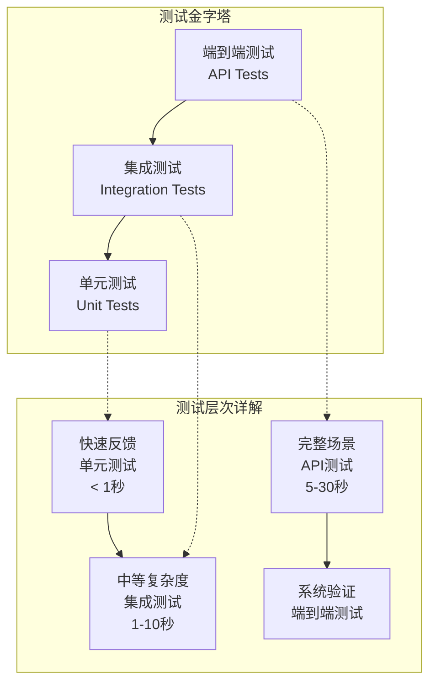
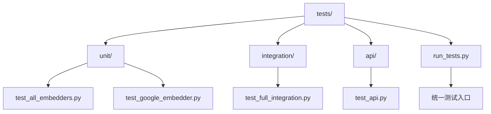
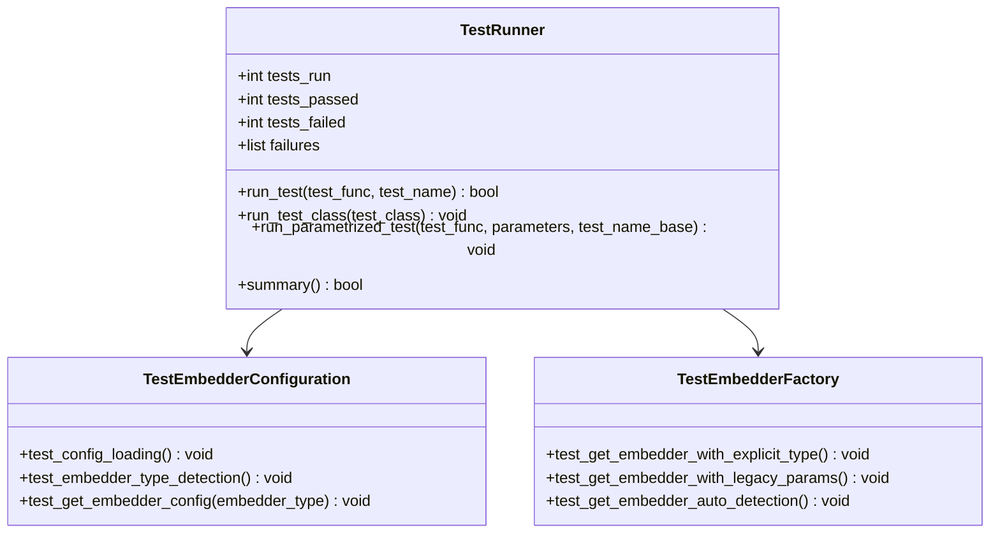
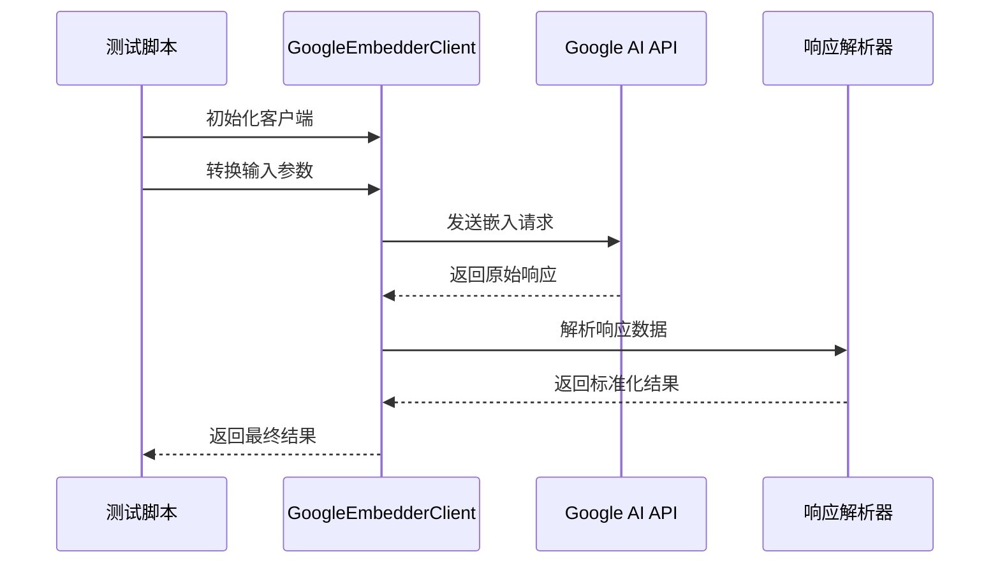
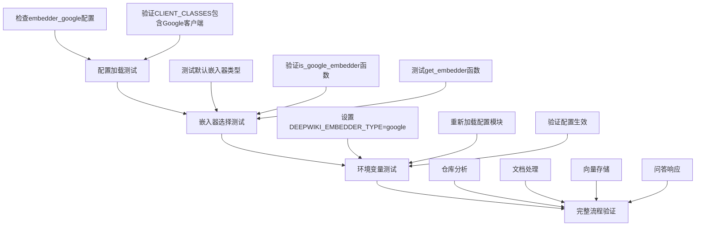
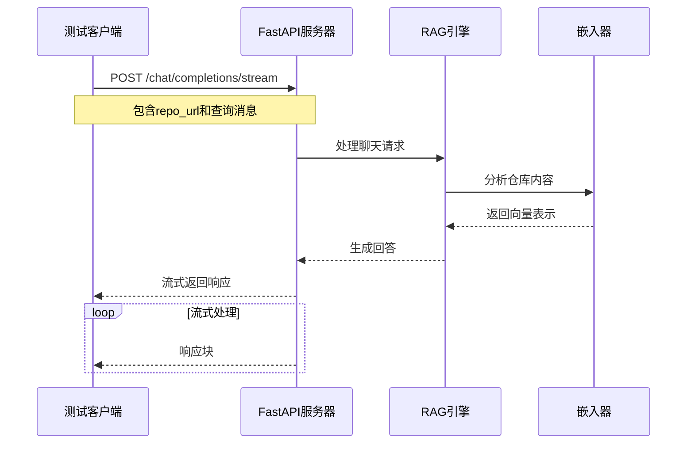
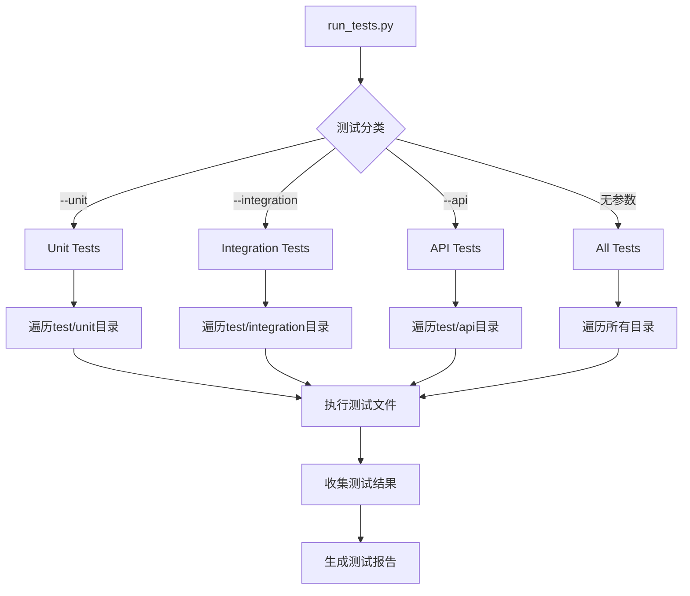
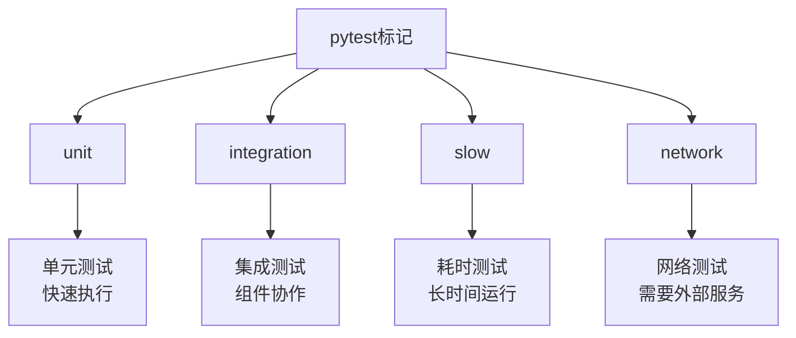
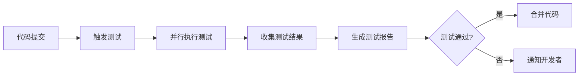

# 测试策略

<cite>
**本文档中引用的文件**
- [pytest.ini](file://pytest.ini)
- [tests/run_tests.py](file://tests/run_tests.py)
- [tests/unit/test_all_embedders.py](file://tests/unit/test_all_embedders.py)
- [tests/unit/test_google_embedder.py](file://tests/unit/test_google_embedder.py)
- [tests/integration/test_full_integration.py](file://tests/integration/test_full_integration.py)
- [tests/api/test_api.py](file://tests/api/test_api.py)
- [test/test_extract_repo_name.py](file://test/test_extract_repo_name.py)
- [tests/README.md](file://tests/README.md)
- [api/tools/embedder.py](file://api/tools/embedder.py)
</cite>

## 目录
1. [概述](#概述)
2. [测试分层架构](#测试分层架构)
3. [单元测试策略](#单元测试策略)
4. [集成测试策略](#集成测试策略)
5. [API测试策略](#api测试策略)
6. [测试工具与框架](#测试工具与框架)
7. [测试配置与标记](#测试配置与标记)
8. [开发者贡献指南](#开发者贡献指南)
9. [测试执行与监控](#测试执行与监控)
10. [最佳实践与建议](#最佳实践与建议)

## 概述

deepwiki-open项目采用分层测试策略，通过三个主要测试层次确保代码质量和功能稳定性：

- **单元测试（Unit Tests）**：验证单个函数与类的正确性
- **集成测试（Integration Tests）**：验证模块间协作和端到端流程
- **API测试（API Tests）**：验证HTTP接口和WebSocket连接

这种分层策略确保了从底层组件到完整业务流程的全面测试覆盖。

## 测试分层架构



**图表来源**
- [tests/README.md](file://tests/README.md#L70-L87)

### 测试目录结构



**图表来源**
- [tests/README.md](file://tests/README.md#L7-L17)

**章节来源**
- [tests/README.md](file://tests/README.md#L1-L126)

## 单元测试策略

### 嵌入器兼容性测试

单元测试的核心是`test_all_embedders.py`，它使用自定义测试运行器验证所有AI嵌入模型的兼容性。

#### 测试运行器架构



**图表来源**
- [tests/unit/test_all_embedders.py](file://tests/unit/test_all_embedders.py#L26-L100)

#### 参数化测试实现

测试系统支持多种嵌入器类型的参数化测试：

| 嵌入器类型 | 配置键 | 客户端类 | 环境变量 |
|------------|--------|----------|----------|
| OpenAI | `embedder` | `OpenAIClient` | 默认 |
| Google | `embedder_google` | `GoogleEmbedderClient` | `GOOGLE_API_KEY` |
| Ollama | `embedder_ollama` | `OllamaClient` | `OLLAMA_HOST` |

#### Google嵌入器专用测试

`test_google_embedder.py`专注于解决特定的嵌入器问题：



**图表来源**
- [tests/unit/test_google_embedder.py](file://tests/unit/test_google_embedder.py#L23-L67)

**章节来源**
- [tests/unit/test_all_embedders.py](file://tests/unit/test_all_embedders.py#L1-L464)
- [tests/unit/test_google_embedder.py](file://tests/unit/test_google_embedder.py#L1-L183)

## 集成测试策略

### 端到端流程测试

`test_full_integration.py`模拟完整的用户工作流程，从仓库分析到文档生成再到问答响应。

#### 集成测试流程



**图表来源**
- [tests/integration/test_full_integration.py](file://tests/integration/test_full_integration.py#L14-L120)

#### 环境变量驱动的测试

集成测试展示了如何通过环境变量控制嵌入器类型：

| 步骤 | 操作 | 验证点 |
|------|------|--------|
| 1 | 设置`DEEPWIKI_EMBEDDER_TYPE=google` | 确认环境变量生效 |
| 2 | 重新加载配置模块 | 验证配置热更新 |
| 3 | 获取当前嵌入器类型 | 确认类型检测正确 |
| 4 | 创建嵌入器实例 | 验证客户端初始化成功 |

**章节来源**
- [tests/integration/test_full_integration.py](file://tests/integration/test_full_integration.py#L1-L152)

## API测试策略

### HTTP端点测试

`test_api.py`专门测试FastAPI应用程序的HTTP接口，包括流式响应处理。

#### API测试架构



**图表来源**
- [tests/api/test_api.py](file://tests/api/test_api.py#L5-L55)

#### 测试用例设计

API测试涵盖了以下关键场景：

| 测试场景 | 输入参数 | 验证要点 |
|----------|----------|----------|
| 标准流式响应 | GitHub仓库URL + 查询 | 响应格式正确，流式传输正常 |
| 文件路径指定 | 包含文件路径的查询 | 特定文件内容被正确检索 |
| 错误处理 | 无效的仓库URL | 返回适当的错误信息 |
| 超时处理 | 大型仓库或复杂查询 | 连接超时和重试机制 |

**章节来源**
- [tests/api/test_api.py](file://tests/api/test_api.py#L1-L71)

## 测试工具与框架

### 统一测试运行器

`run_tests.py`提供了统一的测试执行界面，支持多种测试分类和环境检查。

#### 测试运行器功能



**图表来源**
- [tests/run_tests.py](file://tests/run_tests.py#L41-L82)

#### 环境检查机制

测试运行器包含全面的环境检查：

| 检查项目 | 必要性 | 失败影响 |
|----------|--------|----------|
| `.env`文件存在 | 所有测试 | API密钥缺失 |
| `GOOGLE_API_KEY` | Google测试 | Google嵌入器测试失败 |
| `OPENAI_API_KEY` | OpenAI测试 | OpenAI相关测试失败 |
| `adalflow`库 | 核心依赖 | 嵌入器测试失败 |
| `google-generativeai`库 | Google AI | Google AI测试失败 |
| `requests`库 | API测试 | HTTP接口测试失败 |

**章节来源**
- [tests/run_tests.py](file://tests/run_tests.py#L1-L163)

## 测试配置与标记

### pytest配置

项目使用`pytest.ini`进行全局测试配置，定义了测试发现规则和标记系统。

#### 配置参数详解

| 配置项 | 值 | 作用 |
|--------|-----|------|
| `testpaths` | `test` | 测试文件搜索路径 |
| `python_files` | `test_*.py *_test.py` | 测试文件命名模式 |
| `python_classes` | `Test*` | 测试类命名模式 |
| `python_functions` | `test_*` | 测试函数命名模式 |
| `addopts` | `-v --strict-markers --disable-warnings --tb=short` | 默认命令行选项 |

#### 测试标记系统



**图表来源**
- [pytest.ini](file://pytest.ini#L11-L15)

**章节来源**
- [pytest.ini](file://pytest.ini#L1-L16)

## 开发者贡献指南

### 编写可维护的测试

#### 测试文件组织原则

1. **按功能分类**：将相关测试放在同一文件中
2. **清晰的命名**：使用描述性的测试名称
3. **独立性**：每个测试应该独立运行
4. **可重复性**：测试结果应该一致可靠

#### 使用Mock隔离外部依赖

```python
# 示例：使用unittest.mock隔离外部API调用
from unittest.mock import patch, MagicMock

@patch('api.google_embedder_client.GoogleEmbedderClient.call')
def test_google_embedder_mock(mock_call):
    # 设置mock行为
    mock_call.return_value = {'embedding': [0.1, 0.2, 0.3]}
    
    # 执行测试
    client = GoogleEmbedderClient()
    result = client.process_input("test")
    
    # 验证mock调用
    mock_call.assert_called_once()
    assert result.embedding == [0.1, 0.2, 0.3]
```

#### 边界条件测试

测试应该覆盖以下边界条件：

| 测试类别 | 具体示例 |
|----------|----------|
| 输入边界 | 空字符串、超长文本、特殊字符 |
| 数值边界 | 最小值、最大值、零值 |
| 时间边界 | 超时、延迟、并发访问 |
| 错误边界 | 网络异常、认证失败、资源不足 |

### 测试开发最佳实践

#### 项目根路径设置

所有测试文件都应该包含标准的项目路径设置：

```python
from pathlib import Path
import sys

# 添加项目根目录到Python路径
project_root = Path(__file__).parent.parent.parent
sys.path.insert(0, str(project_root))
```

#### 日志配置

```python
import logging

logging.basicConfig(
    level=logging.INFO,
    format='%(asctime)s - %(name)s - %(levelname)s - %(message)s'
)
logger = logging.getLogger(__name__)
```

**章节来源**
- [tests/README.md](file://tests/README.md#L88-L96)

## 测试执行与监控

### 测试执行命令

#### 基本测试命令

```bash
# 运行所有测试
python tests/run_tests.py

# 只运行单元测试
python tests/run_tests.py --unit

# 只运行集成测试
python tests/run_tests.py --integration

# 只运行API测试
python tests/run_tests.py --api

# 检查环境设置
python tests/run_tests.py --check-env
```

#### pytest直接执行

对于更灵活的测试执行，可以直接使用pytest：

```bash
# 显示详细输出
pytest -v tests/

# 只运行标记为unit的测试
pytest -v -m unit

# 生成覆盖率报告
pytest --cov=api tests/

# 跳过网络测试
pytest -m "not network"
```

### 测试覆盖率分析

#### 覆盖率配置

```bash
# 生成HTML覆盖率报告
pytest --cov=api --cov-report=html

# 生成终端覆盖率报告
pytest --cov=api --cov-report=term

# 设置覆盖率阈值
pytest --cov=api --cov-fail-under=80
```

#### 关键覆盖率指标

| 指标 | 目标值 | 说明 |
|------|--------|------|
| 行覆盖率 | ≥80% | 代码行执行比例 |
| 函数覆盖率 | ≥90% | 函数调用比例 |
| 分支覆盖率 | ≥70% | 条件分支覆盖 |
| 路径覆盖率 | ≥60% | 执行路径覆盖 |

### 测试结果分析

#### 自动化测试流水线



#### 测试失败诊断

当测试失败时，系统提供详细的诊断信息：

1. **错误堆栈跟踪**：显示具体的错误位置
2. **环境变量状态**：检查必要的环境变量
3. **依赖库版本**：验证依赖库的可用性
4. **API密钥状态**：确认API密钥的有效性

**章节来源**
- [tests/run_tests.py](file://tests/run_tests.py#L128-L163)

## 最佳实践与建议

### 测试设计原则

#### 1. 测试金字塔原则

遵循测试金字塔，确保：
- 单元测试数量最多，执行最快
- 集成测试数量适中，验证组件协作
- 端到端测试数量最少，验证完整流程

#### 2. 测试隔离原则

每个测试应该：
- 独立于其他测试
- 不依赖测试顺序
- 清理测试产生的副作用

#### 3. 测试可读性原则

测试代码应该：
- 使用清晰的命名
- 包含充分的注释
- 遵循一致的风格

### 性能优化建议

#### 并行测试执行

```bash
# 使用pytest-xdist并行执行测试
pytest -n auto tests/

# 指定并行进程数
pytest -n 4 tests/
```

#### 测试选择性执行

```bash
# 只运行失败的测试
pytest --lf

# 运行上次失败的测试
pytest --failed-first

# 基于覆盖率选择测试
pytest --cov=api --cov-report=term-missing
```

### 维护性考虑

#### 测试重构策略

1. **定期重构测试代码**：保持测试的可维护性
2. **移除过时的测试**：清理不再相关的测试
3. **更新测试数据**：保持测试数据的时效性
4. **优化测试性能**：识别和优化慢速测试

#### 测试文档维护

- 保持测试文档的更新
- 记录测试的设计决策
- 提供测试故障排除指南
- 维护测试环境配置文档

### 团队协作

#### 测试审查流程

1. **代码审查包含测试**：确保新功能有相应的测试
2. **测试覆盖率要求**：设定最低覆盖率标准
3. **测试质量评估**：定期评估测试的有效性
4. **知识分享**：团队成员分享测试经验

#### 持续改进

- 定期回顾测试效果
- 收集团队反馈
- 更新测试策略
- 引入新的测试工具和技术

通过遵循这些测试策略和最佳实践，deepwiki-open项目能够确保高质量的代码交付和稳定的系统功能。测试不仅是质量保证的手段，更是促进代码设计改善和团队协作的重要工具。