# 深度研究功能技术实现文档

<cite>
**本文档引用的文件**
- [websocket_wiki.py](file://api/websocket_wiki.py)
- [data_pipeline.py](file://api/data_pipeline.py)
- [rag.py](file://api/rag.py)
- [prompts.py](file://api/prompts.py)
- [config.py](file://api/config.py)
- [api.py](file://api/api.py)
- [main.py](file://api/main.py)
- [workshop/page.tsx](file://src/app/[owner]/[repo]/workshop/page.tsx)
- [websocketClient.ts](file://src/utils/websocketClient.ts)
- [Ask.tsx](file://src/components/Ask.tsx)
</cite>

## 目录
1. [概述](#概述)
2. [系统架构](#系统架构)
3. [深度研究与普通问答的区别](#深度研究与普通问答的区别)
4. [前端界面交互](#前端界面交互)
5. [WebSocket通信机制](#websocket通信机制)
6. [后端处理流程](#后端处理流程)
7. [数据管道与RAG协同](#数据管道与rag协同)
8. [研究策略配置](#研究策略配置)
9. [性能考量](#性能考量)
10. [故障排除指南](#故障排除指南)
11. [总结](#总结)

## 概述

深度研究功能是DeepWiki项目的核心特性之一，它提供了一种结构化的、多轮次的研究方法来深入分析代码仓库。与传统的简单问答不同，深度研究通过多个迭代阶段，逐步深入探索特定主题，最终形成全面的综合报告。

该功能采用WebSocket技术实现实时通信，支持持续的对话式研究过程，并能够自动管理研究进度和状态。系统结合了先进的自然语言处理技术和代码分析能力，为用户提供高质量的知识发现体验。

## 系统架构

深度研究功能的整体架构采用前后端分离设计，通过WebSocket建立持久连接，实现高效的实时通信。

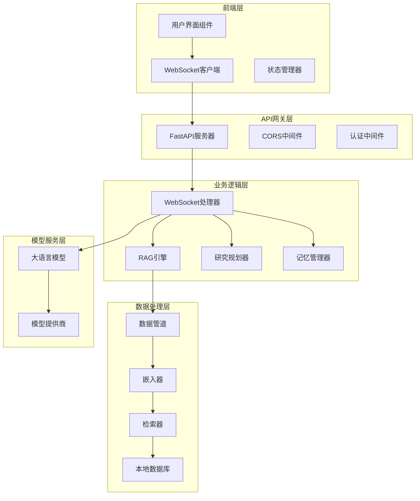

**图表来源**
- [websocket_wiki.py](file://api/websocket_wiki.py#L52-L770)
- [api.py](file://api/api.py#L394-L402)
- [rag.py](file://api/rag.py#L153-L446)

**章节来源**
- [websocket_wiki.py](file://api/websocket_wiki.py#L1-L770)
- [api.py](file://api/api.py#L1-L635)

## 深度研究与普通问答的区别

深度研究功能与传统问答系统存在本质区别，主要体现在以下几个方面：

### 多轮对话机制

深度研究采用多轮对话模式，每个研究阶段都会产生新的见解和发现：

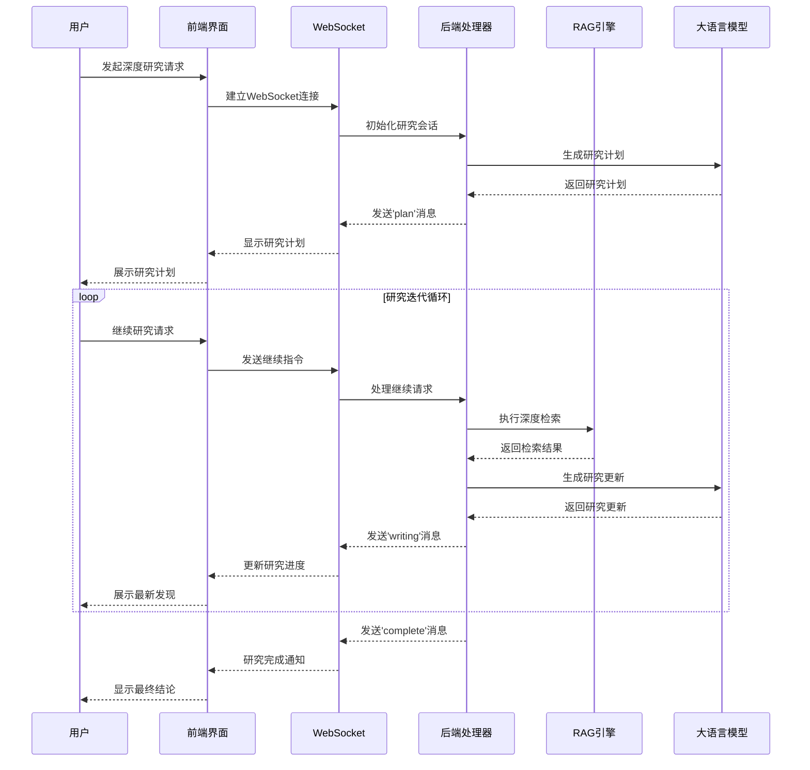

**图表来源**
- [websocket_wiki.py](file://api/websocket_wiki.py#L145-L171)
- [Ask.tsx](file://src/components/Ask.tsx#L280-L498)

### 结构化研究过程

深度研究遵循严格的结构化流程，确保研究的系统性和完整性：

| 阶段 | 描述 | 输出格式 | 持续时间 |
|------|------|----------|----------|
| 计划阶段 | 制定研究策略和预期目标 | 研究计划文档 | 2-5分钟 |
| 探索阶段 | 深入分析特定方面 | 中期研究报告 | 5-10分钟 |
| 分析阶段 | 连接不同方面的发现 | 深度分析报告 | 8-12分钟 |
| 整合阶段 | 综合所有发现形成结论 | 最终研究报告 | 10-15分钟 |

### 并行搜索能力

系统能够同时搜索多个相关主题，提高研究效率：

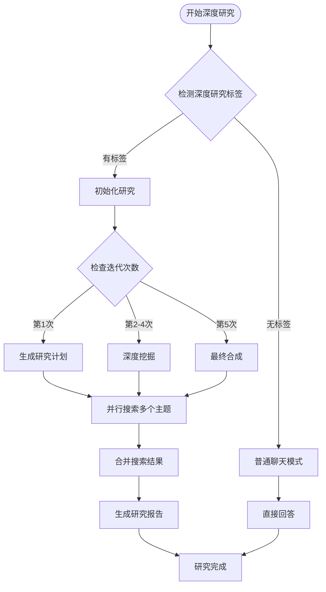

**图表来源**
- [websocket_wiki.py](file://api/websocket_wiki.py#L145-L171)
- [prompts.py](file://api/prompts.py#L59-L121)

**章节来源**
- [websocket_wiki.py](file://api/websocket_wiki.py#L145-L171)
- [prompts.py](file://api/prompts.py#L59-L121)

## 前端界面交互

前端界面提供了直观的用户体验，支持深度研究功能的各种操作。

### 界面组件设计

深度研究界面包含以下核心组件：

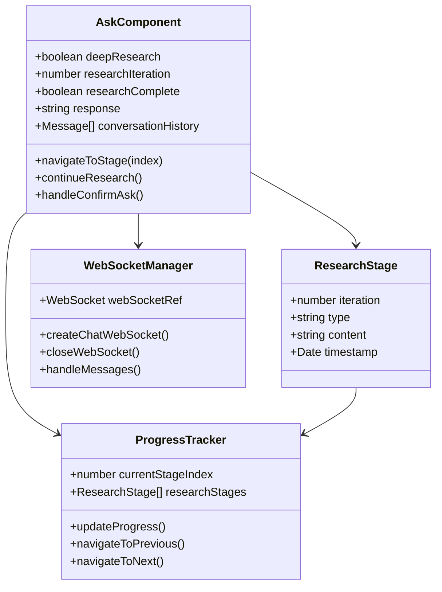

**图表来源**
- [Ask.tsx](file://src/components/Ask.tsx#L255-L627)
- [websocketClient.ts](file://src/utils/websocketClient.ts#L43-L85)

### 研究状态管理

系统维护复杂的研究状态，包括迭代次数、当前阶段和完成状态：

| 状态属性 | 类型 | 描述 | 默认值 |
|----------|------|------|--------|
| deepResearch | boolean | 是否启用深度研究模式 | false |
| researchIteration | number | 当前研究迭代次数 | 0 |
| researchComplete | boolean | 研究是否完成 | false |
| currentStageIndex | number | 当前研究阶段索引 | 0 |
| researchStages | ResearchStage[] | 完整的研究阶段列表 | [] |

### 自动化继续机制

系统实现了智能的自动化继续功能：

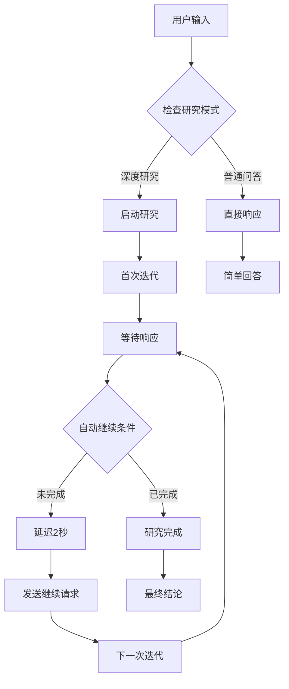

**图表来源**
- [Ask.tsx](file://src/components/Ask.tsx#L482-L498)
- [websocket_wiki.py](file://api/websocket_wiki.py#L145-L171)

**章节来源**
- [Ask.tsx](file://src/components/Ask.tsx#L255-L627)
- [websocketClient.ts](file://src/utils/websocketClient.ts#L43-L85)

## WebSocket通信机制

WebSocket通信是深度研究功能的核心技术，提供了实时、双向的数据传输能力。

### 连接建立流程

WebSocket连接的建立遵循标准的握手协议：

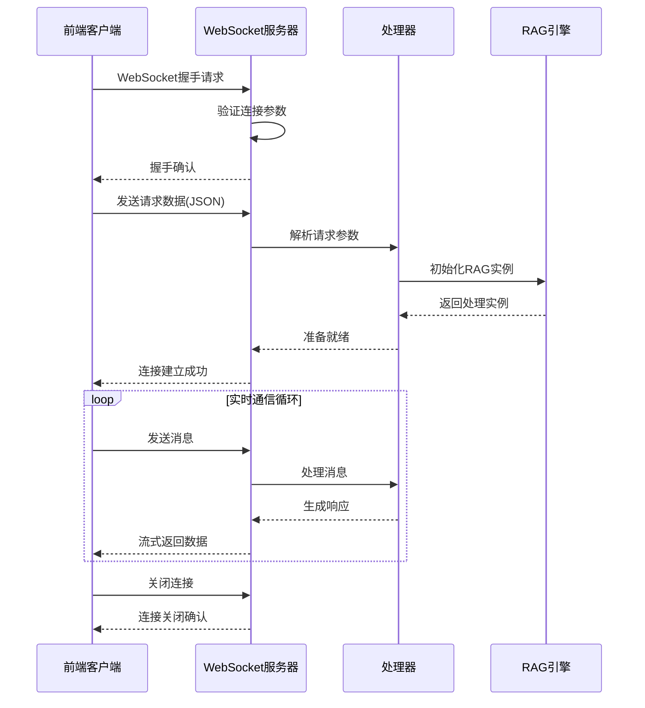

**图表来源**
- [websocket_wiki.py](file://api/websocket_wiki.py#L52-L770)
- [websocketClient.ts](file://src/utils/websocketClient.ts#L43-L85)

### 消息类型定义

系统定义了多种WebSocket消息类型来支持不同的交互场景：

| 消息类型 | 触发时机 | 数据格式 | 用途 |
|----------|----------|----------|------|
| 'plan' | 研究计划生成时 | `{type: 'plan', content: string}` | 发送研究计划内容 |
| 'search_result' | 检索结果可用时 | `{type: 'search_result', results: SearchResult[]}` | 发送检索到的相关文档 |
| 'writing' | 正在生成内容时 | `{type: 'writing', stage: number, content: string}` | 发送当前写作阶段内容 |
| 'complete' | 研究完成时 | `{type: 'complete', final_report: string}` | 发送最终研究报告 |

### 错误处理与重试机制

系统实现了完善的错误处理和重试机制：

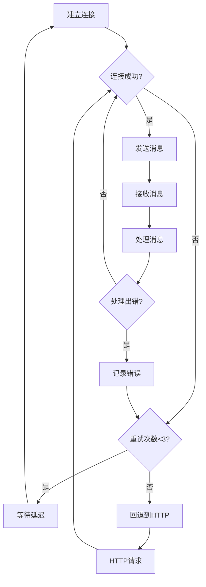

**图表来源**
- [websocket_wiki.py](file://api/websocket_wiki.py#L378-L402)
- [Ask.tsx](file://src/components/Ask.tsx#L405-L437)

**章节来源**
- [websocket_wiki.py](file://api/websocket_wiki.py#L52-L770)
- [websocketClient.ts](file://src/utils/websocketClient.ts#L43-L85)

## 后端处理流程

后端处理流程负责协调整个深度研究过程，包括请求解析、RAG检索、内容生成和状态管理。

### 请求处理管道

深度研究请求的处理遵循严格的管道模式：

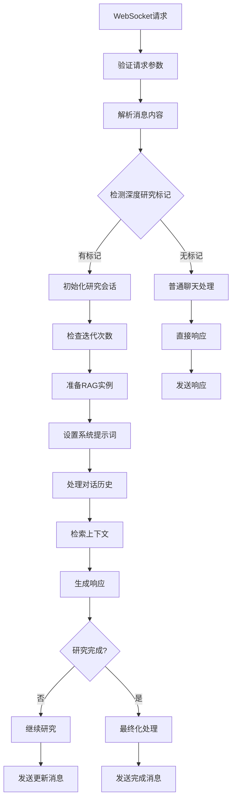

**图表来源**
- [websocket_wiki.py](file://api/websocket_wiki.py#L52-L770)
- [prompts.py](file://api/prompts.py#L59-L121)

### 研究计划制定

系统根据用户查询和上下文信息制定详细的研究计划：

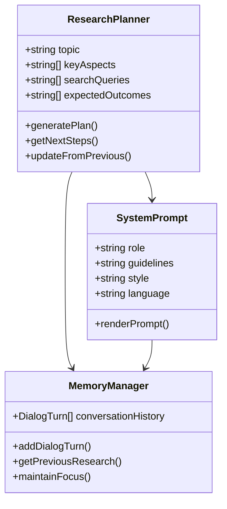

**图表来源**
- [prompts.py](file://api/prompts.py#L59-L88)
- [rag.py](file://api/rag.py#L51-L142)

### 对话历史管理

系统维护复杂的对话历史，支持上下文连续性：

| 对话元素 | 存储格式 | 生命周期 | 用途 |
|----------|----------|----------|------|
| 用户查询 | UserQuery对象 | 整个研究期间 | 提供问题背景 |
| 助手响应 | AssistantResponse对象 | 整个研究期间 | 保存研究进展 |
| 对话轮次 | DialogTurn对象 | 整个研究期间 | 维护研究流程 |
| 研究阶段 | ResearchStage对象 | 单次迭代 | 跟踪研究进度 |

**章节来源**
- [websocket_wiki.py](file://api/websocket_wiki.py#L52-L770)
- [prompts.py](file://api/prompts.py#L59-L121)
- [rag.py](file://api/rag.py#L51-L142)

## 数据管道与RAG协同

数据管道和RAG系统协同工作，为深度研究提供强大的知识检索和内容生成能力。

### 数据管道架构

数据管道负责从代码仓库中提取、处理和索引文档：

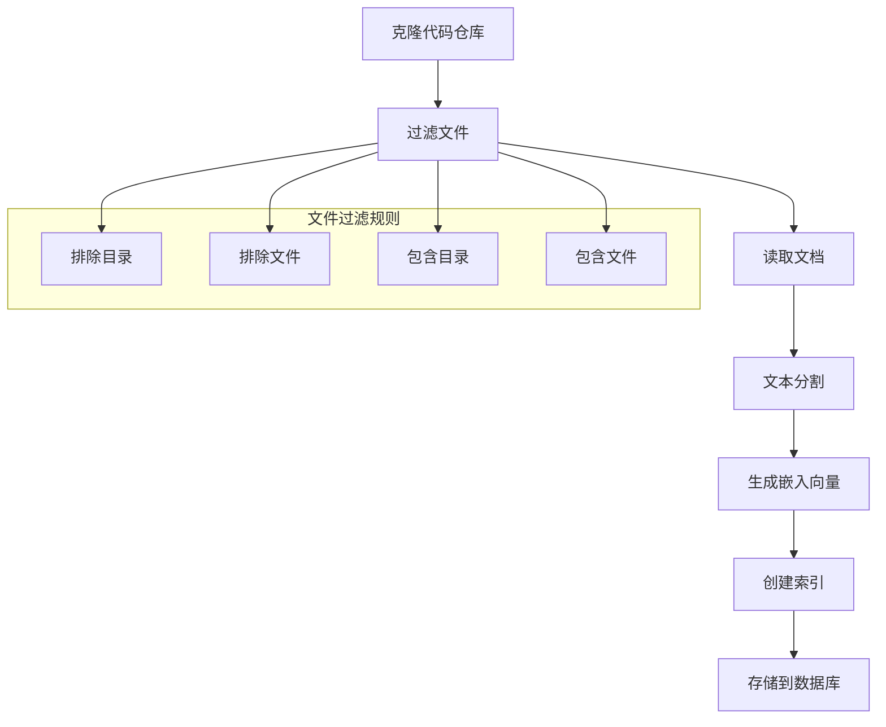

**图表来源**
- [data_pipeline.py](file://api/data_pipeline.py#L144-L371)
- [rag.py](file://api/rag.py#L345-L446)

### RAG检索机制

RAG系统提供智能的文档检索和内容生成能力：

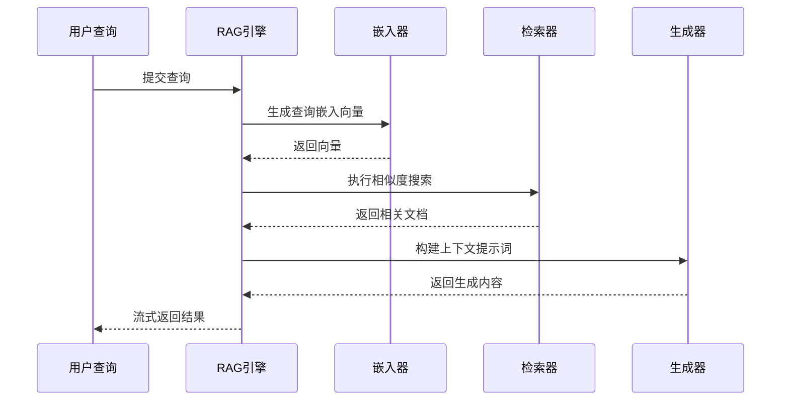

**图表来源**
- [rag.py](file://api/rag.py#L153-L446)
- [data_pipeline.py](file://api/data_pipeline.py#L373-L442)

### 嵌入向量验证

系统实现了严格的嵌入向量验证机制，确保检索质量：

| 验证项目 | 检查内容 | 处理方式 | 影响 |
|----------|----------|----------|------|
| 向量维度 | 确保所有向量具有相同维度 | 过滤不匹配的向量 | 保持检索一致性 |
| 向量大小 | 检查向量数值范围 | 标准化异常值 | 提高检索准确性 |
| 向量质量 | 评估向量分布特征 | 移除低质量向量 | 改善检索效果 |
| 向量数量 | 监控有效向量比例 | 报告统计信息 | 优化资源使用 |

**章节来源**
- [data_pipeline.py](file://api/data_pipeline.py#L144-L371)
- [rag.py](file://api/rag.py#L153-L446)

## 研究策略配置

深度研究功能提供了丰富的配置选项，允许用户定制研究行为和输出格式。

### 搜索深度控制

系统支持灵活的搜索深度配置：

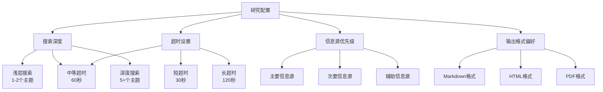

### 语言和文化适配

系统支持多语言环境下的深度研究：

| 语言配置 | 支持的语言 | 文化适配 | 特殊处理 |
|----------|------------|----------|----------|
| 默认语言 | 英语(en) | 全球通用 | 标准提示词 |
| 中文支持 | 简体(zh)、繁体(zh-tw) | 中国地区 | 中文提示词 |
| 日语支持 | 日语(ja) | 日本地区 | 日文提示词 |
| 欧洲语言 | 西班牙(es)、葡萄牙(pt-br)、法语(fr)、俄语(ru) | 欧洲地区 | 欧式提示词 |
| 亚洲语言 | 韩语(kr)、越南语(vi) | 亚洲地区 | 亚洲式提示词 |

### 输出格式定制

系统提供多种输出格式选项：

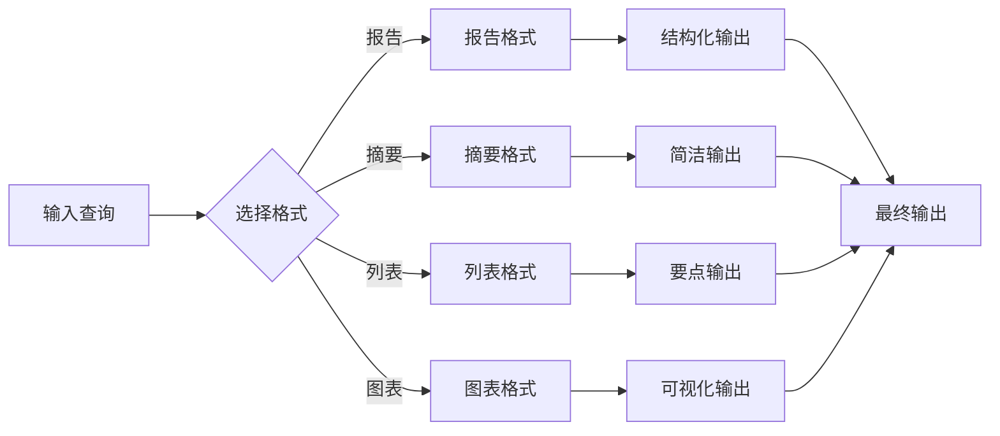

**章节来源**
- [config.py](file://api/config.py#L234-L261)
- [prompts.py](file://api/prompts.py#L59-L192)

## 性能考量

深度研究功能涉及大量计算和网络操作，需要考虑多个性能因素。

### 资源消耗监控

系统实现了全面的资源消耗监控机制：

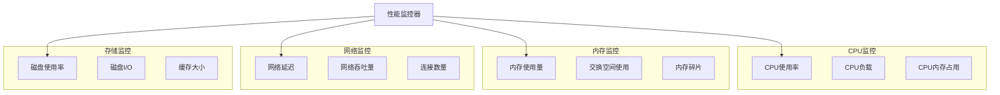

### 超时处理机制

系统实现了多层次的超时处理：

| 超时类型 | 时间限制 | 处理策略 | 回退方案 |
|----------|----------|----------|----------|
| 连接超时 | 5秒 | 重新连接 | HTTP回退 |
| 读取超时 | 30秒 | 取消操作 | 部分结果返回 |
| 写入超时 | 10秒 | 重试写入 | 断点续传 |
| 研究超时 | 120秒 | 强制终止 | 最终快照 |

### 中断与恢复机制

系统支持研究过程的中断和恢复：

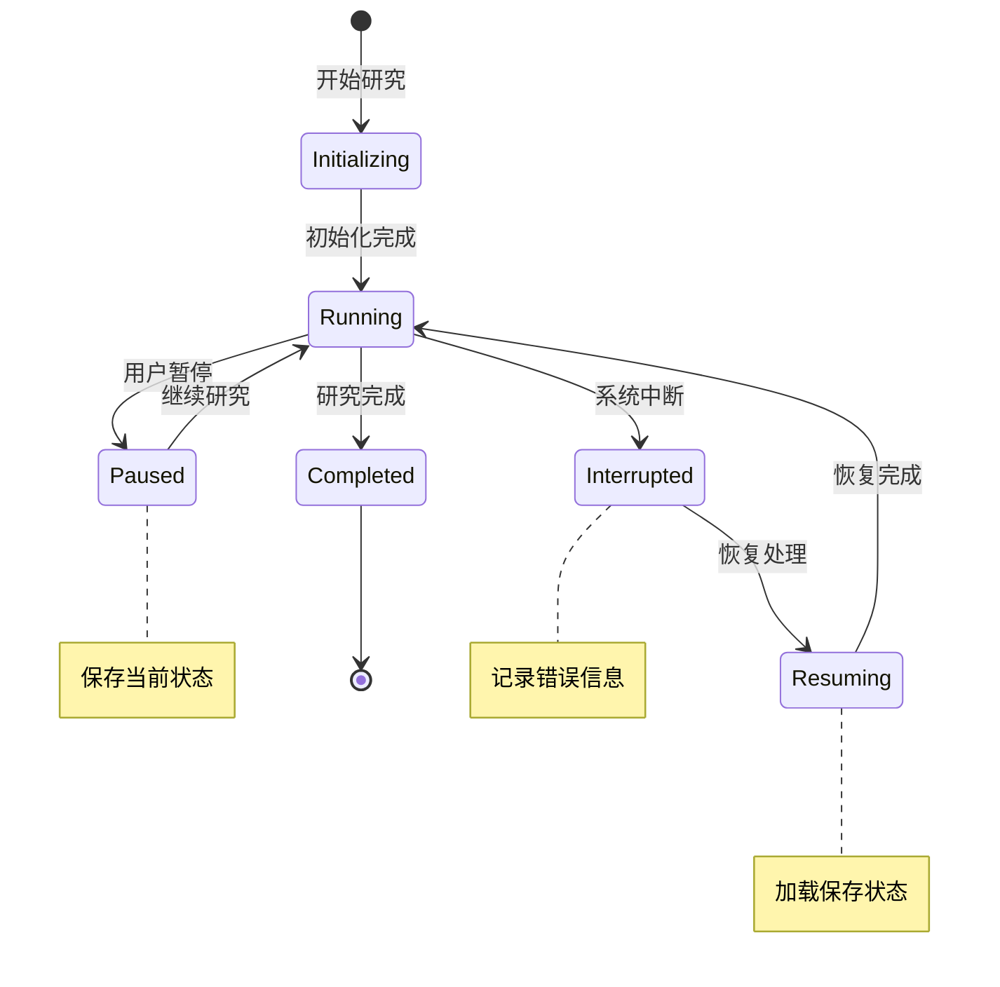

### 缓存策略

系统采用多层缓存策略优化性能：

| 缓存层级 | 缓存内容 | 生命周期 | 清理策略 |
|----------|----------|----------|----------|
| 内存缓存 | 活跃会话数据 | 会话期间 | 会话结束清理 |
| 文件缓存 | 研究结果 | 7天 | 定期清理过期文件 |
| 数据库缓存 | 嵌入向量 | 永久 | 手动清理 |
| 网络缓存 | API响应 | 1小时 | 自动过期 |

**章节来源**
- [websocket_wiki.py](file://api/websocket_wiki.py#L378-L402)
- [data_pipeline.py](file://api/data_pipeline.py#L700-L886)

## 故障排除指南

深度研究功能可能遇到各种问题，以下是常见问题的诊断和解决方法。

### WebSocket连接问题

常见的WebSocket连接问题及解决方案：

| 问题症状 | 可能原因 | 解决方案 | 预防措施 |
|----------|----------|----------|----------|
| 连接超时 | 网络延迟过高 | 增加超时时间 | 使用CDN加速 |
| 连接被拒绝 | 服务器配置错误 | 检查防火墙设置 | 配置正确的端口 |
| 消息丢失 | 网络不稳定 | 实现消息确认机制 | 使用可靠传输协议 |
| 连接频繁断开 | 服务器负载过高 | 优化服务器性能 | 实施负载均衡 |

### 深度研究失败处理

深度研究过程中可能出现的错误及其处理：

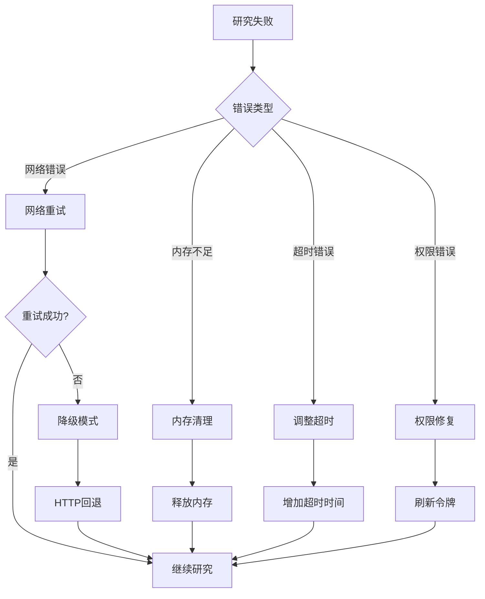

### 性能优化建议

针对不同场景的性能优化建议：

| 场景 | 优化策略 | 预期效果 | 实施难度 |
|------|----------|----------|----------|
| 大型仓库研究 | 分批处理、增量检索 | 减少内存占用50% | 中等 |
| 长时间研究 | 断点续传、状态保存 | 提高成功率90% | 高 |
| 高并发访问 | 连接池、负载均衡 | 响应时间减少30% | 高 |
| 网络不稳定 | 重试机制、缓存策略 | 可用性提升80% | 中等 |

### 日志分析指南

系统提供了详细的日志记录，便于问题诊断：

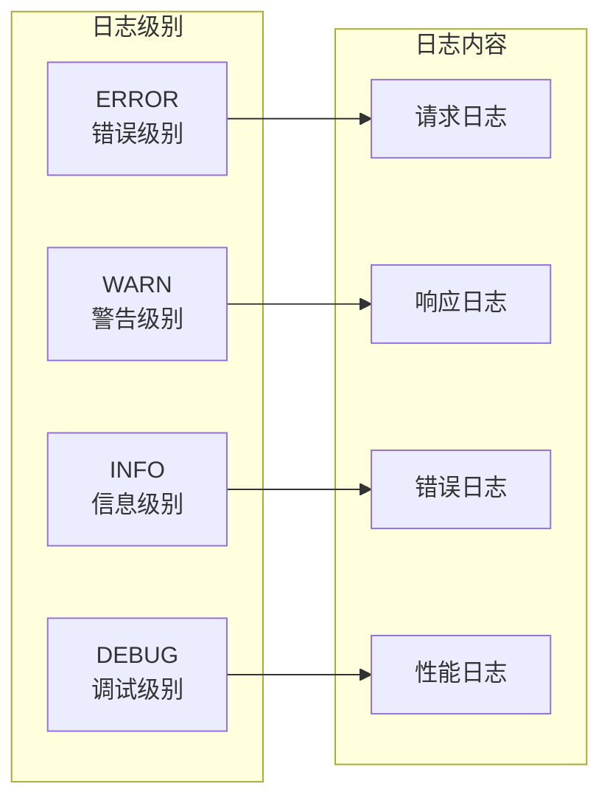

**章节来源**
- [websocket_wiki.py](file://api/websocket_wiki.py#L378-L402)
- [Ask.tsx](file://src/components/Ask.tsx#L405-L437)

## 总结

深度研究功能代表了现代代码分析工具的发展方向，它不仅仅是一个问答系统，更是一个智能化的研究助手。通过WebSocket技术实现实时通信，结合先进的RAG技术和多轮对话机制，为用户提供了前所未有的代码理解和分析体验。

### 核心优势

1. **结构化研究流程**：通过明确的阶段划分和迭代机制，确保研究的系统性和完整性
2. **实时交互体验**：基于WebSocket的实时通信，让用户能够即时看到研究进展
3. **智能内容生成**：结合多种提示词模板和上下文管理，生成高质量的研究报告
4. **灵活配置选项**：支持多种语言、格式和研究策略，适应不同用户需求
5. **强大的容错能力**：完善的错误处理和恢复机制，保证服务的稳定性

### 技术创新点

- **多轮深度研究**：突破了传统问答的局限，实现了真正的深度分析
- **并行搜索能力**：同时探索多个相关主题，提高研究效率
- **智能状态管理**：维护复杂的研究状态，支持断点续传和恢复
- **实时流式输出**：通过WebSocket提供流畅的用户体验

### 应用前景

深度研究功能不仅适用于代码仓库分析，还可以扩展到其他领域的知识发现和研究工作。随着技术的不断发展和完善，它将在软件开发、学术研究、技术文档等领域发挥越来越重要的作用。

通过本文档的详细介绍，开发者可以深入理解深度研究功能的技术实现，为系统的进一步优化和扩展提供参考。同时，用户也可以更好地利用这一功能，提高代码学习和研究的效率。