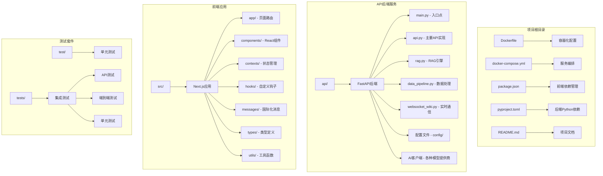
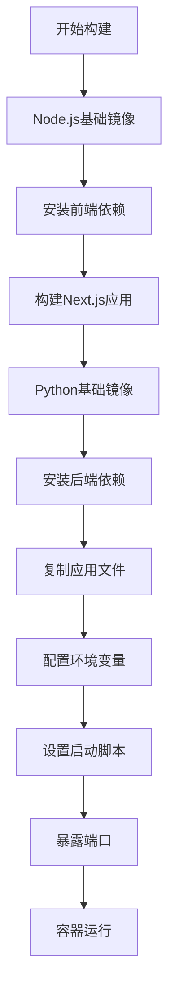
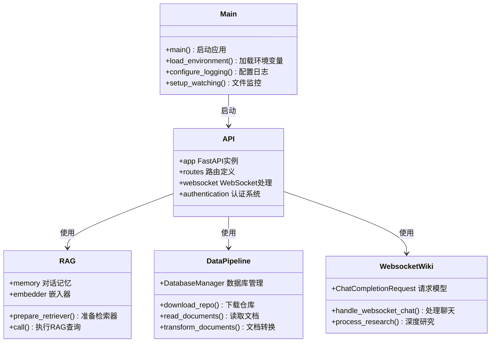
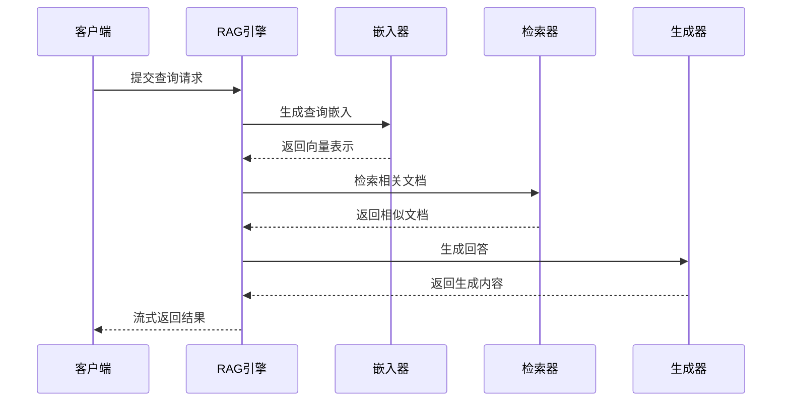
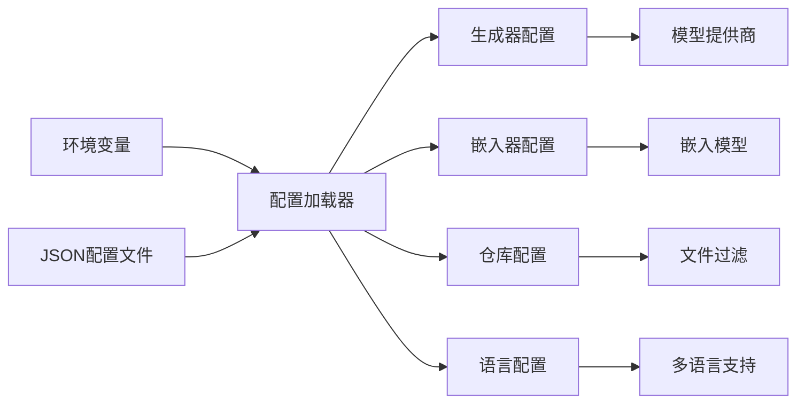
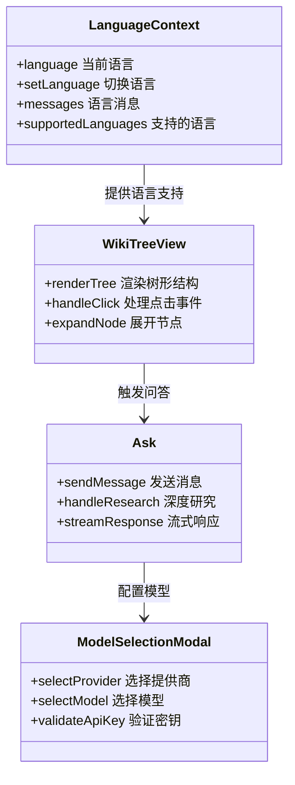
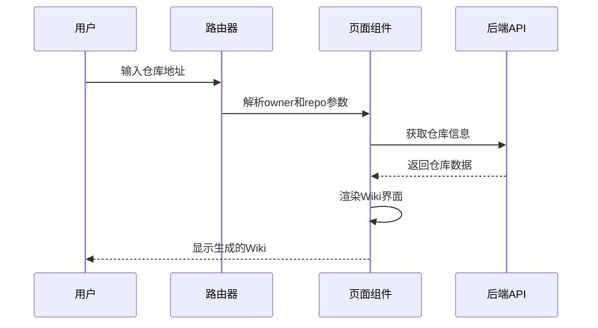
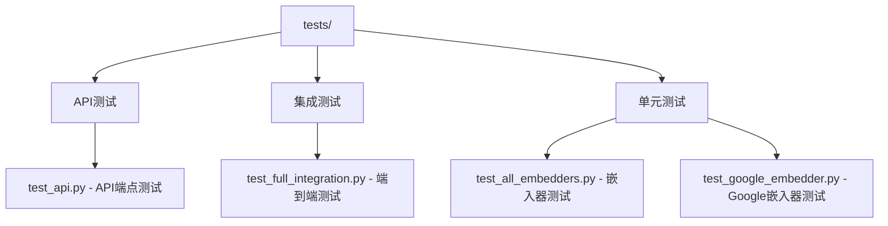

# 目录结构解析

<cite>
**本文档中引用的文件**
- [Dockerfile](file://Dockerfile)
- [docker-compose.yml](file://docker-compose.yml)
- [package.json](file://package.json)
- [pyproject.toml](file://api/pyproject.toml)
- [README.md](file://README.md)
- [api/main.py](file://api/main.py)
- [api/api.py](file://api/api.py)
- [api/rag.py](file://api/rag.py)
- [api/data_pipeline.py](file://api/data_pipeline.py)
- [api/config.py](file://api/config.py)
- [api/websocket_wiki.py](file://api/websocket_wiki.py)
- [api/openai_client.py](file://api/openai_client.py)
- [api/google_embedder_client.py](file://api/google_embedder_client.py)
- [src/i18n.ts](file://src/i18n.ts)
- [src/contexts/LanguageContext.tsx](file://src/contexts/LanguageContext.tsx)
- [src/app/[owner]/[repo]/page.tsx](file://src/app/[owner]/[repo]/page.tsx)
- [src/app/layout.tsx](file://src/app/layout.tsx)
- [test/test_extract_repo_name.py](file://test/test_extract_repo_name.py)
- [tests/api/test_api.py](file://tests/api/test_api.py)
- [tests/unit/test_all_embedders.py](file://tests/unit/test_all_embedders.py)
- [tests/unit/test_google_embedder.py](file://tests/unit/test_google_embedder.py)
- [tests/integration/test_full_integration.py](file://tests/integration/test_full_integration.py)
</cite>

## 目录结构概览

deepwiki-open是一个现代化的全栈应用程序，采用前后端分离架构，结合FastAPI后端和Next.js前端框架。项目结构清晰地分为多个功能模块，每个目录都有明确的职责和作用。



**图表来源**
- [Dockerfile](file://Dockerfile#L1-L112)
- [docker-compose.yml](file://docker-compose.yml#L1-L30)
- [package.json](file://package.json#L1-L39)
- [api/main.py](file://api/main.py#L1-L80)
- [src/app/layout.tsx](file://src/app/layout.tsx#L1-L51)

## 根目录配置文件详解

### Docker容器化配置

项目使用Docker进行容器化部署，提供了完整的多阶段构建流程：



**图表来源**
- [Dockerfile](file://Dockerfile#L1-L112)

**章节来源**
- [Dockerfile](file://Dockerfile#L1-L112)
- [docker-compose.yml](file://docker-compose.yml#L1-L30)

### 前端包管理配置

package.json文件定义了前端项目的依赖关系和脚本命令：

| 配置项 | 描述 | 版本要求 |
|--------|------|----------|
| name | 项目名称 | deepwiki-open |
| version | 版本号 | 0.1.0 |
| private | 私有项目标识 | true |
| scripts | 构建脚本 | dev, build, start, lint |
| dependencies | 生产依赖 | Next.js 15.3.1, React 19.0.0等 |
| devDependencies | 开发依赖 | TypeScript, TailwindCSS等 |

**章节来源**
- [package.json](file://package.json#L1-L39)

### 后端Python依赖管理

pyproject.toml文件管理Python后端的依赖和项目配置，支持Poetry包管理器的完整功能。

**章节来源**
- [pyproject.toml](file://api/pyproject.toml#L1-L1)

## API后端服务架构

### FastAPI后端核心模块

API目录是整个后端的核心，采用模块化设计，每个文件都有特定的功能职责：



**图表来源**
- [api/main.py](file://api/main.py#L1-L80)
- [api/api.py](file://api/api.py#L1-L635)
- [api/rag.py](file://api/rag.py#L1-L446)
- [api/data_pipeline.py](file://api/data_pipeline.py#L1-L800)
- [api/websocket_wiki.py](file://api/websocket_wiki.py#L1-L770)

### 核心API模块详解

#### 主API入口 (api.py)

主要API模块实现了完整的RESTful API接口，包括：

- **模型配置管理**：提供可用模型提供商和模型列表
- **Wiki缓存系统**：支持Wiki内容的存储和检索
- **聊天流式响应**：实时对话和内容生成
- **文件导出功能**：支持Markdown和JSON格式导出
- **本地仓库处理**：支持本地代码库分析

**章节来源**
- [api/api.py](file://api/api.py#L1-L635)

#### RAG引擎 (rag.py)

RAG（检索增强生成）引擎是项目的核心AI功能：



**图表来源**
- [api/rag.py](file://api/rag.py#L1-L446)

**章节来源**
- [api/rag.py](file://api/rag.py#L1-L446)

#### 数据处理流水线 (data_pipeline.py)

数据流水线负责从代码仓库中提取和处理信息：

- **仓库下载**：支持GitHub、GitLab、Bitbucket的私有和公共仓库
- **文档读取**：递归扫描指定目录，过滤不需要的文件
- **文本分割**：使用智能分块算法处理大文件
- **向量化处理**：生成语义嵌入用于检索

**章节来源**
- [api/data_pipeline.py](file://api/data_pipeline.py#L1-L800)

#### WebSocket实时通信 (websocket_wiki.py)

实现实时聊天和深度研究功能：

- **WebSocket连接**：建立持久连接处理实时交互
- **深度研究**：支持多轮对话和深入分析
- **文件上下文**：支持特定文件的上下文分析
- **多模型支持**：兼容多种AI模型提供商

**章节来源**
- [api/websocket_wiki.py](file://api/websocket_wiki.py#L1-L770)

### AI客户端模块

项目支持多个AI模型提供商，每个都有专门的客户端实现：

| 客户端 | 支持模型 | 特点 |
|--------|----------|------|
| OpenAIClient | GPT系列 | 流式响应，多模态支持 |
| GoogleEmbedderClient | text-embedding-004 | 语义一致性，成本优化 |
| AzureAIClient | GPT-4系列 | 企业级安全，合规性 |
| OpenRouterClient | 多模型 | 统一API访问 |
| BedrockClient | AWS模型 | 云原生部署 |
| DashscopeClient | 阿里云模型 | 本地化支持 |

**章节来源**
- [api/openai_client.py](file://api/openai_client.py#L1-L630)
- [api/google_embedder_client.py](file://api/google_embedder_client.py#L1-L231)

### 配置管理系统

配置系统采用JSON文件和环境变量相结合的方式：



**图表来源**
- [api/config.py](file://api/config.py#L1-L388)

**章节来源**
- [api/config.py](file://api/config.py#L1-L388)

## 前端Next.js应用架构

### 页面路由系统

src/app目录采用Next.js 15的新式路由系统，支持动态路由和API路由：

```mermaid
graph TB
A[src/app/] --> B[静态页面]
A --> C[动态路由]
A --> D[API路由]
B --> E[page.tsx - 主页]
B --> F[globals.css - 全局样式]
C --> G[[owner]/[repo]/page.tsx]
C --> H[wiki/projects/page.tsx]
D --> I[api/chat/stream/route.ts]
D --> J[api/models/config/route.ts]
D --> K[api/wiki/projects/route.ts]
```

**图表来源**
- [src/app/[owner]/[repo]/page.tsx](file://src/app/[owner]/[repo]/page.tsx#L1-L800)
- [src/app/layout.tsx](file://src/app/layout.tsx#L1-L51)

**章节来源**
- [src/app/[owner]/[repo]/page.tsx](file://src/app/[owner]/[repo]/page.tsx#L1-L800)
- [src/app/layout.tsx](file://src/app/layout.tsx#L1-L51)

### React组件生态系统

前端组件采用模块化设计，支持主题切换和国际化：



**图表来源**
- [src/contexts/LanguageContext.tsx](file://src/contexts/LanguageContext.tsx#L1-L203)

**章节来源**
- [src/contexts/LanguageContext.tsx](file://src/contexts/LanguageContext.tsx#L1-L203)

### 国际化系统

项目支持多语言界面，通过i18n.ts和LanguageContext.tsx实现：

| 语言代码 | 语言名称 | 支持程度 |
|----------|----------|----------|
| en | 英语 | 完整支持 |
| ja | 日语 | 完整支持 |
| zh | 中文（简体） | 完整支持 |
| zh-tw | 中文（繁体） | 完整支持 |
| es | 西班牙语 | 完整支持 |
| kr | 韩语 | 完整支持 |
| vi | 越南语 | 完整支持 |
| pt-br | 巴西葡萄牙语 | 完整支持 |
| fr | 法语 | 完整支持 |
| ru | 俄语 | 完整支持 |

**章节来源**
- [src/i18n.ts](file://src/i18n.ts#L1-L15)
- [src/contexts/LanguageContext.tsx](file://src/contexts/LanguageContext.tsx#L1-L203)

### 动态路由实现

项目使用Next.js的动态路由功能，通过[owner]/[repo]路径参数实现：



**图表来源**
- [src/app/[owner]/[repo]/page.tsx](file://src/app/[owner]/[repo]/page.tsx#L1-L800)

**章节来源**
- [src/app/[owner]/[repo]/page.tsx](file://src/app/[owner]/[repo]/page.tsx#L1-L800)

## 测试体系架构

### 单元测试 (test/)

test目录包含独立的单元测试文件：

- **test_extract_repo_name.py**：测试仓库名称提取功能

### 集成测试 (tests/)

tests目录采用分层测试策略：



**图表来源**
- [test/test_extract_repo_name.py](file://test/test_extract_repo_name.py#L1-L1)
- [tests/api/test_api.py](file://tests/api/test_api.py#L1-L1)
- [tests/unit/test_all_embedders.py](file://tests/unit/test_all_embedders.py#L1-L1)
- [tests/unit/test_google_embedder.py](file://tests/unit/test_google_embedder.py#L1-L1)
- [tests/integration/test_full_integration.py](file://tests/integration/test_full_integration.py#L1-L1)

**章节来源**
- [test/test_extract_repo_name.py](file://test/test_extract_repo_name.py#L1-L1)
- [tests/api/test_api.py](file://tests/api/test_api.py#L1-L1)
- [tests/unit/test_all_embedders.py](file://tests/unit/test_all_embedders.py#L1-L1)
- [tests/unit/test_google_embedder.py](file://tests/unit/test_google_embedder.py#L1-L1)
- [tests/integration/test_full_integration.py](file://tests/integration/test_full_integration.py#L1-L1)

## 总结

deepwiki-open项目展现了现代全栈应用的最佳实践：

1. **清晰的架构分层**：前后端分离，模块化设计
2. **强大的AI集成**：支持多种模型提供商和嵌入器
3. **完善的测试覆盖**：从单元测试到端到端测试
4. **国际化支持**：多语言界面和内容生成
5. **容器化部署**：Docker化确保环境一致性

这种设计使得项目具有良好的可维护性、可扩展性和用户体验，为开发者提供了强大而灵活的代码库分析和文档生成工具。