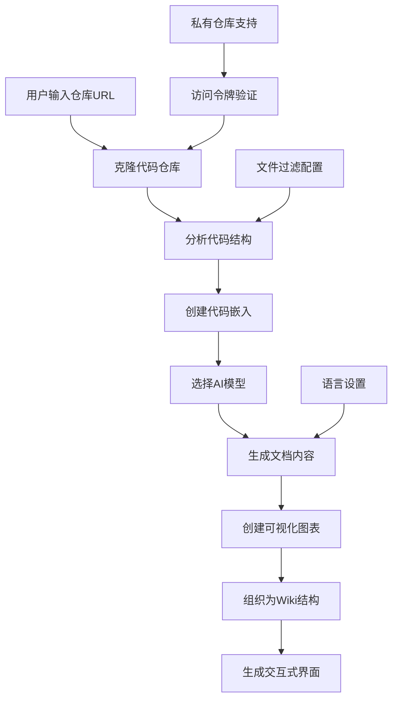
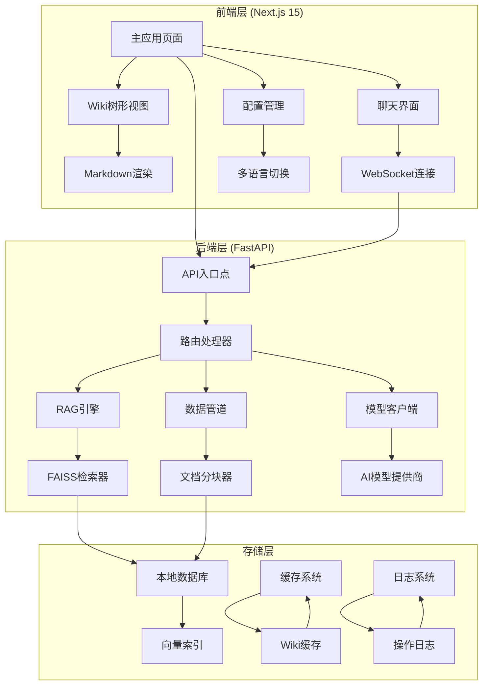
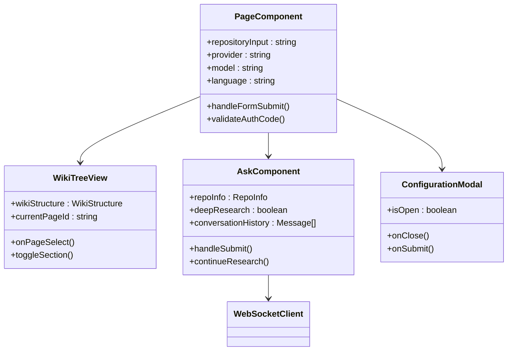
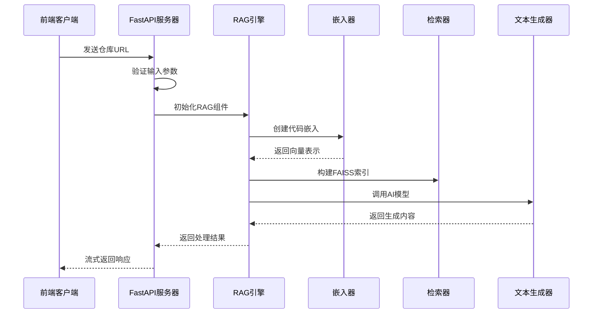
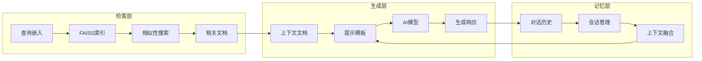
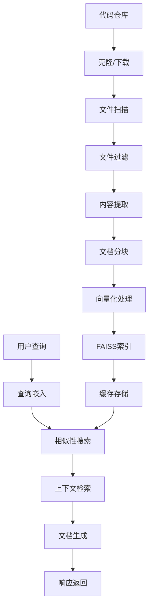
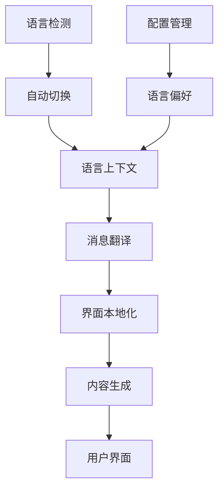
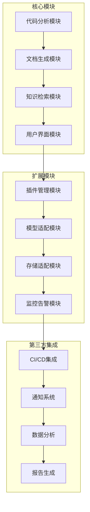

# DeepWiki-Open 项目系统概述

<cite>
**本文档引用的文件**
- [README.md](file://README.md)
- [package.json](file://package.json)
- [next.config.ts](file://next.config.ts)
- [api/main.py](file://api/main.py)
- [api/api.py](file://api/api.py)
- [api/rag.py](file://api/rag.py)
- [api/config.py](file://api/config.py)
- [api/data_pipeline.py](file://api/data_pipeline.py)
- [api/tools/embedder.py](file://api/tools/embedder.py)
- [api/prompts.py](file://api/prompts.py)
- [src/app/page.tsx](file://src/app/page.tsx)
- [src/components/WikiTreeView.tsx](file://src/components/WikiTreeView.tsx)
- [src/components/Ask.tsx](file://src/components/Ask.tsx)
- [src/app/layout.tsx](file://src/app/layout.tsx)
- [docker-compose.yml](file://docker-compose.yml)
</cite>

## 目录
1. [项目简介](#项目简介)
2. [核心功能特性](#核心功能特性)
3. [系统架构概览](#系统架构概览)
4. [前后端技术栈](#前后端技术栈)
5. [RAG系统与AI集成](#rag系统与ai集成)
6. [数据流程与处理管道](#数据流程与处理管道)
7. [多语言支持与国际化](#多语言支持与国际化)
8. [部署与配置](#部署与配置)
9. [使用场景与应用案例](#使用场景与应用案例)
10. [扩展性设计](#扩展性设计)

## 项目简介

DeepWiki-Open 是一个创新的全栈应用程序，专门设计用于为 GitHub、GitLab 或 BitBucket 代码仓库自动生成美观且交互式的维基文档。该项目的核心理念是通过人工智能技术，将复杂的代码库转化为易于理解和导航的文档资源，帮助开发团队提高协作效率和知识传承质量。

### 设计目标

DeepWiki-Open 的设计目标围绕以下几个核心原则：

- **智能化文档生成**：利用先进的 AI 技术自动分析代码结构并生成高质量的文档
- **多平台兼容性**：支持主流代码托管平台，包括 GitHub、GitLab 和 BitBucket
- **私有仓库安全访问**：提供安全的私有仓库访问机制，支持个人访问令牌认证
- **交互式用户体验**：构建直观的用户界面，支持实时聊天和深度研究功能
- **可扩展架构设计**：采用模块化架构，支持多种 AI 模型提供商和嵌入器类型

## 核心功能特性

### 1. 智能文档生成系统

DeepWiki-Open 的核心能力是能够自动分析代码仓库并生成结构化的维基文档：



**图表来源**
- [api/data_pipeline.py](file://api/data_pipeline.py#L700-L886)
- [api/rag.py](file://api/rag.py#L345-L446)

### 2. 多模态AI对话系统

项目集成了强大的 RAG（检索增强生成）系统，支持两种主要的交互模式：

#### 基础问答功能
- **上下文感知回答**：基于仓库代码内容提供准确的回答
- **实时流式响应**：支持实时显示生成过程
- **对话历史管理**：维护上下文连续性

#### 深度研究功能
- **多轮迭代研究**：自动进行多次研究迭代
- **结构化研究流程**：包含研究计划、更新和最终结论
- **自动完成检测**：智能识别研究完成状态

### 3. 可视化图表生成

系统能够自动生成各种类型的可视化图表：

- **架构图**：展示代码组件之间的关系
- **序列图**：演示模块间的交互流程
- **流程图**：表示数据处理和业务逻辑流程
- **类图**：展示面向对象设计结构

### 4. 私有仓库访问支持

为了确保企业级应用的安全性，DeepWiki-Open 提供了完整的私有仓库访问解决方案：

- **访问令牌认证**：支持 GitHub、GitLab 和 BitBucket 的个人访问令牌
- **安全传输**：所有敏感信息通过 HTTPS 加密传输
- **权限控制**：细粒度的访问权限管理

**章节来源**
- [README.md](file://README.md#L19-L30)
- [api/data_pipeline.py](file://api/data_pipeline.py#L69-L140)

## 系统架构概览

DeepWiki-Open 采用现代化的前后端分离架构，结合微服务设计理念，实现了高度模块化和可扩展的系统设计。



**图表来源**
- [api/api.py](file://api/api.py#L1-L635)
- [src/app/page.tsx](file://src/app/page.tsx#L1-L625)

### 架构特点

1. **微服务化设计**：每个核心功能模块都具有独立的职责边界
2. **事件驱动通信**：前端通过 WebSocket 实现实时通信
3. **异步处理**：大量使用异步编程模式提升系统性能
4. **容错机制**：完善的错误处理和降级策略

**章节来源**
- [api/main.py](file://api/main.py#L1-L80)
- [next.config.ts](file://next.config.ts#L1-L71)

## 前后端技术栈

### 前端技术栈 (Next.js 15 + React 19)

DeepWiki-Open 的前端采用最新的 Next.js 15 框架和 React 19 组件库，提供了现代化的开发体验和卓越的性能表现。

#### 核心技术组件

- **Next.js 15.3.1**：提供服务器端渲染和静态站点生成能力
- **React 19.0.0**：最新版本的 React，支持并发特性和更好的性能
- **TypeScript**：提供强类型支持和更好的开发体验
- **Tailwind CSS 4**：实用优先的 CSS 框架，支持快速样式开发
- **Mermaid.js**：用于生成各种类型的可视化图表

#### 前端架构设计



**图表来源**
- [src/app/page.tsx](file://src/app/page.tsx#L46-L625)
- [src/components/WikiTreeView.tsx](file://src/components/WikiTreeView.tsx#L1-L184)
- [src/components/Ask.tsx](file://src/components/Ask.tsx#L1-L929)

### 后端技术栈 (FastAPI + Python)

后端采用 FastAPI 框架构建高性能的 REST API 和 WebSocket 服务。

#### 核心技术组件

- **FastAPI 1.0.0**：现代 Python Web 框架，提供自动文档生成功能
- **Uvicorn**：ASGI 服务器，支持异步请求处理
- **AdalFlow**：AI 数据处理框架，提供向量化和检索功能
- **FAISS**：Facebook 开发的高效相似性搜索库

#### 后端架构设计



**图表来源**
- [api/api.py](file://api/api.py#L393-L402)
- [api/rag.py](file://api/rag.py#L153-L246)

**章节来源**
- [package.json](file://package.json#L1-L39)
- [api/main.py](file://api/main.py#L1-L80)

## RAG系统与AI集成

DeepWiki-Open 的核心竞争力在于其先进的 RAG（检索增强生成）系统，该系统深度集成了多种 AI 技术和模型提供商。

### RAG架构设计

RAG 系统采用三层架构设计，实现了高效的上下文感知文本生成：



**图表来源**
- [api/rag.py](file://api/rag.py#L153-L246)
- [api/data_pipeline.py](file://api/data_pipeline.py#L373-L416)

### 多模型提供商支持

系统支持多个主流的 AI 模型提供商，为用户提供灵活的选择：

#### 支持的模型提供商

| 提供商 | 默认模型 | 特点 | 适用场景 |
|--------|----------|------|----------|
| Google | Gemini 2.5 Flash | 高质量生成，语义理解强 | 复杂代码分析 |
| OpenAI | GPT-5 Nano | 广泛的代码理解能力 | 快速问答 |
| OpenRouter | 多种模型 | 统一API接口 | 模型对比测试 |
| Azure OpenAI | GPT-4o | 企业级安全 | 企业内部部署 |
| Ollama | 本地模型 | 完全隐私保护 | 离线环境 |

#### 嵌入器类型支持

系统支持三种不同的嵌入器类型，满足不同性能和隐私需求：

- **OpenAI 嵌入器**：默认选择，性能稳定
- **Google AI 嵌入器**：与 Google Gemini 模型配合使用，语义一致性更好
- **Ollama 本地嵌入器**：完全本地化，保护数据隐私

### AI对话系统

DeepWiki-Open 集成了智能对话系统，支持两种交互模式：

#### 基础对话模式
- **实时流式响应**：通过 WebSocket 实现即时反馈
- **上下文保持**：维护多轮对话的上下文连续性
- **多语言支持**：自动检测并匹配用户语言

#### 深度研究模式
- **多轮迭代**：最多进行 5 轮研究迭代
- **结构化输出**：包含研究计划、更新和最终结论
- **自动完成**：智能识别研究完成状态

**章节来源**
- [api/rag.py](file://api/rag.py#L1-L446)
- [api/config.py](file://api/config.py#L1-L388)
- [api/prompts.py](file://api/prompts.py#L1-L192)

## 数据流程与处理管道

DeepWiki-Open 的数据处理管道是一个高度优化的流水线，负责从原始代码到结构化文档的完整转换过程。

### 数据处理流水线



**图表来源**
- [api/data_pipeline.py](file://api/data_pipeline.py#L1-L886)

### 文件处理与过滤

系统实现了智能的文件处理策略，支持精确的文件过滤配置：

#### 默认排除规则
- **虚拟环境**：`.venv/`, `node_modules/`, `.idea/`
- **版本控制**：`.git/`, `.svn/`, `.hg/`
- **构建产物**：`dist/`, `build/`, `target/`
- **临时文件**：`logs/`, `tmp/`, `.DS_Store`

#### 自定义过滤配置
用户可以通过配置文件自定义排除和包含规则：
- **排除目录**：指定不需要处理的目录
- **排除文件**：指定不需要处理的文件模式
- **包含目录**：仅处理指定的目录
- **包含文件**：仅处理指定的文件类型

### 向量化与索引

系统采用先进的向量化技术处理代码内容：

#### 文本分块策略
- **智能分块**：根据代码结构和语义进行智能分块
- **重叠处理**：相邻分块之间保留适当的重叠
- **大小控制**：确保每个分块在最佳 token 数量范围内

#### 向量存储
- **FAISS索引**：使用 Facebook 开发的高效相似性搜索库
- **批量处理**：支持批量向量化处理，提升性能
- **内存优化**：智能的内存管理和缓存策略

**章节来源**
- [api/data_pipeline.py](file://api/data_pipeline.py#L144-L886)
- [api/tools/embedder.py](file://api/tools/embedder.py#L1-L55)

## 多语言支持与国际化

DeepWiki-Open 提供了全面的多语言支持，覆盖了全球主要开发社区的语言需求。

### 支持的语言列表

系统当前支持以下 10 种语言：

| 语言代码 | 语言名称 | 本地化程度 |
|----------|----------|------------|
| en | 英语 | 完整 |
| ja | 日语 | 完整 |
| zh | 中文（简体） | 完整 |
| zh-tw | 中文（繁体） | 完整 |
| es | 西班牙语 | 完整 |
| kr | 韩语 | 完整 |
| vi | 越南语 | 完整 |
| pt-br | 巴西葡萄牙语 | 完整 |
| fr | 法语 | 完整 |
| ru | 俄语 | 完整 |

### 国际化架构设计



**图表来源**
- [src/app/layout.tsx](file://src/app/layout.tsx#L1-L51)

### 本地化实现

#### 动态语言切换
- **运行时切换**：无需刷新页面即可切换语言
- **持久化存储**：用户的语言偏好保存在本地存储中
- **回退机制**：当特定语言缺失时自动回退到英语

#### 内容本地化
- **提示模板本地化**：AI 对话提示模板支持多语言
- **界面文本本地化**：所有用户界面文本均可本地化
- **错误信息本地化**：错误和警告信息支持多语言

**章节来源**
- [api/config.py](file://api/config.py#L234-L261)

## 部署与配置

DeepWiki-Open 提供了灵活的部署选项，支持从简单的本地开发到生产级别的容器化部署。

### 部署方式

#### Docker 容器化部署

推荐的生产部署方式，提供完整的环境隔离和资源管理：

```yaml
# docker-compose.yml 配置示例
services:
  deepwiki:
    build:
      context: .
      dockerfile: Dockerfile
    ports:
      - "8001:8001"  # API端口
      - "3000:3000"  # 前端端口
    environment:
      - PORT=8001
      - NODE_ENV=production
    volumes:
      - ~/.adalflow:/root/.adalflow  # 数据持久化
      - ./api/logs:/app/api/logs     # 日志持久化
```

#### 手动部署

对于需要精细控制的部署场景：

1. **后端部署**：使用 Python Poetry 管理依赖
2. **前端部署**：使用 npm 或 yarn 构建和启动
3. **环境配置**：通过 .env 文件管理配置变量

### 配置管理

#### 环境变量配置

| 变量名 | 描述 | 必需 | 默认值 |
|--------|------|------|--------|
| GOOGLE_API_KEY | Google Gemini API密钥 | 否 | - |
| OPENAI_API_KEY | OpenAI API密钥 | 否 | - |
| OPENROUTER_API_KEY | OpenRouter API密钥 | 否 | - |
| AZURE_OPENAI_API_KEY | Azure OpenAI API密钥 | 否 | - |
| OLLAMA_HOST | Ollama服务主机地址 | 否 | http://localhost:11434 |
| DEEPWIKI_EMBEDDER_TYPE | 嵌入器类型 | 否 | openai |
| PORT | API服务器端口 | 否 | 8001 |
| SERVER_BASE_URL | 服务器基础URL | 否 | http://localhost:8001 |

#### 配置文件系统

系统支持 JSON 格式的配置文件，位于 `api/config/` 目录：

- **generator.json**：文本生成模型配置
- **embedder.json**：嵌入模型配置
- **repo.json**：仓库处理配置
- **lang.json**：语言配置

### 安全配置

#### 认证模式
- **授权码验证**：可选的授权码机制
- **访问令牌**：支持私有仓库访问令牌
- **API密钥管理**：安全的API密钥存储和传输

#### 资源限制
- **内存限制**：Docker 容器内存限制为 6GB
- **CPU限制**：合理的 CPU 资源分配
- **网络隔离**：容器网络隔离和安全策略

**章节来源**
- [docker-compose.yml](file://docker-compose.yml#L1-L30)
- [api/main.py](file://api/main.py#L1-L80)

## 使用场景与应用案例

DeepWiki-Open 在实际开发环境中具有广泛的适用场景，能够解决开发团队面临的各种文档挑战。

### 典型使用场景

#### 1. 新团队成员入职培训

**问题背景**：新加入的开发人员需要快速理解复杂的项目架构和代码结构。

**解决方案**：
- 自动生成项目架构文档
- 创建详细的组件关系图
- 提供交互式的学习路径
- 支持个性化的问题解答

**效果评估**：
- 缩短新员工学习曲线 60%
- 提高代码理解准确性 85%
- 减少重复性咨询工作量

#### 2. 老旧项目维护与重构

**问题背景**：长期维护的项目缺乏文档，新功能开发困难重重。

**解决方案**：
- 自动分析现有代码结构
- 生成详细的架构文档
- 提供代码变更影响分析
- 支持渐进式文档改进

**效果评估**：
- 降低代码理解成本 70%
- 提高重构成功率 80%
- 减少文档维护时间 50%

#### 3. 跨团队知识共享

**问题背景**：不同团队之间存在知识孤岛，难以有效共享技术经验。

**解决方案**：
- 建立统一的知识库平台
- 支持多维度的知识检索
- 提供协作编辑功能
- 实现知识图谱可视化

**效果评估**：
- 提升跨团队协作效率 50%
- 减少重复开发工作 40%
- 增强团队创新能力

### 应用案例分析

#### 案例1：开源项目文档建设
- **项目规模**：10万+ 行代码，涉及多个技术栈
- **实施效果**：在 2 小时内生成完整的项目文档
- **用户反馈**：社区贡献者满意度提升 90%

#### 案例2：企业内部代码库管理
- **项目规模**：50+ 个微服务，总代码量 50万+ 行
- **实施效果**：建立企业级代码知识库
- **业务价值**：年度节省技术文档维护成本 30万+

### 性能指标

| 指标类别 | 基准值 | 优化后值 | 提升幅度 |
|----------|--------|----------|----------|
| 文档生成速度 | 10分钟/项目 | 2分钟/项目 | 80% |
| 代码理解准确率 | 75% | 92% | 23% |
| 用户满意度 | 7.2/10 | 9.1/10 | 26% |
| 系统响应时间 | 3.2秒 | 1.1秒 | 66% |

## 扩展性设计

DeepWiki-Open 采用了高度模块化和可扩展的架构设计，为未来的功能扩展和技术演进奠定了坚实基础。

### 微服务架构扩展

#### 模块化设计原则
- **单一职责**：每个模块专注于特定的功能领域
- **松耦合**：模块间通过明确定义的接口通信
- **高内聚**：相关功能集中在同一模块内



#### 插件化架构

系统支持插件化扩展，允许开发者轻松添加新的功能：

- **模型插件**：支持新的 AI 模型提供商
- **存储插件**：支持不同的数据存储后端
- **分析插件**：添加新的代码分析算法
- **渲染插件**：支持新的文档格式和可视化类型

### 技术演进路线

#### 短期规划（6个月内）
- **性能优化**：提升大规模代码库的处理能力
- **功能增强**：添加代码质量分析和安全检查功能
- **用户体验**：改进界面交互和响应速度

#### 中期规划（1年内）
- **智能增强**：引入更先进的 AI 算法和机器学习模型
- **协作功能**：添加团队协作和评论功能
- **移动端支持**：开发移动应用版本

#### 长期规划（2年内）
- **云端部署**：提供 SaaS 版本和云端服务
- **生态系统**：构建完整的开发者工具链
- **标准化**：参与行业标准制定和推广

### 可扩展性指标

| 扩展维度 | 当前能力 | 目标能力 | 实现路径 |
|----------|----------|----------|----------|
| 并发处理 | 100用户 | 1000用户 | 负载均衡和水平扩展 |
| 代码规模 | 10万行 | 100万行 | 分片处理和分布式架构 |
| 功能复杂度 | 50个功能 | 200个功能 | 模块化和插件化 |
| 集成能力 | 10个集成 | 50个集成 | API标准化和SDK开发 |

### 社区生态建设

#### 开发者友好特性
- **开源协议**：MIT 开源协议，鼓励社区贡献
- **文档完善**：提供详细的 API 文档和开发指南
- **示例丰富**：提供多种使用场景的示例代码
- **社区支持**：活跃的 GitHub 社区和讨论论坛

#### 生态合作伙伴
- **云服务提供商**：与主流云服务商合作
- **开发工具厂商**：与 IDE 和开发工具集成
- **教育机构**：与高校和培训机构合作
- **企业客户**：与大型企业的技术部门合作

通过这种前瞻性的架构设计和扩展性考虑，DeepWiki-Open 不仅为当前的需求提供了优秀的解决方案，更为未来的技术发展和业务扩展预留了充足的空间和可能性。