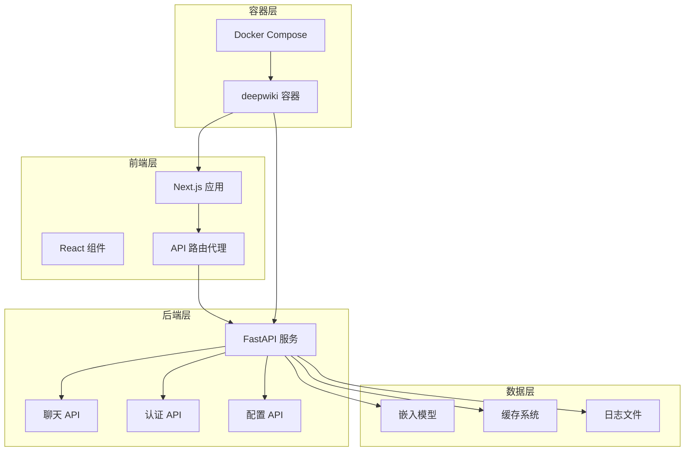
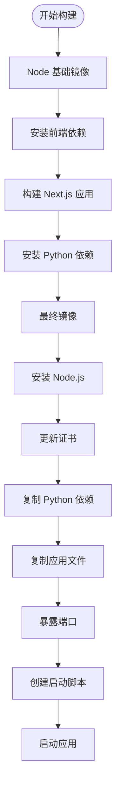
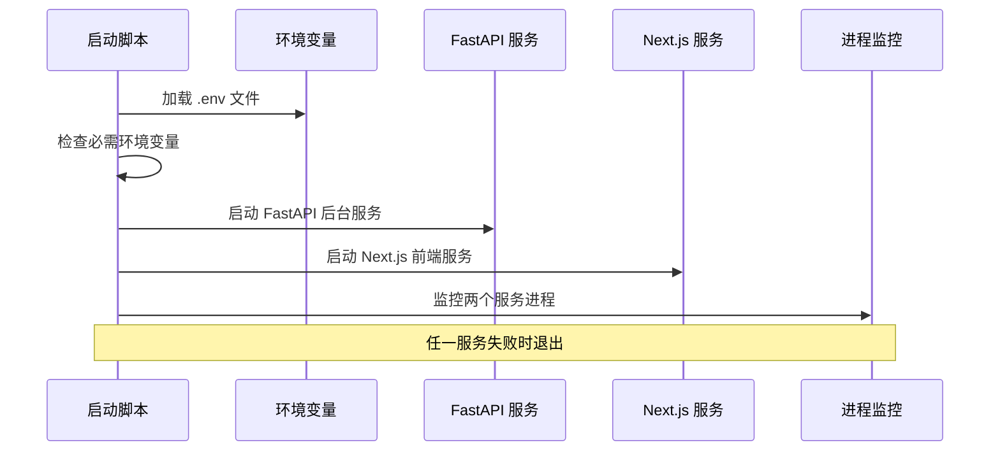
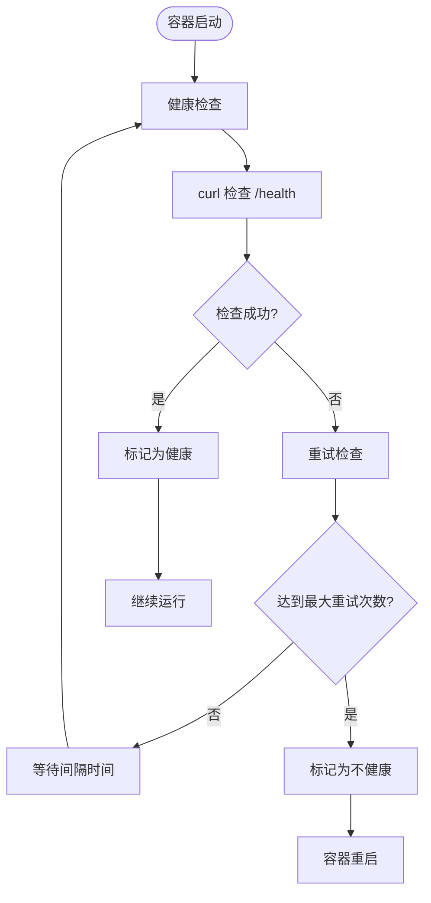

# Docker 部署

<cite>
**本文档中引用的文件**
- [docker-compose.yml](file://docker-compose.yml)
- [Dockerfile](file://Dockerfile)
- [run.sh](file://run.sh)
- [package.json](file://package.json)
- [api/pyproject.toml](file://api/pyproject.toml)
- [api/main.py](file://api/main.py)
- [api/api.py](file://api/api.py)
- [api/config.py](file://api/config.py)
- [next.config.ts](file://next.config.ts)
</cite>

## 目录
1. [简介](#简介)
2. [项目结构概览](#项目结构概览)
3. [Docker Compose 配置详解](#docker-compose-配置详解)
4. [Dockerfile 多阶段构建分析](#dockerfile-多阶段构建分析)
5. [启动脚本分析](#启动脚本分析)
6. [环境变量配置](#环境变量配置)
7. [健康检查机制](#健康检查机制)
8. [资源限制与优化](#资源限制与优化)
9. [部署命令与使用指南](#部署命令与使用指南)
10. [故障排除](#故障排除)

## 简介

DeepWiki Open 是一个基于 FastAPI 和 Next.js 的智能代码分析和 AI 文档生成平台。本文档详细介绍了如何使用 Docker Compose 部署完整的服务栈，包括后端 API 服务和前端用户界面的容器化配置。

该部署方案采用多阶段 Docker 构建，支持多种 AI 提供商集成，具备完善的健康检查机制和资源管理功能。

## 项目结构概览

DeepWiki Open 项目采用前后端分离架构，主要组件包括：



**图表来源**
- [docker-compose.yml](file://docker-compose.yml#L1-L30)
- [Dockerfile](file://Dockerfile#L1-L112)

## Docker Compose 配置详解

### 服务定义

Docker Compose 文件定义了完整的 deepwiki 服务栈，包含以下关键配置：

#### 构建配置
- **构建上下文**: 使用当前目录作为构建上下文
- **Dockerfile**: 指定使用项目根目录下的 Dockerfile
- **镜像构建**: 支持自定义构建参数和证书配置

#### 端口映射
- **API 端口**: 默认映射到宿主机的 8001 端口（可通过 PORT 环境变量自定义）
- **Next.js 端口**: 固定映射到宿主机的 3000 端口

#### 环境变量配置
- **env_file**: 加载 .env 文件中的环境变量
- **environment**: 设置关键环境变量：
  - `PORT`: API 服务端口
  - `NODE_ENV`: 运行环境为生产模式
  - `SERVER_BASE_URL`: 后端服务基础 URL
  - `LOG_LEVEL`: 日志级别
  - `LOG_FILE_PATH`: 日志文件路径

#### 卷挂载
- **~/.adalflow**: 持久化存储仓库和嵌入数据
- **./api/logs**: 持久化日志文件，确保容器重启后日志不丢失

#### 资源限制
- **mem_limit**: 最大内存限制为 6GB
- **mem_reservation**: 内存预留为 2GB

**章节来源**
- [docker-compose.yml](file://docker-compose.yml#L1-L30)

## Dockerfile 多阶段构建分析

### 构建阶段概览

Dockerfile 采用多阶段构建策略，每个阶段负责特定的任务：



**图表来源**
- [Dockerfile](file://Dockerfile#L1-L112)

### Node.js 阶段

#### node_deps 阶段
- **基础镜像**: 使用 `node:20-alpine3.22` 作为基础
- **工作目录**: 设置 `/app` 为工作目录
- **依赖安装**: 使用 `npm ci --legacy-peer-deps` 安装精确版本的依赖

#### node_builder 阶段
- **依赖复用**: 从 node_deps 阶段复制 node_modules
- **构建优化**: 只复制必要的构建文件
- **内存优化**: 设置 `--max-old-space-size=4096` 提升构建性能
- **遥测禁用**: 禁用 Next.js 遥测以提升隐私保护

### Python 依赖阶段

#### py_deps 阶段
- **基础镜像**: 使用 `python:3.11-slim` 作为基础
- **Poetry 安装**: 安装 Poetry 包管理器
- **虚拟环境**: 创建本地虚拟环境
- **依赖安装**: 并行安装所有 Python 依赖（最大工作进程数 10）

### 最终镜像配置

#### 系统环境
- **Node.js 安装**: 从官方源安装最新 Node.js 版本
- **证书更新**: 支持自定义 CA 证书安装
- **Python 环境**: 预配置 Python 3.11 环境

#### 文件复制
- **Python 应用**: 复制 API 服务代码
- **前端应用**: 复制构建后的 Next.js 静态文件
- **静态资源**: 复制公共静态文件和 Next.js 静态资源

**章节来源**
- [Dockerfile](file://Dockerfile#L1-L112)

## 启动脚本分析

### start.sh 脚本功能

启动脚本实现了前后端服务的并行启动和环境变量管理：



**图表来源**
- [Dockerfile](file://Dockerfile#L83-L111)

### 关键功能

#### 环境变量加载
- **自动检测**: 检查是否存在 `.env` 文件
- **变量导入**: 使用 `grep` 和 `xargs` 导入环境变量
- **兼容性**: 支持 Docker Compose 和独立容器运行

#### 必需变量检查
- **API 密钥验证**: 检查 `OPENAI_API_KEY` 和 `GOOGLE_API_KEY`
- **警告提示**: 如果缺少必要密钥，显示警告信息
- **功能完整性**: 确保 AI 功能正常工作

#### 并行启动
- **后台执行**: FastAPI 服务在后台启动
- **前台执行**: Next.js 服务在前台运行
- **进程监控**: 使用 `wait -n` 监控进程状态

**章节来源**
- [Dockerfile](file://Dockerfile#L83-L111)

## 环境变量配置

### 核心环境变量

| 变量名 | 默认值 | 描述 | 必需 |
|--------|--------|------|------|
| `PORT` | 8001 | FastAPI 服务端口 | 否 |
| `NODE_ENV` | production | Node.js 运行环境 | 是 |
| `SERVER_BASE_URL` | http://localhost:8001 | 后端服务基础 URL | 是 |
| `LOG_LEVEL` | INFO | 日志级别 | 否 |
| `LOG_FILE_PATH` | api/logs/application.log | 日志文件路径 | 否 |
| `OPENAI_API_KEY` | - | OpenAI API 密钥 | 是 |
| `GOOGLE_API_KEY` | - | Google API 密钥 | 是 |

### 配置文件优先级

1. **Docker Compose 环境变量**: 优先级最高
2. **.env 文件**: 通过 `env_file` 指定
3. **默认值**: Dockerfile 中设置的默认值

### 自定义配置

#### 证书配置
- **CUSTOM_CERT_DIR**: 自定义证书目录（默认 "certs"）
- **证书安装**: 支持动态安装自定义 CA 证书

#### 认证配置
- **DEEPWIKI_AUTH_MODE**: 启用/禁用 Wiki 认证
- **DEEPWIKI_AUTH_CODE**: 认证码

#### 嵌入器配置
- **DEEPWIKI_EMBEDDER_TYPE**: 嵌入器类型（openai/google/ollama）

**章节来源**
- [docker-compose.yml](file://docker-compose.yml#L9-L17)
- [api/config.py](file://api/config.py#L18-L47)

## 健康检查机制

### 健康检查配置

Docker Compose 配置了完善的健康检查机制：



**图表来源**
- [docker-compose.yml](file://docker-compose.yml#L24-L29)

### 健康检查参数

| 参数 | 值 | 描述 |
|------|-----|------|
| `test` | `["CMD", "curl", "-f", "http://localhost:${PORT:-8001}/health"]` | 使用 curl 测试健康端点 |
| `interval` | 60s | 检查间隔时间 |
| `timeout` | 10s | 单次检查超时时间 |
| `retries` | 3 | 最大重试次数 |
| `start_period` | 30s | 容器启动后等待时间 |

### 健康检查端点

健康检查访问 `/health` 端点，返回以下响应：

```json
{
  "status": "healthy",
  "timestamp": "2024-01-01T00:00:00.000Z",
  "service": "deepwiki-api"
}
```

### 实现细节

健康检查端点位于 `api/api.py` 文件中，由 FastAPI 应用提供：

- **端点路径**: `/health`
- **响应格式**: JSON 格式的标准健康检查响应
- **检查内容**: 服务基本可用性检查

**章节来源**
- [docker-compose.yml](file://docker-compose.yml#L24-L29)
- [api/api.py](file://api/api.py#L540-L547)

## 资源限制与优化

### 内存配置

#### 资源限制
- **mem_limit**: 6GB（最大可用内存）
- **mem_reservation**: 2GB（预留内存）

#### 优化策略
- **Node.js 内存**: 设置 `--max-old-space-size=4096` 提升构建性能
- **Python 虚拟环境**: 使用本地虚拟环境减少磁盘占用
- **依赖缓存**: Poetry 并行安装优化下载速度

### 性能优化

#### 构建优化
- **并行工作进程**: Poetry 使用最多 10 个工作进程
- **依赖复用**: 多阶段构建中复用已安装的依赖
- **缓存清理**: 构建完成后清理 Poetry 缓存

#### 运行时优化
- **Standalone Next.js**: 使用 `output: 'standalone'` 减少运行时依赖
- **Bundle 优化**: Webpack 配置优化包大小
- **内存管理**: 服务器端渲染优化内存使用

### 监控配置

#### 日志配置
- **日志级别**: 支持动态调整日志级别
- **文件轮转**: 支持日志文件持久化
- **结构化日志**: 使用 Python logging 模块

**章节来源**
- [docker-compose.yml](file://docker-compose.yml#L20-L23)
- [Dockerfile](file://Dockerfile#L20-L23)
- [next.config.ts](file://next.config.ts#L1-L70)

## 部署命令与使用指南

### 前置条件

1. **Docker 环境**: 确保已安装 Docker Engine 和 Docker Compose
2. **硬件要求**: 至少 4GB RAM，推荐 8GB 或更多
3. **网络连接**: 需要访问外部 API（如 OpenAI、Google AI）

### 部署步骤

#### 1. 克隆项目
```bash
git clone https://github.com/your-repository/deepwiki-open.git
cd deepwiki-open
```

#### 2. 配置环境变量
创建 `.env` 文件：
```bash
# API 密钥配置
OPENAI_API_KEY=your_openai_api_key_here
GOOGLE_API_KEY=your_google_api_key_here

# 可选配置
PORT=8001
LOG_LEVEL=INFO
DEEPWIKI_AUTH_MODE=False
DEEPWIKI_AUTH_CODE=
```

#### 3. 构建和启动
```bash
# 构建镜像
docker-compose build

# 启动服务
docker-compose up -d

# 查看服务状态
docker-compose ps

# 查看日志
docker-compose logs -f
```

#### 4. 访问应用
- **前端界面**: http://localhost:3000
- **API 服务**: http://localhost:8001
- **健康检查**: http://localhost:8001/health

### 停止和清理

```bash
# 停止服务
docker-compose down

# 清理停止的容器
docker-compose down --remove-orphans

# 删除所有数据（谨慎操作）
docker-compose down -v
```

### 常用命令

#### 开发环境
```bash
# 重新构建并启动
docker-compose up --build -d

# 进入容器调试
docker-compose exec deepwiki sh

# 查看容器资源使用
docker stats
```

#### 生产环境
```bash
# 监控健康状态
docker-compose exec deepwiki curl http://localhost:8001/health

# 手动重启服务
docker-compose restart deepwiki

# 更新镜像
docker-compose pull
docker-compose up -d --force-recreate
```

## 故障排除

### 常见问题

#### 1. 端口冲突
**问题**: 端口 8001 或 3000 已被占用
**解决方案**:
```bash
# 检查端口占用
netstat -tulpn | grep :8001
netstat -tulpn | grep :3000

# 修改端口配置
echo "PORT=8002" >> .env
docker-compose up -d
```

#### 2. API 密钥错误
**问题**: 缺少或无效的 API 密钥
**解决方案**:
```bash
# 检查环境变量
docker-compose exec deepwiki printenv | grep -E "(OPENAI|GOOGLE)_API_KEY"

# 重新设置密钥
echo "OPENAI_API_KEY=your_new_key" >> .env
docker-compose restart deepwiki
```

#### 3. 内存不足
**问题**: 容器因内存不足而崩溃
**解决方案**:
```bash
# 检查内存使用
docker stats

# 调整资源限制
# 在 docker-compose.yml 中修改：
# mem_limit: 8g
# mem_reservation: 4g
docker-compose up -d
```

#### 4. 健康检查失败
**问题**: 容器健康检查失败
**解决方案**:
```bash
# 查看详细日志
docker-compose logs deepwiki

# 手动测试健康端点
docker-compose exec deepwiki curl http://localhost:8001/health

# 重启服务
docker-compose restart deepwiki
```

### 调试技巧

#### 1. 日志分析
```bash
# 实时查看日志
docker-compose logs -f deepwiki

# 查看最近的错误日志
docker-compose logs --tail=100 deepwiki | grep ERROR

# 查看特定时间段的日志
docker-compose logs --since="2024-01-01T00:00:00" deepwiki
```

#### 2. 容器内部调试
```bash
# 进入容器
docker-compose exec deepwiki sh

# 检查进程状态
ps aux

# 检查网络连接
curl -I http://localhost:8001/health

# 检查文件系统
ls -la /app
```

#### 3. 性能监控
```bash
# 监控资源使用
docker stats deepwiki

# 检查磁盘使用
docker-compose exec deepwiki df -h

# 检查内存使用
docker-compose exec deepwiki free -h
```

### 高级配置

#### 自定义证书
```bash
# 将自定义证书放入 certs 目录
mkdir certs
cp your-cert.crt certs/

# 重新构建镜像
docker-compose build --build-arg CUSTOM_CERT_DIR=certs
docker-compose up -d
```

#### 多环境配置
```yaml
# docker-compose.override.yml
version: '3.8'
services:
  deepwiki:
    environment:
      - LOG_LEVEL=DEBUG
    volumes:
      - ./logs:/app/api/logs
```

**章节来源**
- [docker-compose.yml](file://docker-compose.yml#L1-L30)
- [Dockerfile](file://Dockerfile#L56-L66)