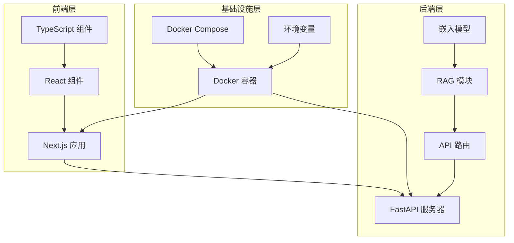
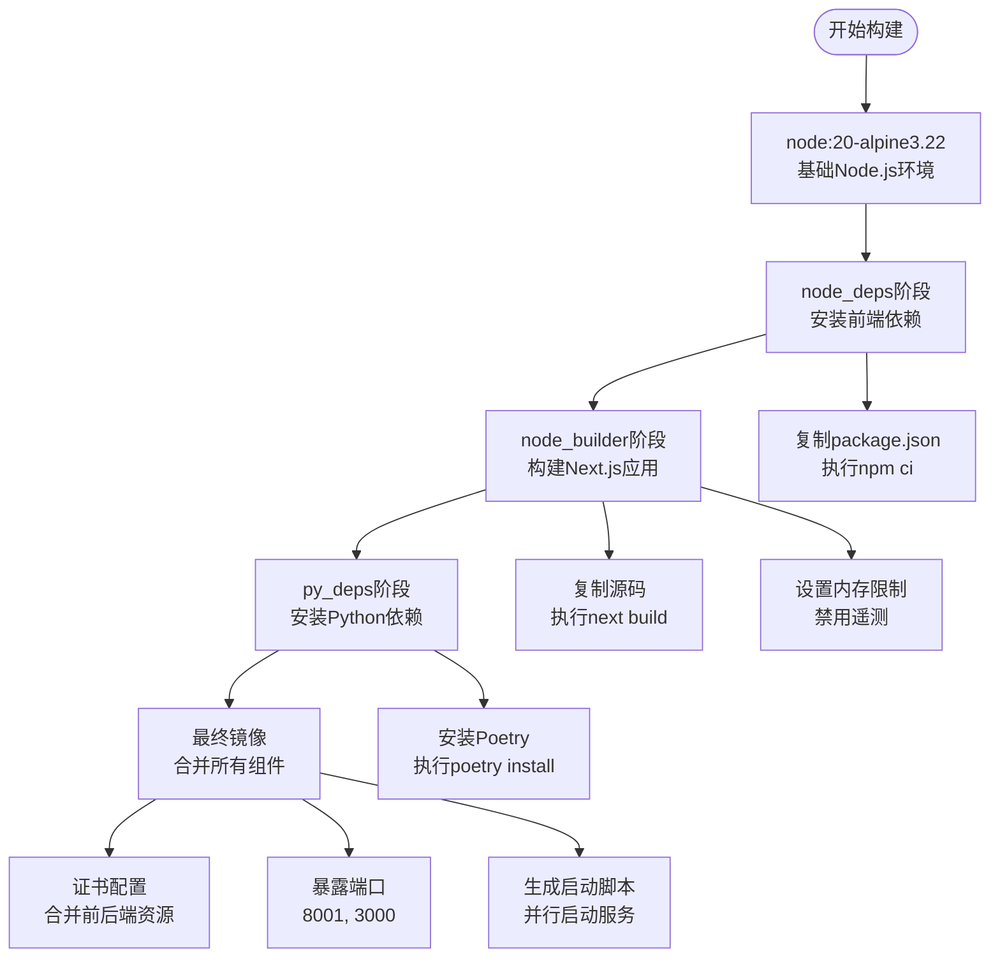
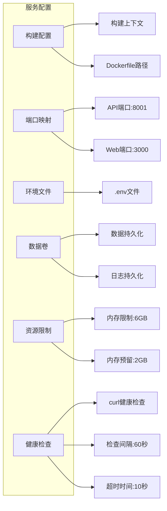
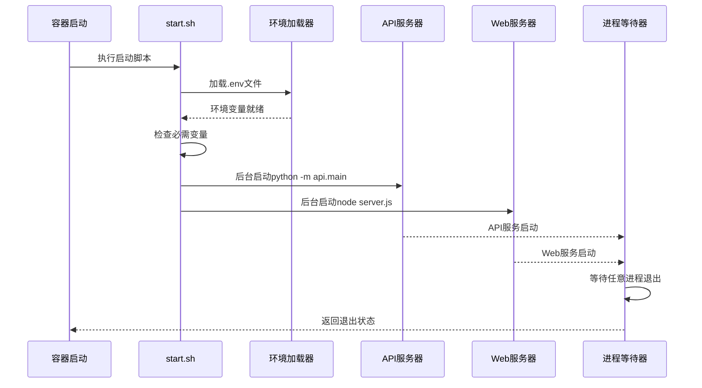
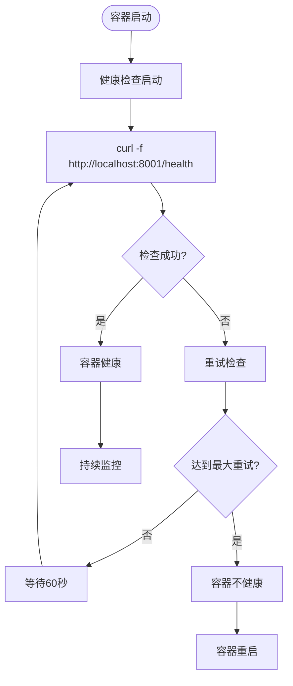

# 构建与运行

<cite>
**本文档中引用的文件**
- [Dockerfile](file://Dockerfile)
- [docker-compose.yml](file://docker-compose.yml)
- [run.sh](file://run.sh)
- [package.json](file://package.json)
- [api/pyproject.toml](file://api/pyproject.toml)
- [api/main.py](file://api/main.py)
- [src/app/layout.tsx](file://src/app/layout.tsx)
- [README.md](file://README.md)
</cite>

## 目录
1. [简介](#简介)
2. [项目结构概览](#项目结构概览)
3. [Dockerfile多阶段构建详解](#dockerfile多阶段构建详解)
4. [Docker Compose配置分析](#docker-compose配置分析)
5. [启动脚本机制](#启动脚本机制)
6. [环境变量配置](#环境变量配置)
7. [构建与运行命令](#构建与运行命令)
8. [健康检查与资源管理](#健康检查与资源管理)
9. [故障排除指南](#故障排除指南)
10. [总结](#总结)

## 简介

DeepWiki-Open是一个基于AI的智能代码文档生成系统，能够自动为GitHub、GitLab或BitBucket仓库创建美观、交互式的维基文档。该项目采用现代化的微服务架构，包含FastAPI后端和Next.js前端，通过Docker容器化部署提供了便捷的部署方式。

本文档将详细介绍如何使用Docker构建和运行DeepWiki-Open应用，包括完整的多阶段构建流程、环境配置、健康检查机制以及最佳实践。

## 项目结构概览

DeepWiki-Open项目采用前后端分离的架构设计：



**图表来源**
- [Dockerfile](file://Dockerfile#L1-L112)
- [docker-compose.yml](file://docker-compose.yml#L1-L30)
- [api/main.py](file://api/main.py#L1-L80)

**章节来源**
- [README.md](file://README.md#L1-L200)
- [Dockerfile](file://Dockerfile#L1-L112)

## Dockerfile多阶段构建详解

DeepWiki-Open采用了精心设计的多阶段Docker构建流程，每个阶段都有特定的职责和优化目标：

### 构建阶段架构



**图表来源**
- [Dockerfile](file://Dockerfile#L6-L112)

### 阶段一：Node.js依赖安装 (node_deps)

在`node_deps`阶段，Dockerfile执行以下操作：

1. **基础环境准备**：使用`node:20-alpine3.22`作为基础镜像
2. **依赖安装**：复制`package.json`和`package-lock.json`到容器
3. **优化安装**：使用`npm ci --legacy-peer-deps`进行快速且确定性的依赖安装

### 阶段二：Next.js应用构建 (node_builder)

`node_builder`阶段负责前端应用的完整构建：

1. **依赖复用**：从`node_deps`阶段复制已安装的`node_modules`
2. **必要文件复制**：只复制构建所需的配置文件和源码
3. **性能优化**：
   - 设置`NODE_OPTIONS="--max-old-space-size=4096"`提升内存限制
   - 启用`NEXT_TELEMETRY_DISABLED=1`禁用遥测收集
4. **生产构建**：执行`NODE_ENV=production npm run build`生成优化的生产版本

### 阶段三：Python依赖安装 (py_deps)

Python依赖安装阶段确保后端服务的完整功能：

1. **Poetry配置**：安装并配置Poetry包管理器
2. **虚拟环境创建**：启用项目内虚拟环境
3. **依赖安装**：使用`poetry install --no-interaction`静默安装所有依赖
4. **缓存清理**：清理Poetry缓存减少镜像大小

### 阶段四：最终镜像构建

最终镜像整合了所有组件并进行了生产环境优化：

1. **Node.js安装**：动态安装Node.js运行时环境
2. **证书配置**：支持自定义CA证书的安装
3. **资源合并**：从各构建阶段复制必要的文件
4. **端口配置**：暴露API端口(8001)和前端端口(3000)
5. **启动脚本**：生成并配置复合启动脚本

**章节来源**
- [Dockerfile](file://Dockerfile#L1-L112)

## Docker Compose配置分析

Docker Compose配置文件定义了完整的服务编排和部署策略：

### 服务配置结构



**图表来源**
- [docker-compose.yml](file://docker-compose.yml#L1-L30)

### 关键配置项解析

1. **构建上下文**：`context: .`指定当前目录为构建上下文
2. **Dockerfile引用**：`dockerfile: Dockerfile`明确指定构建文件
3. **端口映射**：
   - `${PORT:-8001}:${PORT:-8001}`：API服务端口，默认8001
   - `3000:3000`：Next.js前端端口固定映射
4. **环境变量继承**：通过`env_file: - .env`继承外部环境配置
5. **数据持久化**：
   - `~/.adalflow:/root/.adalflow`：持久化嵌入模型数据
   - `./api/logs:/app/api/logs`：持久化应用日志

### 资源管理策略

Compose配置实现了精细的资源控制：

1. **内存限制**：`mem_limit: 6g`限制容器最大内存使用
2. **内存预留**：`mem_reservation: 2g`确保最低可用内存
3. **资源效率**：合理的内存分配避免资源浪费

**章节来源**
- [docker-compose.yml](file://docker-compose.yml#L1-L30)

## 启动脚本机制

DeepWiki-Open的启动脚本采用了创新的并行启动模式，同时运行FastAPI后端和Next.js前端：

### 启动流程架构



**图表来源**
- [Dockerfile](file://Dockerfile#L83-L111)

### 环境变量处理机制

启动脚本实现了智能的环境变量管理：

1. **文件检测**：检查是否存在`.env`文件
2. **变量加载**：使用`grep -v "^#" .env | xargs -r`安全加载变量
3. **验证检查**：验证`OPENAI_API_KEY`和`GOOGLE_API_KEY`是否设置
4. **警告提示**：未设置关键变量时显示友好警告

### 并行服务启动

脚本采用后台并行启动模式：

1. **API服务启动**：`python -m api.main --port ${PORT:-8001} &`
2. **Web服务启动**：`PORT=3000 HOSTNAME=0.0.0.0 node server.js &`
3. **进程监控**：`wait -n`等待任意进程退出并返回状态

**章节来源**
- [Dockerfile](file://Dockerfile#L83-L111)

## 环境变量配置

DeepWiki-Open支持丰富的环境变量配置，用于控制应用行为和集成外部服务：

### 核心API密钥配置

| 变量名 | 必需性 | 描述 | 示例值 |
|--------|--------|------|--------|
| `GOOGLE_API_KEY` | 必需 | Google AI API密钥 | `your-google-api-key` |
| `OPENAI_API_KEY` | 必需 | OpenAI API密钥 | `your-openai-api-key` |
| `OPENROUTER_API_KEY` | 可选 | OpenRouter API密钥 | `your-openrouter-key` |
| `AZURE_OPENAI_API_KEY` | 可选 | Azure OpenAI API密钥 | `your-azure-key` |
| `AZURE_OPENAI_ENDPOINT` | 可选 | Azure OpenAI端点 | `https://your-resource.openai.azure.com/` |
| `AZURE_OPENAI_VERSION` | 可选 | Azure OpenAI API版本 | `2024-02-15-preview` |

### 嵌入模型配置

| 变量名 | 必需性 | 描述 | 默认值 |
|--------|--------|------|--------|
| `DEEPWIKI_EMBEDDER_TYPE` | 可选 | 嵌入模型类型 | `openai` |
| `OLLAMA_HOST` | 可选 | Ollama服务主机地址 | `http://localhost:11434` |

### 应用行为配置

| 变量名 | 必需性 | 描述 | 默认值 |
|--------|--------|------|--------|
| `PORT` | 可选 | API服务端口 | `8001` |
| `NODE_ENV` | 推荐 | Node.js环境模式 | `production` |
| `SERVER_BASE_URL` | 推荐 | 服务器基础URL | `http://localhost:8001` |
| `LOG_LEVEL` | 可选 | 日志级别 | `INFO` |
| `LOG_FILE_PATH` | 可选 | 日志文件路径 | `api/logs/application.log` |

### 配置文件创建示例

根据README文档，创建`.env`文件的标准配置：

```bash
# 必需的API密钥
GOOGLE_API_KEY=your_google_api_key_here
OPENAI_API_KEY=your_openai_api_key_here

# 可选配置
# 使用Google AI嵌入模型（推荐）
DEEPWIKI_EMBEDDER_TYPE=google

# OpenRouter配置
OPENROUTER_API_KEY=your_openrouter_api_key

# Azure OpenAI配置
AZURE_OPENAI_API_KEY=your_azure_openai_api_key
AZURE_OPENAI_ENDPOINT=your_azure_openai_endpoint
AZURE_OPENAI_VERSION=your_azure_openai_version

# Ollama配置（如果使用本地模型）
OLLAMA_HOST=http://localhost:11434
```

**章节来源**
- [README.md](file://README.md#L35-L83)
- [api/main.py](file://api/main.py#L47-L52)

## 构建与运行命令

### 基础构建命令

```bash
# 克隆项目
git clone https://github.com/AsyncFuncAI/deepwiki-open.git
cd deepwiki-open

# 创建环境配置文件
cat > .env << EOF
GOOGLE_API_KEY=your_google_api_key
OPENAI_API_KEY=your_openai_api_key
EOF

# 使用Docker Compose构建和启动
docker-compose up
```

### 开发环境命令

```bash
# 启动开发服务器（非容器化）
# 在api/目录下
python -m pip install poetry==1.8.2 && poetry install -C api

# 启动后端API服务
python -m api.main

# 在另一个终端中启动前端开发服务器
cd src
npm install
npm run dev
```

### 生产环境命令

```bash
# 构建生产镜像
docker build -t deepwiki-open .

# 或使用Docker Compose（推荐）
docker-compose build

# 启动服务
docker-compose up -d

# 查看服务状态
docker-compose ps

# 查看日志
docker-compose logs -f

# 停止服务
docker-compose down
```

### 自定义构建选项

```bash
# 使用自定义端口
PORT=9000 docker-compose up

# 后台运行
docker-compose up -d

# 强制重建镜像
docker-compose up --build -d

# 显示详细输出
docker-compose up --verbose
```

**章节来源**
- [README.md](file://README.md#L35-L55)
- [docker-compose.yml](file://docker-compose.yml#L1-L30)

## 健康检查与资源管理

### 健康检查配置

DeepWiki-Open实现了完善的健康检查机制：



**图表来源**
- [docker-compose.yml](file://docker-compose.yml#L24-L29)

### 健康检查参数详解

1. **检查测试**：`test: ["CMD", "curl", "-f", "http://localhost:8001/health"]`
   - 使用curl命令检查健康端点
   - `-f`参数使curl在HTTP错误时返回非零状态码

2. **检查间隔**：`interval: 60s`
   - 每60秒执行一次健康检查

3. **超时时间**：`timeout: 10s`
   - 每次检查最多等待10秒

4. **重试次数**：`retries: 3`
   - 失败情况下最多重试3次

5. **启动期**：`start_period: 30s`
   - 容器启动后30秒才开始健康检查

### 资源限制配置

```yaml
# 内存限制配置
mem_limit: 6g        # 最大内存使用限制
mem_reservation: 2g  # 内存预留保证
```

### 资源管理优势

1. **内存保护**：防止容器因内存不足而崩溃
2. **资源隔离**：确保其他服务正常运行
3. **性能保障**：预留足够的内存空间
4. **成本控制**：避免过度消耗系统资源

**章节来源**
- [docker-compose.yml](file://docker-compose.yml#L20-L29)

## 故障排除指南

### 常见问题及解决方案

#### 1. 端口冲突问题

**症状**：`Port 8001 is already in use`

**解决方案**：
```bash
# 检查端口占用
lsof -i :8001

# 修改端口配置
PORT=9000 docker-compose up

# 或停止占用端口的进程
sudo kill -9 $(lsof -t -i:8001)
```

#### 2. API密钥配置错误

**症状**：启动时出现API密钥警告

**解决方案**：
```bash
# 检查环境变量
docker-compose exec deepwiki printenv | grep -E "(OPENAI|GOOGLE)_API_KEY"

# 重新设置环境变量
docker-compose down
# 编辑.env文件
docker-compose up
```

#### 3. 内存不足问题

**症状**：容器被OOM killer终止

**解决方案**：
```bash
# 增加系统内存限制
docker-compose down
# 修改docker-compose.yml中的mem_limit
docker-compose up
```

#### 4. 健康检查失败

**症状**：容器频繁重启

**解决方案**：
```bash
# 查看详细日志
docker-compose logs deepwiki

# 检查服务状态
docker-compose exec deepwiki curl -f http://localhost:8001/health

# 调整健康检查参数
# 修改docker-compose.yml中的healthcheck配置
```

### 调试技巧

1. **进入容器调试**：
   ```bash
   docker-compose exec deepwiki sh
   ```

2. **查看完整日志**：
   ```bash
   docker-compose logs --tail=100 deepwiki
   ```

3. **强制重建**：
   ```bash
   docker-compose down
   docker-compose build --no-cache
   docker-compose up
   ```

### 性能优化建议

1. **内存配置**：根据系统资源调整`mem_limit`和`mem_reservation`
2. **并发控制**：合理设置API请求的并发数量
3. **缓存策略**：利用嵌入模型缓存减少重复计算
4. **网络优化**：确保API密钥配置正确避免网络超时

## 总结

DeepWiki-Open的Docker部署方案体现了现代容器化应用的最佳实践：

### 核心优势

1. **多阶段构建**：通过精心设计的构建阶段实现最小化镜像大小和最佳性能
2. **并行启动**：创新的启动脚本机制同时运行前后端服务
3. **环境隔离**：完善的环境变量管理和配置文件支持
4. **健康监控**：全面的健康检查和资源管理机制
5. **易于部署**：简洁的命令行接口和详细的文档支持

### 最佳实践要点

1. **环境配置**：始终创建并维护`.env`文件进行环境变量管理
2. **资源规划**：根据实际需求调整内存限制和并发配置
3. **监控维护**：定期检查健康检查状态和日志记录
4. **安全考虑**：妥善保管API密钥，避免泄露敏感信息
5. **扩展性**：利用Docker Compose的灵活性支持多种部署场景

通过遵循本文档的指导，您可以成功构建、部署和维护DeepWiki-Open应用，充分发挥其智能代码分析和文档生成的强大功能。