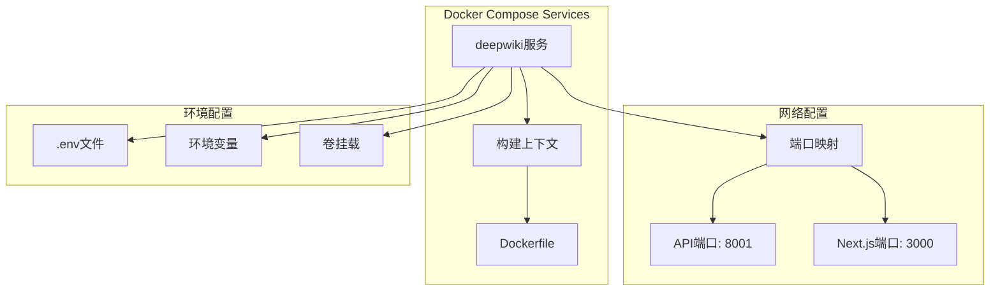
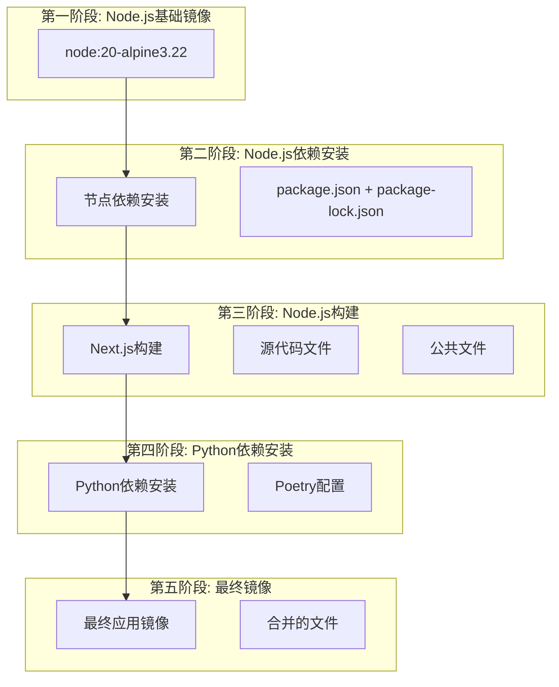
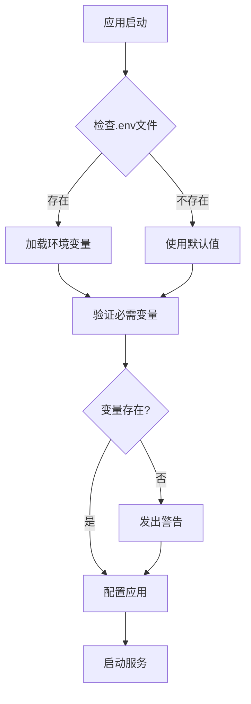
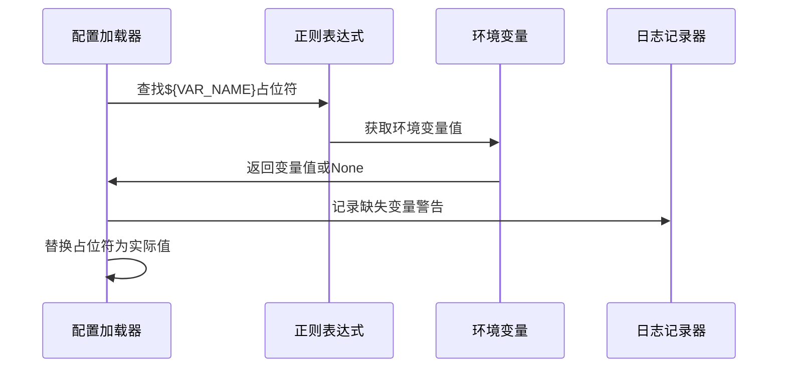
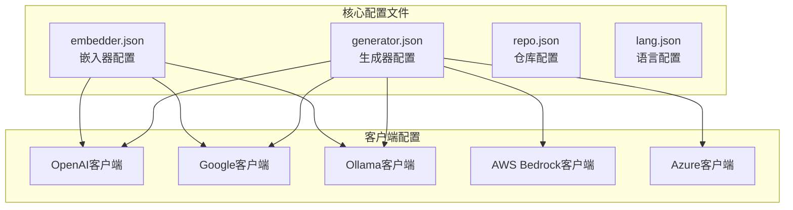
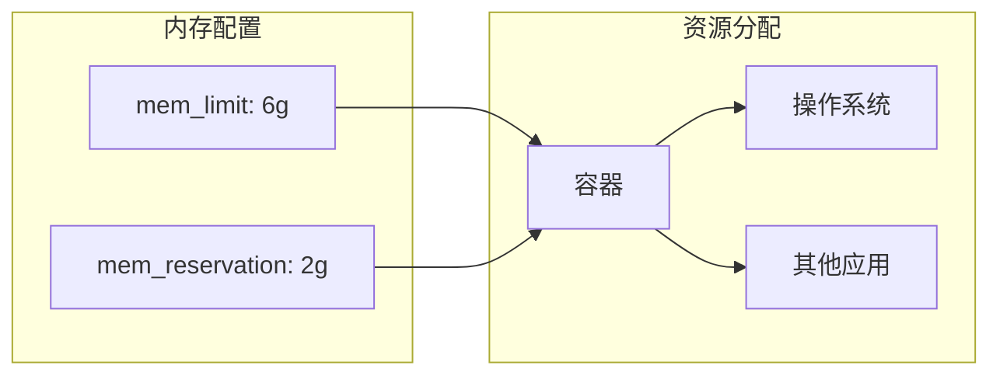
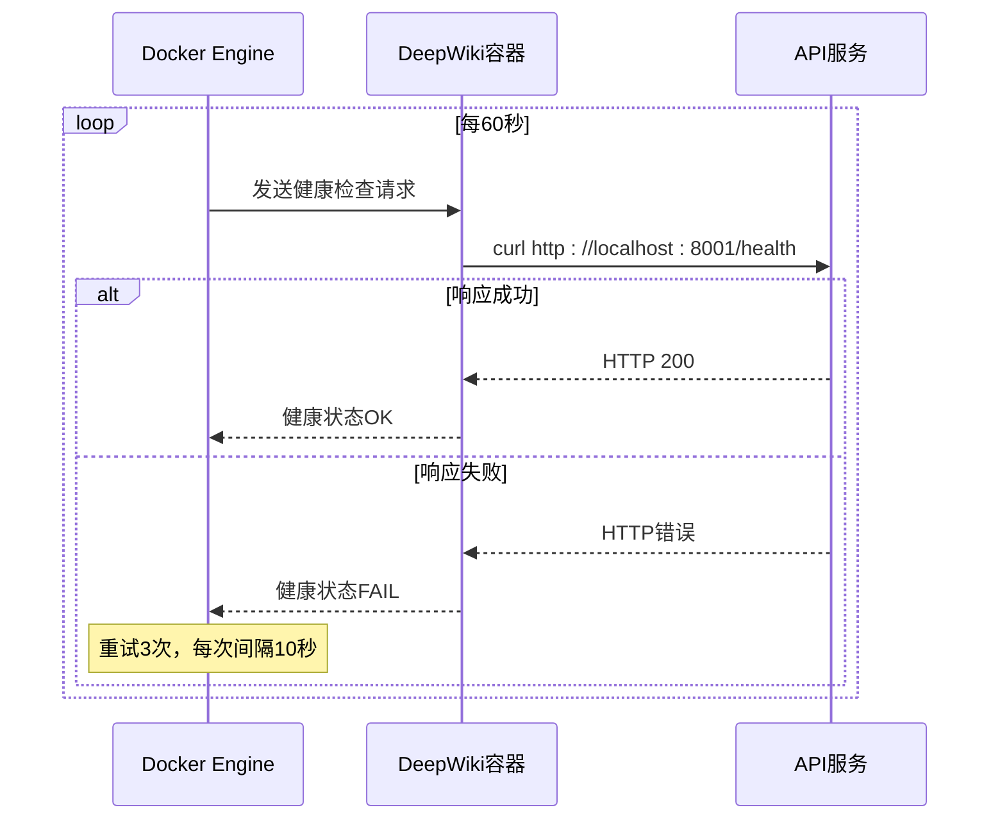
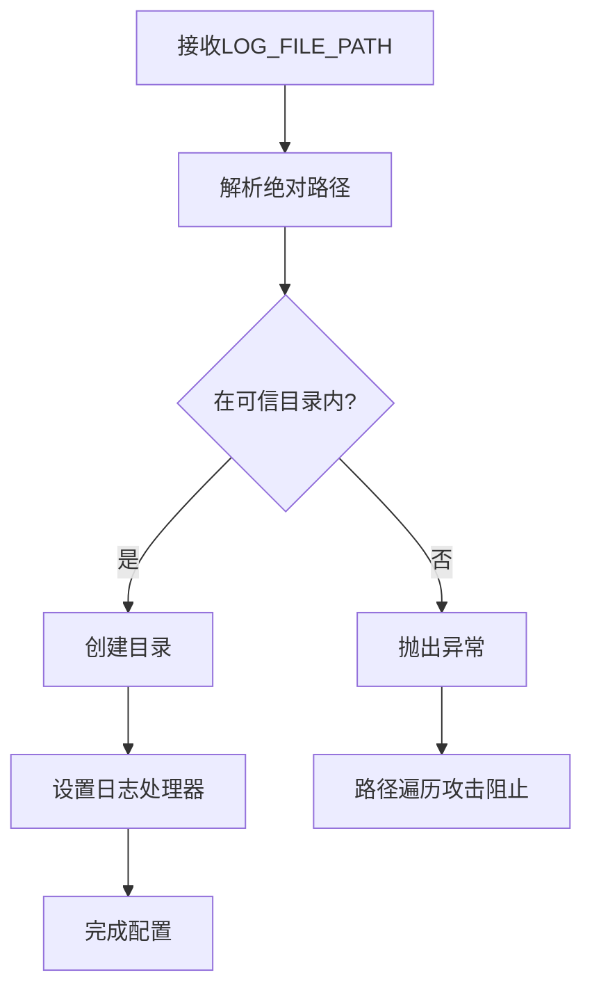

# DeepWiki Docker配置详解

<cite>
**本文档引用的文件**
- [docker-compose.yml](file://docker-compose.yml)
- [Dockerfile](file://Dockerfile)
- [api/config.py](file://api/config.py)
- [api/main.py](file://api/main.py)
- [api/logging_config.py](file://api/logging_config.py)
- [package.json](file://package.json)
- [run.sh](file://run.sh)
- [api/config/generator.json](file://api/config/generator.json)
- [api/config/embedder.json](file://api/config/embedder.json)
- [api/config/repo.json](file://api/config/repo.json)
- [api/config/lang.json](file://api/config/lang.json)
</cite>

## 目录
1. [概述](#概述)
2. [Docker Compose配置详解](#docker-compose配置详解)
3. [Dockerfile多阶段构建分析](#dockerfile多阶段构建分析)
4. [环境变量配置系统](#环境变量配置系统)
5. [配置文件架构](#配置文件架构)
6. [资源管理与健康检查](#资源管理与健康检查)
7. [数据持久化策略](#数据持久化策略)
8. [部署最佳实践](#部署最佳实践)

## 概述

DeepWiki采用现代化的Docker容器化部署方案，通过docker-compose.yml和Dockerfile实现了完整的应用栈部署。该配置支持API服务（FastAPI）和前端界面（Next.js）的统一部署，提供了灵活的环境变量配置、数据持久化和资源管理功能。

## Docker Compose配置详解

### 服务定义与构建配置



**图表来源**
- [docker-compose.yml](file://docker-compose.yml#L2-L30)

### 端口映射配置

Docker Compose配置中定义了两个关键端口的映射：

#### API端口配置
- **映射规则**: `${PORT:-8001}:${PORT:-8001}`
- **默认值**: 8001（当环境变量PORT未设置时）
- **用途**: FastAPI后端服务监听端口
- **可配置性**: 支持通过环境变量PORT动态调整

#### Next.js前端端口
- **映射规则**: `3000:3000`
- **用途**: React前端应用开发服务器
- **特点**: 固定端口，用于本地开发和静态资源服务

### 环境变量管理

#### env_file配置
- **文件位置**: `- .env`
- **功能**: 加载项目根目录下的.env文件
- **优先级**: 低于environment部分的直接配置

#### environment环境变量
配置了多个关键环境变量：

| 变量名 | 默认值 | 功能描述 |
|--------|--------|----------|
| PORT | ${PORT:-8001} | API服务端口 |
| NODE_ENV | production | Node.js运行环境 |
| SERVER_BASE_URL | http://localhost:${PORT:-8001} | 服务器基础URL |
| LOG_LEVEL | ${LOG_LEVEL:-INFO} | 日志级别 |
| LOG_FILE_PATH | ${LOG_FILE_PATH:-api/logs/application.log} | 日志文件路径 |

**节来源**
- [docker-compose.yml](file://docker-compose.yml#L9-L17)

### 数据持久化配置

#### 卷挂载策略

```mermaid
graph LR
subgraph "主机路径"
HostAdalflow[~/.adalflow]
HostLogs[./api/logs]
end
subgraph "容器路径"
ContainerAdalflow[/root/.adalflow]
ContainerLogs[/app/api/logs]
end
HostAdalflow --> ContainerAdalflow
HostLogs --> ContainerLogs
```

**图表来源**
- [docker-compose.yml](file://docker-compose.yml#L17-L19)

#### 持久化目标

1. **~/.adalflow**: 存储仓库数据和嵌入向量缓存
   - **用途**: Adalflow框架的数据存储
   - **持久化意义**: 避免重复处理已扫描的代码库

2. **./api/logs**: 存储应用程序日志文件
   - **用途**: 应用程序运行日志
   - **持久化意义**: 容器重启后日志不丢失

**节来源**
- [docker-compose.yml](file://docker-compose.yml#L17-L19)

## Dockerfile多阶段构建分析

### 构建阶段架构



**图表来源**
- [Dockerfile](file://Dockerfile#L6-L112)

### 多阶段构建优化策略

#### 第一阶段：Node.js基础层
- **基础镜像**: `node:20-alpine3.22`
- **优势**: 轻量级Alpine Linux，减少镜像大小
- **预装工具**: 包含Node.js、npm、curl等必要工具

#### 第二阶段：依赖安装优化
- **工作目录**: `/app`
- **复制策略**: 只复制必要的包管理文件
- **命令**: `npm ci --legacy-peer-deps`
- **优化**: 使用ci确保确定性安装，避免不必要的缓存

#### 第三阶段：构建优化
- **内存限制**: 设置`--max-old-space-size=4096`
- **遥测禁用**: `NEXT_TELEMETRY_DISABLED=1`
- **构建命令**: `NODE_ENV=production npm run build`
- **优化**: 生产环境构建，移除开发依赖

#### 第四阶段：Python依赖管理
- **工具**: Poetry包管理器
- **版本**: `poetry==2.0.1`
- **优化**: 虚拟环境内联安装，减少镜像大小

#### 第五阶段：最终镜像
- **基础镜像**: `python:3.11-slim`
- **证书更新**: 支持自定义CA证书
- **多语言支持**: 同时包含Node.js和Python运行时

**节来源**
- [Dockerfile](file://Dockerfile#L6-L112)

### 关键指令详解

#### ARG指令
- **用途**: 定义构建参数
- **示例**: `ARG CUSTOM_CERT_DIR="certs"`
- **功能**: 支持自定义证书目录的构建时配置

#### COPY指令优化
- **条件复制**: 根据构建阶段选择性复制文件
- **路径优化**: 避免复制不必要的开发文件
- **权限保持**: 保持文件执行权限

#### RUN指令优化
- **链式命令**: 使用`&&`连接多个命令
- **清理操作**: `apt-get clean`和`rm -rf`清理临时文件
- **缓存优化**: 合理利用Docker缓存机制

## 环境变量配置系统

### 环境变量层次结构



**图表来源**
- [api/main.py](file://api/main.py#L1-L80)
- [api/logging_config.py](file://api/logging_config.py#L1-L70)

### 核心环境变量配置

#### API服务配置
- **PORT**: API服务端口，默认8001
- **SERVER_BASE_URL**: 服务器基础URL，自动基于PORT计算
- **NODE_ENV**: Node.js环境，生产环境优化

#### 日志配置系统
- **LOG_LEVEL**: 日志级别，默认INFO
- **LOG_FILE_PATH**: 日志文件路径，默认`api/logs/application.log`
- **LOG_MAX_SIZE**: 最大日志文件大小，默认10MB
- **LOG_BACKUP_COUNT**: 备份数量，默认5个

#### 安全认证配置
- **DEEPWIKI_AUTH_MODE**: 启用授权模式
- **DEEPWIKI_AUTH_CODE**: 授权码（启用时必需）

#### API密钥配置
- **OPENAI_API_KEY**: OpenAI API密钥（必需）
- **GOOGLE_API_KEY**: Google API密钥（必需）
- **OPENROUTER_API_KEY**: OpenRouter API密钥（可选）
- **AWS_ACCESS_KEY_ID**: AWS访问密钥（可选）

**节来源**
- [api/main.py](file://api/main.py#L47-L53)
- [api/logging_config.py](file://api/logging_config.py#L31-L58)

### 环境变量与配置文件的关联

#### 配置文件中的环境变量替换
`api/config.py`实现了智能的环境变量替换功能：



**图表来源**
- [api/config.py](file://api/config.py#L66-L95)

#### 配置优先级
1. **环境变量**: 运行时设置的变量
2. **配置文件**: JSON配置文件中的占位符
3. **默认值**: 代码中的硬编码默认值

**节来源**
- [api/config.py](file://api/config.py#L66-L95)

## 配置文件架构

### 配置文件类型与用途



**图表来源**
- [api/config/generator.json](file://api/config/generator.json#L1-L200)
- [api/config/embedder.json](file://api/config/embedder.json#L1-L34)

### 生成器配置详解

#### 支持的提供商
- **Google**: Gemini系列模型
- **OpenAI**: GPT系列模型
- **OpenRouter**: 第三方模型聚合
- **Ollama**: 本地模型部署
- **AWS Bedrock**: 云原生模型服务
- **Azure**: Microsoft云服务

#### 模型配置参数
每个提供商支持以下参数：
- **temperature**: 温度参数，控制输出随机性
- **top_p**: 核采样参数
- **top_k**: 最高k个词汇采样
- **其他特定参数**: 如Ollama的num_ctx

**节来源**
- [api/config/generator.json](file://api/config/generator.json#L1-L200)

### 嵌入器配置详解

#### 多种嵌入器支持
- **OpenAI**: text-embedding-3-small模型
- **Ollama**: nomic-embed-text模型
- **Google**: text-embedding-004模型

#### 性能优化参数
- **batch_size**: 批处理大小
- **dimensions**: 向量维度
- **encoding_format**: 编码格式

**节来源**
- [api/config/embedder.json](file://api/config/embedder.json#L1-L34)

### 仓库过滤配置

#### 排除规则分类
- **版本控制系统**: .git, .svn, .hg, .bzr
- **虚拟环境**: .venv, node_modules, bower_components
- **构建产物**: dist/, build/, target/
- **缓存文件**: __pycache__, .pytest_cache, .mypy_cache
- **配置文件**: 各种.lock文件、配置文件

#### 大小限制
- **最大仓库大小**: 50000MB（50GB）

**节来源**
- [api/config/repo.json](file://api/config/repo.json#L1-L129)

## 资源管理与健康检查

### 内存资源配置



**图表来源**
- [docker-compose.yml](file://docker-compose.yml#L20-L22)

#### 配置参数说明
- **mem_limit**: 最大内存限制6GB
- **mem_reservation**: 最低内存保留2GB
- **目的**: 确保容器获得足够内存，同时允许系统回收空闲内存

### 健康检查配置

#### 健康检查策略



**图表来源**
- [docker-compose.yml](file://docker-compose.yml#L24-L29)

#### 健康检查参数
- **测试命令**: `curl -f http://localhost:${PORT:-8001}/health`
- **检查间隔**: 60秒
- **超时时间**: 10秒
- **重试次数**: 3次
- **启动期**: 30秒（容器启动后的等待时间）

**节来源**
- [docker-compose.yml](file://docker-compose.yml#L24-L29)

## 数据持久化策略

### 持久化架构设计

```mermaid
graph TB
subgraph "主机存储"
HostHome[~/.adalflow<br/>用户数据]
HostLogs[./api/logs<br/>日志文件]
end
subgraph "容器内部"
ContainerHome[/root/.adalflow<br/>Adalflow数据]
ContainerLogs[/app/api/logs<br/>应用日志]
end
subgraph "数据流向"
WriteData[写入数据]
ReadData[读取数据]
Backup[备份保护]
end
HostHome --> ContainerHome
HostLogs --> ContainerLogs
ContainerHome --> WriteData
ContainerHome --> ReadData
ContainerLogs --> WriteData
ContainerLogs --> Backup
```

**图表来源**
- [docker-compose.yml](file://docker-compose.yml#L17-L19)

### 持久化策略详解

#### Adalflow数据持久化
- **路径**: `~/.adalflow` → `/root/.adalflow`
- **数据类型**: 
  - 代码仓库索引
  - 向量嵌入数据
  - 处理缓存
- **重要性**: 避免重复处理相同代码库，提升性能

#### 日志文件持久化
- **路径**: `./api/logs` → `/app/api/logs`
- **文件类型**: 应用程序日志
- **轮转策略**: 自动轮转，支持压缩
- **保留策略**: 可配置备份数量

### 数据安全考虑

#### 路径安全验证
`api/logging_config.py`实现了严格的路径安全检查：



**图表来源**
- [api/logging_config.py](file://api/logging_config.py#L38-L43)

#### 权限控制建议
- **生产环境**: 确保日志目录具有适当权限
- **访问控制**: 限制对敏感数据的访问
- **定期清理**: 实施日志轮转和清理策略

**节来源**
- [api/logging_config.py](file://api/logging_config.py#L38-L43)

## 部署最佳实践

### 环境配置最佳实践

#### 开发环境配置
```bash
# 使用环境变量直接配置
LOG_LEVEL=DEBUG LOG_FILE_PATH=./debug.log docker-compose up

# 或创建.env文件
echo "LOG_LEVEL=DEBUG" >> .env
echo "LOG_FILE_PATH=./debug.log" >> .env
docker-compose up
```

#### 生产环境配置
```bash
# 安全的环境变量设置
export OPENAI_API_KEY="your-key-here"
export GOOGLE_API_KEY="your-key-here"
export PORT=8001
export NODE_ENV=production

# 启动服务
docker-compose up -d
```

### 性能优化建议

#### 资源配置调优
- **内存配置**: 根据实际负载调整mem_limit
- **CPU限制**: 可添加cpu_quota限制
- **存储优化**: 使用SSD存储提高I/O性能

#### 网络配置优化
- **端口冲突**: 确保端口8001和3000可用
- **防火墙规则**: 配置适当的防火墙规则
- **负载均衡**: 生产环境考虑使用反向代理

### 监控与维护

#### 健康检查监控
```bash
# 手动测试健康检查
curl -f http://localhost:8001/health

# 查看容器状态
docker-compose ps
docker-compose logs deepwiki
```

#### 日志监控
```bash
# 实时查看日志
docker-compose logs -f deepwiki

# 查看最近日志
docker-compose logs --tail=100 deepwiki
```

### 故障排除指南

#### 常见问题解决

| 问题类型 | 症状 | 解决方案 |
|----------|------|----------|
| 端口占用 | 容器无法启动 | 检查端口8001和3000是否被占用 |
| 内存不足 | 容器被杀死 | 增加mem_limit或优化应用 |
| API密钥错误 | 启动时警告 | 检查环境变量设置 |
| 数据丢失 | 容器重启后数据消失 | 检查卷挂载配置 |

#### 配置验证流程
1. **环境变量检查**: 验证所有必需的API密钥
2. **端口连通性**: 测试端口可达性
3. **磁盘空间**: 确保有足够的存储空间
4. **网络连接**: 验证外部API服务连接

### 扩展性考虑

#### 水平扩展
- **负载均衡**: 使用Nginx或HAProxy分发流量
- **数据库分离**: 将Adalflow数据存储分离
- **缓存层**: 添加Redis缓存层

#### 多环境部署
- **配置隔离**: 不同环境使用不同的配置文件
- **镜像版本**: 维护不同环境的镜像版本
- **自动化部署**: 集成CI/CD流水线

通过以上配置详解，DeepWiki提供了一个完整、可扩展且易于维护的Docker部署解决方案。该配置充分考虑了生产环境的需求，同时保持了开发环境的灵活性。