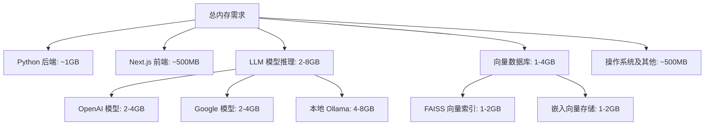

# 云服务部署指南

<cite>
**本文档中引用的文件**
- [docker-compose.yml](file://docker-compose.yml)
- [Dockerfile](file://Dockerfile)
- [README.md](file://README.md)
- [run.sh](file://run.sh)
- [package.json](file://package.json)
- [api/pyproject.toml](file://api/pyproject.toml)
- [api/config.py](file://api/config.py)
- [api/config/generator.json](file://api/config/generator.json)
- [api/config/embedder.json](file://api/config/embedder.json)
</cite>

## 目录
1. [简介](#简介)
2. [系统要求与资源规划](#系统要求与资源规划)
3. [云平台选择与实例配置](#云平台选择与实例配置)
4. [部署前准备](#部署前准备)
5. [云服务器环境搭建](#云服务器环境搭建)
6. [应用部署流程](#应用部署流程)
7. [Nginx 反向代理配置](#nginx-反向代理配置)
8. [SSL 证书配置](#ssl-证书配置)
9. [高可用性策略](#高可用性策略)
10. [监控与维护](#监控与维护)
11. [故障排除](#故障排除)

## 简介

DeepWiki 是一个基于人工智能的代码文档生成工具，能够自动分析 GitHub、GitLab 或 BitBucket 仓库并生成美观、交互式的维基文档。本指南将指导您在 AWS EC2、Google Cloud Platform 或其他 VPS 平台上部署 DeepWiki 应用程序。

DeepWiki 采用前后端分离架构：
- **前端**：基于 Next.js 的 React 应用，运行在 3000 端口
- **后端 API**：基于 FastAPI 的 Python 服务，运行在 8001 端口
- **数据存储**：使用本地持久化卷存储克隆的仓库、嵌入向量和缓存内容

## 系统要求与资源规划

### 最低资源配置

根据项目分析，DeepWiki 对资源的需求如下：

| 组件 | 最低配置 | 推荐配置 | 内存消耗说明 |
|------|----------|----------|--------------|
| CPU | 2 核心 | 4 核心 | 主要用于 LLM 推理和代码分析 |
| 内存 | 4GB | 8GB+ | 特别是向量数据库和 LLM 模型推理需要大量内存 |
| 存储 | 20GB SSD | 50GB+ SSD | 用于存储克隆的仓库和嵌入数据 |
| 网络 | 100Mbps | 1Gbps | 支持大规模代码仓库下载 |

### 内存消耗分析



**图表来源**
- [Dockerfile](file://Dockerfile#L7-L112)
- [api/config/embedder.json](file://api/config/embedder.json#L1-L34)

### 端口配置

DeepWiki 使用以下端口：
- **3000**: Next.js 前端应用
- **8001**: FastAPI 后端服务
- **11434**: Ollama 本地模型服务（可选）

**节来源**
- [docker-compose.yml](file://docker-compose.yml#L6-L8)
- [Dockerfile](file://Dockerfile#L80)

## 云平台选择与实例配置

### AWS EC2 实例推荐

#### t3.large 实例
- **vCPU**: 2 核心
- **内存**: 8GB
- **存储**: 50GB SSD
- **网络**: 高性能网络
- **价格**: 约 $0.096/小时

#### m5.xlarge 实例
- **vCPU**: 4 核心
- **内存**: 16GB
- **存储**: 100GB SSD
- **网络**: 高性能网络
- **价格**: 约 $0.184/小时

### Google Cloud Compute Engine 推荐

#### e2-standard-4 实例
- **vCPU**: 4 核心
- **内存**: 16GB
- **存储**: 100GB SSD
- **网络**: 标准网络
- **价格**: 约 $0.20/小时

#### n2-standard-4 实例
- **vCPU**: 4 核心
- **内存**: 16GB
- **存储**: 100GB SSD
- **网络**: 高性能网络
- **价格**: 约 $0.22/小时

### 安全组配置

在云平台上配置安全组规则以开放必要的端口：

| 协议 | 端口范围 | 来源 | 描述 |
|------|----------|------|------|
| TCP | 22 | 你的IP/网段 | SSH 远程访问 |
| TCP | 80 | 0.0.0.0/0 | HTTP 流量 |
| TCP | 443 | 0.0.0.0/0 | HTTPS 流量 |
| TCP | 3000 | 0.0.0.0/0 | 前端应用 |
| TCP | 8001 | 0.0.0.0/0 | API 服务 |
| TCP | 11434 | 0.0.0.0/0 | Ollama 服务（可选） |

## 部署前准备

### API 密钥获取

DeepWiki 支持多种 LLM 提供商，需要获取相应的 API 密钥：

#### Google AI Studio
1. 访问 [Google AI Studio](https://makersuite.google.com/app/apikey)
2. 创建新项目或使用现有项目
3. 获取 API 密钥

#### OpenAI Platform
1. 登录 [OpenAI Platform](https://platform.openai.com/api-keys)
2. 创建新的 API 密钥
3. 复制密钥值

#### OpenRouter
1. 注册 [OpenRouter](https://openrouter.ai/)
2. 获取 API 密钥
3. 添加到 `.env` 文件

#### Azure OpenAI
1. 在 Azure 门户创建 OpenAI 资源
2. 获取 API 密钥、终结点和版本号

### 环境变量配置

创建 `.env` 文件并配置以下环境变量：

```bash
# Google AI API 密钥
GOOGLE_API_KEY=your_google_api_key

# OpenAI API 密钥（可选）
OPENAI_API_KEY=your_openai_api_key

# OpenRouter API 密钥（可选）
OPENROUTER_API_KEY=your_openrouter_api_key

# Azure OpenAI 配置（可选）
AZURE_OPENAI_API_KEY=your_azure_openai_api_key
AZURE_OPENAI_ENDPOINT=your_azure_openai_endpoint
AZURE_OPENAI_VERSION=your_azure_openai_version

# Ollama 配置（可选）
OLLAMA_HOST=http://localhost:11434

# 嵌入器类型（可选：openai/google/ollama）
DEEPWIKI_EMBEDDER_TYPE=google

# 日志配置
LOG_LEVEL=INFO
LOG_FILE_PATH=api/logs/application.log

# 认证模式（可选）
DEEPWIKI_AUTH_MODE=false
DEEPWIKI_AUTH_CODE=your_secret_code
```

**节来源**
- [README.md](file://README.md#L35-L83)
- [api/config.py](file://api/config.py#L18-L47)

## 云服务器环境搭建

### SSH 连接到服务器

```bash
# 使用私钥连接
ssh -i your-key.pem ubuntu@your-server-ip

# 或使用用户名
ssh ubuntu@your-server-ip
```

### 更新系统包

```bash
# Ubuntu/Debian 系统
sudo apt update && sudo apt upgrade -y

# CentOS/RHEL 系统
sudo yum update -y
```

### 安装 Docker 和 Docker Compose

#### 安装 Docker

```bash
# 卸载旧版本（如果存在）
sudo apt remove docker docker-engine docker.io containerd runc || true

# 更新包索引
sudo apt update

# 安装必要依赖
sudo apt install -y ca-certificates curl gnupg

# 添加 Docker 官方 GPG 密钥
sudo install -m 0755 -d /etc/apt/keyrings
curl -fsSL https://download.docker.com/linux/ubuntu/gpg | sudo gpg --dearmor -o /etc/apt/keyrings/docker.gpg
sudo chmod a+r /etc/apt/keyrings/docker.gpg

# 添加 Docker 仓库
echo \
  "deb [arch=$(dpkg --print-architecture) signed-by=/etc/apt/keyrings/docker.gpg] https://download.docker.com/linux/ubuntu \
  $(. /etc/os-release && echo "$VERSION_CODENAME") stable" | \
  sudo tee /etc/apt/sources.list.d/docker.list > /dev/null

# 安装 Docker
sudo apt update
sudo apt install -y docker-ce docker-ce-cli containerd.io docker-buildx-plugin docker-compose-plugin
```

#### 验证 Docker 安装

```bash
# 检查 Docker 版本
docker --version

# 检查 Docker Compose 版本
docker compose version

# 测试 Docker
sudo docker run hello-world
```

### 克隆 DeepWiki 仓库

```bash
# 创建应用目录
mkdir -p ~/deepwiki
cd ~/deepwiki

# 克隆仓库
git clone https://github.com/AsyncFuncAI/deepwiki-open.git .
git checkout main

# 设置权限
chmod +x run.sh
```

### 配置环境变量

```bash
# 创建 .env 文件
cat > .env << EOF
GOOGLE_API_KEY=your_google_api_key
OPENAI_API_KEY=your_openai_api_key
DEEPWIKI_EMBEDDER_TYPE=google
PORT=8001
SERVER_BASE_URL=http://localhost:8001
NODE_ENV=production
EOF
```

**节来源**
- [README.md](file://README.md#L33-L55)
- [Dockerfile](file://Dockerfile#L83-L112)

## 应用部署流程

### 构建 Docker 镜像

```bash
# 构建镜像（可选，使用预构建镜像更快速）
docker build -t deepwiki-open .

# 或直接拉取官方镜像
docker pull ghcr.io/asyncfuncai/deepwiki-open:latest
```

### 启动服务

#### 方法一：使用 docker-compose（推荐）

```bash
# 启动服务（前台运行）
docker compose up

# 后台运行
docker compose up -d
```

#### 方法二：手动启动容器

```bash
# 创建数据卷挂载目录
mkdir -p ~/.adalflow

# 启动后端 API 服务
docker run -d \
  --name deepwiki-api \
  -p 8001:8001 \
  -e GOOGLE_API_KEY=$GOOGLE_API_KEY \
  -e OPENAI_API_KEY=$OPENAI_API_KEY \
  -e DEEPWIKI_EMBEDDER_TYPE=google \
  -v ~/.adalflow:/root/.adalflow \
  -v ./api/logs:/app/api/logs \
  -v $(pwd)/.env:/app/.env \
  --restart unless-stopped \
  ghcr.io/asyncfuncai/deepwiki-open:latest

# 启动前端服务
docker run -d \
  --name deepwiki-web \
  -p 3000:3000 \
  --link deepwiki-api:api \
  -e SERVER_BASE_URL=http://api:8001 \
  -v $(pwd)/.env:/app/.env \
  --restart unless-stopped \
  ghcr.io/asyncfuncai/deepwiki-open:latest
```

### 验证部署状态

```bash
# 查看容器状态
docker ps

# 查看容器日志
docker logs deepwiki-api
docker logs deepwiki-web

# 检查健康检查状态
docker inspect --format='{{json .State.Health}}' deepwiki-api
```

### 访问应用程序

在浏览器中访问：
- **前端界面**: `http://your-server-ip:3000`
- **API 状态**: `http://your-server-ip:8001/health`

**节来源**
- [docker-compose.yml](file://docker-compose.yml#L1-L30)
- [Dockerfile](file://Dockerfile#L83-L112)

## Nginx 反向代理配置

### 安装 Nginx

```bash
# Ubuntu/Debian
sudo apt update
sudo apt install nginx -y

# CentOS/RHEL
sudo yum install epel-release -y
sudo yum install nginx -y
```

### 配置 Nginx

创建 Nginx 配置文件：

```bash
# 备份默认配置
sudo cp /etc/nginx/sites-available/default /etc/nginx/sites-available/default.backup

# 创建新配置
sudo tee /etc/nginx/sites-available/deepwiki << EOF
upstream deepwiki_backend {
    server localhost:8001;
}

server {
    listen 80;
    server_name your-domain.com www.your-domain.com;
    
    # 重定向所有 HTTP 请求到 HTTPS
    return 301 https://\$server_name\$request_uri;
}

server {
    listen 443 ssl http2;
    server_name your-domain.com www.your-domain.com;
    
    # SSL 配置
    ssl_certificate /etc/letsencrypt/live/your-domain.com/fullchain.pem;
    ssl_certificate_key /etc/letsencrypt/live/your-domain.com/privkey.pem;
    include /etc/letsencrypt/options-ssl-nginx.conf;
    ssl_dhparam /etc/letsencrypt/ssl-dhparams.pem;
    
    # 安全头
    add_header X-Frame-Options DENY always;
    add_header X-Content-Type-Options nosniff always;
    add_header X-XSS-Protection "1; mode=block" always;
    add_header Referrer-Policy "strict-origin-when-cross-origin" always;
    add_header Content-Security-Policy "default-src 'self'; script-src 'self'; style-src 'self'; img-src 'self' data:; font-src 'self'; connect-src 'self' ws://localhost:3000; frame-ancestors 'none'" always;
    
    # 优化配置
    client_max_body_size 50M;
    client_body_buffer_size 128k;
    proxy_buffering off;
    proxy_request_buffering off;
    
    # 前端路由支持
    location / {
        proxy_pass http://localhost:3000;
        proxy_http_version 1.1;
        proxy_set_header Upgrade \$http_upgrade;
        proxy_set_header Connection 'upgrade';
        proxy_set_header Host \$host;
        proxy_set_header X-Real-IP \$remote_addr;
        proxy_set_header X-Forwarded-For \$proxy_add_x_forwarded_for;
        proxy_set_header X-Forwarded-Proto \$scheme;
        proxy_cache_bypass \$http_upgrade;
    }
    
    # API 路由
    location /api/ {
        proxy_pass http://deepwiki_backend/;
        proxy_http_version 1.1;
        proxy_set_header Upgrade \$http_upgrade;
        proxy_set_header Connection 'upgrade';
        proxy_set_header Host \$host;
        proxy_set_header X-Real-IP \$remote_addr;
        proxy_set_header X-Forwarded-For \$proxy_add_x_forwarded_for;
        proxy_set_header X-Forwarded-Proto \$scheme;
        proxy_cache_bypass \$http_upgrade;
        
        # WebSocket 支持
        proxy_set_header X-Forwarded-Host \$server_name;
    }
    
    # 静态文件
    location /static/ {
        expires 1y;
        add_header Cache-Control "public";
        try_files \$uri @fallback;
    }
    
    location @fallback {
        proxy_pass http://localhost:3000;
    }
    
    # 错误页面
    error_page 500 502 503 504 /50x.html;
    location = /50x.html {
        root /usr/share/nginx/html;
    }
}
EOF
```

### 启用配置并测试

```bash
# 启用站点
sudo ln -sf /etc/nginx/sites-available/deepwiki /etc/nginx/sites-enabled/

# 测试 Nginx 配置
sudo nginx -t

# 重新加载 Nginx
sudo systemctl reload nginx
```

### 配置防火墙

```bash
# 允许 HTTP 和 HTTPS 流量
sudo ufw allow 'Nginx Full'

# 或者使用 iptables
sudo iptables -A INPUT -p tcp --dport 80 -j ACCEPT
sudo iptables -A INPUT -p tcp --dport 443 -j ACCEPT
```

**节来源**
- [docker-compose.yml](file://docker-compose.yml#L6-L8)

## SSL 证书配置

### 安装 Certbot

```bash
# Ubuntu/Debian
sudo apt install certbot python3-certbot-nginx -y

# CentOS/RHEL
sudo yum install certbot python3-certbot-nginx -y
```

### 获取 SSL 证书

```bash
# 获取证书（会自动配置 Nginx）
sudo certbot --nginx -d your-domain.com -d www.your-domain.com

# 或手动配置
sudo certbot certonly --nginx -d your-domain.com -d www.your-domain.com
```

### 自动续期配置

Certbot 会自动设置每日 cron 任务来续期证书：

```bash
# 测试续期
sudo certbot renew --dry-run

# 查看续期计划
sudo crontab -l
```

### 手动续期（可选）

```bash
# 手动续期
sudo certbot renew

# 重新加载 Nginx
sudo systemctl reload nginx
```

### 验证 SSL 配置

使用 [SSL Labs](https://www.ssllabs.com/ssltest/) 或类似工具验证 SSL 配置。

## 高可用性策略

### Docker 重启策略

DeepWiki 使用 `unless-stopped` 重启策略确保服务稳定性：

```yaml
# docker-compose.yml 中的配置
services:
  deepwiki:
    restart: unless-stopped
```

### 数据持久化

```bash
# 创建数据备份脚本
cat > ~/backup-data.sh << 'EOF'
#!/bin/bash
BACKUP_DIR="$HOME/backups"
DATE=$(date +%Y%m%d_%H%M%S)

# 创建备份目录
mkdir -p "$BACKUP_DIR"

# 备份 .adalflow 目录
tar -czf "$BACKUP_DIR/adalflow_backup_$DATE.tar.gz" ~/.adalflow

# 备份日志文件
tar -czf "$BACKUP_DIR/logs_backup_$DATE.tar.gz" ./api/logs

echo "备份完成: $BACKUP_DIR"
EOF

chmod +x ~/backup-data.sh
```

### 监控配置

#### Prometheus + Grafana 监控

```bash
# 创建监控 docker-compose.yml
cat > ~/monitoring/docker-compose.yml << 'EOF'
version: '3.8'
services:
  prometheus:
    image: prom/prometheus:latest
    ports:
      - "9090:9090"
    volumes:
      - ./prometheus.yml:/etc/prometheus/prometheus.yml
      - prometheus_data:/prometheus
    command:
      - '--config.file=/etc/prometheus/prometheus.yml'
      - '--storage.tsdb.path=/prometheus'
      - '--web.console.libraries=/etc/prometheus/console_libraries'
      - '--web.console.templates=/etc/prometheus/consoles'
      - '--storage.tsdb.retention.time=200h'
      - '--web.enable-lifecycle'

  grafana:
    image: grafana/grafana:latest
    ports:
      - "3001:3001"
    volumes:
      - grafana_data:/var/lib/grafana
    environment:
      - GF_SECURITY_ADMIN_PASSWORD=admin

volumes:
  prometheus_data:
  grafana_data:
EOF
```

#### 监控指标

主要监控指标包括：
- **CPU 使用率**: 监控 LLM 推理负载
- **内存使用率**: 确保向量数据库不溢出
- **磁盘空间**: 监控仓库克隆和日志增长
- **网络带宽**: 监控代码仓库下载
- **容器健康状态**: 监控服务可用性

### 负载均衡（可选）

对于生产环境，可以配置负载均衡：

```bash
# HAProxy 配置
cat > /etc/haproxy/haproxy.cfg << EOF
global
    daemon
    maxconn 4096
    log stdout local0

defaults
    mode http
    timeout connect 5000ms
    timeout client 50000ms
    timeout server 50000ms

frontend http-in
    bind *:80
    default_backend deepwiki-backend

backend deepwiki-backend
    balance roundrobin
    server server1 localhost:3000 check
    server server2 localhost:3001 check
EOF
```

## 监控与维护

### 日志管理

#### 配置日志轮转

```bash
# 创建日志轮转配置
sudo tee /etc/logrotate.d/deepwiki << EOF
/var/log/deepwiki/*.log {
    daily
    missingok
    rotate 30
    compress
    delaycompress
    notifempty
    copytruncate
}
EOF
```

#### 集中化日志收集

```bash
# 使用 Fluentd 收集日志
docker run -d \
  --name fluentd \
  -p 24224:24224 \
  -v $(pwd)/fluentd.conf:/fluentd/etc/fluent.conf \
  -v /var/log:/var/log \
  fluent/fluentd:v1.15-1

# fluentd.conf 示例
cat > fluentd.conf << EOF
<source>
  @type tail
  path /var/log/deepwiki/*.log
  pos_file /var/log/fluentd.log.pos
  tag deepwiki.*
  format multiline
  format_firstline /\d{4}-\d{2}-\d{2}/
  format1 /^(?<time>\d{4}-\d{2}-\d{2} \d{2}:\d{2}:\d{2}) \[(?<level>\w+)\] (?<message>.*)/
</source>

<match deepwiki.**>
  @type elasticsearch
  host elasticsearch-server
  port 9200
  index_name deepwiki-logs
</match>
EOF
```

### 性能优化

#### 内存优化

```bash
# 检查内存使用情况
docker stats

# 清理未使用的容器和镜像
docker system prune -f
docker volume prune -f
```

#### 存储优化

```bash
# 清理旧的日志文件
find ~/.adalflow -name "*.log" -mtime +7 -delete

# 压缩历史数据
tar -czf ~/.adalflow/history_$(date +%Y%m).tar.gz ~/.adalflow/history/
rm -rf ~/.adalflow/history/
```

### 备份策略

#### 自动备份脚本

```bash
#!/bin/bash
# deepwiki-backup.sh

BACKUP_DIR="$HOME/backups"
DATE=$(date +%Y%m%d_%H%M%S)
RETENTION_DAYS=30

# 创建备份目录
mkdir -p "$BACKUP_DIR"

# 备份数据库和配置
docker exec deepwiki-db pg_dump -U postgres deepwiki > "$BACKUP_DIR/db_backup_$DATE.sql"

# 备份应用数据
tar -czf "$BACKUP_DIR/app_data_$DATE.tar.gz" ~/.adalflow

# 备份配置文件
cp .env "$BACKUP_DIR/env_$DATE"

# 清理过期备份
find "$BACKUP_DIR" -name "*.tar.gz" -mtime +$RETENTION_DAYS -delete
find "$BACKUP_DIR" -name "*.sql" -mtime +$RETENTION_DAYS -delete

echo "备份完成: $BACKUP_DIR"
```

## 故障排除

### 常见问题及解决方案

#### 1. 端口冲突

```bash
# 检查端口占用
sudo netstat -tulpn | grep :3000
sudo netstat -tulpn | grep :8001

# 停止占用端口的进程
sudo kill -9 $(sudo lsof -t -i:3000)
sudo kill -9 $(sudo lsof -t -i:8001)
```

#### 2. 内存不足

```bash
# 检查内存使用
free -h

# 查看容器内存限制
docker stats --no-stream

# 调整容器内存限制
docker update --memory 6g deepwiki-api
```

#### 3. API 密钥错误

```bash
# 检查环境变量
docker exec deepwiki-api printenv | grep -E "(GOOGLE|OPENAI)_API_KEY"

# 重新设置环境变量
docker exec deepwiki-api bash -c 'export GOOGLE_API_KEY=your_new_key'
```

#### 4. 网络连接问题

```bash
# 测试外部连接
docker exec deepwiki-api curl -I https://api.openai.com

# 检查 DNS 解析
docker exec deepwiki-api nslookup api.openai.com

# 检查防火墙规则
sudo iptables -L
```

#### 5. 日志分析

```bash
# 查看容器日志
docker logs deepwiki-api --tail 100

# 实时查看日志
docker logs -f deepwiki-api

# 检查健康检查状态
docker inspect --format='{{json .State.Health}}' deepwiki-api
```

### 性能调优

#### 1. LLM 模型选择

根据资源情况选择合适的模型：

```bash
# 小型模型（适合资源有限的环境）
export DEEPWIKI_EMBEDDER_TYPE=ollama
export MODEL=qwen3:1.7b

# 中型模型（平衡性能和成本）
export DEEPWIKI_EMBEDDER_TYPE=google
export MODEL=gemini-2.5-flash-lite

# 大型模型（高性能但资源消耗大）
export DEEPWIKI_EMBEDDER_TYPE=google
export MODEL=gemini-2.5-pro
```

#### 2. 向量数据库优化

```bash
# 调整向量检索参数
cat > api/config/embedder.json << EOF
{
  "embedder": {
    "client_class": "OpenAIClient",
    "batch_size": 250,
    "model_kwargs": {
      "model": "text-embedding-3-small",
      "dimensions": 256,
      "encoding_format": "float"
    }
  },
  "retriever": {
    "top_k": 10
  }
}
EOF
```

#### 3. 缓存策略

```bash
# 清理缓存
docker exec deepwiki-api rm -rf /root/.adalflow/wikicache/*

# 调整缓存大小限制
export MAX_CACHE_SIZE=10GB
```

### 监控告警

#### 设置监控告警

```bash
# 创建监控脚本
cat > ~/monitor.sh << 'EOF'
#!/bin/bash

# 内存使用率告警（超过 80%）
MEMORY_USAGE=$(docker stats --no-stream --format "table {{.MemUsage}}" deepwiki-api | head -1 | awk '{split($1,a,"/"); split(a[1],b," "); print b[1]}')
MEMORY_LIMIT=$(docker stats --no-stream --format "table {{.MemLimit}}" deepwiki-api | head -1 | awk '{split($1,a,"/"); split(a[2],b," "); print b[1]}')

if (( $(echo "$MEMORY_USAGE > 0.8 * $MEMORY_LIMIT" | bc -l) )); then
    echo "警告: DeepWiki 内存使用率过高: $MEMORY_USAGE/$MEMORY_LIMIT" | mail -s "DeepWiki 内存告警" admin@example.com
fi

# 磁盘使用率告警（超过 90%）
DISK_USAGE=$(df -h ~/.adalflow | awk 'NR==2 {print $5}' | sed 's/%//')
if [ $DISK_USAGE -gt 90 ]; then
    echo "警告: DeepWiki 磁盘使用率过高: ${DISK_USAGE}%" | mail -s "DeepWiki 磁盘告警" admin@example.com
fi
EOF

chmod +x ~/monitor.sh
```

通过本指南，您应该能够在云平台上成功部署和运行 DeepWiki 应用程序。建议定期监控系统性能，并根据实际使用情况进行相应的优化调整。