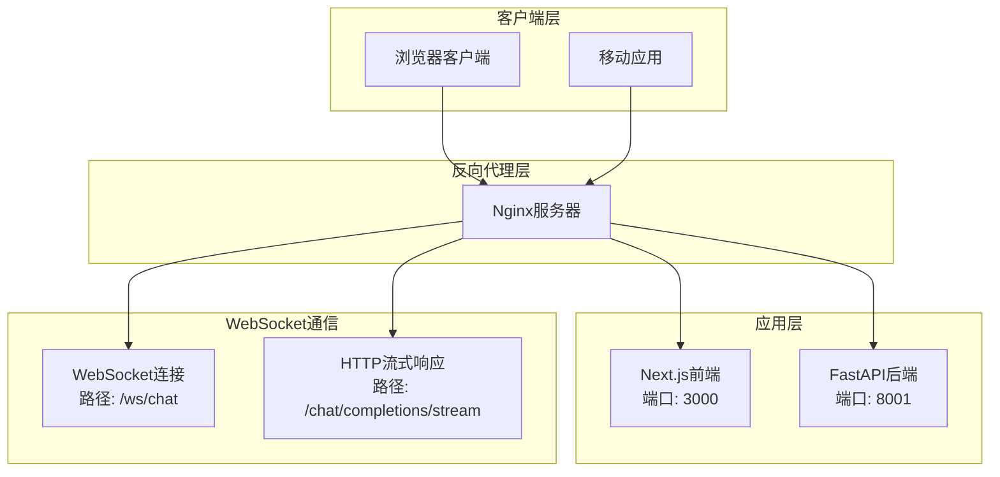

# 反向代理与SSL安全配置指南

<cite>
**本文档中引用的文件**
- [README.md](file://README.md)
- [docker-compose.yml](file://docker-compose.yml)
- [Dockerfile](file://Dockerfile)
- [run.sh](file://run.sh)
- [package.json](file://package.json)
- [api/main.py](file://api/main.py)
- [api/api.py](file://api/api.py)
- [src/app/api/chat/stream/route.ts](file://src/app/api/chat/stream/route.ts)
- [src/utils/websocketClient.ts](file://src/utils/websocketClient.ts)
- [src/app/[owner]/[repo]/page.tsx](file://src/app/[owner]/[repo]/page.tsx)
</cite>

## 目录
1. [简介](#简介)
2. [项目架构概述](#项目架构概述)
3. [Nginx安装与基础配置](#nginx安装与基础配置)
4. [反向代理配置详解](#反向代理配置详解)
5. [SSL证书配置](#ssl证书配置)
6. [高级优化配置](#高级优化配置)
7. [环境变量配置](#环境变量配置)
8. [故障排除指南](#故障排除指南)
9. [最佳实践建议](#最佳实践建议)

## 简介

本指南为DeepWiki项目提供完整的反向代理与SSL安全配置解决方案。DeepWiki是一个基于Next.js前端和FastAPI后端的AI驱动知识库生成系统，支持实时聊天、WebSocket通信和多种AI模型提供商。通过正确的反向代理和SSL配置，您可以实现生产级别的安全部署，确保数据传输加密和高性能访问。

## 项目架构概述

DeepWiki采用前后端分离的微服务架构，包含以下核心组件：



**图表来源**
- [docker-compose.yml](file://docker-compose.yml#L1-L30)
- [Dockerfile](file://Dockerfile#L79-L81)

### 核心端口配置

| 组件 | 默认端口 | 用途 | 协议 |
|------|----------|------|------|
| 前端应用 | 3000 | Next.js Web界面 | HTTP/HTTPS |
| API服务 | 8001 | FastAPI后端接口 | HTTP/HTTPS |
| WebSocket | 8001 | 实时聊天通信 | WebSocket |

**章节来源**
- [docker-compose.yml](file://docker-compose.yml#L6-L8)
- [Dockerfile](file://Dockerfile#L79-L81)

## Nginx安装与基础配置

### 系统要求

- Ubuntu 20.04+/Debian 10+/CentOS 7+
- 至少2GB RAM
- 1GB可用磁盘空间
- 域名指向服务器IP地址

### 安装Nginx

```bash
# 更新包索引
sudo apt update

# 安装Nginx
sudo apt install nginx -y

# 启动并启用Nginx服务
sudo systemctl start nginx
sudo systemctl enable nginx

# 检查Nginx状态
sudo systemctl status nginx
```

### 基础配置结构

创建Nginx配置目录和主配置文件：

```bash
# 创建配置目录
sudo mkdir -p /etc/nginx/conf.d

# 创建主配置文件
sudo nano /etc/nginx/nginx.conf
```

基础nginx.conf配置：

```nginx
user www-data;
worker_processes auto;
pid /run/nginx.pid;

events {
    worker_connections 1024;
    use epoll;
    multi_accept on;
}

http {
    # 基本配置
    sendfile on;
    tcp_nopush on;
    tcp_nodelay on;
    keepalive_timeout 65;
    types_hash_max_size 2048;
    
    # MIME类型
    include /etc/nginx/mime.types;
    default_type application/octet-stream;
    
    # 日志格式
    log_format main '$remote_addr - $remote_user [$time_local] "$request" '
                    '$status $body_bytes_sent "$http_referer" '
                    '"$http_user_agent" "$http_x_forwarded_for"';
    
    access_log /var/log/nginx/access.log main;
    error_log /var/log/nginx/error.log;
    
    # 包含子配置文件
    include /etc/nginx/conf.d/*.conf;
}
```

## 反向代理配置详解

### 基础反向代理配置

创建DeepWiki的专用配置文件：

```bash
sudo nano /etc/nginx/conf.d/deepwiki.conf
```

完整的基础反向代理配置：

```nginx
upstream deepwiki_frontend {
    server 127.0.0.1:3000;
    keepalive 32;
}

upstream deepwiki_backend {
    server 127.0.0.1:8001;
    keepalive 32;
}

server {
    listen 80;
    server_name your-domain.com www.your-domain.com;
    return 301 https://$server_name$request_uri;
}

server {
    listen 443 ssl http2;
    server_name your-domain.com www.your-domain.com;
    
    # SSL配置
    ssl_certificate /etc/letsencrypt/live/your-domain.com/fullchain.pem;
    ssl_certificate_key /etc/letsencrypt/live/your-domain.com/privkey.pem;
    include /etc/letsencrypt/options-ssl-nginx.conf;
    ssl_dhparam /etc/letsencrypt/ssl-dhparams.pem;
    
    # 安全头
    add_header X-Frame-Options DENY always;
    add_header X-Content-Type-Options nosniff always;
    add_header X-XSS-Protection "1; mode=block" always;
    add_header Referrer-Policy "strict-origin-when-cross-origin" always;
    add_header Permissions-Policy "camera=(), microphone=(), geolocation=()" always;
    
    # HSTS配置
    add_header Strict-Transport-Security "max-age=31536000; includeSubDomains; preload" always;
    
    # OCSP Stapling
    ssl_stapling on;
    ssl_stapling_verify on;
    ssl_trusted_certificate /etc/letsencrypt/live/your-domain.com/chain.pem;
    
    # 缓存配置
    location / {
        proxy_pass http://deepwiki_frontend;
        proxy_http_version 1.1;
        proxy_set_header Upgrade $http_upgrade;
        proxy_set_header Connection "upgrade";
        proxy_set_header Host $host;
        proxy_set_header X-Real-IP $remote_addr;
        proxy_set_header X-Forwarded-For $proxy_add_x_forwarded_for;
        proxy_set_header X-Forwarded-Proto $scheme;
        
        # 缓存控制
        proxy_cache_bypass $http_upgrade;
        proxy_cache_valid 200 1d;
        proxy_cache_use_stale error timeout updating http_500 http_502 http_503 http_504;
    }
    
    # API端点配置
    location /api/ {
        proxy_pass http://deepwiki_backend/;
        proxy_http_version 1.1;
        proxy_set_header Upgrade $http_upgrade;
        proxy_set_header Connection "upgrade";
        proxy_set_header Host $host;
        proxy_set_header X-Real-IP $remote_addr;
        proxy_set_header X-Forwarded-For $proxy_add_x_forwarded_for;
        proxy_set_header X-Forwarded-Proto $scheme;
        
        # WebSocket支持
        proxy_set_header X-Forwarded-Host $server_name;
        
        # 缓存控制
        proxy_cache_bypass 1;
    }
    
    # 静态资源缓存
    location ~* \.(jpg|jpeg|png|gif|ico|css|js|woff|woff2)$ {
        proxy_pass http://deepwiki_frontend;
        proxy_http_version 1.1;
        proxy_set_header Host $host;
        proxy_set_header X-Real-IP $remote_addr;
        proxy_set_header X-Forwarded-For $proxy_add_x_forwarded_for;
        proxy_set_header X-Forwarded-Proto $scheme;
        
        expires 1y;
        add_header Cache-Control "public, immutable";
        add_header Vary Accept-Encoding;
    }
    
    # WebSocket配置
    location /ws/chat {
        proxy_pass http://deepwiki_backend/ws/chat;
        proxy_http_version 1.1;
        proxy_set_header Upgrade $http_upgrade;
        proxy_set_header Connection "Upgrade";
        proxy_set_header Host $host;
        proxy_set_header X-Real-IP $remote_addr;
        proxy_set_header X-Forwarded-For $proxy_add_x_forwarded_for;
        proxy_set_header X-Forwarded-Proto $scheme;
        
        # WebSocket超时配置
        proxy_read_timeout 86400s;
        proxy_send_timeout 86400s;
        proxy_connect_timeout 86400s;
    }
    
    # 健康检查
    location /health {
        proxy_pass http://deepwiki_backend/health;
        proxy_http_version 1.1;
        proxy_set_header Host $host;
        proxy_set_header X-Real-IP $remote_addr;
        proxy_set_header X-Forwarded-For $proxy_add_x_forwarded_for;
        proxy_set_header X-Forwarded-Proto $scheme;
    }
    
    # 错误页面
    error_page 500 502 503 504 /50x.html;
    location = /50x.html {
        root /usr/share/nginx/html;
    }
}
```

### 关键配置说明

#### 1. 上游服务器配置
```nginx
upstream deepwiki_frontend {
    server 127.0.0.1:3000;
    keepalive 32;
}

upstream deepwiki_backend {
    server 127.0.0.1:8001;
    keepalive 32;
}
```
- 使用keepalive连接池提高性能
- 支持多个上游服务器实现负载均衡

#### 2. WebSocket支持配置
```nginx
location /ws/chat {
    proxy_pass http://deepwiki_backend/ws/chat;
    proxy_http_version 1.1;
    proxy_set_header Upgrade $http_upgrade;
    proxy_set_header Connection "Upgrade";
    proxy_read_timeout 86400s;
    proxy_send_timeout 86400s;
}
```
- 特殊处理WebSocket升级请求
- 设置长时间超时避免连接中断

#### 3. 静态资源优化
```nginx
location ~* \.(jpg|jpeg|png|gif|ico|css|js|woff|woff2)$ {
    expires 1y;
    add_header Cache-Control "public, immutable";
}
```
- 长期缓存静态资源
- 减少带宽使用和服务器负载

**章节来源**
- [src/utils/websocketClient.ts](file://src/utils/websocketClient.ts#L9-L15)
- [src/app/api/chat/stream/route.ts](file://src/app/api/chat/stream/route.ts#L18-L28)

## SSL证书配置

### 使用Certbot自动获取Let's Encrypt证书

#### 安装Certbot

```bash
# 安装Certbot和Nginx插件
sudo apt install certbot python3-certbot-nginx -y

# 获取SSL证书
sudo certbot --nginx -d your-domain.com -d www.your-domain.com
```

#### 自动续期配置

Certbot会自动配置cron任务进行证书续期：

```bash
# 检查续期计划
sudo certbot renew --dry-run
```

#### 手动配置续期脚本

```bash
#!/bin/bash
# /etc/letsencrypt/renewal-hooks/deploy/deepwiki-restart.sh

# 重启Nginx应用新证书
sudo systemctl reload nginx

# 重启应用服务（可选）
# sudo systemctl restart deepwiki-app
```

### SSL配置优化

#### 强化SSL配置

```nginx
# SSL参数优化
ssl_protocols TLSv1.2 TLSv1.3;
ssl_ciphers ECDHE-RSA-AES128-GCM-SHA256:ECDHE-RSA-AES256-GCM-SHA384:ECDHE-RSA-AES128-SHA256:ECDHE-RSA-AES256-SHA384;
ssl_prefer_server_ciphers off;
ssl_session_cache shared:SSL:10m;
ssl_session_timeout 10m;
ssl_ecdh_curve prime256v1;
```

#### HSTS预加载配置

```nginx
# HSTS配置（生产环境）
add_header Strict-Transport-Security "max-age=31536000; includeSubDomains; preload" always;

# OCSP Stapling配置
ssl_stapling on;
ssl_stapling_verify on;
ssl_trusted_certificate /etc/letsencrypt/live/your-domain.com/chain.pem;
```

**章节来源**
- [README.md](file://README.md#L615-L652)

## 高级优化配置

### Gzip压缩配置

```nginx
# Gzip压缩配置
gzip on;
gzip_vary on;
gzip_min_length 1024;
gzip_comp_level 6;
gzip_types
    text/plain
    text/css
    text/xml
    text/javascript
    application/javascript
    application/x-javascript
    application/json
    application/xml+rss
    application/atom+xml
    image/svg+xml;
```

### 缓存策略配置

```nginx
# 浏览器缓存配置
location ~* \.(js|css|png|jpg|jpeg|gif|ico|svg|woff|woff2|ttf|eot)$ {
    expires 1y;
    add_header Cache-Control "public, immutable";
    add_header Vary Accept-Encoding;
    
    # ETag支持
    etag on;
}

# 动态内容缓存
location /api/ {
    proxy_cache api_cache;
    proxy_cache_valid 200 1h;
    proxy_cache_use_stale error timeout updating http_500 http_502 http_503 http_504;
    add_header X-Cache-Status $upstream_cache_status;
}
```

### 性能监控配置

```nginx
# 请求跟踪
map $request_uri $request_tag {
    ~*/api/* api_request;
    ~*/ws/* websocket_request;
    default general_request;
}

log_format performance '$remote_addr - $remote_user [$time_local] '
                     '"$request" $status $body_bytes_sent '
                     '"$http_referer" "$http_user_agent" '
                     'rt=$request_time uct="$upstream_connect_time" '
                     'uht="$upstream_header_time" urt="$upstream_response_time" '
                     'tag=$request_tag';

access_log /var/log/nginx/performance.log performance;
```

### 安全增强配置

```nginx
# IP限制
limit_req_zone $binary_remote_addr zone=api_limit:10m rate=10r/s;
limit_req_zone $binary_remote_addr zone=login_limit:10m rate=5r/m;

server {
    # API速率限制
    location /api/ {
        limit_req zone=api_limit burst=20 nodelay;
        limit_conn api_conn 10;
    }
    
    # 登录接口限制
    location /api/auth/ {
        limit_req zone=login_limit burst=5 nodelay;
    }
    
    # 文件上传大小限制
    client_max_body_size 50M;
    
    # 防止目录遍历
    location ~ /\. {
        deny all;
        return 404;
    }
}
```

## 环境变量配置

### SERVER_BASE_URL环境变量

SERVER_BASE_URL是DeepWiki项目中的关键环境变量，用于配置前端与后端API之间的通信地址。

#### 配置位置

```bash
# Docker环境变量配置
# 在docker-compose.yml中设置
environment:
  - SERVER_BASE_URL=https://your-domain.com:8001

# 或在.env文件中设置
echo "SERVER_BASE_URL=https://your-domain.com:8001" >> .env
```

#### 环境变量解析逻辑

```javascript
// 前端路由中的SERVER_BASE_URL使用
const TARGET_SERVER_BASE_URL = process.env.SERVER_BASE_URL || 'http://localhost:8001';
```

#### 不同部署场景的配置

| 部署环境 | SERVER_BASE_URL值 | 说明 |
|----------|-------------------|------|
| 开发环境 | `http://localhost:8001` | 本地开发调试 |
| Docker环境 | `http://localhost:8001` | 容器内部通信 |
| 生产环境 | `https://your-domain.com:8001` | HTTPS生产环境 |
| 反向代理环境 | `https://your-domain.com:8001` | 通过Nginx代理 |

### 其他重要环境变量

```bash
# API密钥配置
export OPENAI_API_KEY=your_openai_api_key
export GOOGLE_API_KEY=your_google_api_key

# 端口配置
export PORT=8001

# 认证配置
export DEEPWIKI_AUTH_MODE=false
export DEEPWIKI_AUTH_CODE=your_secret_code

# 日志配置
export LOG_LEVEL=INFO
export LOG_FILE_PATH=/var/log/deepwiki/application.log
```

**章节来源**
- [src/app/api/chat/stream/route.ts](file://src/app/api/chat/stream/route.ts#L4-L5)
- [api/main.py](file://api/main.py#L65-L66)

## 故障排除指南

### 常见问题诊断

#### 1. WebSocket连接失败

**症状**: 实时聊天功能无法正常工作

**诊断步骤**:
```bash
# 检查Nginx错误日志
sudo tail -f /var/log/nginx/error.log

# 检查WebSocket连接
curl -I -H "Connection: Upgrade" -H "Upgrade: websocket" https://your-domain.com/ws/chat

# 检查后端服务状态
curl http://localhost:8001/health
```

**解决方案**:
```nginx
# 确保WebSocket配置正确
location /ws/chat {
    proxy_pass http://deepwiki_backend/ws/chat;
    proxy_http_version 1.1;
    proxy_set_header Upgrade $http_upgrade;
    proxy_set_header Connection "Upgrade";
    proxy_read_timeout 86400s;
}
```

#### 2. SSL证书问题

**症状**: HTTPS连接失败或证书警告

**诊断命令**:
```bash
# 检查证书有效性
openssl s_client -connect your-domain.com:443 -servername your-domain.com

# 检查证书链
certbot --test-cert --nginx -d your-domain.com
```

**解决方案**:
```bash
# 重新获取证书
sudo certbot --nginx -d your-domain.com -d www.your-domain.com

# 手动测试续期
sudo certbot renew --dry-run
```

#### 3. 反向代理配置错误

**症状**: 页面显示空白或404错误

**诊断步骤**:
```bash
# 检查Nginx配置语法
sudo nginx -t

# 查看配置文件
sudo cat /etc/nginx/conf.d/deepwiki.conf

# 检查上游服务器状态
curl http://localhost:3000
curl http://localhost:8001
```

### 性能优化建议

#### 1. 连接池优化

```nginx
upstream deepwiki_backend {
    server 127.0.0.1:8001 weight=1 max_fails=3 fail_timeout=30s;
    keepalive 64;
}

server {
    # 连接池配置
    keepalive_requests 1000;
    keepalive_timeout 60s;
}
```

#### 2. 缓存优化

```nginx
# Redis缓存配置（需要安装nginx-module-http_redis）
location /api/cache/ {
    redis_pass redis://127.0.0.1:6379;
    redis_connect_timeout 1s;
    redis_send_timeout 1s;
    redis_read_timeout 1s;
}
```

#### 3. 压缩优化

```nginx
# 更高效的压缩配置
gzip on;
gzip_vary on;
gzip_min_length 1024;
gzip_proxied any;
gzip_comp_level 6;
gzip_types
    text/plain
    text/css
    text/xml
    text/javascript
    application/javascript
    application/x-javascript
    application/json
    application/xml
    application/rss+xml
    application/atom+xml
    font/opentype
    image/svg+xml;
```

**章节来源**
- [src/app/[owner]/[repo]/page.tsx](file://src/app/[owner]/[repo]/page.tsx#L584-L619)

## 最佳实践建议

### 安全配置最佳实践

#### 1. 网络安全

```nginx
# 仅允许必要的端口
iptables -A INPUT -p tcp --dport 80 -j ACCEPT
iptables -A INPUT -p tcp --dport 443 -j ACCEPT
iptables -A INPUT -p tcp --dport 22 -j DROP

# 防火墙配置
ufw allow 80/tcp
ufw allow 443/tcp
ufw deny 22/tcp  # 使用SSH密钥认证
ufw enable
```

#### 2. 应用安全

```nginx
# 移除敏感信息
server_tokens off;
more_clear_headers 'Server';

# 请求限制
limit_req_zone $binary_remote_addr zone=one:10m rate=10r/s;
limit_req zone=one burst=20 nodelay;

# 文件扩展名过滤
location ~* \.(php|jsp|cgi|pl|py|asp|aspx|sh|bat)$ {
    deny all;
}
```

#### 3. 监控和日志

```nginx
# 结构化日志
log_format json_combined escape=json
  '{'
    '"timestamp": "$time_iso8601",'
    '"remote_addr": "$remote_addr",'
    '"request_method": "$request_method",'
    '"request_uri": "$request_uri",'
    '"status": "$status",'
    '"body_bytes_sent": "$body_bytes_sent",'
    '"request_time": "$request_time",'
    '"http_referrer": "$http_referer",'
    '"http_user_agent": "$http_user_agent"'
  '}';

access_log /var/log/nginx/access.log json_combined;
```

### 部署自动化

#### 1. CI/CD集成

```yaml
# .github/workflows/deploy.yml
name: Deploy DeepWiki

on:
  push:
    branches: [ main ]

jobs:
  deploy:
    runs-on: ubuntu-latest
    steps:
    - name: Deploy to server
      run: |
        ssh user@your-server "
        cd /opt/deepwiki
        git pull
        docker-compose down
        docker-compose up -d
        sudo nginx -t && sudo systemctl reload nginx
        "
```

#### 2. 健康检查脚本

```bash
#!/bin/bash
# /usr/local/bin/deepwiki-health-check.sh

set -e

# 检查Nginx
if ! pgrep -f nginx > /dev/null; then
    echo "ERROR: Nginx not running"
    exit 1
fi

# 检查后端服务
if ! curl -f http://localhost:8001/health > /dev/null; then
    echo "ERROR: Backend service unhealthy"
    exit 1
fi

# 检查前端服务
if ! curl -f http://localhost:3000 > /dev/null; then
    echo "ERROR: Frontend service unhealthy"
    exit 1
fi

echo "SUCCESS: All services healthy"
```

### 备份和恢复

#### 1. 配置备份

```bash
#!/bin/bash
# /usr/local/bin/backup-deepwiki.sh

BACKUP_DIR="/backup/deepwiki/$(date +%Y%m%d_%H%M%S)"
mkdir -p $BACKUP_DIR

# 备份配置文件
cp -r /etc/nginx/conf.d/deepwiki.conf $BACKUP_DIR/
cp -r /etc/letsencrypt/live/ $BACKUP_DIR/

# 备份数据库
docker exec deepwiki-db pg_dump -U postgres deepwiki > $BACKUP_DIR/db_backup.sql

echo "Backup completed: $BACKUP_DIR"
```

#### 2. 自动化监控

```bash
#!/bin/bash
# /usr/local/bin/monitor-deepwiki.sh

ALERT_EMAIL="admin@example.com"

# 检查服务状态
check_service() {
    if ! systemctl is-active --quiet $1; then
        echo "Service $1 is not running" | mail -s "DeepWiki Alert" $ALERT_EMAIL
    fi
}

check_service nginx
check_service docker
```

通过遵循本指南中的配置和最佳实践，您可以成功部署一个安全、高效且可扩展的DeepWiki实例。定期更新证书、监控系统性能并保持配置文件的最新状态是确保系统长期稳定运行的关键。