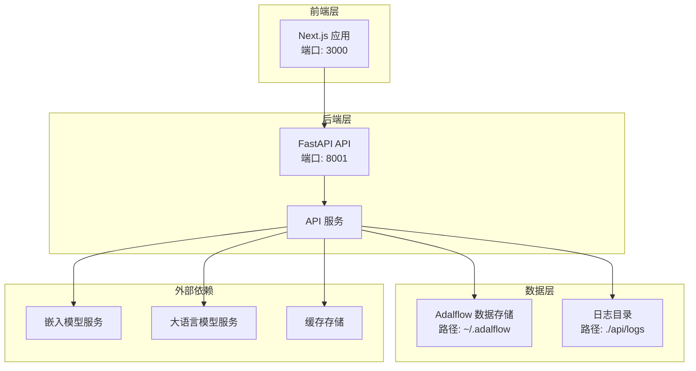
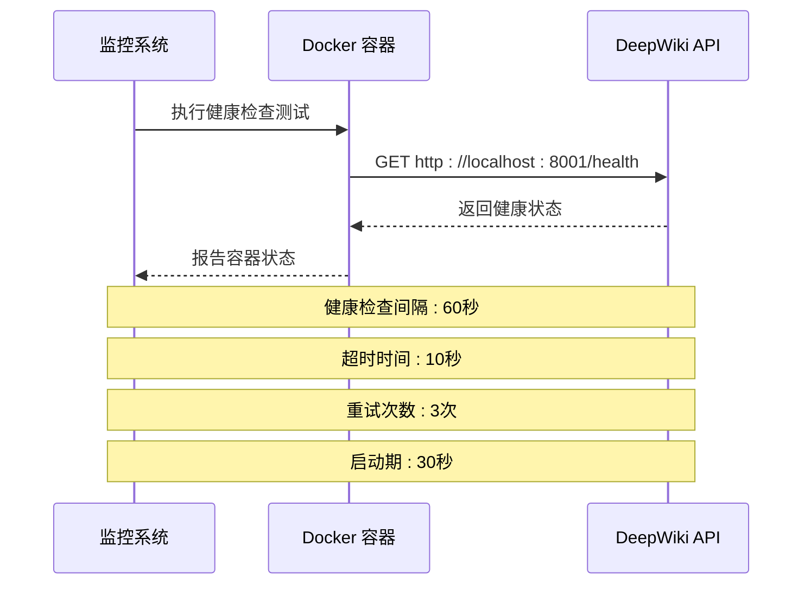
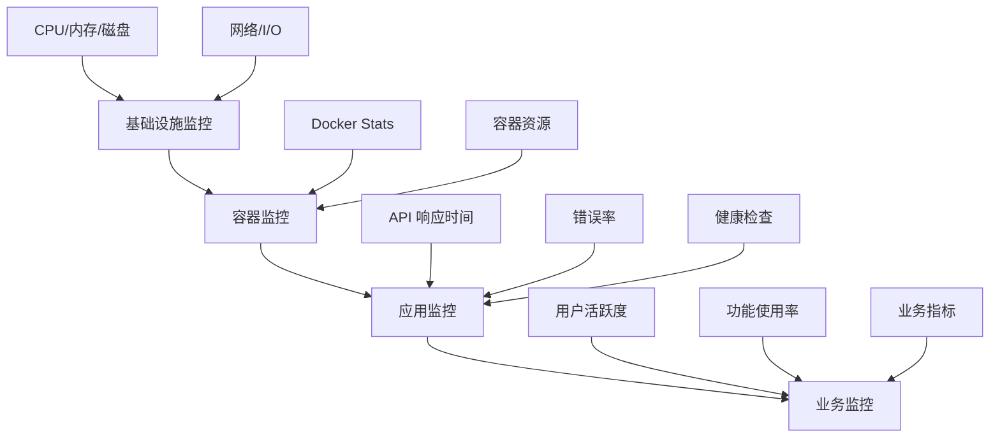

# 高可用性与系统监控配置指南

<cite>
**本文档中引用的文件**
- [docker-compose.yml](file://docker-compose.yml)
- [Dockerfile](file://Dockerfile)
- [api/main.py](file://api/main.py)
- [api/logging_config.py](file://api/logging_config.py)
- [api/api.py](file://api/api.py)
- [api/config.py](file://api/config.py)
- [run.sh](file://run.sh)
- [README.md](file://README.md)
</cite>

## 目录
1. [简介](#简介)
2. [项目架构概览](#项目架构概览)
3. [容器高可用性配置](#容器高可用性配置)
4. [系统级监控配置](#系统级监控配置)
5. [应用层监控与健康检查](#应用层监控与健康检查)
6. [日志管理与轮转策略](#日志管理与轮转策略)
7. [云服务商监控集成](#云服务商监控集成)
8. [开源监控方案](#开源监控方案)
9. [告警规则与通知](#告警规则与通知)
10. [故障排除指南](#故障排除指南)
11. [最佳实践建议](#最佳实践建议)

## 简介

deepwiki-open 是一个基于 FastAPI 和 Next.js 构建的智能知识库系统，支持多种大语言模型提供商。为了确保该系统在生产环境中的高可用性和稳定性，需要实施完善的监控和高可用性配置策略。

本指南将详细介绍如何配置 docker-compose.yml 中的重启策略、设置 systemd 服务、集成云监控工具以及实现完整的监控体系。

## 项目架构概览

deepwiki-open 采用前后端分离架构，包含以下核心组件：



**图表来源**
- [docker-compose.yml](file://docker-compose.yml#L1-L30)
- [Dockerfile](file://Dockerfile#L1-L112)

**章节来源**
- [docker-compose.yml](file://docker-compose.yml#L1-L30)
- [Dockerfile](file://Dockerfile#L1-L112)

## 容器高可用性配置

### Docker Compose 重启策略配置

在 docker-compose.yml 中添加 `restart: unless-stopped` 策略是确保容器异常退出后自动重启的关键配置。

#### 当前配置分析

项目现有的 docker-compose.yml 已经包含了基本的健康检查配置：

```yaml
# 健康检查配置
healthcheck:
  test: ["CMD", "curl", "-f", "http://localhost:${PORT:-8001}/health"]
  interval: 60s
  timeout: 10s
  retries: 3
  start_period: 30s
```

#### 推荐的完整重启策略配置

```yaml
services:
  deepwiki:
    # 现有配置...
    restart: unless-stopped  # 添加重启策略
    # 健康检查配置...
```

#### 重启策略详解

| 策略类型 | 描述 | 适用场景 |
|---------|------|----------|
| `no` | 不自动重启 | 开发调试环境 |
| `always` | 总是重启，无论退出码 | 测试环境 |
| `on-failure` | 仅在非零退出码时重启 | 生产环境，允许手动干预 |
| `unless-stopped` | 除非手动停止，否则重启 | 生产环境推荐 |

### Docker 守护进程开机自启

#### Ubuntu/Debian 系统配置

```bash
# 启用 Docker 服务开机自启
sudo systemctl enable docker

# 检查 Docker 服务状态
sudo systemctl status docker

# 如果需要，可以设置 docker-compose 服务自启
sudo systemctl enable docker-compose
```

#### CentOS/RHEL 系统配置

```bash
# 启用 Docker 服务
sudo systemctl enable docker.service

# 启动 Docker 服务
sudo systemctl start docker
```

**章节来源**
- [docker-compose.yml](file://docker-compose.yml#L24-L29)

## 系统级监控配置

### 系统资源监控

#### CPU 和内存监控

```bash
# 监控容器资源使用情况
docker stats deepwiki

# 查看系统整体资源使用
htop
free -h
```

#### 存储空间监控

```bash
# 监控磁盘使用情况
df -h

# 监控特定目录大小
du -sh ~/.adalflow
du -sh ./api/logs
```

### 网络连接监控

```bash
# 监控端口占用情况
netstat -tlnp | grep :8001
netstat -tlnp | grep :3000

# 检查防火墙规则
sudo ufw status
sudo iptables -L
```

## 应用层监控与健康检查

### 健康检查端点实现

deepwiki-open 提供了专门的健康检查端点 `/health`，这是监控系统的重要入口。

#### 健康检查端点分析

```python
@app.get("/health")
async def health_check():
    """用于 Docker 和监控"""
    return {
        "status": "healthy",
        "timestamp": datetime.now().isoformat(),
        "service": "deepwiki-api"
    }
```

#### 健康检查工作原理



**图表来源**
- [api/api.py](file://api/api.py#L540-L547)
- [docker-compose.yml](file://docker-compose.yml#L24-L29)

### 自定义健康检查扩展

#### 实现更详细的健康检查

```python
@app.get("/health/detailed")
async def detailed_health_check():
    """提供更详细的健康检查信息"""
    health_data = {
        "status": "healthy",
        "timestamp": datetime.now().isoformat(),
        "service": "deepwiki-api",
        "checks": {
            "database": await check_database_connection(),
            "embedding_service": await check_embedding_service(),
            "llm_services": await check_llm_services(),
            "storage": await check_storage_space()
        }
    }
    
    # 根据检查结果调整状态
    if not all(health_data["checks"].values()):
        health_data["status"] = "unhealthy"
    
    return health_data
```

**章节来源**
- [api/api.py](file://api/api.py#L540-L547)

## 日志管理与轮转策略

### 日志配置分析

deepwiki-open 提供了完善的日志管理系统，支持动态配置和轮转。

#### 日志配置参数

| 参数 | 默认值 | 描述 |
|------|--------|------|
| `LOG_LEVEL` | INFO | 日志级别 |
| `LOG_FILE_PATH` | api/logs/application.log | 日志文件路径 |
| `LOG_MAX_SIZE` | 10MB | 单个日志文件最大大小 |
| `LOG_BACKUP_COUNT` | 5 | 备份文件数量 |

#### 日志轮转配置

```python
# 日志轮转实现
file_handler = RotatingFileHandler(
    resolved_path, 
    maxBytes=max_bytes, 
    backupCount=backup_count, 
    encoding="utf-8"
)
```

### 推荐的日志轮转策略

#### 1. 文件大小限制

```bash
# 创建日志轮转配置文件
cat > /etc/logrotate.d/deepwiki << EOF
/app/api/logs/*.log {
    daily
    rotate 30
    compress
    delaycompress
    missingok
    notifempty
    create 644 root root
    postrotate
        docker exec deepwiki-app kill -USR1 \$(cat /var/run/nginx.pid)
    endscript
}
EOF
```

#### 2. 日志保留策略

```bash
# 清理超过30天的日志文件
find /app/api/logs -name "*.log.*" -mtime +30 -delete
```

#### 3. 日志监控脚本

```bash
#!/bin/bash
# 日志监控脚本

LOG_DIR="/app/api/logs"
THRESHOLD_SIZE=104857600  # 100MB

# 检查日志文件大小
for logfile in $LOG_DIR/*.log; do
    if [ -f "$logfile" ]; then
        size=$(stat -f%z "$logfile")
        if [ $size -gt $THRESHOLD_SIZE ]; then
            echo "警告: 日志文件 $logfile 超过大小限制 ($size > $THRESHOLD_SIZE)"
            # 可以在这里添加邮件通知
        fi
    fi
done
```

**章节来源**
- [api/logging_config.py](file://api/logging_config.py#L1-L86)

## 云服务商监控集成

### AWS CloudWatch 集成

#### 1. CloudWatch Agent 配置

```bash
# 安装 CloudWatch Agent
sudo yum install amazon-cloudwatch-agent -y

# 创建配置文件
cat > /opt/aws/amazon-cloudwatch-agent/bin/config.json << EOF
{
    "agent": {
        "metrics_collection_interval": 60,
        "run_as_user": "cwagent"
    },
    "metrics": {
        "namespace": "DeepWiki/Monitoring",
        "metrics_collected": {
            "cpu": {
                "measurement": [
                    "cpu_usage_idle",
                    "cpu_usage_iowait",
                    "cpu_usage_user",
                    "cpu_usage_system"
                ],
                "metrics_collection_interval": 60
            },
            "disk": {
                "measurement": [
                    "used_percent",
                    "inodes_free"
                ],
                "metrics_collection_interval": 60,
                "resources": [
                    "/"
                ]
            },
            "mem": {
                "measurement": [
                    "mem_used_percent"
                ],
                "metrics_collection_interval": 60
            }
        }
    }
}
EOF

# 启动 CloudWatch Agent
sudo /opt/aws/amazon-cloudwatch-agent/bin/amazon-cloudwatch-agent-ctl -a fetch-config -m ec2 -c file:/opt/aws/amazon-cloudwatch-agent/bin/config.json -s
```

#### 2. 自定义指标配置

```bash
# 创建自定义监控脚本
cat > /usr/local/bin/deepwiki-monitoring.sh << 'EOF'
#!/bin/bash

# 获取容器指标
CONTAINER_NAME="deepwiki-app"
CPU_USAGE=$(docker stats --no-stream --format "table {{.CPUPerc}}" $CONTAINER_NAME | tail -1 | sed 's/%//')
MEMORY_USAGE=$(docker stats --no-stream --format "table {{.MemUsage}}" $CONTAINER_NAME | tail -1 | awk '{print $1}' | sed 's/MiB//')

# 发送到 CloudWatch
aws cloudwatch put-metric-data \
    --metric-name CPUUsage \
    --namespace DeepWiki \
    --value $CPU_USAGE \
    --unit Percent \
    --region us-west-2

aws cloudwatch put-metric-data \
    --metric-name MemoryUsage \
    --namespace DeepWiki \
    --value $MEMORY_USAGE \
    --unit Megabytes \
    --region us-west-2
EOF

chmod +x /usr/local/bin/deepwiki-monitoring.sh
```

### Google Cloud Operations 集成

#### 1. Stackdriver Agent 配置

```bash
# 安装 Stackdriver Agent
curl -sSO https://dl.google.com/cloudagents/add-google-cloud-ops-agent-repo.sh
sudo bash add-google-cloud-ops-agent-repo.sh --also-install

# 配置监控
cat > /etc/google-cloud-ops-agent/config.yaml << EOF
metrics:
  receivers:
    prometheus:
      type: prometheus
      listen_address: "0.0.0.0:9100"
  processors:
    resource_detection:
      detectors: [gce]
  exporters:
    google_cloud_monitoring:
      project: your-project-id
  service:
    pipelines:
      default_pipeline:
        receivers: [prometheus]
        processors: [resource_detection]
        exporters: [google_cloud_monitoring]
EOF

sudo systemctl restart google-cloud-ops-agent
```

#### 2. 自定义指标收集

```bash
# 创建监控脚本
cat > /usr/local/bin/gcp-monitoring.sh << 'EOF'
#!/bin/bash

# 获取 API 响应时间
RESPONSE_TIME=$(curl -w "%{time_total}" -o /dev/null -s http://localhost:8001/health)

# 发送到 Cloud Monitoring
gcloud monitoring write timeseries \
    --descriptor-type="custom.googleapis.com/deepwiki/response_time" \
    --metric-labels="instance_id=\$(curl -s http://metadata.google.internal/computeMetadata/v1/instance/id -H "Metadata-Flavor: Google")" \
    --timeseries-data="{
        \"metric\": {
            \"type\": \"custom.googleapis.com/deepwiki/response_time\",
            \"labels\": {
                \"instance_id\": \"\$(curl -s http://metadata.google.internal/computeMetadata/v1/instance/id -H "Metadata-Flavor: Google\")\"
            }
        },
        \"resource\": {
            \"type\": \"gce_instance\",
            \"labels\": {
                \"instance_id\": \"\$(curl -s http://metadata.google.internal/computeMetadata/v1/instance/id -H "Metadata-Flavor: Google")\",
                \"zone\": \"\$(curl -s http://metadata.google.internal/computeMetadata/v1/instance/zone -H "Metadata-Flavor: Google")\"
            }
        },
        \"points\": [{
            \"interval\": {
                \"endTime\": \"\$(date -u +%Y-%m-%dT%H:%M:%SZ)\"
            },
            \"value\": {
                \"doubleValue\": $RESPONSE_TIME
            }
        }]
    }"
EOF
```

## 开源监控方案

### Prometheus + Grafana 集成

#### 1. Prometheus 配置

```yaml
# prometheus.yml
global:
  scrape_interval: 15s

scrape_configs:
  - job_name: 'deepwiki'
    static_configs:
      - targets: ['localhost:9100']
    metrics_path: '/metrics'
    
  - job_name: 'docker'
    static_configs:
      - targets: ['localhost:9323']
      
  - job_name: 'node-exporter'
    static_configs:
      - targets: ['localhost:9100']
```

#### 2. Node Exporter 配置

```bash
# 安装 Node Exporter
wget https://github.com/prometheus/node_exporter/releases/download/v1.6.0/node_exporter-1.6.0.linux-amd64.tar.gz
tar xvfz node_exporter-1.6.0.linux-amd64.tar.gz
sudo mv node_exporter-1.6.0.linux-amd64/node_exporter /usr/local/bin/

# 创建 systemd 服务
cat > /etc/systemd/system/node-exporter.service << EOF
[Unit]
Description=Node Exporter
After=network.target

[Service]
User=node_exporter
Group=node_exporter
Type=simple
ExecStart=/usr/local/bin/node_exporter

[Install]
WantedBy=multi-user.target
EOF

sudo systemctl daemon-reload
sudo systemctl enable node-exporter
sudo systemctl start node-exporter
```

#### 3. Grafana 仪表板配置

```json
{
  "dashboard": {
    "title": "DeepWiki Monitoring",
    "panels": [
      {
        "title": "API Response Time",
        "type": "graph",
        "targets": [
          {
            "expr": "histogram_quantile(0.95, rate(deepwiki_request_duration_seconds_bucket[5m]))",
            "legendFormat": "{{job}}"
          }
        ]
      },
      {
        "title": "Container CPU Usage",
        "type": "graph",
        "targets": [
          {
            "expr": "rate(container_cpu_usage_seconds_total{container_label_name=\"deepwiki\"}[5m]) * 100",
            "legendFormat": "{{container}}"
          }
        ]
      }
    ]
  }
}
```

### 自定义指标收集

#### 1. 应用级指标收集

```python
# metrics.py
from prometheus_client import Counter, Histogram, Gauge, start_http_server

# 请求计数器
REQUEST_COUNT = Counter('deepwiki_requests_total', 'Total requests', ['method', 'endpoint', 'status'])
REQUEST_DURATION = Histogram('deepwiki_request_duration_seconds', 'Request duration', ['method', 'endpoint'])
ACTIVE_REQUESTS = Gauge('deepwiki_active_requests', 'Active requests')

# 启动 Prometheus 服务器
def start_metrics_server(port=9100):
    start_http_server(port)

# 在 API 中使用
@app.middleware("http")
async def metrics_middleware(request, call_next):
    REQUEST_COUNT.labels(method=request.method, endpoint=request.url.path).inc()
    ACTIVE_REQUESTS.inc()
    
    start_time = time.time()
    try:
        response = await call_next(request)
    finally:
        duration = time.time() - start_time
        REQUEST_DURATION.labels(
            method=request.method, 
            endpoint=request.url.path
        ).observe(duration)
        ACTIVE_REQUESTS.dec()
    
    return response
```

## 告警规则与通知

### 关键监控指标

#### 1. 性能指标

| 指标名称 | 告警阈值 | 告警级别 | 通知方式 |
|---------|----------|----------|----------|
| API 响应时间 | > 2秒 | 警告 | 邮件 + Slack |
| CPU 使用率 | > 80% | 警告 | 邮件 + SMS |
| 内存使用率 | > 85% | 严重 | 邮件 + 电话 |
| 磁盘使用率 | > 90% | 严重 | 邮件 + Slack |
| 健康检查失败 | 连续3次失败 | 严重 | 邮件 + 电话 |

#### 2. 业务指标

| 指标名称 | 告警阈值 | 告警级别 | 通知方式 |
|---------|----------|----------|----------|
| 嵌入生成失败率 | > 5% | 警告 | 邮件 + Slack |
| API 错误率 | > 1% | 警告 | 邮件 + SMS |
| 缓存命中率 | < 90% | 警告 | 邮件 + Slack |
| 数据库连接失败 | 连续3次 | 严重 | 邮件 + 电话 |

### 告警规则配置

#### Prometheus Alertmanager 配置

```yaml
# alertmanager.yml
global:
  smtp_from: 'alertmanager@example.com'
  smtp_smarthost: 'smtp.gmail.com:587'
  smtp_auth_username: 'alertmanager@example.com'
  smtp_auth_password: 'password'

route:
  group_by: ['alertname', 'severity']
  group_wait: 30s
  group_interval: 5m
  repeat_interval: 12h
  receiver: 'default'
  routes:
    - match:
        severity: 'critical'
      receiver: 'critical-alerts'
    - match:
        severity: 'warning'
      receiver: 'warning-alerts'

receivers:
  - name: 'default'
    slack_configs:
      - api_url: 'https://hooks.slack.com/services/YOUR/SLACK/WEBHOOK'
        channel: '#deepwiki-alerts'
        
  - name: 'critical-alerts'
    email_configs:
      - to: 'admin@example.com'
        subject: '🚨 DeepWiki Critical Alert: {{ .GroupLabels.alertname }}'
        
  - name: 'warning-alerts'
    slack_configs:
      - api_url: 'https://hooks.slack.com/services/YOUR/SLACK/WEBHOOK'
        channel: '#deepwiki-warnings'
```

#### 自定义告警规则

```yaml
# deepwiki.rules.yml
groups:
- name: deepwiki
  rules:
  - alert: HighAPILatency
    expr: histogram_quantile(0.95, rate(deepwiki_request_duration_seconds_bucket[5m])) > 2
    for: 2m
    labels:
      severity: warning
    annotations:
      summary: "High API latency detected"
      description: "API response time is {{ $value }} seconds"
      
  - alert: HighCPUUsage
    expr: rate(container_cpu_usage_seconds_total{container_label_name="deepwiki"}[5m]) * 100 > 80
    for: 5m
    labels:
      severity: warning
    annotations:
      summary: "High CPU usage"
      description: "CPU usage is {{ $value }}%"
      
  - alert: HealthCheckFailure
    expr: up{job="deepwiki"} == 0
    for: 1m
    labels:
      severity: critical
    annotations:
      summary: "DeepWiki service is down"
      description: "Health check endpoint is not responding"
```

### 告警通知模板

#### 1. Slack 通知模板

```json
{
  "attachments": [
    {
      "color": "{{ if eq .Status \"firing\" }}danger{{ else }}good{{ end }}",
      "title": "{{ .GroupLabels.alertname }}",
      "text": "{{ .Annotations.summary }}\n{{ .Annotations.description }}",
      "fields": [
        {
          "title": "Severity",
          "value": "{{ .GroupLabels.severity }}",
          "short": true
        },
        {
          "title": "Instance",
          "value": "{{ $labels.instance }}",
          "short": true
        }
      ],
      "footer": "DeepWiki Monitoring",
      "footer_icon": "https://example.com/favicon.png",
      "ts": {{ .StartsAt.Unix }}
    }
  ]
}
```

#### 2. 邮件通知模板

```html
<!DOCTYPE html>
<html>
<head>
    <title>DeepWiki Alert: {{ .GroupLabels.alertname }}</title>
</head>
<body>
    <h2>{{ .GroupLabels.alertname }}</h2>
    <p>Status: {{ .Status }}</p>
    <p>Severity: {{ .GroupLabels.severity }}</p>
    <p>Description: {{ .Annotations.description }}</p>
    <p>Start Time: {{ .Alerts.Firing | first | .StartsAt }}</p>
    <p><a href="http://monitoring.example.com">View Dashboard</a></p>
</body>
</html>
```

## 故障排除指南

### 常见问题诊断

#### 1. 容器启动失败

```bash
# 检查容器状态
docker ps -a

# 查看容器日志
docker logs deepwiki

# 检查配置文件
docker exec deepwiki cat /app/.env

# 检查资源限制
docker stats deepwiki
```

#### 2. 健康检查失败

```bash
# 手动测试健康检查端点
curl -v http://localhost:8001/health

# 检查端口占用
netstat -tlnp | grep 8001

# 检查进程状态
docker exec deepwiki ps aux | grep python
```

#### 3. 性能问题诊断

```bash
# 监控系统资源
docker stats deepwiki

# 分析 API 性能
curl -w "@curl-format.txt" -o /dev/null -s http://localhost:8001/health

# curl-format.txt 内容:
#     time_namelookup:  %{time_namelookup}\n
#        time_connect:  %{time_connect}\n
#     time_appconnect:  %{time_appconnect}\n
#    time_pretransfer:  %{time_pretransfer}\n
#       time_redirect:  %{time_redirect}\n
#  time_starttransfer:  %{time_starttransfer}\n
#                     ----------\n
#          time_total:  %{time_total}\n
```

### 性能优化建议

#### 1. 资源配置优化

```yaml
services:
  deepwiki:
    # 资源限制配置
    mem_limit: 8g
    mem_reservation: 2g
    cpu_quota: 400000  # 4 cores
    cpu_period: 100000
```

#### 2. 缓存策略优化

```python
# 缓存配置示例
CACHE_CONFIG = {
    "redis": {
        "host": "localhost",
        "port": 6379,
        "db": 0,
        "ttl": 3600  # 1小时
    },
    "memory": {
        "max_size": 1000,
        "ttl": 1800  # 30分钟
    }
}
```

## 最佳实践建议

### 1. 监控体系建设

#### 分层监控策略



#### 监控数据保留策略

| 时间范围 | 保留期限 | 存储成本 | 用途 |
|---------|----------|----------|------|
| 1周 | 7天 | 低 | 日常运维 |
| 1个月 | 30天 | 中等 | 故障排查 |
| 1年 | 365天 | 高 | 性能分析 |
| 永久 | 永久 | 最高 | 合规审计 |

### 2. 自动化运维

#### 1. 自动扩容配置

```yaml
# Kubernetes HPA 配置示例
apiVersion: autoscaling/v2
kind: HorizontalPodAutoscaler
metadata:
  name: deepwiki-hpa
spec:
  scaleTargetRef:
    apiVersion: apps/v1
    kind: Deployment
    name: deepwiki
  minReplicas: 2
  maxReplicas: 10
  metrics:
  - type: Resource
    resource:
      name: cpu
      target:
        type: Utilization
        averageUtilization: 70
  - type: Resource
    resource:
      name: memory
      target:
        type: Utilization
        averageUtilization: 80
```

#### 2. 自动备份策略

```bash
#!/bin/bash
# 自动备份脚本

BACKUP_DIR="/backups/deepwiki"
DATE=$(date +%Y%m%d_%H%M%S)

# 创建备份目录
mkdir -p $BACKUP_DIR

# 备份数据库
docker exec deepwiki-db pg_dump -U postgres deepwiki > $BACKUP_DIR/db_$DATE.sql

# 备份配置文件
tar czf $BACKUP_DIR/config_$DATE.tar.gz /app/config/

# 备份日志
tar czf $BACKUP_DIR/logs_$DATE.tar.gz /app/logs/

# 清理旧备份（保留30天）
find $BACKUP_DIR -name "*.tar.gz" -mtime +30 -delete
```

### 3. 安全监控

#### 1. 访问日志分析

```bash
# 访问日志监控脚本
cat > /usr/local/bin/access-log-monitor.sh << 'EOF'
#!/bin/bash

LOG_FILE="/app/logs/access.log"
ALERT_THRESHOLD=100

# 统计异常访问
abnormal_access=$(awk '$9 ~ /^[45][0-9][0-9]$/ {count++} END {print count}' $LOG_FILE)

if [ $abnormal_access -gt $ALERT_THRESHOLD ]; then
    echo "警告: 检测到 $abnormal_access 个异常HTTP响应" | mail -s "DeepWiki 访问异常告警" admin@example.com
fi
EOF
```

#### 2. 安全事件监控

```python
# 安全事件检测
import re
from datetime import datetime

def detect_security_events(log_entry):
    """检测安全相关事件"""
    events = []
    
    # 检测暴力破解尝试
    if re.search(r'Failed password', log_entry):
        events.append({
            'type': 'brute_force',
            'severity': 'high',
            'timestamp': datetime.now(),
            'details': '检测到暴力破解尝试'
        })
    
    # 检测异常API调用
    if re.search(r'/admin|/config|/secret', log_entry):
        events.append({
            'type': 'suspicious_api',
            'severity': 'medium',
            'timestamp': datetime.now(),
            'details': '检测到可疑API调用'
        })
    
    return events
```

### 4. 文档与培训

#### 1. 监控操作手册

- 制定标准的监控检查清单
- 建立故障响应流程
- 定期进行应急演练

#### 2. 团队培训计划

- 监控系统使用培训
- 故障诊断技能培训
- 告警响应流程培训

通过实施本指南中的配置和最佳实践，可以显著提升 deepwiki-open 在云环境中的高可用性和监控能力，确保系统的稳定运行和快速故障恢复。