# 本地 Ollama 模型管理

<cite>
**本文档中引用的文件**
- [Dockerfile-ollama-local](file://Dockerfile-ollama-local)
- [Ollama-instruction.md](file://Ollama-instruction.md)
- [api/config/generator.json](file://api/config/generator.json)
- [api/config/embedder.json](file://api/config/embedder.json)
- [api/ollama_patch.py](file://api/ollama_patch.py)
- [api/main.py](file://api/main.py)
- [api/rag.py](file://api/rag.py)
- [run.sh](file://run.sh)
</cite>

## 目录
1. [简介](#简介)
2. [项目架构概览](#项目架构概览)
3. [Dockerfile-ollama-local 分析](#dockerfile-ollamalocal-分析)
4. [模型预加载机制](#模型预加载机制)
5. [模型配置管理](#模型配置管理)
6. [模型下载与管理](#模型下载与管理)
7. [性能权衡与选择建议](#性能权衡与选择建议)
8. [容器化部署](#容器化部署)
9. [故障排除指南](#故障排除指南)
10. [最佳实践](#最佳实践)

## 简介

DeepWiki 是一个基于本地 Ollama 模型的代码文档生成工具，提供了完全离线的 AI 功能。通过本地部署 Ollama 服务器和预加载特定模型，DeepWiki 实现了隐私保护、成本控制和离线可用性的目标。

本地 Ollama 模型管理的核心优势包括：
- **完全离线运行**：无需依赖云端 API，保护代码隐私
- **成本效益**：避免持续的 API 费用
- **自定义控制**：可自由选择和配置模型参数
- **本地存储**：所有数据和模型都保存在本地系统

## 项目架构概览

DeepWiki 的本地 Ollama 集成采用多层架构设计，确保模型管理和应用服务的高效协同。

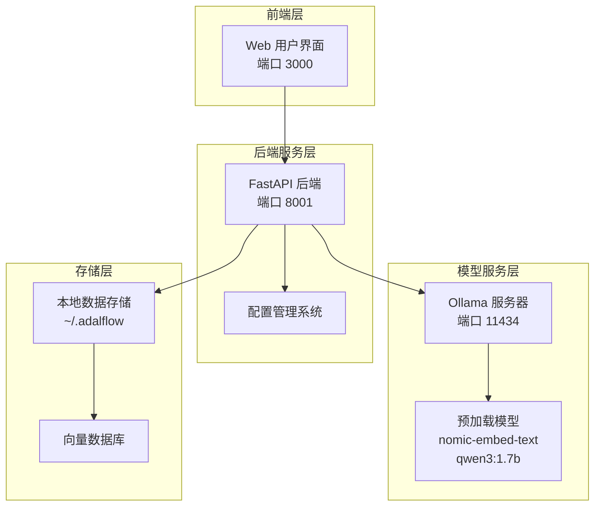

**图表来源**
- [Dockerfile-ollama-local](file://Dockerfile-ollama-local#L85-L120)
- [api/main.py](file://api/main.py#L64-L80)

**章节来源**
- [Dockerfile-ollama-local](file://Dockerfile-ollama-local#L1-L121)
- [api/main.py](file://api/main.py#L1-L80)

## Dockerfile-ollama-local 分析

Dockerfile-ollama-local 采用了精心设计的多阶段构建策略，实现了高效的本地 Ollama 部署。

### 构建阶段架构

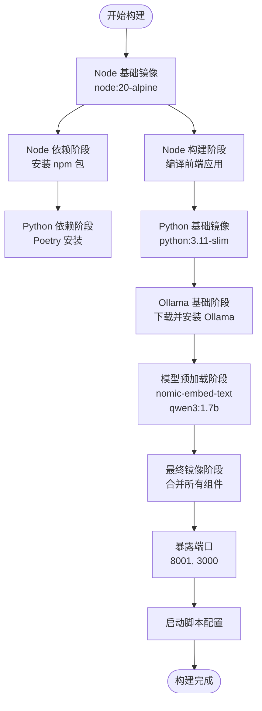

**图表来源**
- [Dockerfile-ollama-local](file://Dockerfile-ollama-local#L3-L120)

### 关键特性分析

1. **架构感知构建**：支持 ARM64 和 AMD64 架构的自动检测和适配
2. **多阶段优化**：每个阶段专注于特定任务，减少最终镜像大小
3. **预加载策略**：在构建阶段就下载并初始化所需模型
4. **环境变量配置**：灵活的端口和服务配置

**章节来源**
- [Dockerfile-ollama-local](file://Dockerfile-ollama-local#L27-L52)

## 模型预加载机制

### 自动化预加载流程

Ollama 模型的预加载在 Docker 构建阶段通过以下步骤实现：

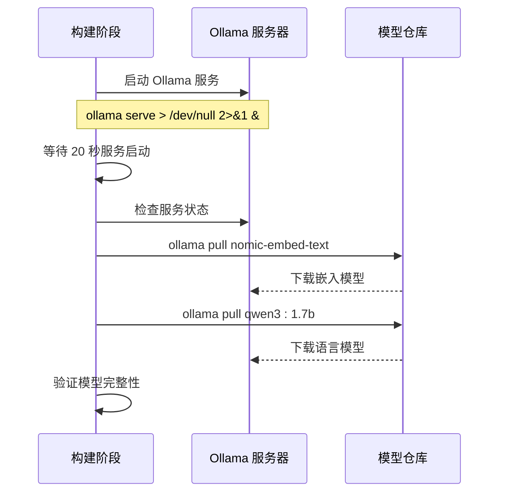

**图表来源**
- [Dockerfile-ollama-local](file://Dockerfile-ollama-local#L48-L51)

### 预加载模型详解

| 模型名称 | 类型 | 大小 | 用途 | 性能特点 |
|---------|------|------|------|----------|
| nomic-embed-text | 嵌入模型 | ~2GB | 代码语义理解、文档向量化 | 高精度文本嵌入，适合代码分析 |
| qwen3:1.7b | 语言模型 | ~3.8GB | 文档生成、代码解释 | 平衡速度与质量的默认选择 |

### 构建阶段验证机制

构建过程包含了模型可用性检查，确保预加载成功：

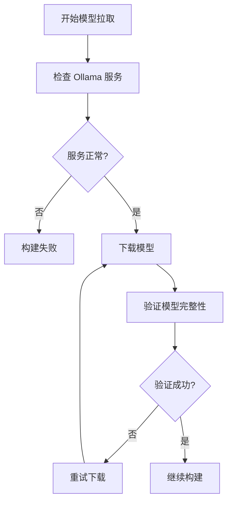

**图表来源**
- [Dockerfile-ollama-local](file://Dockerfile-ollama-local#L48-L51)

**章节来源**
- [Dockerfile-ollama-local](file://Dockerfile-ollama-local#L48-L51)

## 模型配置管理

### 配置文件结构

DeepWiki 通过 JSON 配置文件管理系统中使用的模型：

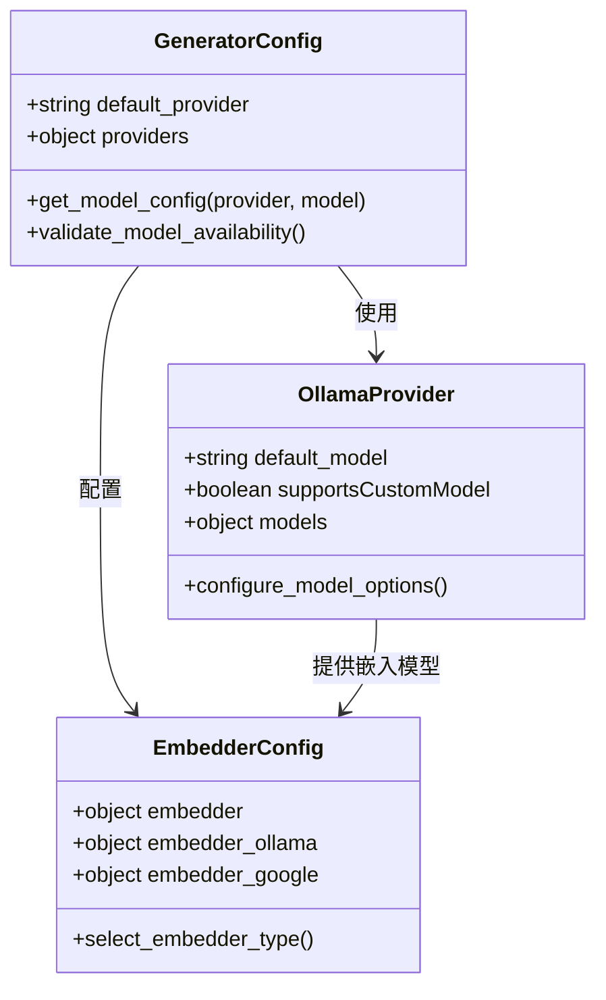

**图表来源**
- [api/config/generator.json](file://api/config/generator.json#L116-L142)
- [api/config/embedder.json](file://api/config/embedder.json#L11-L16)

### 模型参数配置

#### 语言模型配置

在 `generator.json` 中，Ollama 语言模型的配置示例：

```json
{
  "ollama": {
    "default_model": "qwen3:1.7b",
    "supportsCustomModel": true,
    "models": {
      "qwen3:1.7b": {
        "options": {
          "temperature": 0.7,
          "top_p": 0.8,
          "num_ctx": 32000
        }
      }
    }
  }
}
```

#### 嵌入模型配置

在 `embedder.json` 中，Ollama 嵌入模型的配置：

```json
{
  "embedder_ollama": {
    "client_class": "OllamaClient",
    "model_kwargs": {
      "model": "nomic-embed-text"
    }
  }
}
```

### 动态模型切换机制

系统支持运行时动态切换模型，通过配置文件的热更新实现：

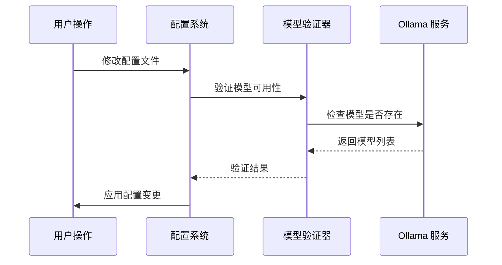

**图表来源**
- [api/ollama_patch.py](file://api/ollama_patch.py#L21-L60)

**章节来源**
- [api/config/generator.json](file://api/config/generator.json#L116-L142)
- [api/config/embedder.json](file://api/config/embedder.json#L11-L16)
- [api/ollama_patch.py](file://api/ollama_patch.py#L21-L60)

## 模型下载与管理

### 手动模型下载

用户可以通过以下命令手动下载所需的 Ollama 模型：

```bash
# 下载嵌入模型
ollama pull nomic-embed-text

# 下载语言模型
ollama pull qwen3:1.7b

# 下载其他推荐模型
ollama pull phi3:mini    # 小型快速模型
ollama pull llama3:8b    # 大型高质量模型
```

### 模型查看与管理

#### 查看已安装模型

```bash
# 列出所有已安装的模型
ollama list

# 示例输出：
# NAME                  SIZE
# nomic-embed-text      2.1 GB
# qwen3:1.7b            3.8 GB
# phi3:mini             1.3 GB
```

#### 模型存储位置

Ollama 模型默认存储在以下路径：
- **Linux/macOS**: `~/.ollama/models`
- **Windows**: `%USERPROFILE%\.ollama\models`

### 模型替换策略

#### 替换语言模型

要将默认的语言模型从 `qwen3:1.7b` 替换为其他模型：

1. 编辑 `api/config/generator.json`
2. 修改 `"default_model"` 字段
3. 更新对应模型的参数配置

```json
{
  "ollama": {
    "default_model": "phi3:mini",
    "models": {
      "phi3:mini": {
        "options": {
          "temperature": 0.7,
          "top_p": 0.8,
          "num_ctx": 32000
        }
      }
    }
  }
}
```

#### 替换嵌入模型

要更换嵌入模型：

1. 编辑 `api/config/embedder.json`
2. 修改 `"model"` 字段
3. 确保新模型与现有配置兼容

```json
{
  "embedder_ollama": {
    "model_kwargs": {
      "model": "llama3:8b"  // 使用 Llama3 作为嵌入模型
    }
  }
}
```

### 模型兼容性检查

系统提供了完善的模型可用性检查机制：

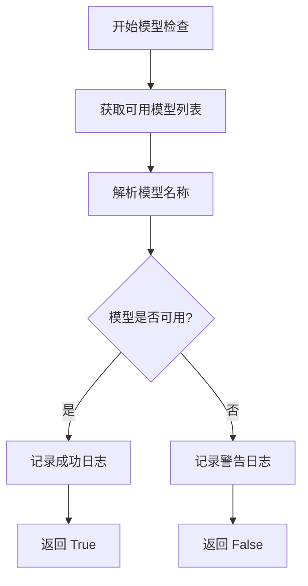

**图表来源**
- [api/ollama_patch.py](file://api/ollama_patch.py#L21-L60)

**章节来源**
- [Ollama-instruction.md](file://Ollama-instruction.md#L27-L34)
- [api/ollama_patch.py](file://api/ollama_patch.py#L21-L60)

## 性能权衡与选择建议

### 模型性能对比表

根据 Ollama-instruction.md 中的性能数据，以下是各模型的详细对比：

| 模型 | 参数量 | 内存占用 | 生成速度 | 质量评分 | 适用场景 |
|------|--------|----------|----------|----------|----------|
| phi3:mini | 1.3B | 2GB | 极快 | 良好 | 小项目测试、快速原型 |
| qwen3:1.7b | 1.7B | 3.8GB | 中等 | 优秀 | 默认选择，平衡方案 |
| llama3:8b | 8B | 8GB | 较慢 | 最佳 | 复杂项目、详细分析 |

### 性能优化建议

#### 硬件要求

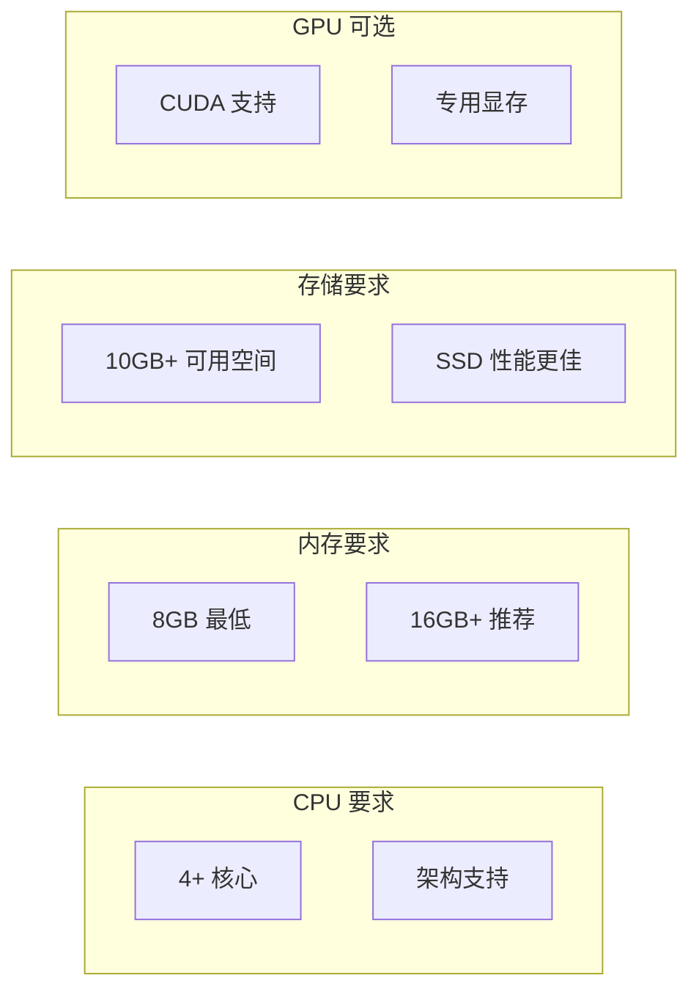

#### 模型选择策略

1. **开发测试阶段**：使用 `phi3:mini` 进行快速迭代
2. **生产环境**：推荐 `qwen3:1.7b` 作为默认配置
3. **复杂项目**：考虑使用 `llama3:8b` 获取更好质量
4. **资源受限**：优先选择小型模型并调整上下文窗口

### 上下文窗口优化

不同模型的上下文窗口对性能的影响：

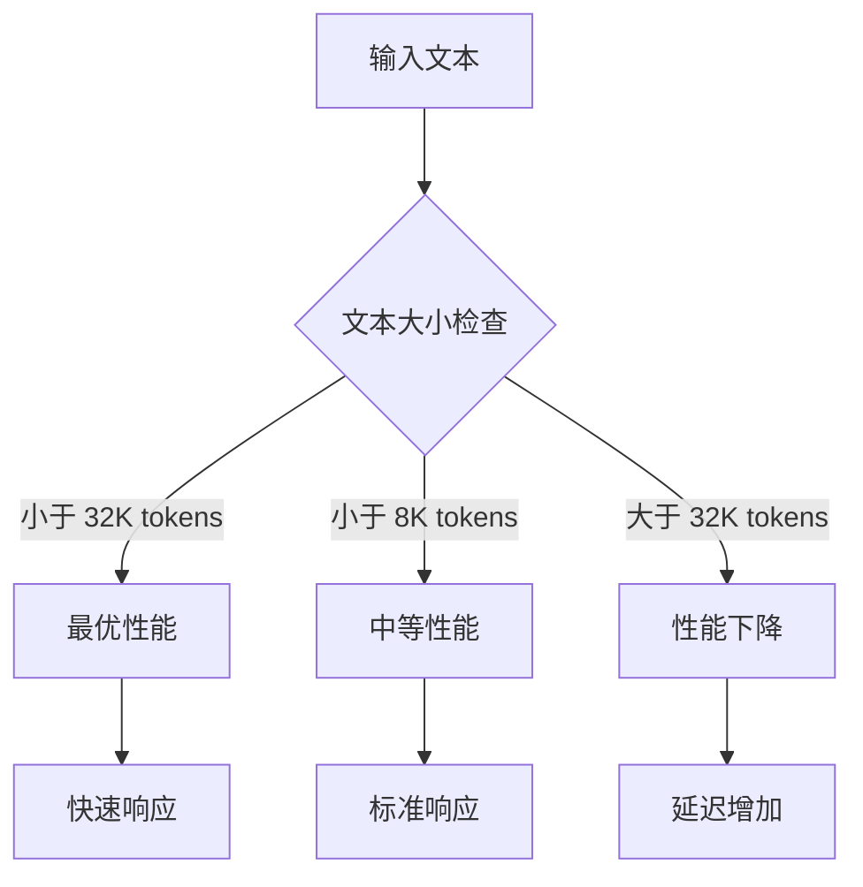

**图表来源**
- [api/config/generator.json](file://api/config/generator.json#L124-L138)

**章节来源**
- [Ollama-instruction.md](file://Ollama-instruction.md#L169-L178)
- [api/config/generator.json](file://api/config/generator.json#L124-L138)

## 容器化部署

### Docker 多阶段构建集成

Dockerfile-ollama-local 展示了如何将 Ollama 模型集成到最终镜像中：

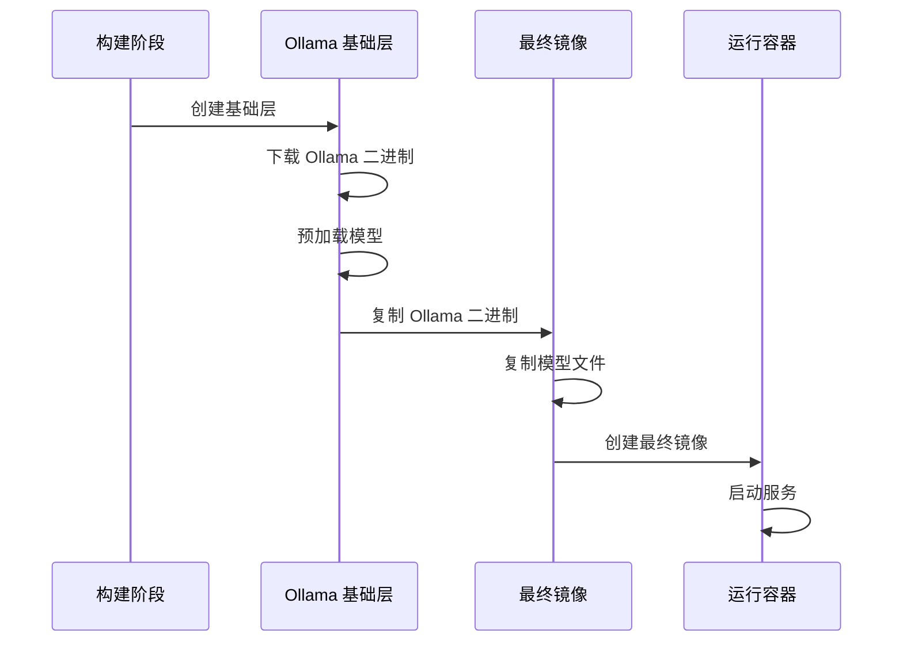

**图表来源**
- [Dockerfile-ollama-local](file://Dockerfile-ollama-local#L82-L83)

### 容器存储策略

#### 数据持久化

容器运行时的数据持久化通过卷挂载实现：

```bash
# 基本容器运行命令
docker run -p 3000:3000 -p 8001:8001 \
  -v ~/.adalflow:/root/.adalflow \
  -v ~/.ollama:/root/.ollama \
  deepwiki:ollama-local
```

#### 存储路径映射

| 主机路径 | 容器路径 | 用途 |
|----------|----------|------|
| `~/.adalflow` | `/root/.adalflow` | 项目数据、缓存、数据库 |
| `~/.ollama` | `/root/.ollama` | Ollama 模型和配置 |

### 容器启动流程

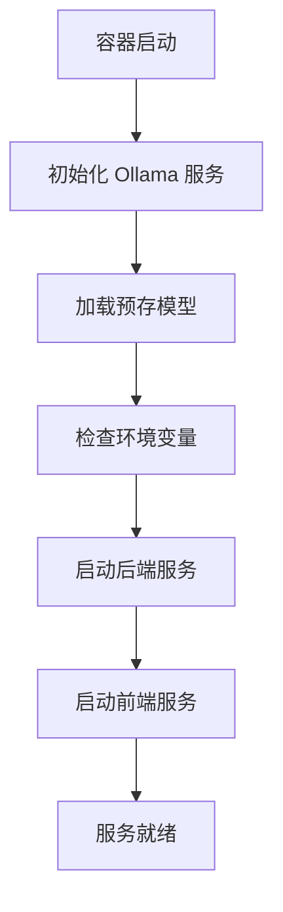

**图表来源**
- [Dockerfile-ollama-local](file://Dockerfile-ollama-local#L89-L108)

**章节来源**
- [Dockerfile-ollama-local](file://Dockerfile-ollama-local#L82-L84)
- [Dockerfile-ollama-local](file://Dockerfile-ollama-local#L89-L108)

## 故障排除指南

### 常见问题诊断

#### 连接问题

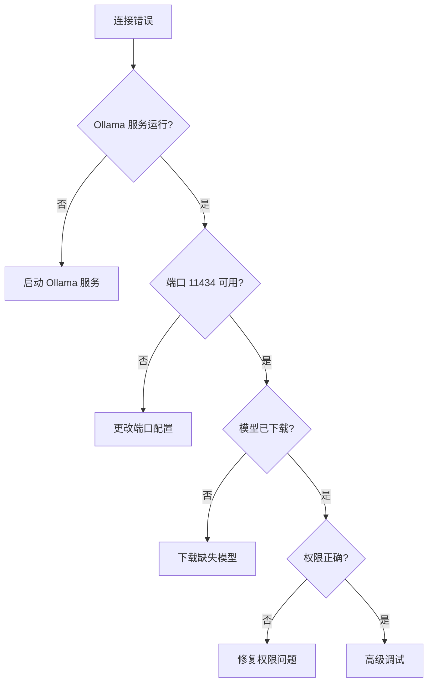

#### 模型相关问题

1. **模型不存在错误**
   ```bash
   # 错误信息
   Exception: Ollama model 'qwen3:1.7b' not found
   
   # 解决方案
   ollama pull qwen3:1.7b
   ```

2. **内存不足问题**
   ```bash
   # 症状：OOM 错误
   # 解决方案：
   # - 使用更小的模型
   # - 增加系统内存
   # - 调整模型参数
   ```

3. **网络连接问题**
   ```bash
   # 检查 Ollama 服务状态
   curl http://localhost:11434/api/tags
   
   # 重启 Ollama 服务
   systemctl restart ollama
   ```

### 调试工具和技巧

#### 日志分析

系统提供了详细的日志记录功能：

```python
# 日志级别配置
logger.info(f"Ollama model '{model_name}' is available")
logger.warning(f"Ollama model '{model_name}' is not available")
logger.error(f"Failed to get embedding for document '{file_path}'")
```

#### 性能监控

```bash
# 监控 Ollama 服务状态
ollama ps

# 检查模型使用情况
ollama list

# 监控系统资源
htop
```

### 环境变量配置

正确的环境变量设置对于 Ollama 正常工作至关重要：

```bash
# 基本配置
export OLLAMA_HOST=http://localhost:11434

# 自定义端口
export OLLAMA_HOST=http://localhost:12345

# 远程 Ollama 服务器
export OLLAMA_HOST=http://remote-server:11434
```

**章节来源**
- [api/ollama_patch.py](file://api/ollama_patch.py#L17-L20)
- [api/rag.py](file://api/rag.py#L186-L187)
- [Ollama-instruction.md](file://Ollama-instruction.md#L116-L128)

## 最佳实践

### 模型管理最佳实践

1. **定期更新模型**
   ```bash
   # 检查可用更新
   ollama list --updates
   
   # 更新模型
   ollama pull --upgrade
   ```

2. **模型版本管理**
   ```bash
   # 固定模型版本
   ollama pull qwen3:1.7b@sha256:abc123...
   
   # 清理未使用的模型
   ollama prune
   ```

3. **备份重要模型**
   ```bash
   # 备份模型目录
   tar -czf ollama-backup.tar.gz ~/.ollama
   ```

### 性能优化建议

1. **硬件优化**
   - 使用 SSD 存储模型文件
   - 确保充足的系统内存
   - 考虑 GPU 加速（如果支持）

2. **软件配置**
   - 调整上下文窗口大小
   - 优化温度和采样参数
   - 使用适当的并发设置

3. **监控和维护**
   - 定期检查系统资源使用
   - 监控模型加载时间
   - 跟踪生成质量指标

### 安全考虑

1. **访问控制**
   - 限制 Ollama 服务的网络访问
   - 使用防火墙规则
   - 配置适当的用户权限

2. **数据保护**
   - 定期备份重要数据
   - 加密敏感的模型文件
   - 监控异常访问模式

3. **更新策略**
   - 及时应用安全补丁
   - 测试新版本兼容性
   - 维护更新日志

通过遵循这些最佳实践，可以确保 DeepWiki 的本地 Ollama 部署既高效又安全，为用户提供稳定可靠的代码文档生成服务。