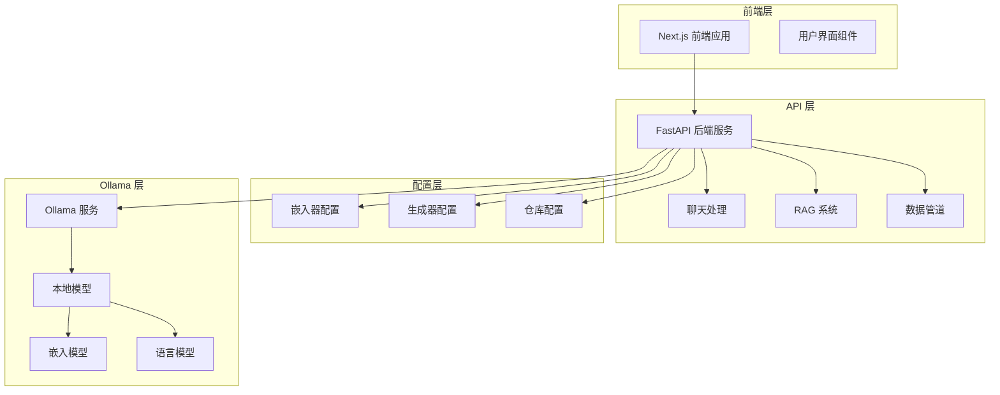
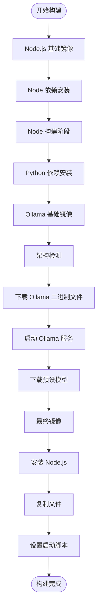
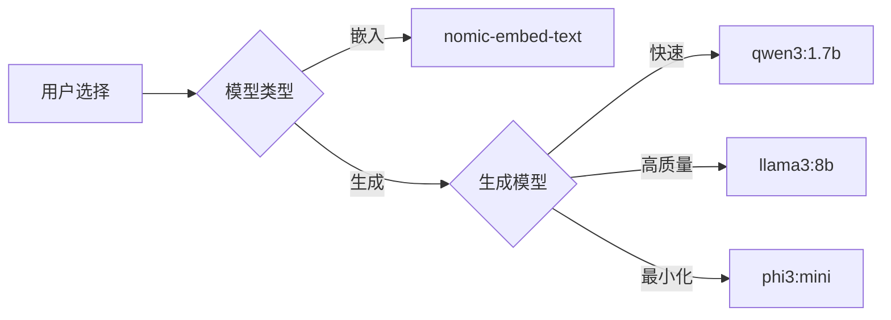
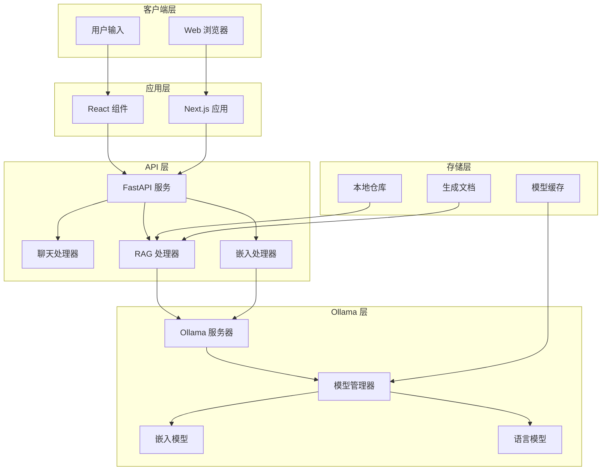
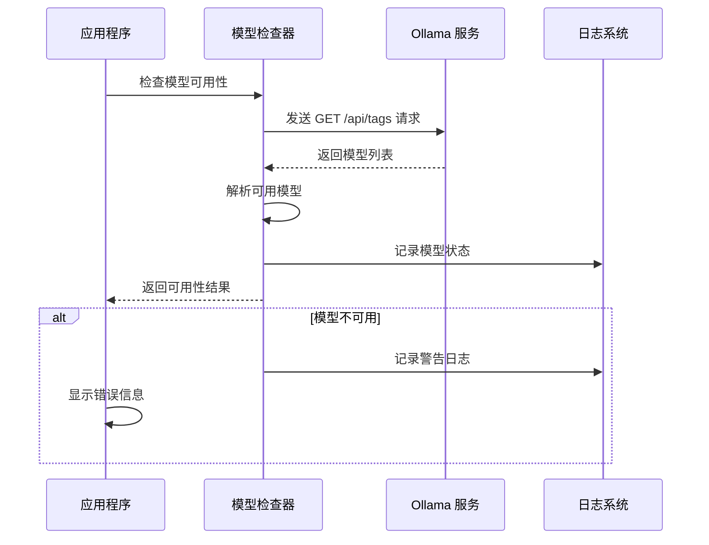
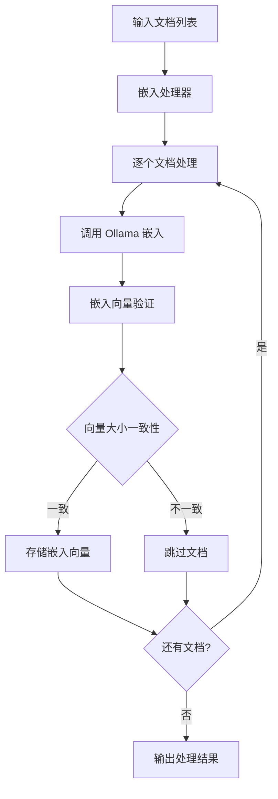
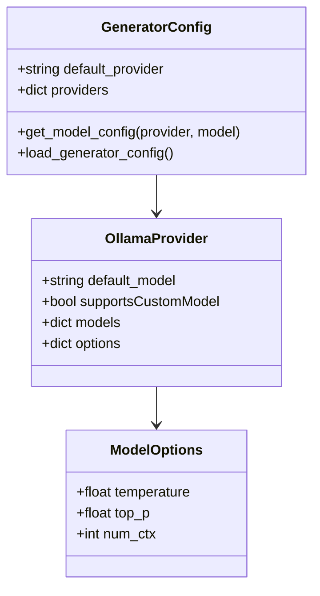
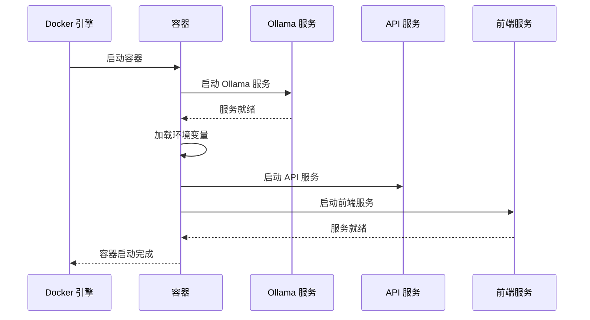
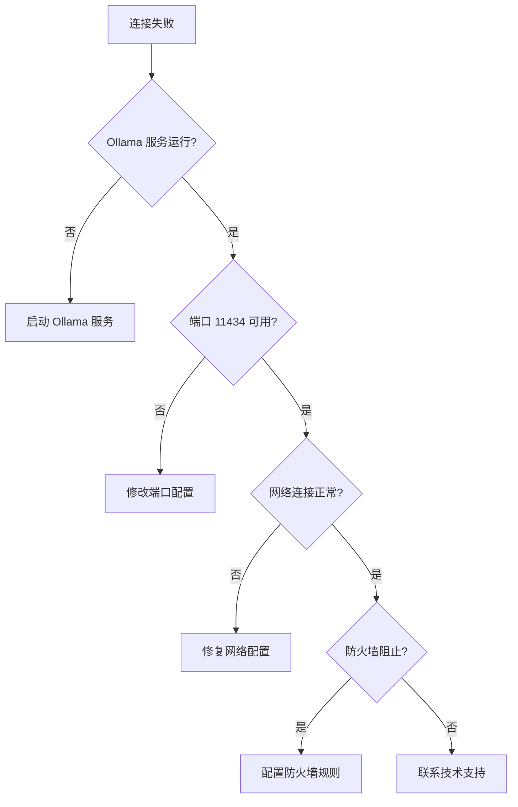

# 本地 Ollama 部署指南

<cite>
**本文档中引用的文件**
- [Dockerfile-ollama-local](file://Dockerfile-ollama-local)
- [Ollama-instruction.md](file://Ollama-instruction.md)
- [api/config/embedder.json](file://api/config/embedder.json)
- [api/config/embedder.ollama.json.bak](file://api/config/embedder.ollama.json.bak)
- [api/config/generator.json](file://api/config/generator.json)
- [api/ollama_patch.py](file://api/ollama_patch.py)
- [api/tools/embedder.py](file://api/tools/embedder.py)
</cite>

## 目录
1. [简介](#简介)
2. [项目结构概览](#项目结构概览)
3. [核心组件分析](#核心组件分析)
4. [架构概述](#架构概述)
5. [详细组件分析](#详细组件分析)
6. [部署流程详解](#部署流程详解)
7. [性能考虑](#性能考虑)
8. [故障排除指南](#故障排除指南)
9. [总结](#总结)

## 简介

本指南详细介绍了如何使用 Dockerfile-ollama-local 在本地环境中部署 DeepWiki 应用程序，实现完全离线、私有的 AI 能力。该部署模式避免了云 API 成本，提供了隐私保护的代码分析解决方案。

本地 Ollama 部署的核心目标是：
- 实现完全离线的 AI 功能，无需依赖云服务
- 避免 OpenAI 或 Google 等云提供商的 API 成本
- 提供隐私保护的代码分析能力
- 支持自定义模型和配置

## 项目结构概览

DeepWiki 项目采用现代化的微服务架构，包含前端 React 应用和后端 Python API 服务：



**图表来源**
- [Dockerfile-ollama-local](file://Dockerfile-ollama-local#L1-L121)
- [api/config/embedder.json](file://api/config/embedder.json#L1-L34)

**章节来源**
- [Dockerfile-ollama-local](file://Dockerfile-ollama-local#L1-L121)
- [api/config/embedder.json](file://api/config/embedder.json#L1-L34)

## 核心组件分析

### Dockerfile-ollama-local 构建流程

Dockerfile-ollama-local 采用了多阶段构建策略，实现了高效的镜像构建和优化：

#### 多阶段构建架构



**图表来源**
- [Dockerfile-ollama-local](file://Dockerfile-ollama-local#L1-L121)

#### 架构支持机制

Dockerfile 内置了对不同 CPU 架构的支持：

| 架构类型 | 支持状态 | 下载路径 | 性能特点 |
|---------|---------|---------|---------|
| arm64 | ✅ 完全支持 | ollama-linux-arm64.tgz | Apple Silicon 优化 |
| amd64 | ✅ 完全支持 | ollama-linux-amd64.tgz | Intel/AMD 通用 |
| 其他架构 | ❌ 不支持 | - | 需要手动添加 |

**章节来源**
- [Dockerfile-ollama-local](file://Dockerfile-ollama-local#L27-L51)

### Ollama 模型配置

系统预配置了两个关键模型用于代码分析：

#### 嵌入模型配置

| 模型名称 | 大小 | 用途 | 特点 |
|---------|------|------|------|
| nomic-embed-text | ~1GB | 代码语义嵌入 | 高质量代码理解 |
| qwen3:1.7b | ~3.8GB | 文档生成 | 平衡速度与质量 |

#### 模型选择策略



**图表来源**
- [api/config/generator.json](file://api/config/generator.json#L116-L141)
- [api/config/embedder.json](file://api/config/embedder.json#L11-L15)

**章节来源**
- [api/config/generator.json](file://api/config/generator.json#L116-L141)
- [api/config/embedder.json](file://api/config/embedder.json#L11-L15)

## 架构概述

### 系统架构图



**图表来源**
- [Dockerfile-ollama-local](file://Dockerfile-ollama-local#L82-L83)
- [api/tools/embedder.py](file://api/tools/embedder.py#L1-L55)

## 详细组件分析

### Ollama 客户端集成

#### 模型可用性检查机制

系统实现了智能的模型可用性检查功能：



**图表来源**
- [api/ollama_patch.py](file://api/ollama_patch.py#L21-L60)

#### 嵌入处理器设计

Ollama 嵌入处理器解决了批量处理限制问题：



**图表来源**
- [api/ollama_patch.py](file://api/ollama_patch.py#L62-L105)

**章节来源**
- [api/ollama_patch.py](file://api/ollama_patch.py#L21-L105)

### 配置管理系统

#### 嵌入器配置切换

系统支持多种嵌入器配置的动态切换：

| 配置类型 | 默认值 | 用途 | 性能特点 |
|---------|--------|------|---------|
| embedder | OpenAIClient | 开放式 AI | 云端服务，高质量 |
| embedder_ollama | OllamaClient | 本地 Ollama | 离线，隐私保护 |
| embedder_google | GoogleEmbedderClient | Google 服务 | 企业级，稳定可靠 |

#### 生成器配置管理



**图表来源**
- [api/config/generator.json](file://api/config/generator.json#L116-L141)

**章节来源**
- [api/config/generator.json](file://api/config/generator.json#L116-L141)
- [api/tools/embedder.py](file://api/tools/embedder.py#L6-L55)

## 部署流程详解

### 完整部署步骤

#### 第一阶段：环境准备

1. **安装 Ollama 客户端**
   - Windows 用户：从官网下载并安装
   - macOS 用户：从官网下载并拖拽到应用程序文件夹
   - Linux 用户：运行安装脚本

2. **下载必要模型**
   ```bash
   ollama pull nomic-embed-text
   ollama pull qwen3:1.7b
   ```

#### 第二阶段：应用配置

3. **克隆项目**
   ```bash
   git clone https://github.com/AsyncFuncAI/deepwiki-open.git
   cd deepwiki-open
   ```

4. **配置环境变量**
   创建 `.env` 文件：
   ```
   PORT=8001
   OLLAMA_HOST=your_ollama_host # (默认: http://localhost:11434)
   ```

5. **配置嵌入器**
   ```bash
   cp api/config/embedder.ollama.json.bak api/config/embedder.json
   ```

#### 第三阶段：构建和运行

6. **构建 Docker 镜像**
   ```bash
   docker build -f Dockerfile-ollama-local -t deepwiki:ollama-local .
   ```

7. **运行容器**
   ```bash
   docker run -p 3000:3000 -p 8001:8001 --name deepwiki \
     -v ~/.adalflow:/root/.adalflow \
     -e OLLAMA_HOST=your_ollama_host \
     deepwiki:ollama-local
   ```

#### 第四阶段：使用应用

8. **访问 Web 界面**
   打开浏览器访问 `http://localhost:3000`

9. **配置仓库**
   输入 GitHub、GitLab 或 Bitbucket 仓库 URL

10. **启用本地 Ollama**
    - 勾选 "Use Local Ollama Model" 选项
    - 点击 "Generate Wiki" 生成文档

**章节来源**
- [Ollama-instruction.md](file://Ollama-instruction.md#L1-L190)
- [Dockerfile-ollama-local](file://Dockerfile-ollama-local#L82-L83)

### Docker 容器启动流程



**图表来源**
- [Dockerfile-ollama-local](file://Dockerfile-ollama-local#L89-L108)

## 性能考虑

### 硬件要求

#### 最低配置要求

| 组件 | 最低要求 | 推荐配置 | 说明 |
|------|---------|---------|------|
| CPU | 2 核心 | 4+ 核心 | 影响模型推理速度 |
| 内存 | 4GB | 8GB+ | 模型加载和缓存 |
| 存储 | 10GB | 20GB+ | 模型文件和临时数据 |
| GPU | 可选 | NVIDIA RTX 系列 | 显著提升推理速度 |

#### 模型性能对比

| 模型 | 大小 | 推理速度 | 质量评分 | 适用场景 |
|------|------|---------|---------|---------|
| phi3:mini | 1.3GB | 快速 | 良好 | 小项目测试 |
| qwen3:1.7b | 3.8GB | 中等 | 优秀 | 默认推荐 |
| llama3:8b | 8GB | 较慢 | 最佳 | 复杂项目分析 |

### 性能优化建议

1. **内存管理**
   - 关闭其他内存密集型应用
   - 根据可用内存调整模型选择
   - 监控系统内存使用情况

2. **存储优化**
   - 使用 SSD 存储提高 I/O 性能
   - 定期清理临时文件和缓存
   - 监控磁盘空间使用

3. **网络配置**
   - 确保 Ollama 服务在本地网络中可访问
   - 配置适当的防火墙规则
   - 使用本地网络地址而非远程连接

## 故障排除指南

### 常见问题及解决方案

#### 连接问题

**问题：无法连接到 Ollama 服务器**


**解决方案：**
1. 检查 Ollama 服务状态：`ollama list`
2. 验证服务是否在默认端口运行
3. 重启 Ollama 服务
4. 检查防火墙设置

#### 性能问题

**问题：生成速度过慢**
- **原因**：模型过大或硬件性能不足
- **解决方案**：
  - 使用较小的模型（如 phi3:mini）
  - 升级硬件配置
  - 减少分析的代码量

**问题：内存不足**
- **原因**：模型过大或系统内存不足
- **解决方案**：
  - 关闭其他应用程序
  - 使用更小的模型
  - 增加系统内存

#### 配置问题

**问题：模型未找到**
- **原因**：模型未正确下载或配置错误
- **解决方案**：
  ```bash
  # 检查可用模型
  ollama list
  
  # 重新下载模型
  ollama pull nomic-embed-text
  ollama pull qwen3:1.7b
  ```

**问题：配置文件错误**
- **原因**：配置文件格式或内容错误
- **解决方案**：
  - 恢复默认配置文件
  - 检查 JSON 格式语法
  - 验证配置参数有效性

### 调试技巧

1. **查看日志**
   ```bash
   docker logs deepwiki
   ```

2. **检查服务状态**
   ```bash
   docker exec -it deepwiki ps aux
   ```

3. **测试模型**
   ```bash
   docker exec -it deepwiki ollama list
   ```

4. **网络诊断**
   ```bash
   docker exec -it deepwiki netstat -tlnp
   ```

**章节来源**
- [Ollama-instruction.md](file://Ollama-instruction.md#L114-L189)
- [api/ollama_patch.py](file://api/ollama_patch.py#L21-L60)

## 总结

本地 Ollama 部署为 DeepWiki 提供了一个完全离线、私有的 AI 解决方案。通过 Dockerfile-ollama-local，我们实现了：

### 主要优势

1. **完全离线运行**：无需互联网连接即可使用 AI 功能
2. **成本效益**：避免云 API 订阅费用
3. **隐私保护**：所有数据处理都在本地进行
4. **灵活配置**：支持多种模型和自定义配置
5. **跨平台支持**：支持 ARM64 和 AMD64 架构

### 技术亮点

- **智能架构检测**：自动识别并下载对应架构的 Ollama 二进制文件
- **预下载优化**：在构建过程中预下载关键模型，减少首次使用延迟
- **多阶段构建**：优化镜像大小和构建效率
- **健壮的错误处理**：完善的模型可用性检查和错误恢复机制

### 适用场景

- **企业内部部署**：需要严格数据安全控制的组织
- **开发团队协作**：团队成员共享本地 AI 能力
- **离线开发环境**：没有稳定互联网连接的开发环境
- **隐私敏感项目**：涉及敏感代码或商业机密的项目

通过本指南，您可以成功部署一个功能完整、性能优化的本地 Ollama 环境，为您的代码分析需求提供强大而私密的 AI 支持。