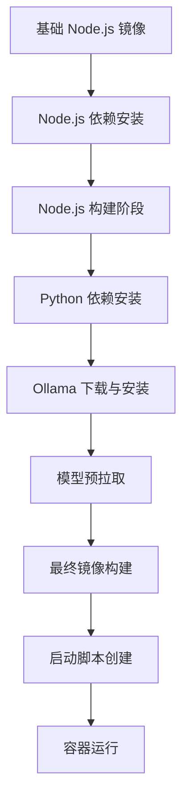
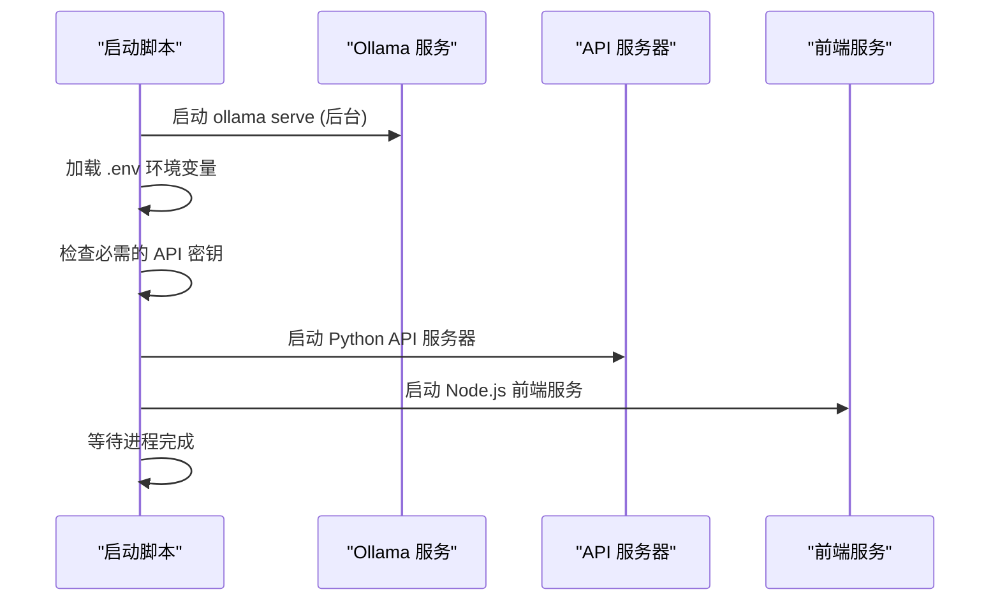
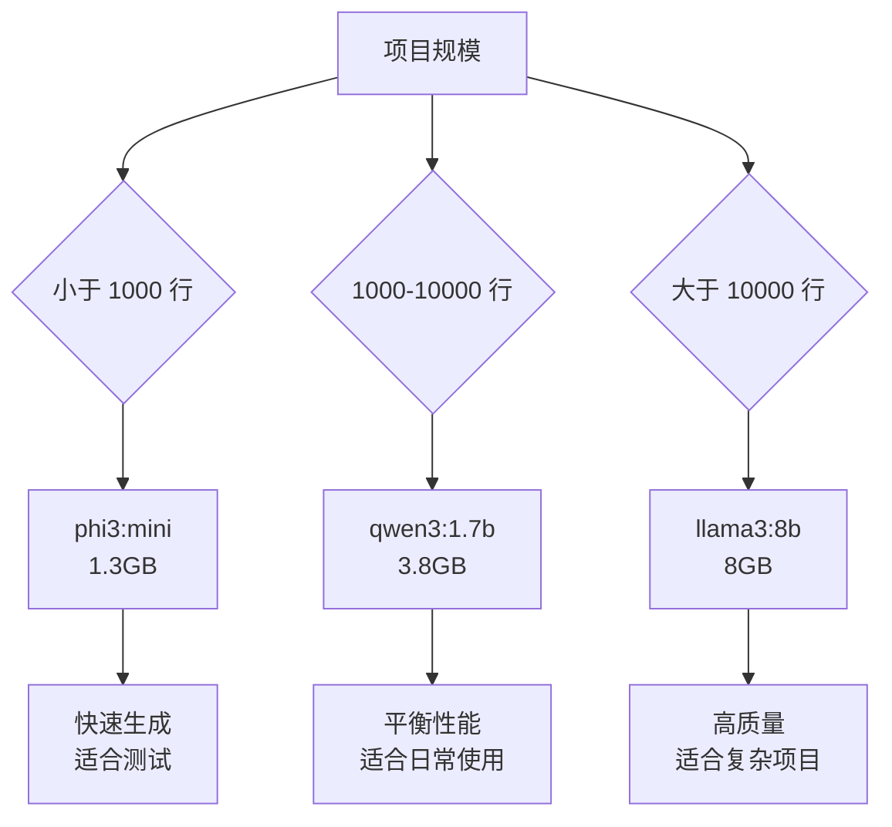

# 本地 Ollama 部署流程

<cite>
**本文档中引用的文件**
- [Dockerfile-ollama-local](file://Dockerfile-ollama-local)
- [Ollama-instruction.md](file://Ollama-instruction.md)
- [run.sh](file://run.sh)
- [api/config/embedder.json](file://api/config/embedder.json)
- [api/config/embedder.ollama.json.bak](file://api/config/embedder.ollama.json.bak)
- [api/config/generator.json](file://api/config/generator.json)
- [docker-compose.yml](file://docker-compose.yml)
- [api/main.py](file://api/main.py)
- [api/ollama_patch.py](file://api/ollama_patch.py)
- [api/tools/embedder.py](file://api/tools/embedder.py)
</cite>

## 目录
1. [简介](#简介)
2. [系统要求](#系统要求)
3. [环境准备](#环境准备)
4. [Ollama 客户端安装](#ollama-客户端安装)
5. [模型下载与配置](#模型下载与配置)
6. [DeepWiki 配置](#deepwiki-配置)
7. [Docker 镜像构建](#docker-镜像构建)
8. [容器运行](#容器运行)
9. [启动脚本详解](#启动脚本详解)
10. [环境变量配置](#环境变量配置)
11. [使用场景示例](#使用场景示例)
12. [故障排除](#故障排除)
13. [性能优化建议](#性能优化建议)

## 简介

DeepWiki 支持通过 Ollama 运行本地 AI 模型，为用户提供完全离线的代码文档生成解决方案。本指南详细介绍了从环境准备到服务运行的完整部署流程，包括 Docker 容器化部署和传统安装两种方式。

本地 Ollama 部署的优势：
- 完全离线运行，无需依赖云服务
- 避免 API 成本支出
- 提供更高的数据隐私保护
- 可自定义模型选择和参数配置

## 系统要求

### 硬件要求
- **CPU**: 4+ 核心推荐
- **内存**: 8GB 最低配置，16GB+ 推荐
- **存储空间**: 10GB+ 可用空间用于模型存储
- **GPU**: 可选但强烈推荐（提升处理速度）

### 软件要求
- Docker 20.10 或更高版本
- Python 3.11
- Node.js 20.x
- Git

## 环境准备

### 创建项目目录
```bash
mkdir deepwiki-ollama
cd deepwiki-ollama
```

### 克隆项目仓库
```bash
git clone https://github.com/AsyncFuncAI/deepwiki-open.git
cd deepwiki-open
```

### 检查项目结构
确认项目包含以下关键文件：
- `Dockerfile-ollama-local` - 本地 Ollama 部署专用 Dockerfile
- `Ollama-instruction.md` - Ollama 部署指南
- `api/config/embedder.json` - 嵌入器配置文件
- `api/config/generator.json` - 生成器配置文件

## Ollama 客户端安装

### Windows 平台

1. **下载安装程序**
   - 访问 [Ollama 官方网站](https://ollama.com/download)
   - 下载 Windows 安装程序

2. **安装过程**
   - 运行下载的安装程序
   - 按照屏幕指示完成安装
   - 安装完成后，Ollama 将在后台运行（可通过系统托盘图标确认）

3. **验证安装**
   ```bash
   ollama --version
   ```

### macOS 平台

1. **下载安装**
   - 访问 [Ollama 官方网站](https://ollama.com/download)
   - 下载 macOS 版本
   - 将 Ollama 拖拽到应用程序文件夹

2. **启动应用**
   - 从应用程序文件夹启动 Ollama
   - 应用启动后会在菜单栏显示状态图标

3. **验证安装**
   ```bash
   ollama --version
   ```

### Linux 平台

1. **使用安装脚本**
   ```bash
   curl -fsSL https://ollama.com/install.sh | sh
   ```

2. **验证安装**
   ```bash
   ollama --version
   ```

## 模型下载与配置

### 必需模型

DeepWiki 使用两个核心模型：
- **nomic-embed-text**: 代码嵌入模型
- **qwen3:1.7b**: 文档生成语言模型

### 下载模型
```bash
ollama pull nomic-embed-text
ollama pull qwen3:1.7b
```

### 模型验证
```bash
ollama list
```

输出应包含：
```
nomic-embed-text
qwen3:1.7b
```

### 模型配置选项

#### 不同模型对比

| 模型 | 大小 | 速度 | 质量 | 使用场景 |
|------|------|------|-------|----------|
| phi3:mini | 1.3GB | 快速 | 良好 | 小项目，快速测试 |
| qwen3:1.7b | 3.8GB | 中等 | 更好 | 默认选择，平衡性能 |
| llama3:8b | 8GB | 较慢 | 最佳 | 复杂项目，详细分析 |

### 自定义模型配置

修改 `api/config/generator.json` 中的模型设置：

```json
"ollama": {
  "default_model": "qwen3:1.7b",
  "supportsCustomModel": true,
  "models": {
    "qwen3:1.7b": {
      "options": {
        "temperature": 0.7,
        "top_p": 0.8,
        "num_ctx": 32000
      }
    }
  }
}
```

## DeepWiki 配置

### 环境变量配置

创建 `.env` 文件：

```bash
# DeepWiki 端口配置
PORT=8001

# Ollama 主机配置（可选）
# 如果 Ollama 在本地运行，默认值为 http://localhost:11434
# OLLAMA_HOST=your_ollama_host

# API 密钥（使用 Ollama 时不需要）
# OPENAI_API_KEY=
# GOOGLE_API_KEY=
```

### 嵌入器配置

#### 方法一：使用备份配置文件
```bash
cp api/config/embedder.ollama.json.bak api/config/embedder.json
```

#### 方法二：手动编辑配置
修改 `api/config/embedder.json`：

```json
{
  "embedder": {
    "client_class": "OllamaClient",
    "model_kwargs": {
      "model": "nomic-embed-text"
    }
  },
  "retriever": {
    "top_k": 20
  },
  "text_splitter": {
    "split_by": "word",
    "chunk_size": 350,
    "chunk_overlap": 100
  }
}
```

### 验证配置
```bash
# 加载依赖
python -m pip install poetry==2.0.1 && poetry install

# 启动 API 服务
python -m api.main
```

## Docker 镜像构建

### 构建基础镜像

#### 使用预构建镜像
```bash
docker pull ghcr.io/asyncfuncai/deepwiki-open:latest
```

#### 本地构建镜像

```bash
# 构建本地 Ollama 镜像
docker build -f Dockerfile-ollama-local -t deepwiki:ollama-local .

# 指定架构（Apple Silicon Mac）
docker build -f Dockerfile-ollama-local -t deepwiki:ollama-local --build-arg TARGETARCH=arm64 .

# 指定架构（Intel/AMD）
docker build -f Dockerfile-ollama-local -t deepwiki:ollama-local --build-arg TARGETARCH=amd64 .
```

### 构建过程详解

Dockerfile-ollama-local 的构建阶段：



**图表来源**
- [Dockerfile-ollama-local](file://Dockerfile-ollama-local#L1-L121)

### TARGETARCH 参数说明

构建过程中 `TARGETARCH` 参数的作用：

| 架构类型 | 用途 | 性能特点 |
|----------|------|----------|
| arm64 | Apple Silicon Mac、ARM 设备 | 优化的 ARM64 二进制文件，性能更优 |
| amd64 | Intel/AMD x86_64 设备 | 标准 x86_64 二进制文件 |

## 容器运行

### 基础运行命令

```bash
# 基础运行
docker run -p 3000:3000 -p 8001:8001 \
  --name deepwiki \
  -v ~/.adalflow:/root/.adalflow \
  deepwiki:ollama-local
```

### 带环境变量的运行

```bash
# 包含 OLLAMA_HOST 配置
docker run -p 3000:3000 -p 8001:8001 \
  --name deepwiki \
  -v ~/.adalflow:/root/.adalflow \
  -e OLLAMA_HOST=your_ollama_host \
  deepwiki:ollama-local
```

### 本地仓库分析模式

```bash
# 本地仓库挂载
docker run -p 3000:3000 -p 8001:8001 \
  --name deepwiki \
  -v ~/.adalflow:/root/.adalflow \
  -e OLLAMA_HOST=your_ollama_host \
  -v /path/to/your/repo:/app/local-repos/repo-name \
  deepwiki:ollama-local
```

### Docker Compose 方式

使用 `docker-compose.yml` 配置：

```yaml
services:
  deepwiki:
    build:
      context: .
      dockerfile: Dockerfile-ollama-local
    ports:
      - "${PORT:-8001}:${PORT:-8001}"
      - "3000:3000"
    environment:
      - PORT=${PORT:-8001}
      - NODE_ENV=production
      - SERVER_BASE_URL=http://localhost:${PORT:-8001}
    volumes:
      - ~/.adalflow:/root/.adalflow
    mem_limit: 6g
    mem_reservation: 2g
```

运行：
```bash
docker-compose up -d
```

## 启动脚本详解

### start.sh 脚本功能

Dockerfile 中创建的启动脚本 `/app/start.sh` 执行以下步骤：



**图表来源**
- [Dockerfile-ollama-local](file://Dockerfile-ollama-local#L89-L109)

### 启动顺序说明

1. **Ollama 服务启动** (`line 90-91`)
   ```bash
   ollama serve > /dev/null 2>&1 &
   ```
   - 后台启动 Ollama 服务
   - 重定向输出到空设备
   - 等待 20 秒确保服务就绪

2. **模型预拉取** (`line 48-51`)
   ```bash
   ollama pull nomic-embed-text
   ollama pull qwen3:1.7b
   ```
   - 下载嵌入模型
   - 下载生成模型

3. **环境变量加载** (`line 93-96`)
   ```bash
   if [ -f .env ]; then
     export $(grep -v "^#" .env | xargs -r)
   fi
   ```

4. **API 服务启动** (`line 105-106`)
   ```bash
   python -m api.main --port ${PORT:-8001} &
   ```

5. **前端服务启动** (`line 107`)
   ```bash
   PORT=3000 HOSTNAME=0.0.0.0 node server.js &
   ```

**章节来源**
- [Dockerfile-ollama-local](file://Dockerfile-ollama-local#L89-L109)

## 环境变量配置

### 关键环境变量

| 变量名 | 默认值 | 描述 | 必需性 |
|--------|--------|------|--------|
| `PORT` | 8001 | API 服务端口 | 可选 |
| `OLLAMA_HOST` | http://localhost:11434 | Ollama 服务地址 | 可选 |
| `NODE_ENV` | production | Node.js 环境模式 | 可选 |
| `SERVER_BASE_URL` | http://localhost:8001 | 服务器基础 URL | 可选 |

### OLLAMA_HOST 配置说明

#### 默认配置
```bash
OLLAMA_HOST=http://localhost:11434
```

#### 远程 Ollama 服务器
```bash
OLLAMA_HOST=http://remote-server:11434
```

#### 自定义端口
```bash
OLLAMA_HOST=http://localhost:12345
```

### 环境变量优先级

1. 容器启动时的 `-e` 参数
2. 挂载的 `.env` 文件
3. Dockerfile 中的默认值

**章节来源**
- [Dockerfile-ollama-local](file://Dockerfile-ollama-local#L112-L114)
- [api/ollama_patch.py](file://api/ollama_patch.py#L33)

## 使用场景示例

### 场景一：常规使用

```bash
# 1. 启动 Ollama 服务
ollama serve

# 2. 构建 Docker 镜像
docker build -f Dockerfile-ollama-local -t deepwiki:ollama-local .

# 3. 运行容器
docker run -p 3000:3000 -p 8001:8001 \
  --name deepwiki \
  -v ~/.adalflow:/root/.adalflow \
  deepwiki:ollama-local
```

### 场景二：本地仓库分析

```bash
# 1. 准备本地仓库
git clone https://github.com/example/project.git /path/to/local/repo

# 2. 运行容器
docker run -p 3000:3000 -p 8001:8001 \
  --name deepwiki \
  -v ~/.adalflow:/root/.adalflow \
  -v /path/to/local/repo:/app/local-repos/project-name \
  deepwiki:ollama-local
```

### 场景三：远程 Ollama 服务器

```bash
# 1. 在远程服务器上启动 Ollama
ssh remote-server
ollama serve

# 2. 在本地运行 DeepWiki
docker run -p 3000:3000 -p 8001:8001 \
  --name deepwiki \
  -v ~/.adalflow:/root/.adalflow \
  -e OLLAMA_HOST=http://remote-server:11434 \
  deepwiki:ollama-local
```

### 场景四：开发环境配置

```bash
# 1. 创建开发环境配置
cat > .env << EOF
PORT=8001
OLLAMA_HOST=http://localhost:11434
NODE_ENV=development
EOF

# 2. 使用 Docker Compose
docker-compose up -d
```

## 故障排除

### 常见问题及解决方案

#### 1. "无法连接到 Ollama 服务器"

**症状**: 
```
Could not connect to Ollama to check models
```

**解决方案**:
```bash
# 检查 Ollama 服务状态
ollama list

# 重启 Ollama 服务
ollama serve

# 检查端口是否被占用
netstat -tulpn | grep 11434
```

#### 2. 模型下载失败

**症状**: 
```
Ollama model 'nomic-embed-text' is not available
```

**解决方案**:
```bash
# 检查可用模型
ollama list

# 手动下载模型
ollama pull nomic-embed-text
ollama pull qwen3:1.7b

# 清理缓存重新下载
ollama pull --insecure nomic-embed-text
```

#### 3. 内存不足错误

**症状**: 
```
Out of memory errors
```

**解决方案**:
```bash
# 使用较小的模型
ollama pull phi3:mini

# 修改配置使用较小模型
sed -i 's/"model": "qwen3:1.7b"/"model": "phi3:mini"/' api/config/generator.json

# 限制容器内存使用
docker run --memory=4g ...
```

#### 4. 端口冲突

**症状**: 
```
Port 8001 or 3000 is already in use
```

**解决方案**:
```bash
# 查找占用端口的进程
lsof -i :8001
lsof -i :3000

# 终止占用进程或使用其他端口
docker run -p 8080:8001 -p 3001:3000 ...
```

### 调试技巧

#### 1. 查看容器日志
```bash
# 查看实时日志
docker logs -f deepwiki

# 查看特定时间段的日志
docker logs --since="2024-01-01T00:00:00" deepwiki
```

#### 2. 进入容器调试
```bash
# 进入正在运行的容器
docker exec -it deepwiki bash

# 检查 Ollama 状态
ollama list
ollama ps
```

#### 3. 网络连接测试
```bash
# 测试 Ollama 连接
curl http://localhost:11434/api/tags

# 测试 DeepWiki API
curl http://localhost:8001/health
```

**章节来源**
- [api/ollama_patch.py](file://api/ollama_patch.py#L21-L60)

## 性能优化建议

### 硬件优化

#### CPU 优化
- 使用 8 核心或更多 CPU
- 确保 CPU 支持 AVX2 指令集
- 避免 CPU 超频过度

#### 内存优化
- 分配至少 16GB RAM
- 使用 SSD 存储
- 配置足够的交换空间

#### GPU 加速（可选）
- NVIDIA GPU 推荐
- 安装 CUDA 支持
- 配置 GPU 内存分配

### 模型优化

#### 模型选择策略



#### 参数调优

```json
{
  "options": {
    "temperature": 0.7,      // 创造性 vs 一致性
    "top_p": 0.8,           // 词汇采样范围
    "num_ctx": 32000,       // 上下文窗口大小
    "num_gpu": 99,          // GPU 层数（如果可用）
    "num_thread": 8         // CPU 线程数
  }
}
```

### 系统优化

#### Docker 优化
```bash
# 设置资源限制
docker run --memory=8g --cpus=4 ...

# 使用 GPU 加速
docker run --gpus all ...

# 优化存储驱动
docker run --storage-opt size=50G ...
```

#### Ollama 优化
```bash
# 设置环境变量
export OLLAMA_NUM_PARALLEL=4
export OLLAMA_MAX_LOADED_MODELS=2

# 预热模型
ollama serve &
sleep 30
ollama pull nomic-embed-text
ollama pull qwen3:1.7b
```

### 监控指标

#### 性能监控
- **响应时间**: API 请求平均响应时间
- **内存使用率**: Ollama 和 DeepWiki 内存占用
- **CPU 使用率**: 处理器负载情况
- **磁盘 I/O**: 模型文件读写性能

#### 错误监控
- **连接超时**: Ollama 连接失败次数
- **模型加载失败**: 模型初始化错误
- **内存溢出**: 内存不足异常
- **端口冲突**: 端口绑定错误

通过遵循本指南的步骤，您应该能够成功部署和运行 DeepWiki 的本地 Ollama 版本。如遇到任何问题，请参考故障排除部分或查阅项目文档获取更多信息。