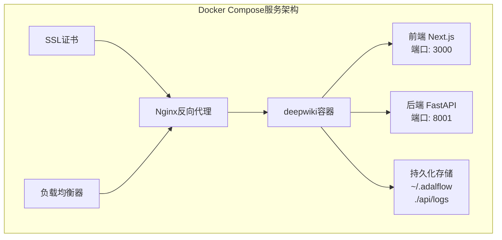
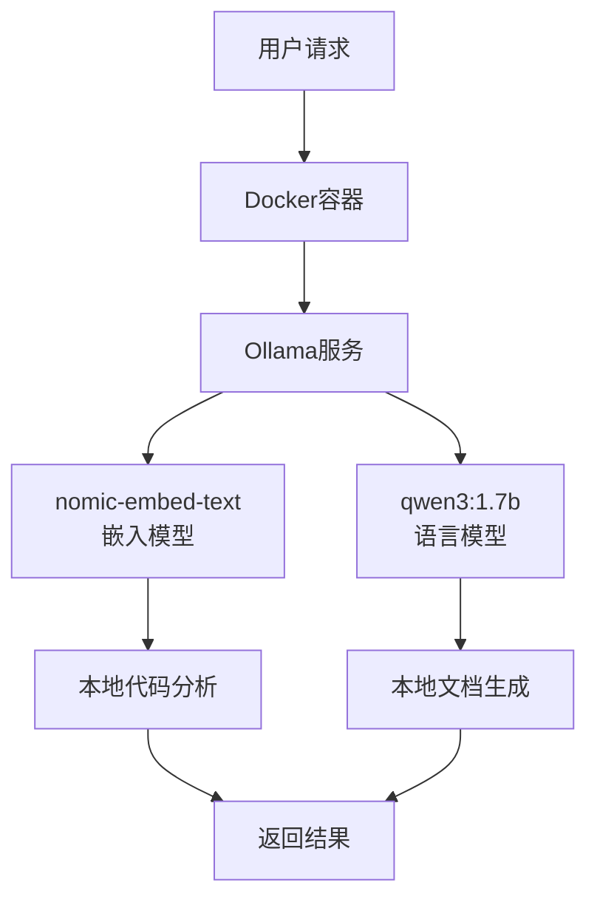
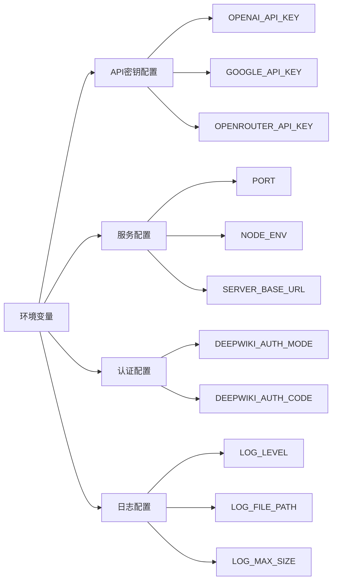
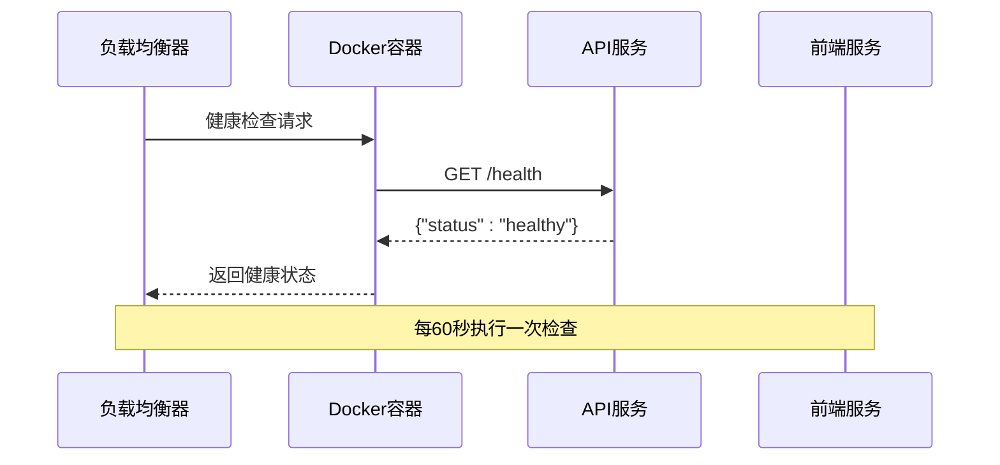
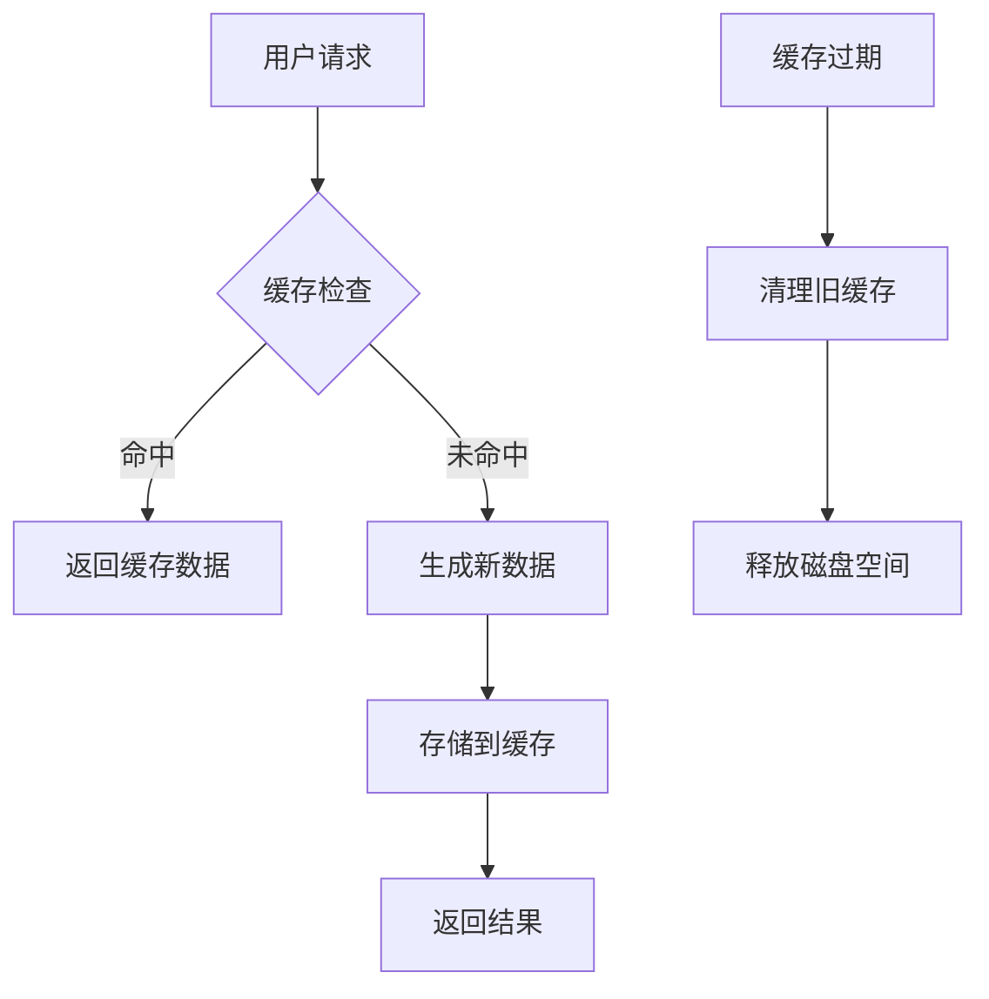
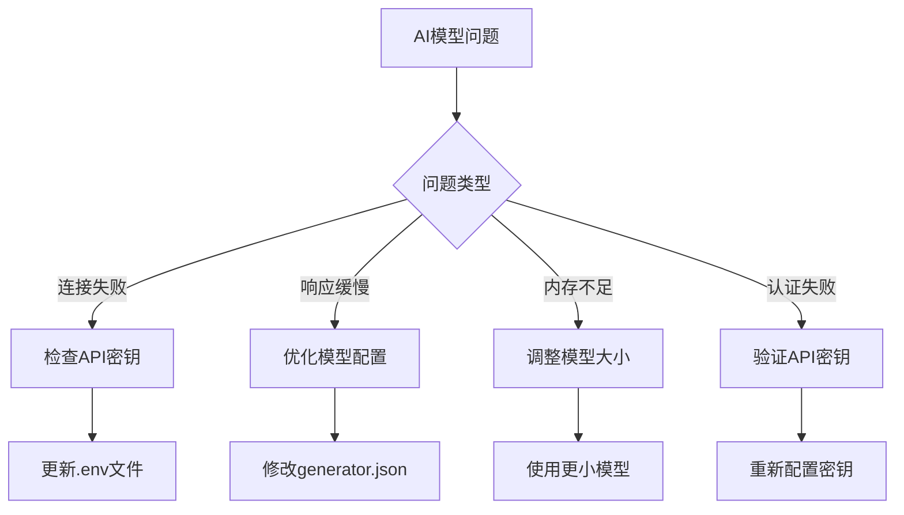

# 部署指南

<cite>
**本文档中引用的文件**
- [docker-compose.yml](file://docker-compose.yml)
- [Dockerfile](file://Dockerfile)
- [Dockerfile-ollama-local](file://Dockerfile-ollama-local)
- [run.sh](file://run.sh)
- [Ollama-instruction.md](file://Ollama-instruction.md)
- [package.json](file://package.json)
- [api/main.py](file://api/main.py)
- [api/config.py](file://api/config.py)
- [api/api.py](file://api/api.py)
- [api/logging_config.py](file://api/logging_config.py)
</cite>

## 目录
1. [简介](#简介)
2. [系统要求](#系统要求)
3. [Docker部署方案](#docker部署方案)
4. [本地部署方案](#本地部署方案)
5. [云部署建议](#云部署建议)
6. [配置管理](#配置管理)
7. [监控与日志](#监控与日志)
8. [高可用性配置](#高可用性配置)
9. [性能优化](#性能优化)
10. [故障排除](#故障排除)

## 简介

DeepWiki是一个基于AI的代码文档生成工具，支持多种部署方式。本指南将帮助您将DeepWiki部署到生产环境或个人服务器，包括Docker容器化部署、本地部署以及云平台部署方案。

DeepWiki的核心架构包含：
- **前端应用**：基于Next.js的React应用程序，运行在3000端口
- **后端API**：基于FastAPI的Python服务，运行在8001端口
- **AI模型支持**：支持OpenAI、Google、Ollama等多种AI服务提供商
- **向量数据库**：用于存储代码嵌入和知识库数据

## 系统要求

### 最低硬件要求

| 组件 | 最低配置 | 推荐配置 |
|------|----------|----------|
| CPU | 2核心 | 4核心+ |
| 内存 | 4GB | 8GB+ |
| 存储 | 10GB可用空间 | 50GB+ |
| 网络 | 稳定互联网连接 | 高速网络 |

### 资源需求评估

#### 向量数据库与LLM推理
- **内存需求**：根据使用的AI模型大小而定
  - 小型模型（如phi3:mini）：2-4GB RAM
  - 中型模型（如qwen3:1.7b）：4-8GB RAM  
  - 大型模型（如llama3:8b）：8GB+ RAM
- **存储需求**：模型文件约3-10GB，缓存数据视项目规模而定

#### 生产环境推荐配置
- **CPU**：8核心以上，支持并发处理多个请求
- **内存**：16GB+，确保AI模型和应用同时运行
- **存储**：SSD存储，至少100GB用于模型和缓存
- **网络**：千兆网卡，确保快速数据传输

## Docker部署方案

### 使用docker-compose.yml启动完整栈

Docker Compose是部署DeepWiki最简单的方式，它包含了前端、后端和可选的Ollama服务。

#### 基础部署步骤

1. **准备环境变量文件**
```bash
# 创建.env文件
cat > .env << EOF
# API密钥配置
OPENAI_API_KEY=your_openai_api_key
GOOGLE_API_KEY=your_google_api_key

# 应用配置
PORT=8001
NODE_ENV=production
SERVER_BASE_URL=http://localhost:8001
LOG_LEVEL=INFO
LOG_FILE_PATH=api/logs/application.log

# 认证配置（可选）
DEEPWIKI_AUTH_MODE=false
DEEPWIKI_AUTH_CODE=your_auth_code
EOF
```

2. **启动服务**
```bash
# 使用默认配置启动
docker-compose up -d

# 或指定环境变量启动
LOG_LEVEL=DEBUG LOG_FILE_PATH=./debug.log docker-compose up -d
```

#### Docker Compose配置详解



**图表来源**
- [docker-compose.yml](file://docker-compose.yml#L1-L30)
- [Dockerfile](file://Dockerfile#L80-L111)

#### 容器资源限制

Docker Compose文件中预设了资源限制：
- **内存限制**：6GB最大内存，2GB预留内存
- **健康检查**：每60秒检查一次，超时10秒，重试3次
- **启动延迟**：30秒启动期确保服务稳定

**章节来源**
- [docker-compose.yml](file://docker-compose.yml#L1-L30)
- [Dockerfile](file://Dockerfile#L80-L111)

### Dockerfile-ollama-local特殊用途

Dockerfile-ollama-local专门用于在本地运行Ollama模型，实现完全离线的AI能力。

#### 架构特点



**图表来源**
- [Dockerfile-ollama-local](file://Dockerfile-ollama-local#L27-L52)

#### 支持的架构

- **AMD64**：适用于Intel/AMD处理器
- **ARM64**：适用于Apple Silicon和ARM处理器

**章节来源**
- [Dockerfile-ollama-local](file://Dockerfile-ollama-local#L27-L52)

## 本地部署方案

### 前端部署

1. **安装依赖**
```bash
# 安装Node.js依赖
npm install

# 构建生产版本
npm run build
```

2. **启动前端**
```bash
# 开发模式
npm run dev

# 生产模式
npm run start
```

### 后端部署

1. **安装Python环境**
```bash
# 安装Poetry包管理器
pip install poetry==2.0.1

# 安装Python依赖
poetry install
```

2. **启动后端服务**
```bash
# 使用run.sh脚本
./run.sh

# 或直接运行
uv run -m api.main
```

### 环境变量配置

本地部署需要设置以下环境变量：

| 变量名 | 描述 | 示例值 |
|--------|------|--------|
| OPENAI_API_KEY | OpenAI API密钥 | sk-xxx |
| GOOGLE_API_KEY | Google API密钥 | AIzaSyxxx |
| PORT | API端口 | 8001 |
| NODE_ENV | 运行环境 | production |
| LOG_LEVEL | 日志级别 | INFO |

**章节来源**
- [package.json](file://package.json#L1-L39)
- [api/main.py](file://api/main.py#L1-L80)
- [run.sh](file://run.sh#L1-L1)

## 云部署建议

### AWS EC2部署

#### 实例选择建议

| 场景 | 实例类型 | vCPU | 内存 | 存储 | 价格范围 |
|------|----------|------|------|------|----------|
| 开发测试 | t3.medium | 2 | 4GB | EBS | $0.0416/小时 |
| 生产环境 | c5.large | 2 | 4GB | SSD | $0.085/小时 |
| 高负载 | c5.xlarge | 4 | 8GB | SSD | $0.17/小时 |

#### 部署步骤

1. **创建EC2实例**
```bash
# SSH连接到实例
ssh -i your-key.pem ec2-user@your-instance-ip

# 更新系统
sudo yum update -y
```

2. **安装Docker**
```bash
# 安装Docker
sudo amazon-linux-extras install docker
sudo service docker start
sudo usermod -a -G docker ec2-user

# 登出并重新登录使组变更生效
exit
ssh -i your-key.pem ec2-user@your-instance-ip
```

3. **部署应用**
```bash
# 克隆代码
git clone https://github.com/AsyncFuncAI/deepwiki-open.git
cd deepwiki-open

# 设置环境变量
echo "OPENAI_API_KEY=your_key" > .env
echo "GOOGLE_API_KEY=your_key" >> .env

# 启动服务
docker-compose up -d
```

### Google Cloud部署

#### Compute Engine部署

1. **创建虚拟机实例**
   - 区域：us-central1
   - 实例类型：e2-standard-4
   - 系统镜像：Ubuntu 22.04 LTS
   - 启用HTTP/HTTPS访问

2. **安装Docker和Docker Compose**
```bash
# 安装Docker
curl -fsSL https://get.docker.com -o get-docker.sh
sudo sh get-docker.sh

# 安装Docker Compose
sudo curl -L "https://github.com/docker/compose/releases/download/v2.20.2/docker-compose-$(uname -s)-$(uname -m)" -o /usr/local/bin/docker-compose
sudo chmod +x /usr/local/bin/docker-compose
```

### VPS部署

#### DigitalOcean Droplets

1. **选择合适的配置**
   - Basic: 2GB RAM, 1 vCPU, 50GB SSD
   - Standard: 4GB RAM, 2 vCPU, 100GB SSD
   - GPU: 8GB RAM, 4 vCPU, 150GB SSD

2. **部署流程**
```bash
# 创建swap文件（如果内存不足）
sudo fallocate -l 4G /swapfile
sudo chmod 600 /swapfile
sudo mkswap /swapfile
sudo swapon /swapfile

# 安装Docker
curl -fsSL https://get.docker.com -o get-docker.sh
sudo sh get-docker.sh

# 配置Docker开机自启
sudo systemctl enable docker
sudo systemctl start docker
```

## 配置管理

### 环境变量配置

DeepWiki支持通过环境变量进行灵活配置：



**图表来源**
- [api/config.py](file://api/config.py#L18-L41)
- [api/logging_config.py](file://api/logging_config.py#L12-L85)

### 挂载卷配置

为了实现配置持久化和数据保存，建议使用以下挂载卷：

| 挂载点 | 用途 | 必需性 |
|--------|------|--------|
| ~/.adalflow | 存储仓库和嵌入数据 | 必需 |
| ./api/logs | 存储应用日志文件 | 推荐 |
| ./certs | 自定义SSL证书 | 可选 |
| ./config | 自定义配置文件 | 可选 |

### 配置文件结构

```bash
# 项目目录结构
deepwiki-open/
├── .env                    # 环境变量配置
├── docker-compose.yml      # Docker编排配置
├── certs/                 # SSL证书目录
├── api/config/           # 应用配置文件
│   ├── embedder.json     # 嵌入模型配置
│   ├── generator.json    # 生成模型配置
│   ├── lang.json         # 语言配置
│   └── repo.json         # 仓库过滤配置
└── api/logs/             # 日志文件目录
```

**章节来源**
- [docker-compose.yml](file://docker-compose.yml#L17-L19)
- [api/config.py](file://api/config.py#L96-L118)

## 监控与日志

### 日志配置

DeepWiki内置了强大的日志系统，支持多种配置选项：

#### 日志级别配置

| 级别 | 描述 | 使用场景 |
|------|------|----------|
| DEBUG | 详细调试信息 | 开发和问题排查 |
| INFO | 一般信息记录 | 正常运行状态 |
| WARNING | 警告信息 | 潜在问题提醒 |
| ERROR | 错误信息 | 异常情况记录 |
| CRITICAL | 严重错误 | 系统级故障 |

#### 日志轮转配置

```bash
# 默认配置
LOG_MAX_SIZE=10MB          # 单个日志文件最大10MB
LOG_BACKUP_COUNT=5         # 保留5个备份文件
LOG_FILE_PATH=api/logs/application.log  # 日志文件路径
```

### 健康检查

DeepWiki提供了完整的健康检查机制：



**图表来源**
- [docker-compose.yml](file://docker-compose.yml#L24-L29)
- [api/api.py](file://api/api.py#L540-L547)

### 监控指标

#### 关键性能指标

| 指标类别 | 监控项 | 目标值 | 告警阈值 |
|----------|--------|--------|----------|
| 响应时间 | API响应延迟 | < 2秒 | > 5秒 |
| 可用性 | 服务可用率 | > 99.9% | < 99% |
| 资源使用 | CPU使用率 | < 70% | > 85% |
| 资源使用 | 内存使用率 | < 80% | > 90% |
| 错误率 | HTTP 5xx错误 | < 0.1% | > 1% |

#### 监控工具集成

```bash
# Prometheus监控配置示例
scrape_configs:
  - job_name: 'deepwiki'
    static_configs:
      - targets: ['localhost:8001']
    metrics_path: '/health'
```

**章节来源**
- [api/logging_config.py](file://api/logging_config.py#L12-L85)
- [docker-compose.yml](file://docker-compose.yml#L24-L29)
- [api/api.py](file://api/api.py#L540-L547)

## 高可用性配置

### 负载均衡

#### Nginx反向代理配置

```nginx
upstream deepwiki_backend {
    server localhost:8001 weight=1 max_fails=3 fail_timeout=30s;
    server localhost:8002 weight=1 max_fails=3 fail_timeout=30s;
}

upstream deepwiki_frontend {
    server localhost:3000 weight=1 max_fails=3 fail_timeout=30s;
    server localhost:3001 weight=1 max_fails=3 fail_timeout=30s;
}

server {
    listen 80;
    server_name your-domain.com;
    
    # 前端静态资源
    location / {
        proxy_pass http://deepwiki_frontend;
        proxy_set_header Host $host;
        proxy_set_header X-Real-IP $remote_addr;
    }
    
    # API接口
    location /api/ {
        proxy_pass http://deepwiki_backend;
        proxy_set_header Host $host;
        proxy_set_header X-Real-IP $remote_addr;
    }
    
    # WebSocket支持
    location /ws/ {
        proxy_pass http://deepwiki_backend;
        proxy_http_version 1.1;
        proxy_set_header Upgrade $http_upgrade;
        proxy_set_header Connection "upgrade";
    }
}
```

### 自动重启策略

#### Docker Restart Policy

```yaml
services:
  deepwiki:
    restart: unless-stopped
    # 其他配置...
```

#### systemd服务配置

```ini
[Unit]
Description=DeepWiki Service
After=docker.service
Requires=docker.service

[Service]
Type=simple
ExecStart=/usr/bin/docker-compose up
ExecStop=/usr/bin/docker-compose down
Restart=always
RestartSec=10

[Install]
WantedBy=multi-user.target
```

### 数据备份策略

#### 自动备份脚本

```bash
#!/bin/bash
# DeepWiki数据备份脚本

BACKUP_DIR="/backup/deepwiki"
DATE=$(date +%Y%m%d_%H%M%S)

# 创建备份目录
mkdir -p $BACKUP_DIR

# 备份配置文件
tar -czf $BACKUP_DIR/config_$DATE.tar.gz ~/.adalflow

# 备份日志文件
tar -czf $BACKUP_DIR/logs_$DATE.tar.gz ./api/logs

# 清理超过30天的备份
find $BACKUP_DIR -name "*.tar.gz" -mtime +30 -delete
```

## 性能优化

### 缓存策略

#### 向量缓存配置

DeepWiki使用智能缓存机制来提升性能：



**图表来源**
- [api/api.py](file://api/api.py#L404-L457)

#### 缓存配置参数

| 参数 | 默认值 | 说明 |
|------|--------|------|
| 缓存目录 | ~/.adalflow/wikicache | 缓存文件存储位置 |
| 缓存有效期 | 永久有效 | 直到手动删除 |
| 文件命名格式 | deepwiki_cache_{repo_type}_{owner}_{repo}_{language}.json | 唯一标识缓存文件 |

### 并发处理优化

#### Gunicorn配置

```bash
# 生产环境Gunicorn配置
gunicorn -w 4 -k uvicorn.workers.UvicornWorker \
         --bind 0.0.0.0:8001 \
         --max-requests 1000 \
         --max-requests-jitter 100 \
         --timeout 30 \
         api.main:app
```

#### WebSocket优化

```python
# WebSocket连接池配置
websocket_connections = {
    'max_connections': 1000,
    'timeout': 30,
    'ping_interval': 20,
    'ping_timeout': 10
}
```

**章节来源**
- [api/api.py](file://api/api.py#L404-L457)

## 故障排除

### 常见问题及解决方案

#### Docker部署问题

| 问题 | 原因 | 解决方案 |
|------|------|----------|
| 容器启动失败 | 端口冲突 | 更改端口映射或停止占用端口的服务 |
| 内存不足 | 资源限制过低 | 增加mem_limit和mem_reservation |
| 权限错误 | 挂载卷权限问题 | 修改挂载目录权限或使用正确的用户ID |
| 网络连接失败 | 网络配置问题 | 检查防火墙规则和网络配置 |

#### AI模型问题



#### 日志分析

##### 查看应用日志

```bash
# 查看实时日志
docker-compose logs -f deepwiki

# 查看特定时间段的日志
docker-compose logs --since="2024-01-01T00:00:00" deepwiki

# 查看错误日志
docker-compose logs deepwiki | grep ERROR
```

##### 分析日志模式

```bash
# 统计错误频率
docker-compose logs deepwiki | grep ERROR | wc -l

# 分析响应时间
docker-compose logs deepwiki | grep "GET /api/" | awk '{print $NF}'

# 检查健康检查状态
docker-compose exec deepwiki curl -f http://localhost:8001/health
```

### 性能调优

#### 内存优化

```bash
# 监控内存使用
docker stats deepwiki

# 调整JVM堆内存（如果使用）
export JAVA_OPTS="-Xmx4g -Xms2g"
```

#### 网络优化

```bash
# 优化TCP参数
echo 'net.core.somaxconn = 1024' >> /etc/sysctl.conf
echo 'net.ipv4.tcp_max_syn_backlog = 2048' >> /etc/sysctl.conf
sysctl -p
```

### 安全加固

#### HTTPS配置

```nginx
server {
    listen 443 ssl http2;
    server_name your-domain.com;
    
    ssl_certificate /etc/ssl/certs/your-cert.crt;
    ssl_certificate_key /etc/ssl/private/your-key.key;
    
    # SSL安全配置
    ssl_protocols TLSv1.2 TLSv1.3;
    ssl_ciphers ECDHE-RSA-AES256-GCM-SHA512:DHE-RSA-AES256-GCM-SHA512;
    ssl_prefer_server_ciphers off;
    
    # HSTS配置
    add_header Strict-Transport-Security "max-age=31536000; includeSubDomains" always;
}
```

#### 认证配置

```bash
# 启用基本认证
htpasswd -c /etc/nginx/.htpasswd admin

# Nginx认证配置
location /admin {
    auth_basic "Restricted Area";
    auth_basic_user_file /etc/nginx/.htpasswd;
    proxy_pass http://deepwiki_backend;
}
```

**章节来源**
- [api/logging_config.py](file://api/logging_config.py#L12-L85)
- [docker-compose.yml](file://docker-compose.yml#L24-L29)

## 结论

本部署指南涵盖了DeepWiki从开发环境到生产环境的完整部署流程。通过Docker容器化部署，您可以快速启动服务；通过云平台部署，可以实现高可用性和弹性扩展；通过合理的监控和维护，可以确保系统的稳定运行。

无论选择哪种部署方式，都建议：
1. 制定详细的部署计划和回滚方案
2. 建立完善的监控和告警机制
3. 定期进行安全审计和漏洞扫描
4. 保持软件版本的及时更新

通过遵循本指南的最佳实践，您可以成功部署一个高性能、高可用的DeepWiki实例，为团队提供强大的代码文档生成能力。