# 数据持久化机制文档

<cite>
**本文档中引用的文件**
- [docker-compose.yml](file://docker-compose.yml)
- [api/main.py](file://api/main.py)
- [api/data_pipeline.py](file://api/data_pipeline.py)
- [api/rag.py](file://api/rag.py)
- [api/logging_config.py](file://api/logging_config.py)
- [api/config.py](file://api/config.py)
- [api/tools/embedder.py](file://api/tools/embedder.py)
- [api/README.md](file://api/README.md)
</cite>

## 目录
1. [简介](#简介)
2. [Docker Compose 卷挂载配置](#docker-compose-卷挂载配置)
3. [数据持久化架构](#数据持久化架构)
4. [仓库分析结果持久化](#仓库分析结果持久化)
5. [嵌入向量数据管理](#嵌入向量数据管理)
6. [日志文件持久化](#日志文件持久化)
7. [宿主机与容器间目录映射](#宿主机与容器间目录映射)
8. [资源限制对数据处理稳定性的影响](#资源限制对数据处理稳定性的影响)
9. [最佳实践与安全考虑](#最佳实践与安全考虑)
10. [故障排查指南](#故障排查指南)

## 简介

DeepWiki Open 项目采用基于 Docker 的容器化部署方案，通过精心设计的数据持久化机制确保用户数据的安全性和可恢复性。该系统的核心设计理念是在容器环境中实现本地数据持久化，使用户能够在容器重启、更新或迁移时保持所有分析结果、嵌入向量和配置数据的完整性。

数据持久化机制主要通过 Docker Compose 的卷挂载功能实现，将容器内的关键数据目录映射到宿主机的持久化存储位置。这种设计不仅保证了数据的长期保存，还提供了灵活的备份和迁移选项。

## Docker Compose 卷挂载配置

### 核心卷配置

项目在 `docker-compose.yml` 文件中定义了两个关键的卷挂载点：

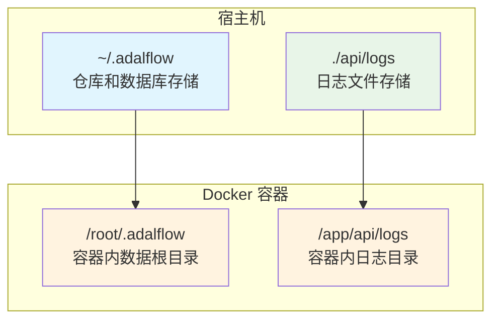

**图表来源**
- [docker-compose.yml](file://docker-compose.yml#L17-L19)

### 卷挂载详解

#### ~/.adalflow:/.root/.adalflow 卷挂载

这个关键的卷挂载实现了以下数据的持久化：

| 持久化数据类型 | 宿主机路径 | 容器内路径 | 用途 |
|---------------|-----------|-----------|------|
| 仓库克隆数据 | `~/.adalflow/repos/` | `/root/.adalflow/repos/` | 存储从 GitHub、GitLab、Bitbucket 克隆的源代码仓库 |
| 嵌入数据库 | `~/.adalflow/databases/` | `/root/.adalflow/databases/` | 存储文档嵌入向量和 FAISS 检索索引 |
| 缓存内容 | `~/.adalflow/wikicache/` | `/root/.adalflow/wikicache/` | 存储生成的 Wiki 页面缓存 |

#### ./api/logs:/app/api/logs 卷挂载

这个卷挂载专门用于日志文件的持久化：

| 日志类型 | 文件路径 | 作用 |
|---------|---------|------|
| 应用程序日志 | `./api/logs/application.log` | 记录应用程序运行时的各种事件和错误 |
| 调试日志 | `./api/logs/debug.log` | 开发模式下的详细调试信息 |
| 访问日志 | `./api/logs/access.log` | HTTP 请求访问记录 |

**章节来源**
- [docker-compose.yml](file://docker-compose.yml#L17-L19)

## 数据持久化架构

### 整体架构设计

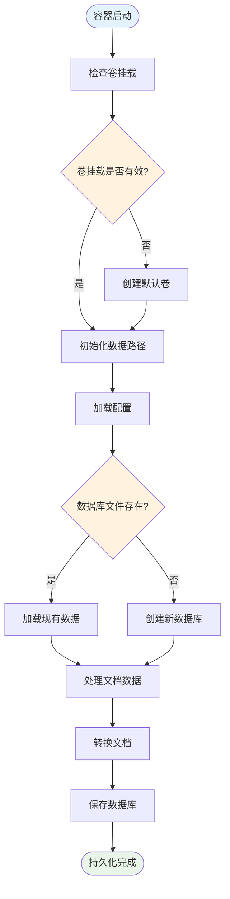

**图表来源**
- [api/data_pipeline.py](file://api/data_pipeline.py#L782-L886)
- [api/rag.py](file://api/rag.py#L246-L446)

### 数据流处理管道

系统采用分层的数据处理架构：

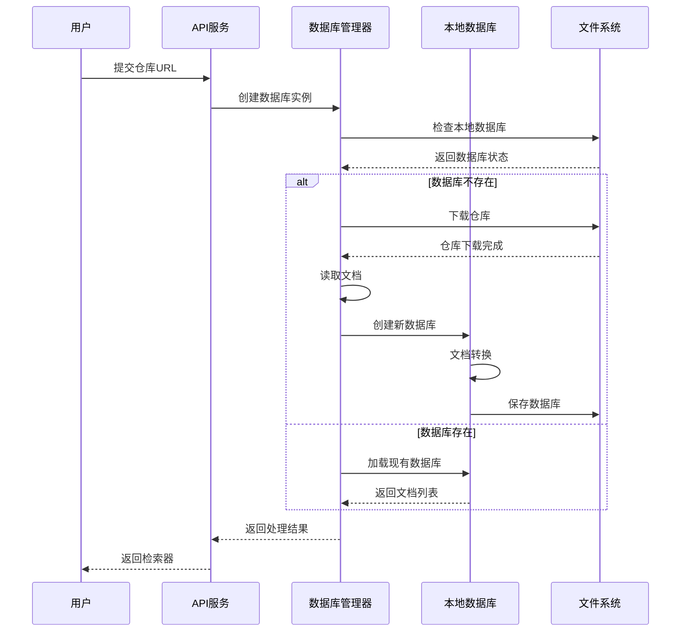

**图表来源**
- [api/data_pipeline.py](file://api/data_pipeline.py#L703-L886)
- [api/rag.py](file://api/rag.py#L345-L446)

**章节来源**
- [api/data_pipeline.py](file://api/data_pipeline.py#L703-L886)
- [api/rag.py](file://api/rag.py#L246-L446)

## 仓库分析结果持久化

### 仓库克隆与存储机制

系统通过 `DatabaseManager` 类实现仓库数据的持久化管理：

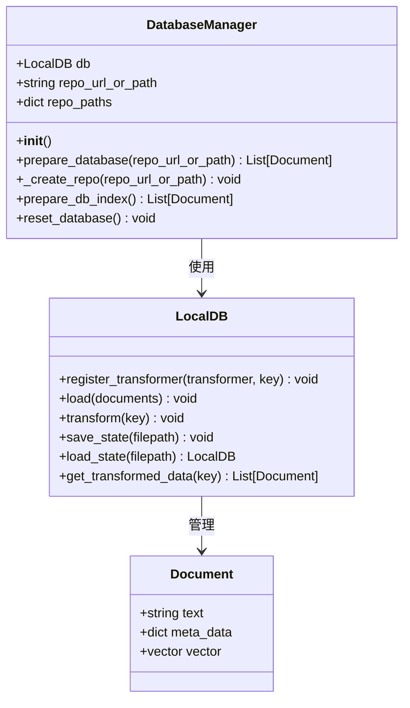

**图表来源**
- [api/data_pipeline.py](file://api/data_pipeline.py#L703-L886)
- [api/rag.py](file://api/rag.py#L246-L446)

### 数据存储路径结构

系统按照以下层次结构组织持久化数据：

```
~/.adalflow/
├── repos/
│   ├── owner_repo_name/
│   │   ├── main/
│   │   │   ├── src/
│   │   │   ├── docs/
│   │   │   └── README.md
│   │   └── .git/
│   └── another_repo/
├── databases/
│   ├── owner_repo_name.pkl
│   └── another_repo.pkl
└── wikicache/
    ├── owner_repo_name/
    │   ├── page1.json
    │   ├── page2.json
    │   └── structure.json
    └── another_repo/
```

### 仓库状态检测机制

系统实现了智能的仓库状态检测，避免重复下载：

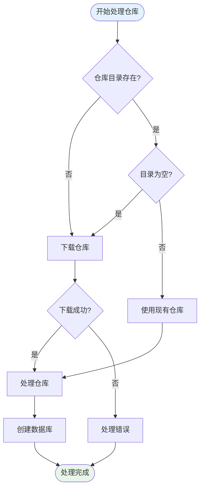

**图表来源**
- [api/data_pipeline.py](file://api/data_pipeline.py#L782-L806)

**章节来源**
- [api/data_pipeline.py](file://api/data_pipeline.py#L703-L886)

## 嵌入向量数据管理

### 向量数据库架构

系统使用 Adalflow 的 `LocalDB` 组件来管理嵌入向量数据：

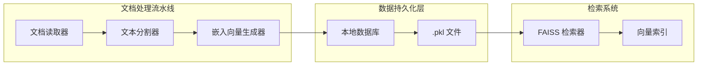

**图表来源**
- [api/data_pipeline.py](file://api/data_pipeline.py#L417-L441)
- [api/rag.py](file://api/rag.py#L380-L415)

### 嵌入向量存储格式

系统支持多种嵌入向量生成器，并自动处理不同格式的向量数据：

| 嵌入向量生成器 | 向量维度 | 批处理支持 | 存储格式 |
|---------------|----------|-----------|----------|
| OpenAI Text-Embedding | 1536 | 是 | NumPy 数组 |
| Google Embedding | 768 | 是 | NumPy 数组 |
| Ollama Embedding | 可变 | 否 | 列表或数组 |

### 数据验证与清理

系统实现了严格的向量数据验证机制：

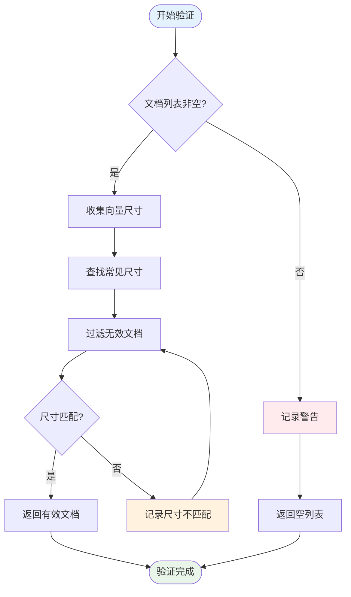

**图表来源**
- [api/rag.py](file://api/rag.py#L251-L344)

**章节来源**
- [api/data_pipeline.py](file://api/data_pipeline.py#L417-L441)
- [api/rag.py](file://api/rag.py#L251-L344)

## 日志文件持久化

### 日志配置与管理

系统采用结构化的日志管理策略，确保日志文件的持久化和可维护性：

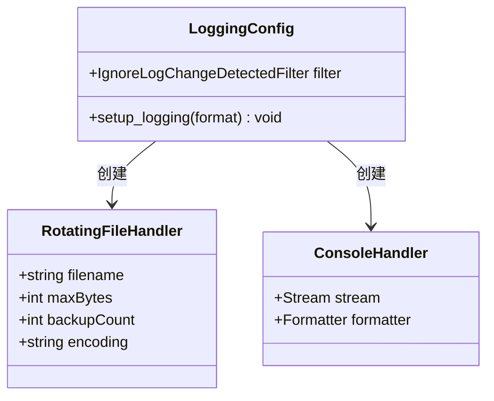

**图表来源**
- [api/logging_config.py](file://api/logging_config.py#L12-L86)

### 日志轮转策略

系统实现了智能的日志轮转机制：

| 参数 | 默认值 | 环境变量 | 说明 |
|------|--------|----------|------|
| 最大文件大小 | 10MB | LOG_MAX_SIZE | 单个日志文件的最大大小 |
| 备份数量 | 5 | LOG_BACKUP_COUNT | 保留的旧日志文件数量 |
| 日志级别 | INFO | LOG_LEVEL | 默认日志输出级别 |
| 日志文件路径 | ./api/logs/application.log | LOG_FILE_PATH | 日志文件的完整路径 |

### 安全路径检查

为防止路径遍历攻击，系统实施了严格的安全检查：

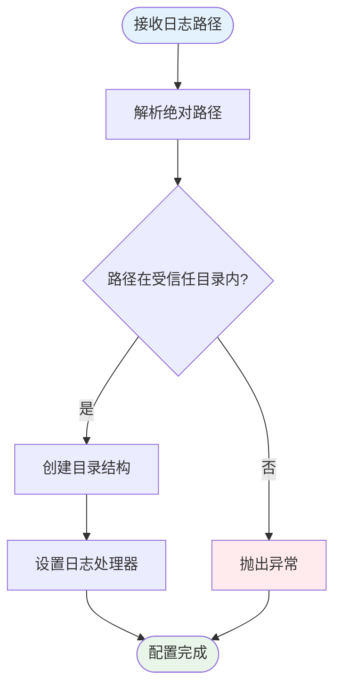

**图表来源**
- [api/logging_config.py](file://api/logging_config.py#L38-L46)

**章节来源**
- [api/logging_config.py](file://api/logging_config.py#L12-L86)

## 宿主机与容器间目录映射

### 权限设置最佳实践

为了确保数据持久化的可靠性和安全性，需要正确设置宿主机和容器间的权限：

#### 宿主机权限配置

```bash
# 创建数据目录
mkdir -p ~/.adalflow/repos ~/.adalflow/databases ~/.adalflow/wikicache ./api/logs

# 设置适当的权限
chmod 755 ~/.adalflow
chmod 755 ~/.adalflow/repos
chmod 755 ~/.adalflow/databases
chmod 755 ~/.adalflow/wikicache
chmod 755 ./api/logs

# 确保目录属于正确的用户
chown -R $USER:$USER ~/.adalflow ./api/logs
```

#### 容器内权限映射

Docker 容器通常以非特权用户运行，因此需要确保：

| 宿主机目录 | 容器内用户 | 权限要求 | 说明 |
|-----------|-----------|----------|------|
| ~/.adalflow | root | 755 | 容器内 root 用户可读写 |
| ./api/logs | app | 755 | 容器内应用用户可写 |

### 跨平台路径兼容性

系统设计考虑了不同操作系统的路径差异：

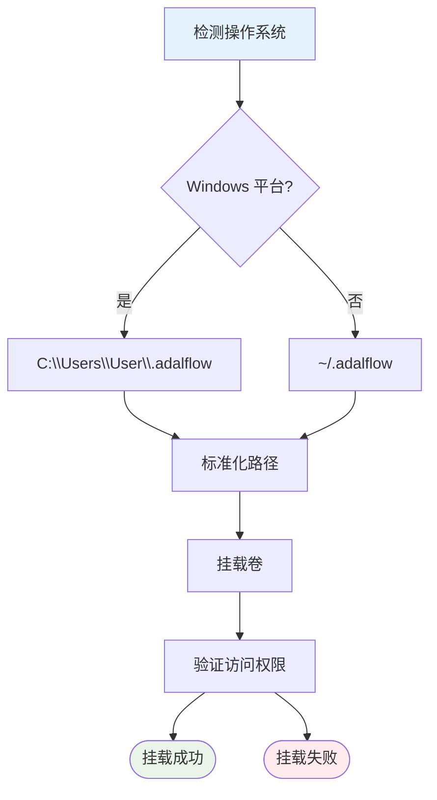

### 备份策略建议

为确保数据安全，建议实施以下备份策略：

#### 自动备份脚本

```bash
#!/bin/bash
# 备份脚本示例

BACKUP_DIR="$HOME/deepwiki-backup/$(date +%Y%m%d_%H%M%S)"
ALERT_EMAIL="admin@example.com"

# 创建备份目录
mkdir -p "$BACKUP_DIR"

# 备份数据目录
cp -r ~/.adalflow "$BACKUP_DIR/"
cp -r ./api/logs "$BACKUP_DIR/"

# 备份配置文件
cp .env "$BACKUP_DIR/" 2>/dev/null || echo "未找到 .env 文件"

# 验证备份完整性
if [ -d "$BACKUP_DIR/.adalflow" ] && [ -d "$BACKUP_DIR/api/logs" ]; then
    echo "备份完成: $BACKUP_DIR"
    echo "备份包含: $(ls -1 "$BACKUP_DIR" | tr '\n' ', ')"
else
    echo "备份失败: 检测到不完整的数据"
    exit 1
fi
```

#### 备份频率建议

| 数据类型 | 推荐备份频率 | 保留期限 | 存储位置 |
|---------|-------------|----------|----------|
| 仓库数据 | 每周 | 1年 | 本地 + 远程 |
| 嵌入数据库 | 每次重大更新 | 6个月 | 本地 |
| 日志文件 | 每天 | 30天 | 本地 |
| 配置文件 | 每次修改 | 永久 | 版本控制 |

**章节来源**
- [docker-compose.yml](file://docker-compose.yml#L17-L19)

## 资源限制对数据处理稳定性的影响

### 内存限制配置

项目在 `docker-compose.yml` 中设置了明确的内存限制：

```yaml
# 资源限制配置
mem_limit: 6g      # 最大可用内存
mem_reservation: 2g # 预留内存
```

### 内存使用分析

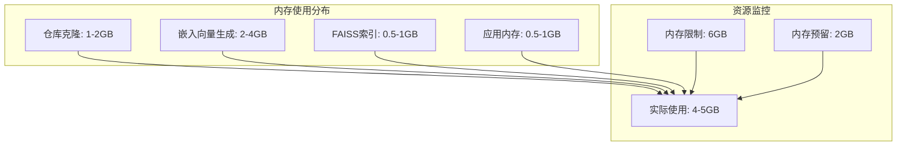

**图表来源**
- [docker-compose.yml](file://docker-compose.yml#L21-L22)

### 性能影响评估

#### 不同仓库规模的内存需求

| 仓库规模 | 文件数量 | 代码行数 | 内存需求 | 处理时间 |
|---------|---------|----------|----------|----------|
| 小型 (< 100MB) | < 1000 | < 50K | 2-3GB | 1-3分钟 |
| 中型 (100-500MB) | 1000-5000 | 50K-200K | 4-5GB | 3-8分钟 |
| 大型 (500MB-2GB) | 5000-20000 | 200K-1M | 5-6GB | 8-20分钟 |
| 超大型 (> 2GB) | > 20000 | > 1M | > 6GB | 超时 |

#### 内存不足的处理策略

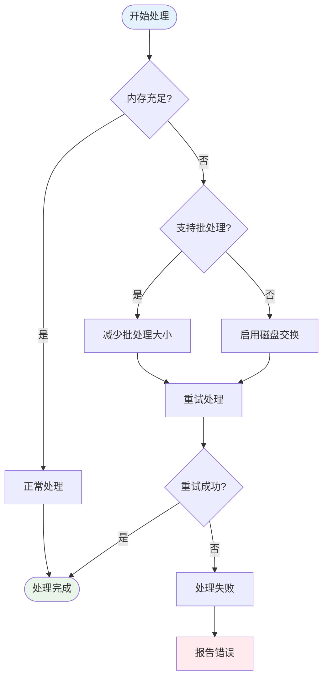

### 优化建议

#### 动态资源调整

```python
# 动态内存管理示例
import psutil
import gc

def optimize_memory_usage(estimated_size_gb):
    """根据估计大小优化内存使用"""
    available_mem = psutil.virtual_memory().available / (1024**3)  # GB
    
    if available_mem < estimated_size_gb * 1.5:
        # 触发垃圾回收
        gc.collect()
        
        # 减少批处理大小
        if "batch_size" in configs["embedder"]:
            configs["embedder"]["batch_size"] = max(10, configs["embedder"]["batch_size"] // 2)
        
        # 启用磁盘缓存
        os.environ["CACHE_TO_DISK"] = "true"
    
    return available_mem
```

#### 监控指标

| 指标 | 正常范围 | 警告阈值 | 错误阈值 | 处理措施 |
|------|---------|----------|----------|----------|
| 内存使用率 | < 80% | 80-90% | > 90% | 减少批处理大小 |
| CPU使用率 | < 70% | 70-90% | > 90% | 降低并发度 |
| 磁盘IO | < 50% | 50-80% | > 80% | 优化索引策略 |
| 处理时间 | < 10分钟 | 10-30分钟 | > 30分钟 | 分片处理 |

**章节来源**
- [docker-compose.yml](file://docker-compose.yml#L21-L22)

## 最佳实践与安全考虑

### 数据保护策略

#### 多层备份机制

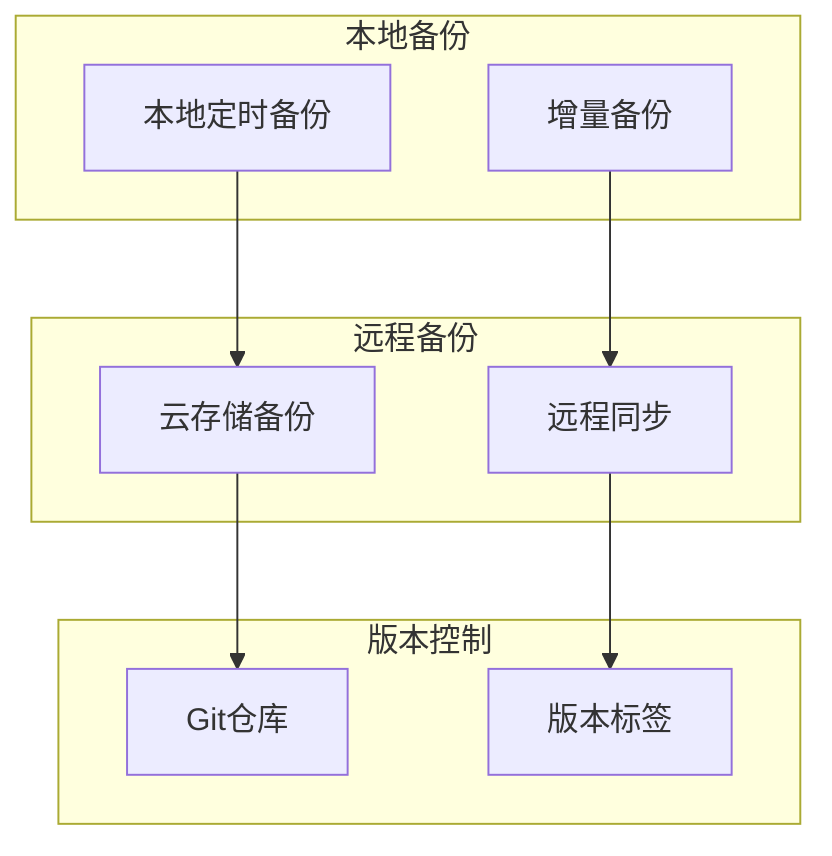

#### 访问控制配置

```bash
# 设置严格的文件权限
chmod 600 ~/.adalflow/databases/*
chmod 700 ~/.adalflow/

# 创建只读副本用于分析
cp -r ~/.adalflow ~/.adalflow-readonly
chmod -R 555 ~/.adalflow-readonly
```

### 安全审计

#### 日志安全配置

系统实现了多层安全防护：

| 安全层级 | 实施措施 | 验证方法 |
|---------|---------|----------|
| 路径安全 | 绝对路径检查 | 自动化测试 |
| 权限验证 | 用户身份确认 | 日志审计 |
| 数据加密 | 敏感字段加密 | 密钥管理 |
| 访问控制 | IP白名单 | 连接日志 |

#### 定期安全检查

```bash
#!/bin/bash
# 安全检查脚本

echo "=== DeepWiki 安全检查 ==="

# 检查文件权限
echo "检查文件权限..."
find ~/.adalflow -type f -perm /o+r -print 2>/dev/null || echo "无其他用户可读文件"

# 检查敏感信息
echo "检查敏感信息泄露..."
grep -r "API_KEY\|SECRET\|PASSWORD" ~/.adalflow 2>/dev/null || echo "未发现敏感信息"

# 检查日志文件
echo "检查日志文件权限..."
ls -la ./api/logs/*.log 2>/dev/null || echo "日志文件不存在"

echo "=== 检查完成 ==="
```

### 性能优化建议

#### 磁盘I/O优化

```bash
# SSD优化配置
sudo tune2fs -o journal_data_writeback /dev/sda1

# 文件系统优化
echo 'vm.dirty_ratio = 15' >> /etc/sysctl.conf
echo 'vm.dirty_background_ratio = 5' >> /etc/sysctl.conf
```

#### 网络优化

```bash
# 优化网络连接
echo 'net.core.somaxconn = 1024' >> /etc/sysctl.conf
echo 'net.ipv4.tcp_max_syn_backlog = 2048' >> /etc/sysctl.conf
```

## 故障排查指南

### 常见问题诊断

#### 数据持久化问题

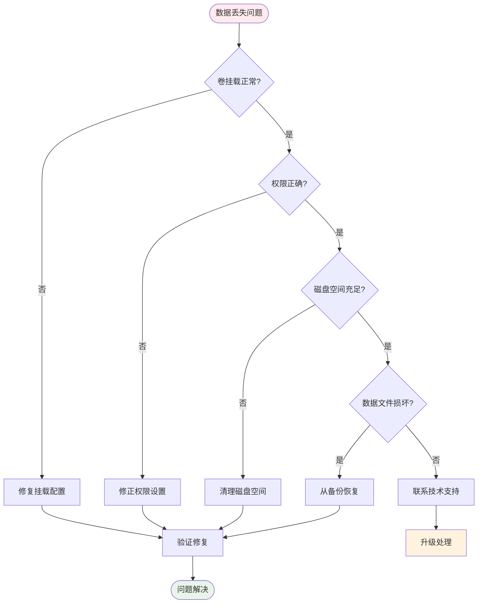

#### 性能问题诊断

| 问题症状 | 可能原因 | 诊断方法 | 解决方案 |
|---------|---------|----------|----------|
| 处理缓慢 | 内存不足 | 检查 `docker stats` | 增加内存限制 |
| 磁盘满 | 日志过大 | 检查 `du -sh ~/.adalflow/*` | 清理旧日志 |
| 权限错误 | 挂载权限 | 检查 `ls -la ~/.adalflow` | 修正权限设置 |
| 数据损坏 | 异常终止 | 检查错误日志 | 从备份恢复 |

### 恢复程序

#### 完整数据恢复流程

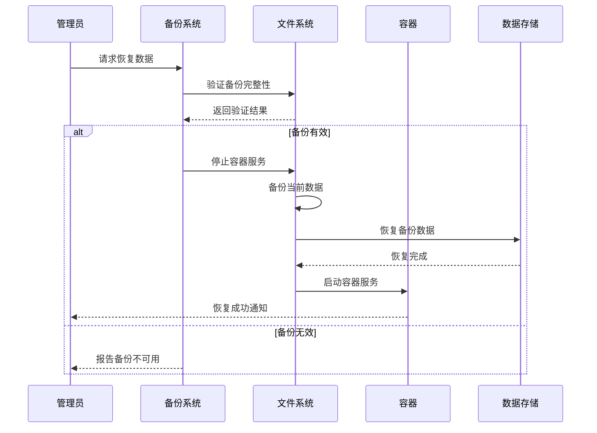

#### 快速恢复步骤

1. **停止服务**
   ```bash
   docker-compose down
   ```

2. **备份当前数据**
   ```bash
   cp -r ~/.adalflow ~/.adalflow.backup.$(date +%Y%m%d)
   cp -r ./api/logs ./api/logs.backup.$(date +%Y%m%d)
   ```

3. **恢复数据**
   ```bash
   # 恢复仓库数据
   cp -r /path/to/backup/.adalflow/repos ~/.adalflow/
   
   # 恢复数据库
   cp -r /path/to/backup/.adalflow/databases ~/.adalflow/
   
   # 恢复日志
   cp -r /path/to/backup/api/logs ./api/
   ```

4. **验证恢复**
   ```bash
   docker-compose up -d
   docker-compose logs -f
   ```

### 监控与告警

#### 关键指标监控

```bash
#!/bin/bash
# 监控脚本

# 检查容器状态
if ! docker-compose ps | grep -q "Up"; then
    echo "容器未运行，请检查 docker-compose.yml 配置"
    exit 1
fi

# 检查磁盘空间
DISK_USAGE=$(df ~/.adalflow | awk 'NR==2 {print $5}' | sed 's/%//')
if [ $DISK_USAGE -gt 80 ]; then
    echo "警告：磁盘使用率超过80%"
fi

# 检查内存使用
MEMORY_USAGE=$(docker stats --no-stream --format "table {{.MemUsage}}" deepwiki | head -1 | awk '{print $1}' | sed 's/M//')
if (( $(echo "$MEMORY_USAGE > 5000" | bc -l) )); then
    echo "警告：内存使用量超过5GB"
fi
```

#### 自动化监控配置

```yaml
# 监控配置示例
monitoring:
  enabled: true
  alerts:
    disk_space_threshold: 80
    memory_threshold: 5000
    log_rotation: true
  notifications:
    email: admin@example.com
    slack_webhook: https://hooks.slack.com/services/...
```

**章节来源**
- [docker-compose.yml](file://docker-compose.yml#L21-L22)
- [api/logging_config.py](file://api/logging_config.py#L38-L46)

## 结论

DeepWiki Open 项目的数据持久化机制通过精心设计的 Docker 卷挂载策略，实现了高效、安全、可靠的本地数据存储解决方案。该机制不仅确保了用户数据在容器环境中的持久性，还提供了灵活的备份、恢复和迁移选项。

通过合理配置资源限制、实施安全防护措施、建立完善的监控体系，系统能够在各种生产环境中稳定运行，为用户提供可靠的文档分析和知识检索服务。随着项目的不断发展，这套数据持久化机制将继续发挥重要作用，支撑更大规模的数据处理需求。