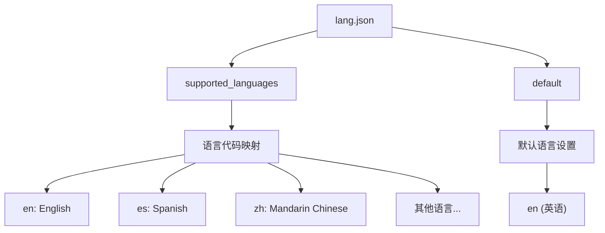
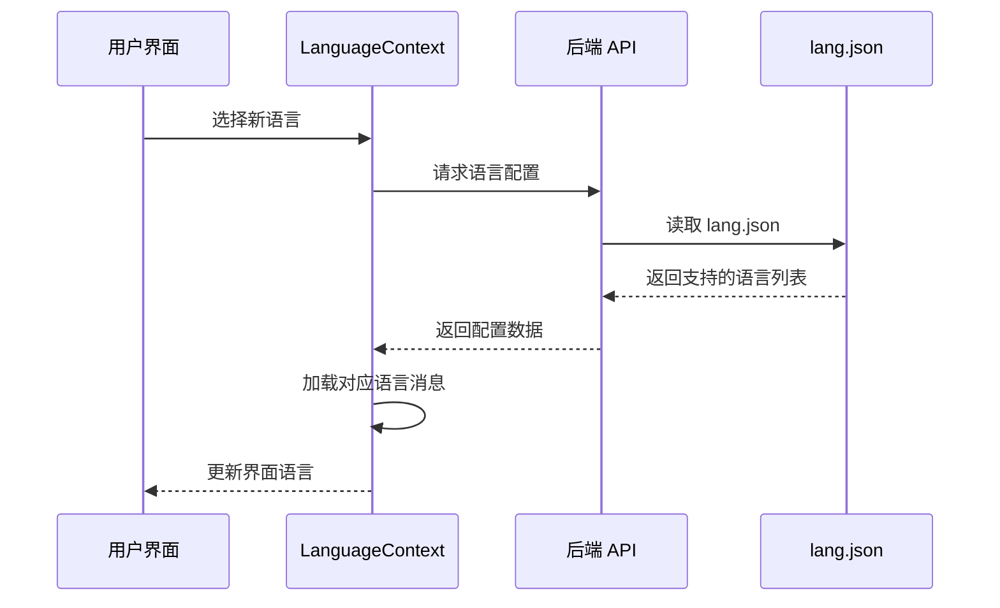
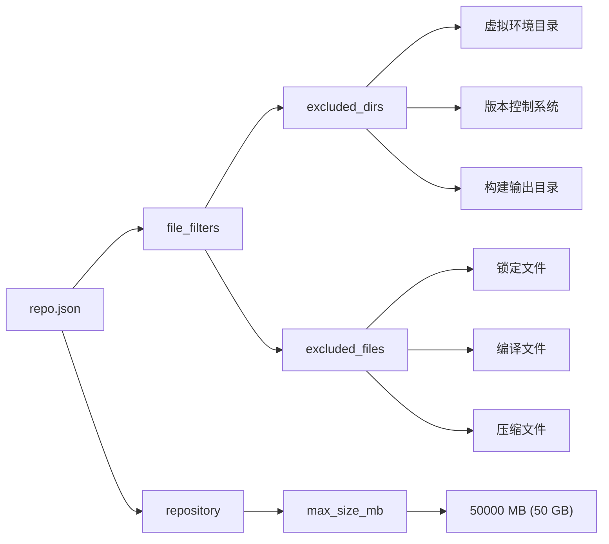
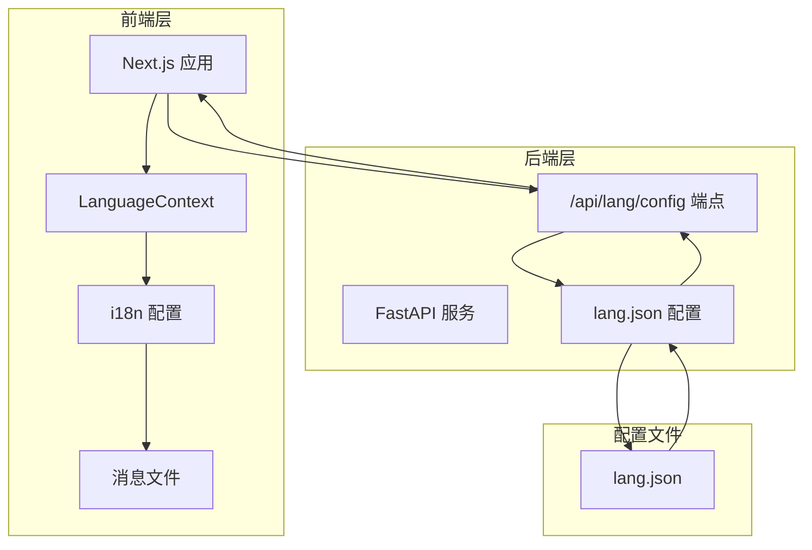
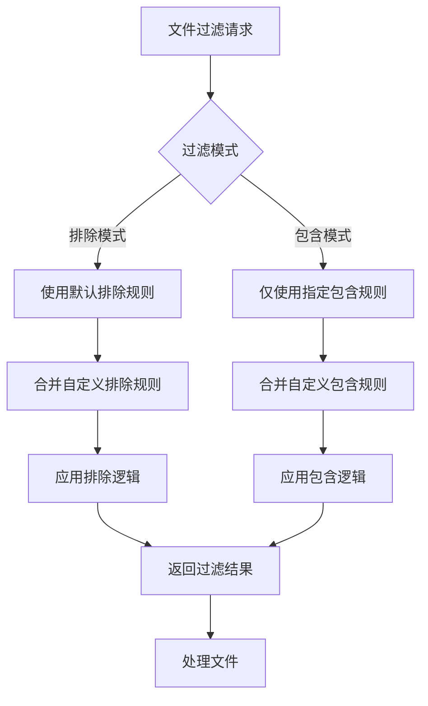
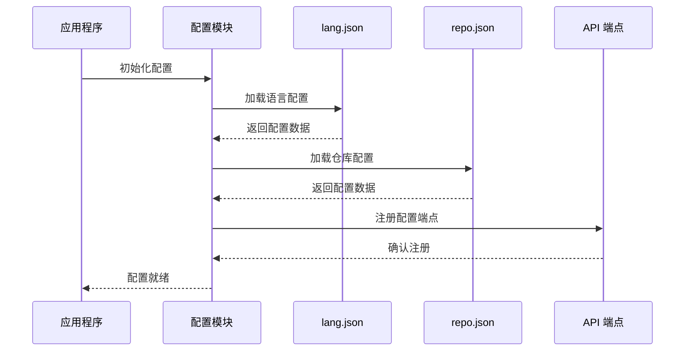

# 其他配置文件

<cite>
**本文档中引用的文件**
- [lang.json](file://api/config/lang.json)
- [repo.json](file://api/config/repo.json)
- [i18n.ts](file://src/i18n.ts)
- [LanguageContext.tsx](file://src/contexts/LanguageContext.tsx)
- [es.json](file://src/messages/es.json)
- [config.py](file://api/config.py)
- [data_pipeline.py](file://api/data_pipeline.py)
- [api.py](file://api/api.py)
- [UserSelector.tsx](file://src/components/UserSelector.tsx)
- [websocketClient.ts](file://src/utils/websocketClient.ts)
</cite>

## 目录
1. [简介](#简介)
2. [lang.json 配置文件](#langjson-配置文件)
3. [repo.json 配置文件](#repojson-配置文件)
4. [多语言系统架构](#多语言系统架构)
5. [文件过滤机制](#文件过滤机制)
6. [配置文件集成流程](#配置文件集成流程)
7. [配置示例](#配置示例)
8. [故障排除](#故障排除)

## 简介

DeepWiki-Open 使用两个核心配置文件来管理应用程序的语言支持和仓库文件过滤规则。`lang.json` 负责多语言国际化配置，而 `repo.json` 则控制仓库分析过程中的文件过滤策略。这些配置文件确保了应用程序能够正确处理多种语言界面，并在分析代码仓库时排除不必要的文件类型。

## lang.json 配置文件

### 文件结构概述

`lang.json` 是一个 JSON 格式的配置文件，位于 `api/config/` 目录下，定义了应用程序支持的所有语言及其默认设置。



**图表来源**
- [lang.json](file://api/config/lang.json#L1-L16)

### supported_languages 多语言映射机制

`supported_languages` 对象定义了所有支持的语言及其显示名称：

| 语言代码 | 显示名称 | 完整语言名 |
|---------|----------|-----------|
| `en` | English | 英语 |
| `es` | Spanish (Español) | 西班牙语 |
| `ja` | Japanese (日本語) | 日语 |
| `zh` | Mandarin Chinese (中文) | 普通话中文 |
| `zh-tw` | Traditional Chinese (繁體中文) | 繁体中文 |
| `kr` | Korean (한국어) | 韩语 |
| `vi` | Vietnamese (Tiếng Việt) | 越南语 |
| `pt-br` | Brazilian Portuguese (Português Brasileiro) | 巴西葡萄牙语 |
| `fr` | Français (French) | 法语 |
| `ru` | Русский (Russian) | 俄语 |

### default 默认语言设置

`default` 字段指定了应用程序的默认语言，当检测不到用户偏好的语言或语言配置文件损坏时使用。当前默认值为 `"en"`（英语）。

### 与前端 i18n 系统的集成方式

前端国际化系统通过以下组件实现语言切换功能：



**图表来源**
- [LanguageContext.tsx](file://src/contexts/LanguageContext.tsx#L69-L99)
- [api.py](file://api/api.py#L149-L151)

**章节来源**
- [lang.json](file://api/config/lang.json#L1-L16)
- [LanguageContext.tsx](file://src/contexts/LanguageContext.tsx#L69-L99)
- [i18n.ts](file://src/i18n.ts#L1-L15)

## repo.json 配置文件

### 文件过滤器结构

`repo.json` 包含两个主要部分：`file_filters` 和 `repository` 配置。



**图表来源**
- [repo.json](file://api/config/repo.json#L1-L129)

### excluded_dirs 排除目录规则

排除目录列表包含常见的开发工具和构建系统的输出目录：

#### 核心排除目录
- **虚拟环境**: `.venv/`, `venv/`, `env/`, `virtualenv/`
- **包管理器**: `node_modules/`, `bower_components/`, `jspm_packages/`
- **版本控制**: `.git/`, `.svn/`, `.hg/`, `.bzr/`
- **缓存目录**: `__pycache__/`, `.pytest_cache/`, `.mypy_cache/`
- **构建输出**: `dist/`, `build/`, `out/`, `target/`, `bin/`, `obj/`

#### 开发工具特定排除
- **IDE 目录**: `.idea/`, `.vscode/`, `.vs/`, `.eclipse/`, `.settings/`
- **日志目录**: `logs/`, `log/`, `tmp/`, `temp/`

### excluded_files 排除文件规则

排除文件列表涵盖各种构建产物、锁定文件和临时文件：

#### 锁定文件
- **JavaScript**: `yarn.lock`, `pnpm-lock.yaml`, `npm-shrinkwrap.json`, `package-lock.json`
- **Python**: `poetry.lock`, `Pipfile.lock`, `requirements.txt.lock`, `Pipfile.lock`
- **Rust**: `Cargo.lock`
- **PHP**: `composer.lock`

#### 编译和构建产物
- **二进制文件**: `*.exe`, `*.dll`, `*.so`, `*.dylib`, `*.class`, `*.pyc`
- **压缩文件**: `*.zip`, `*.tar`, `*.gz`, `*.rar`, `*.7z`
- **媒体文件**: `*.jpg`, `*.png`, `*.mp4`, `*.mp3`

#### 系统和临时文件
- **系统文件**: `.DS_Store`, `Thumbs.db`, `desktop.ini`
- **配置文件**: `*.cfg`, `*.ini`, `.gitignore`, `.gitattributes`
- **临时文件**: `*.tmp`, `*.temp`, `*.bak`

### repository.max_size_mb 安全考量

`max_size_mb` 设置为 50000 MB（50 GB），这是出于以下安全考虑：

1. **资源保护**: 防止大型仓库占用过多服务器资源
2. **性能优化**: 确保系统响应时间在可接受范围内
3. **存储限制**: 避免无限增长的缓存占用磁盘空间
4. **网络传输**: 控制下载和传输的数据量

**章节来源**
- [repo.json](file://api/config/repo.json#L1-L129)
- [data_pipeline.py](file://api/data_pipeline.py#L189-L313)

## 多语言系统架构

### 前后端语言配置同步

应用程序采用前后端分离的语言配置架构：



**图表来源**
- [LanguageContext.tsx](file://src/contexts/LanguageContext.tsx#L17-L203)
- [i18n.ts](file://src/i18n.ts#L1-L15)
- [api.py](file://api/api.py#L149-L151)

### 语言检测和回退机制

系统实现了智能的语言检测和回退策略：

1. **浏览器语言检测**: 自动检测用户的浏览器语言设置
2. **本地存储恢复**: 从 localStorage 恢复上次选择的语言
3. **默认语言回退**: 当检测失败时使用英语作为默认语言
4. **配置文件验证**: 验证配置文件的完整性和有效性

**章节来源**
- [LanguageContext.tsx](file://src/contexts/LanguageContext.tsx#L25-L66)
- [LanguageContext.tsx](file://src/contexts/LanguageContext.tsx#L101-L150)

## 文件过滤机制

### 过滤模式

系统支持两种文件过滤模式：



**图表来源**
- [data_pipeline.py](file://api/data_pipeline.py#L189-L222)

### 文件匹配算法

系统使用精确匹配和通配符匹配相结合的方式：

#### 目录匹配
- **精确匹配**: 完全匹配目录路径
- **部分匹配**: 检查目录是否在文件路径中

#### 文件匹配
- **精确文件名**: 完全匹配文件名
- **通配符匹配**: 支持 `*` 通配符
- **扩展名匹配**: 基于文件扩展名进行匹配

### 过滤优先级

文件过滤遵循以下优先级顺序：

1. **用户自定义规则** (最高优先级)
2. **配置文件规则** (中等优先级)
3. **默认系统规则** (最低优先级)

**章节来源**
- [data_pipeline.py](file://api/data_pipeline.py#L257-L294)
- [UserSelector.tsx](file://src/components/UserSelector.tsx#L136-L522)

## 配置文件集成流程

### 启动时配置加载

应用程序启动时按以下顺序加载配置：



**图表来源**
- [config.py](file://api/config.py#L303-L331)
- [api.py](file://api/api.py#L149-L151)

### 实时配置更新

系统支持运行时配置的动态更新：

1. **语言切换**: 用户界面实时更新语言
2. **文件过滤**: 动态调整文件包含/排除规则
3. **大小限制**: 运行时检查仓库大小限制

**章节来源**
- [config.py](file://api/config.py#L229-L260)
- [api.py](file://api/api.py#L229-L260)

## 配置示例

### 新增西班牙语支持

要添加西班牙语支持，需要修改 `lang.json` 文件：

```json
{
  "supported_languages": {
    "en": "English",
    "es": "Spanish (Español)",
    "ja": "Japanese (日本語)",
    "zh": "Mandarin Chinese (中文)",
    "zh-tw": "Traditional Chinese (繁體中文)",
    "kr": "Korean (한국어)",
    "vi": "Vietnamese (Tiếng Việt)",
    "pt-br": "Brazilian Portuguese (Português Brasileiro)",
    "fr": "Français (French)",
    "ru": "Русский (Russian)"
  },
  "default": "en"
}
```

同时需要创建对应的翻译文件 `src/messages/es.json`，包含完整的西班牙语翻译内容。

### 扩展排除 .log 文件类型

要在 `repo.json` 中添加对 `.log` 文件类型的排除，可以修改 `excluded_files` 数组：

```json
{
  "file_filters": {
    "excluded_dirs": [
      "./.venv/", 
      "./venv/", 
      "./env/", 
      "./virtualenv/",
      "./node_modules/", 
      "./bower_components/", 
      "./jspm_packages/",
      "./.git/", 
      "./.svn/", 
      "./.hg/", 
      "./.bzr/"
    ],
    "excluded_files": [
      "yarn.lock", 
      "pnpm-lock.yaml", 
      "npm-shrinkwrap.json", 
      "poetry.lock",
      "Pipfile.lock", 
      "requirements.txt.lock", 
      "Cargo.lock", 
      "composer.lock",
      ".lock", 
      ".DS_Store", 
      "Thumbs.db", 
      "desktop.ini", 
      "*.lnk", 
      ".env", 
      ".env.*", 
      "*.env", 
      "*.cfg", 
      "*.ini", 
      ".flaskenv", 
      ".gitignore", 
      ".gitattributes", 
      ".gitmodules", 
      ".github", 
      ".gitlab-ci.yml", 
      ".prettierrc", 
      ".eslintrc", 
      ".eslintignore", 
      ".stylelintrc", 
      ".editorconfig", 
      ".jshintrc", 
      ".pylintrc", 
      ".flake8", 
      "mypy.ini", 
      "pyproject.toml", 
      "tsconfig.json", 
      "webpack.config.js", 
      "babel.config.js", 
      "rollup.config.js", 
      "jest.config.js", 
      "karma.conf.js", 
      "vite.config.js", 
      "next.config.js", 
      "*.min.js", 
      "*.min.css", 
      "*.bundle.js", 
      "*.bundle.css", 
      "*.map", 
      "*.gz", 
      "*.zip", 
      "*.tar", 
      "*.tgz", 
      "*.rar", 
      "*.7z", 
      "*.iso", 
      "*.dmg", 
      "*.img", 
      "*.msix", 
      "*.appx", 
      "*.appxbundle", 
      "*.xap", 
      "*.ipa", 
      "*.deb", 
      "*.rpm", 
      "*.msi", 
      "*.exe", 
      "*.dll", 
      "*.so", 
      "*.dylib", 
      "*.o", 
      "*.obj", 
      "*.jar", 
      "*.war", 
      "*.ear", 
      "*.jsm", 
      "*.class", 
      "*.pyc", 
      "*.pyd", 
      "*.pyo", 
      "__pycache__", 
      "*.a", 
      "*.lib", 
      "*.lo", 
      "*.la", 
      "*.slo", 
      "*.dSYM",
      "*.egg", 
      "*.egg-info", 
      "*.dist-info", 
      "*.eggs", 
      "node_modules",
      "bower_components", 
      "jspm_packages", 
      "lib-cov", 
      "coverage", 
      "htmlcov", 
      ".nyc_output", 
      ".tox", 
      "dist", 
      "build", 
      "bld", 
      "out", 
      "bin", 
      "target",
      "packages/*/dist", 
      "packages/*/build", 
      ".output",
      "*.log"  // 新增的日志文件类型
    ]
  },
  "repository": {
    "max_size_mb": 50000
  }
}
```

**章节来源**
- [lang.json](file://api/config/lang.json#L1-L16)
- [repo.json](file://api/config/repo.json#L1-L129)

## 故障排除

### 常见问题及解决方案

#### 语言配置问题

**问题**: 语言切换不生效
**原因**: 
- `lang.json` 文件格式错误
- 前端语言上下文未正确初始化
- 浏览器缓存问题

**解决方案**:
1. 验证 `lang.json` 文件语法正确性
2. 检查 `LanguageContext` 是否正确加载配置
3. 清除浏览器缓存或使用无痕模式测试

#### 文件过滤问题

**问题**: 应该排除的文件仍然被处理
**原因**:
- 过滤规则优先级设置错误
- 文件路径匹配规则不准确
- 配置文件未正确加载

**解决方案**:
1. 检查文件路径是否包含正确的前缀和后缀
2. 验证过滤规则的正确定义
3. 重启应用程序以重新加载配置

#### 性能问题

**问题**: 处理大型仓库时性能下降
**原因**:
- 排除规则过于复杂
- 仓库大小超过限制
- 内存使用过高

**解决方案**:
1. 优化排除规则的复杂度
2. 调整 `max_size_mb` 设置
3. 增加系统内存或优化缓存策略

### 配置验证工具

建议使用以下方法验证配置文件的有效性：

1. **JSON 语法检查**: 使用在线 JSON 验证工具检查语法
2. **配置加载测试**: 通过 API 端点验证配置是否正确加载
3. **功能测试**: 在实际环境中测试配置效果

**章节来源**
- [config.py](file://api/config.py#L253-L259)
- [LanguageContext.tsx](file://src/contexts/LanguageContext.tsx#L80-L96)