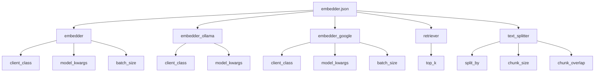
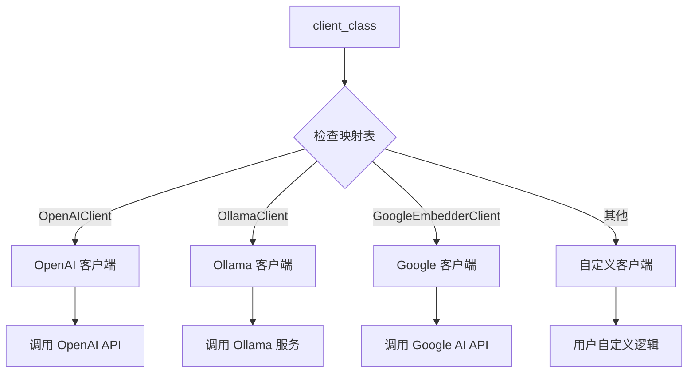
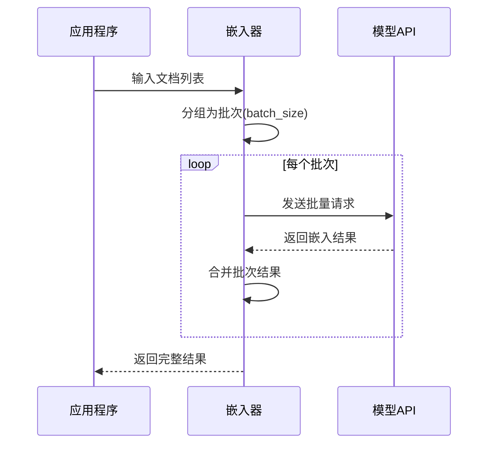
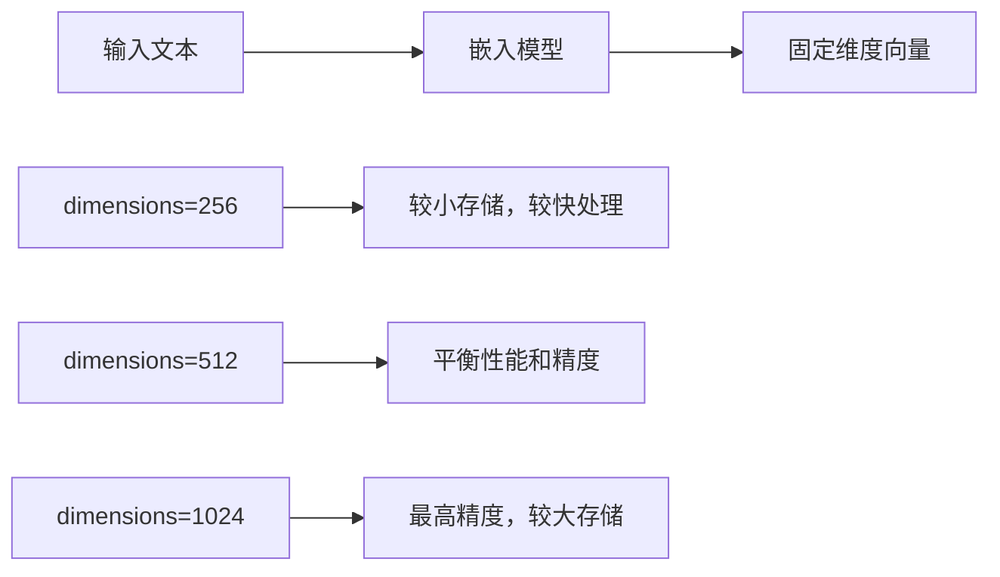
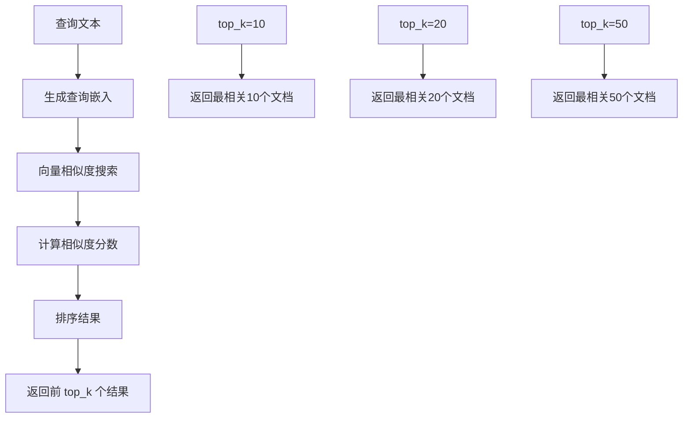
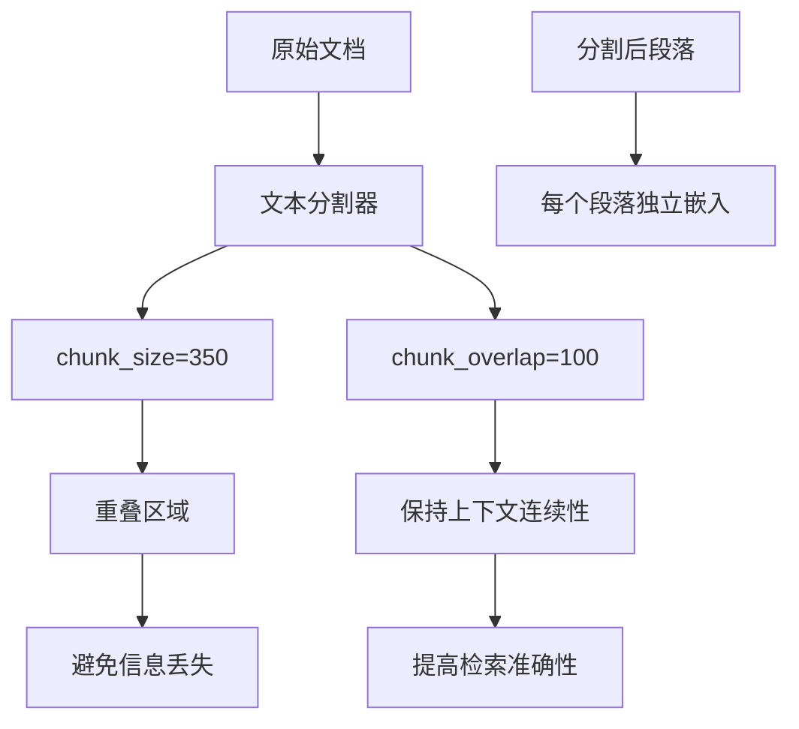
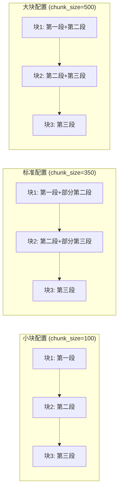
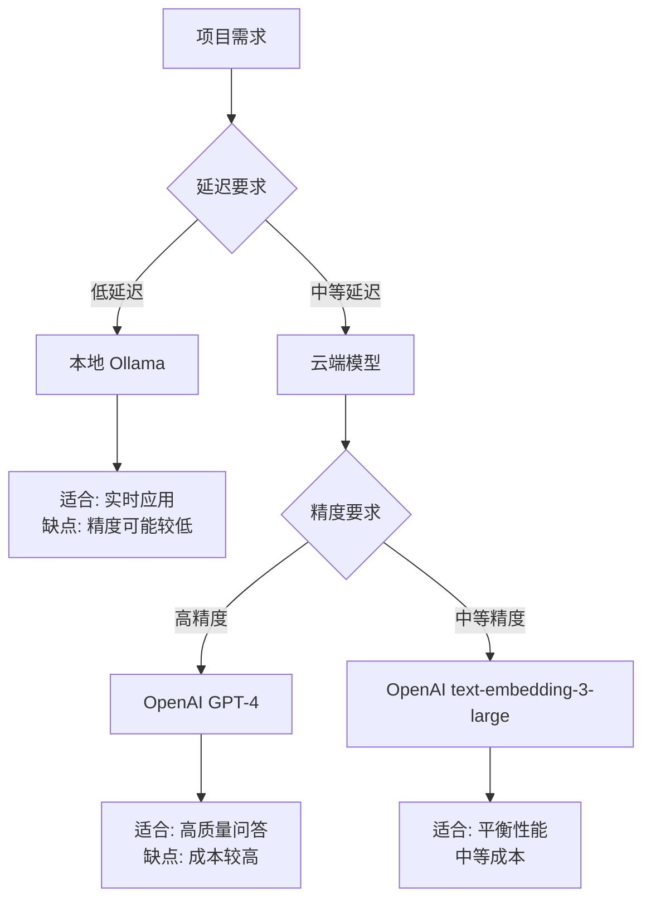

# 嵌入器配置

<cite>
**本文档中引用的文件**
- [embedder.json](file://api/config/embedder.json)
- [embedder.py](file://api/tools/embedder.py)
- [config.py](file://api/config.py)
- [openai_client.py](file://api/openai_client.py)
- [google_embedder_client.py](file://api/google_embedder_client.py)
- [ollama_patch.py](file://api/ollama_patch.py)
- [test_all_embedders.py](file://tests/unit/test_all_embedders.py)
</cite>

## 目录
1. [简介](#简介)
2. [配置文件结构](#配置文件结构)
3. [嵌入器客户端类型](#嵌入器客户端类型)
4. [核心配置参数](#核心配置参数)
5. [批量处理优化](#批量处理优化)
6. [向量嵌入参数](#向量嵌入参数)
7. [检索器配置](#检索器配置)
8. [文本分割器配置](#文本分割器配置)
9. [配置切换示例](#配置切换示例)
10. [故障排除指南](#故障排除指南)
11. [最佳实践](#最佳实践)

## 简介

DeepWiki Open 提供了一个灵活的嵌入器配置系统，支持多种嵌入模型客户端，包括 OpenAI、Google 和 Ollama。该系统通过 `embedder.json` 配置文件管理不同嵌入器的参数设置，并提供了自动检测和动态切换功能。

## 配置文件结构

嵌入器配置存储在 `api/config/embedder.json` 文件中，包含以下主要组件：



**图表来源**
- [embedder.json](file://api/config/embedder.json#L1-L34)

**章节来源**
- [embedder.json](file://api/config/embedder.json#L1-L34)

## 嵌入器客户端类型

系统支持以下嵌入器客户端：

### OpenAI 客户端 (OpenAIClient)

默认的嵌入器客户端，使用 OpenAI 的文本嵌入模型。

| 参数 | 类型 | 默认值 | 描述 |
|------|------|--------|------|
| client_class | string | "OpenAIClient" | 指定使用的客户端类 |
| model_kwargs.model | string | "text-embedding-3-small" | 使用的嵌入模型名称 |
| model_kwargs.dimensions | integer | 256 | 输出向量的维度数 |
| model_kwargs.encoding_format | string | "float" | 编码格式：float 或 base64 |

### Ollama 客户端 (OllamaClient)

本地运行的开源嵌入模型客户端。

| 参数 | 类型 | 默认值 | 描述 |
|------|------|--------|------|
| client_class | string | "OllamaClient" | 指定使用的客户端类 |
| model_kwargs.model | string | "nomic-embed-text" | 使用的 Ollama 模型名称 |

### Google 客户端 (GoogleEmbedderClient)

Google AI 平台的嵌入模型客户端。

| 参数 | 类型 | 默认值 | 描述 |
|------|------|--------|------|
| client_class | string | "GoogleEmbedderClient" | 指定使用的客户端类 |
| model_kwargs.model | string | "text-embedding-004" | 使用的 Google 嵌入模型 |
| model_kwargs.task_type | string | "SEMANTIC_SIMILARITY" | 任务类型：SEMANTIC_SIMILARITY |

**章节来源**
- [embedder.json](file://api/config/embedder.json#L2-L32)
- [config.py](file://api/config.py#L55-L63)

## 核心配置参数

### client_class 参数

`client_class` 指定要使用的嵌入器客户端类，系统会根据这个参数映射到相应的客户端实现：



**图表来源**
- [config.py](file://api/config.py#L55-L63)

### model_kwargs 参数

`model_kwargs` 包含传递给具体模型客户端的参数：

- **OpenAI**: 支持 `model`、`dimensions`、`encoding_format` 等参数
- **Ollama**: 主要配置 `model` 参数
- **Google**: 支持 `model` 和 `task_type` 参数

**章节来源**
- [embedder.py](file://api/tools/embedder.py#L39-L54)
- [openai_client.py](file://api/openai_client.py#L270-L301)
- [google_embedder_client.py](file://api/google_embedder_client.py#L141-L184)

## 批量处理优化

### batch_size 参数

`batch_size` 控制单次批量处理的文档数量，直接影响处理性能：



**图表来源**
- [embedder.py](file://api/tools/embedder.py#L51-L54)

#### 性能影响因素

| 批量大小 | 优点 | 缺点 | 推荐场景 |
|----------|------|------|----------|
| 小批量 (50-100) | 内存占用低，错误隔离好 | 网络开销高 | 小规模数据，实时处理 |
| 中等批量 (200-500) | 平衡性能和资源 | 可能内存压力 | 一般应用场景 |
| 大批量 (1000+) | 最大化吞吐量 | 内存需求高，错误影响范围大 | 批量处理，离线计算 |

**章节来源**
- [embedder.json](file://api/config/embedder.json#L4-L5)
- [embedder.py](file://api/tools/embedder.py#L51-L54)

## 向量嵌入参数

### dimensions 参数

控制输出向量的维度数，影响嵌入质量和存储空间：



**图表来源**
- [embedder.json](file://api/config/embedder.json#L6-L8)

### encoding_format 参数

指定向量编码格式：

| 格式 | 特点 | 适用场景 |
|------|------|----------|
| float | 直接浮点数数组，精度高 | 高精度要求的应用 |
| base64 | Base64 编码字符串，兼容性好 | 跨平台传输，数据库存储 |

**章节来源**
- [embedder.json](file://api/config/embedder.json#L6-L9)
- [openai_client.py](file://api/openai_client.py#L270-L301)

## 检索器配置

### top_k 参数

`retriever.top_k` 控制检索结果的数量：



**图表来源**
- [embedder.json](file://api/config/embedder.json#L25-L27)

#### 参数选择建议

| top_k 值 | 检索效果 | 性能影响 | 推荐场景 |
|----------|----------|----------|----------|
| 5-10 | 精确度高，结果集中 | 检索速度快 | 高精度问答系统 |
| 15-25 | 平衡精度和多样性 | 中等性能开销 | 通用知识检索 |
| 30-50 | 结果丰富，覆盖广 | 检索时间较长 | 文档探索，推荐系统 |

**章节来源**
- [embedder.json](file://api/config/embedder.json#L25-L27)

## 文本分割器配置

### chunk_size 和 chunk_overlap

文本分割器控制文档切分的质量：



**图表来源**
- [embedder.json](file://api/config/embedder.json#L28-L32)

#### 参数配置指南

| 参数 | 推荐值 | 影响因素 | 说明 |
|------|--------|----------|------|
| chunk_size | 350 | 文档类型，语义完整性 | 单个块的最大词数 |
| chunk_overlap | 100 | 上下文重要性 | 重叠的词数，保持语义连续 |
| split_by | word | 分割策略 | 按单词或字符分割 |

#### 不同配置的效果对比



**图表来源**
- [embedder.json](file://api/config/embedder.json#L28-L32)

**章节来源**
- [embedder.json](file://api/config/embedder.json#L28-L32)

## 配置切换示例

### 从 OpenAI 切换至 Ollama

以下是将嵌入器从 OpenAI 切换到 Ollama 的完整配置示例：

#### 步骤 1: 修改环境变量

```bash
# 设置 Ollama 嵌入器类型
export DEEPWIKI_EMBEDDER_TYPE=ollama

# 如果需要自定义 Ollama 服务器地址
export OLLAMA_HOST=http://localhost:11434
```

#### 步骤 2: 更新配置文件

```json
{
  "embedder": {
    "client_class": "OpenAIClient",
    "batch_size": 500,
    "model_kwargs": {
      "model": "text-embedding-3-small",
      "dimensions": 256,
      "encoding_format": "float"
    }
  },
  "embedder_ollama": {
    "client_class": "OllamaClient",
    "model_kwargs": {
      "model": "nomic-embed-text"
    }
  },
  "embedder_google": {
    "client_class": "GoogleEmbedderClient",
    "batch_size": 100,
    "model_kwargs": {
      "model": "text-embedding-004",
      "task_type": "SEMANTIC_SIMILARITY"
    }
  },
  "retriever": {
    "top_k": 20
  },
  "text_splitter": {
    "split_by": "word",
    "chunk_size": 350,
    "chunk_overlap": 100
  }
}
```

#### 步骤 3: 验证配置

```python
# 验证当前嵌入器类型
from api.config import get_embedder_type, is_ollama_embedder

print(f"当前嵌入器类型: {get_embedder_type()}")
print(f"是否为 Ollama 嵌入器: {is_ollama_embedder()}")

# 测试嵌入器功能
from api.tools.embedder import get_embedder

embedder = get_embedder(embedder_type='ollama')
result = embedder("测试文本")
print(f"嵌入器初始化成功: {result is not None}")
```

### 配置生效行为

**重要提示**: 更改嵌入器配置后，必须重启服务才能使新配置生效。这是因为：
1. 配置在应用启动时加载并缓存
2. 客户端实例在初始化时确定
3. 运行时无法动态切换客户端类型

**章节来源**
- [config.py](file://api/config.py#L160-L173)
- [test_all_embedders.py](file://tests/unit/test_all_embedders.py#L313-L354)

## 故障排除指南

### 常见问题及解决方案

#### 1. Ollama 模型不可用

**症状**: 嵌入器初始化失败，提示模型不存在

**解决方案**:
```python
from api.ollama_patch import check_ollama_model_exists

# 检查模型可用性
model_name = "nomic-embed-text"
host = "http://localhost:11434"
is_available = check_ollama_model_exists(model_name, host)

if not is_available:
    print(f"模型 {model_name} 在 Ollama 服务器上不可用")
    # 安装模型: ollama pull nomic-embed-text
```

#### 2. API 密钥配置错误

**症状**: OpenAI 或 Google 嵌入器认证失败

**解决方案**:
```bash
# 检查环境变量
echo $OPENAI_API_KEY
echo $GOOGLE_API_KEY

# 设置环境变量
export OPENAI_API_KEY="your-api-key-here"
export GOOGLE_API_KEY="your-google-api-key"
```

#### 3. 批量处理超时

**症状**: 大批量文档处理时出现超时错误

**解决方案**:
```json
{
  "embedder": {
    "batch_size": 200,  // 减少批量大小
    "timeout": 30       // 增加超时时间
  }
}
```

#### 4. 内存不足错误

**症状**: 处理大量文档时内存溢出

**解决方案**:
```json
{
  "embedder": {
    "batch_size": 100,  // 进一步减少批量大小
    "memory_limit": "2GB"  // 设置内存限制
  }
}
```

**章节来源**
- [ollama_patch.py](file://api/ollama_patch.py#L21-L60)
- [test_all_embedders.py](file://tests/unit/test_all_embedders.py#L84-L137)

## 最佳实践

### 1. 性能优化建议

#### 嵌入器选择策略



#### 批量处理优化

| 场景 | 推荐 batch_size | 理由 |
|------|----------------|------|
| 实时聊天 | 50-100 | 快速响应，内存友好 |
| 批量文档处理 | 500-1000 | 最大化吞吐量 |
| 小规模测试 | 10-20 | 易于调试，快速验证 |

### 2. 配置管理最佳实践

#### 环境特定配置

```bash
# 开发环境
export DEEPWIKI_EMBEDDER_TYPE=openai
export OPENAI_API_KEY="dev-key"

# 生产环境
export DEEPWIKI_EMBEDDER_TYPE=ollama
export OLLAMA_HOST="http://ollama-server:11434"
```

#### 配置版本控制

```json
{
  "version": "1.0.0",
  "embedder": {
    "client_class": "OpenAIClient",
    "model_kwargs": {
      "model": "text-embedding-3-small",
      "dimensions": 256
    },
    "batch_size": 500
  }
}
```

### 3. 监控和日志

#### 关键指标监控

```python
import logging
from api.tools.embedder import get_embedder

# 设置详细日志
logging.basicConfig(level=logging.DEBUG)

# 监控嵌入器性能
embedder = get_embedder()
start_time = time.time()
result = embedder("测试文本")
processing_time = time.time() - start_time

print(f"处理时间: {processing_time:.2f}秒")
print(f"向量维度: {len(result.data[0].embedding)}")
```

#### 错误处理模式

```python
from api.tools.embedder import get_embedder
from api.config import get_embedder_type

def robust_embedder(text, fallback=True):
    """健壮的嵌入器包装器"""
    try:
        embedder = get_embedder()
        return embedder(text)
    except Exception as e:
        logging.error(f"主嵌入器失败: {e}")
        if fallback and get_embedder_type() != 'openai':
            # 回退到 OpenAI
            fallback_embedder = get_embedder(embedder_type='openai')
            return fallback_embedder(text)
        raise
```

**章节来源**
- [embedder.py](file://api/tools/embedder.py#L6-L54)
- [config.py](file://api/config.py#L160-L173)