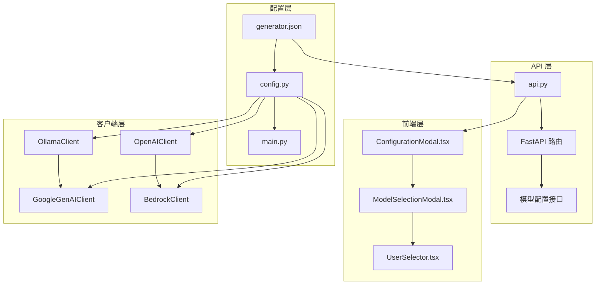
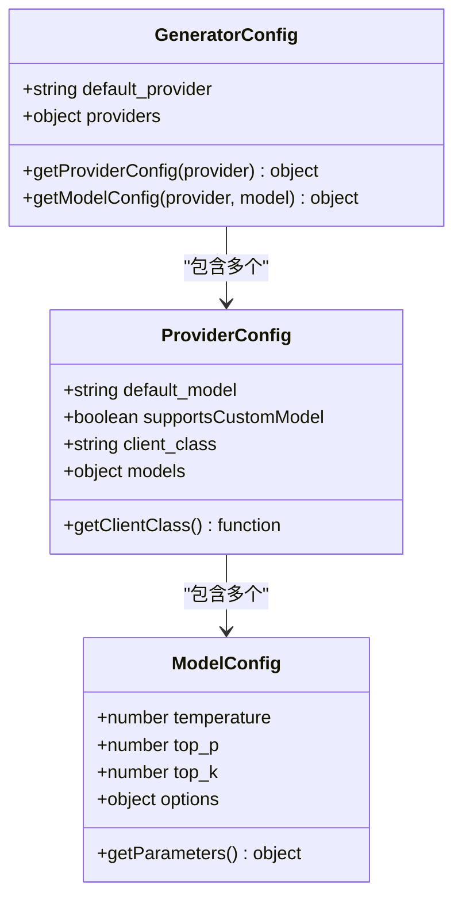
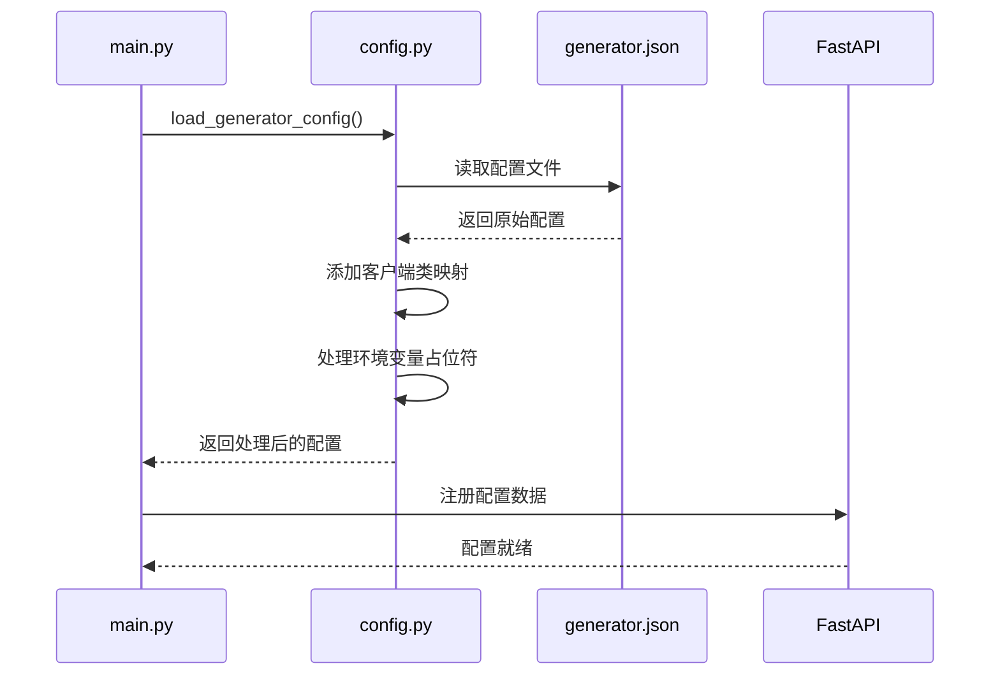
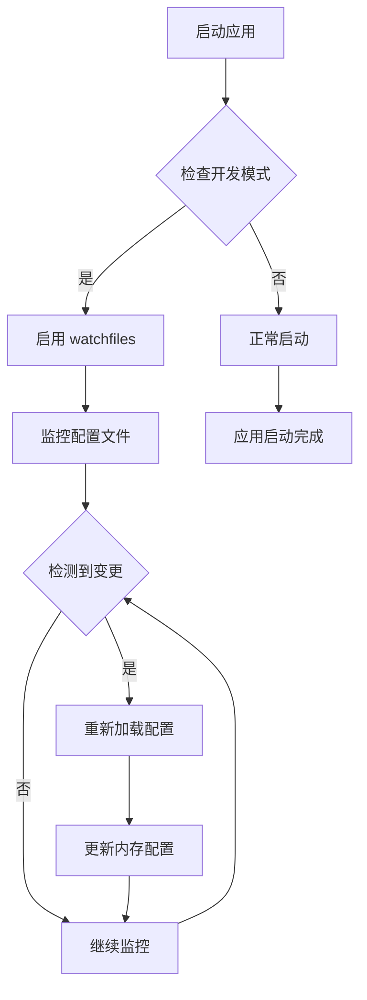
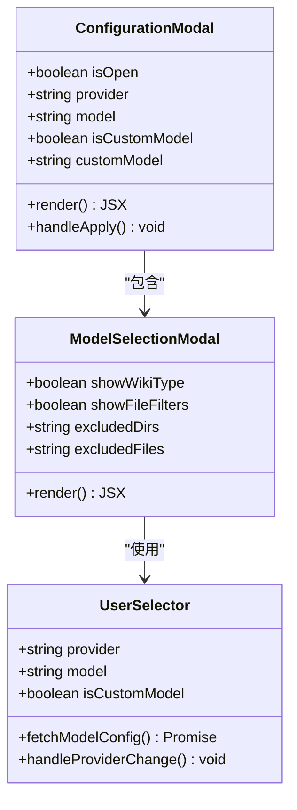
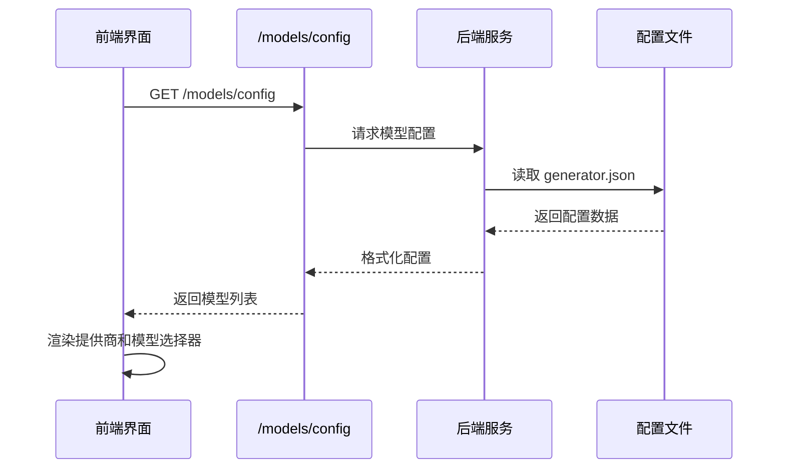

# 生成器配置

<cite>
**本文档中引用的文件**
- [generator.json](file://api/config/generator.json)
- [config.py](file://api/config.py)
- [main.py](file://api/main.py)
- [ollama_patch.py](file://api/ollama_patch.py)
- [ModelSelectionModal.tsx](file://src/components/ModelSelectionModal.tsx)
- [ConfigurationModal.tsx](file://src/components/ConfigurationModal.tsx)
- [UserSelector.tsx](file://src/components/UserSelector.tsx)
- [api.py](file://api/api.py)
- [route.ts](file://src/app/api/models/config/route.ts)
</cite>

## 目录
1. [简介](#简介)
2. [项目结构概览](#项目结构概览)
3. [核心配置文件分析](#核心配置文件分析)
4. [AI提供商配置详解](#ai提供商配置详解)
5. [模型参数配置](#模型参数配置)
6. [配置热重载机制](#配置热重载机制)
7. [前端配置界面](#前端配置界面)
8. [配置切换示例](#配置切换示例)
9. [故障排除指南](#故障排除指南)
10. [总结](#总结)

## 简介

DeepWiki Open 是一个基于流式 API 的知识库生成系统，支持多种 AI 提供商的模型管理。本文档详细介绍 generator.json 配置文件中的多 AI 提供商模型管理机制，包括 default_provider 默认生成模型设置、各平台配置参数、生成参数调优以及配置热重载功能。

该系统支持以下主要 AI 提供商：
- Google Gemini 系列模型
- OpenAI GPT 系列模型
- OpenRouter 多提供商聚合
- Ollama 本地模型
- AWS Bedrock 安全模型
- Azure OpenAI 企业级服务
- 阿里云通义千问系列

## 项目结构概览



**图表来源**
- [generator.json](file://api/config/generator.json#L1-L200)
- [config.py](file://api/config.py#L1-L388)
- [api.py](file://api/api.py#L1-L200)

## 核心配置文件分析

### generator.json 结构解析

generator.json 文件是整个生成器配置的核心，采用分层结构设计：



**图表来源**
- [generator.json](file://api/config/generator.json#L1-L200)
- [config.py](file://api/config.py#L120-L149)

**章节来源**
- [generator.json](file://api/config/generator.json#L1-L200)
- [config.py](file://api/config.py#L120-L149)

### 配置加载流程

系统通过以下流程加载和处理配置：



**图表来源**
- [main.py](file://api/main.py#L63-L80)
- [config.py](file://api/config.py#L120-L149)

**章节来源**
- [main.py](file://api/main.py#L63-L80)
- [config.py](file://api/config.py#L120-L149)

## AI 提供商配置详解

### default_provider 设置

`default_provider` 字段定义了系统的默认 AI 提供商。在当前配置中，默认值为 `"google"`，这意味着：

- 当用户首次访问系统时，会自动选择 Google 作为默认提供商
- 在没有指定提供商的情况下，系统会使用 Google 的默认模型
- 前端界面会优先显示 Google 提供商及其模型列表

### 各提供商配置参数

#### Google Gemini 系列

```json
{
  "google": {
    "default_model": "gemini-2.5-flash",
    "supportsCustomModel": true,
    "models": {
      "gemini-2.5-flash": {
        "temperature": 1.0,
        "top_p": 0.8,
        "top_k": 20
      }
    }
  }
}
```

Google 提供商的特点：
- 支持自定义模型（`supportsCustomModel: true`）
- 默认使用 `gemini-2.5-flash` 模型
- 配置了标准的生成参数：temperature、top_p、top_k

#### OpenAI GPT 系列

```json
{
  "openai": {
    "default_model": "gpt-5-nano",
    "supportsCustomModel": true,
    "models": {
      "gpt-5": { "temperature": 1.0 },
      "gpt-4o": { "temperature": 0.7, "top_p": 0.8 },
      "o1": { "temperature": 0.7, "top_p": 0.8 }
    }
  }
}
```

OpenAI 提供商支持多种模型变体：
- `gpt-5` 系列：基础版本，temperature=1.0
- `gpt-4o` 系列：优化版本，temperature=0.7，top_p=0.8
- `o1` 系列：推理专用，temperature=0.7，top_p=0.8

#### Ollama 本地模型

```json
{
  "ollama": {
    "default_model": "qwen3:1.7b",
    "supportsCustomModel": true,
    "models": {
      "qwen3:1.7b": {
        "options": {
          "temperature": 0.7,
          "top_p": 0.8,
          "num_ctx": 32000
        }
      }
    }
  }
}
```

Ollama 特殊配置：
- 使用 `options` 对象封装所有参数
- 包含 `num_ctx` 上下文长度配置
- 支持本地部署的开源模型

#### 其他提供商

系统还支持：
- **OpenRouter**：多提供商聚合服务
- **Bedrock**：AWS 企业级安全模型
- **Azure**：Microsoft 企业级服务
- **Dashscope**：阿里云通义千问系列

**章节来源**
- [generator.json](file://api/config/generator.json#L2-L199)
- [config.py](file://api/config.py#L120-L149)

## 模型参数配置

### 生成参数详解

#### Temperature 参数

Temperature 控制生成文本的随机性和创造性：

| 温度值 | 输出特性 | 适用场景 |
|--------|----------|----------|
| 0.0 | 确定性最高，重复性强 | 技术文档、代码生成 |
| 0.7 | 平衡创造性和一致性 | 一般问答、摘要生成 |
| 1.0 | 最高创造性，可能不一致 | 创意写作、头脑风暴 |

#### Top-p 参数

Top-p（核采样）控制候选词的概率分布：

| Top-p 值 | 采样范围 | 输出特点 |
|----------|----------|----------|
| 0.8 | 基本词汇 | 稳定、保守输出 |
| 0.9 | 扩展词汇 | 适度创新 |
| 1.0 | 所有词汇 | 最大创新性 |

#### Top-k 参数

Top-k 限制候选词的数量：

| Top-k 值 | 候选数量 | 计算复杂度 |
|----------|----------|------------|
| 20 | 最佳前20个词 | 低 |
| 40 | 最佳前40个词 | 中等 |
| 100+ | 更多候选词 | 高 |

### Ollama 特殊配置

Ollama 提供商的 `options` 字段包含额外的配置参数：

```json
{
  "options": {
    "temperature": 0.7,
    "top_p": 0.8,
    "num_ctx": 32000
  }
}
```

#### num_ctx 上下文长度

- **32000**：适用于大型文档和复杂对话
- **8000**：适用于中等规模文档
- **4000**：适用于简洁对话

**章节来源**
- [generator.json](file://api/config/generator.json#L26-L141)
- [config.py](file://api/config.py#L376-L386)

## 配置热重载机制

### 开发环境热重载

系统在开发环境中实现了配置文件的热重载功能：



**图表来源**
- [main.py](file://api/main.py#L21-L44)
- [main.py](file://api/main.py#L76-L78)

### 热重载配置

开发环境中的热重载特性：

- **自动重启**：当配置文件发生变化时，应用会自动重启
- **排除规则**：排除日志目录和编译缓存文件
- **文件监控**：实时监控配置文件变更

### 生产环境配置

生产环境中配置保持静态，需要手动重启应用以应用新的配置。

**章节来源**
- [main.py](file://api/main.py#L21-L44)
- [main.py](file://api/main.py#L76-L78)

## 前端配置界面

### 配置模态框架构



**图表来源**
- [ConfigurationModal.tsx](file://src/components/ConfigurationModal.tsx#L1-L299)
- [ModelSelectionModal.tsx](file://src/components/ModelSelectionModal.tsx#L1-L260)
- [UserSelector.tsx](file://src/components/UserSelector.tsx#L98-L374)

### 动态模型配置

前端通过 API 获取实时的模型配置：



**图表来源**
- [api.py](file://api/api.py#L167-L208)
- [route.ts](file://src/app/api/models/config/route.ts#L1-L48)

### 自定义模型支持

系统支持用户输入自定义模型名称：

- **默认行为**：使用提供商推荐的模型
- **自定义模式**：允许用户输入任意模型名称
- **验证机制**：在运行时验证模型可用性

**章节来源**
- [ConfigurationModal.tsx](file://src/components/ConfigurationModal.tsx#L1-L299)
- [ModelSelectionModal.tsx](file://src/components/ModelSelectionModal.tsx#L1-L260)
- [UserSelector.tsx](file://src/components/UserSelector.tsx#L98-L374)

## 配置切换示例

### 将默认生成器从 Google 切换为 Ollama qwen3:8b 模型

以下是完整的配置修改步骤：

#### 第一步：修改 generator.json

```json
{
  "default_provider": "ollama",
  "providers": {
    "ollama": {
      "default_model": "qwen3:8b",
      "supportsCustomModel": true,
      "models": {
        "qwen3:8b": {
          "options": {
            "temperature": 0.7,
            "top_p": 0.8,
            "num_ctx": 32000
          }
        }
      }
    }
  }
}
```

#### 第二步：验证 Ollama 连接

确保 Ollama 服务正在运行并可用：

```bash
# 检查 Ollama 服务状态
curl http://localhost:11434/api/tags

# 下载 qwen3:8b 模型（如果尚未下载）
ollama pull qwen3:8b
```

#### 第三步：重启应用

```bash
# 开发环境
npm run dev

# 或者生产环境
python api/main.py
```

#### 第四步：验证配置

1. 访问前端界面
2. 检查默认提供商是否显示为 Ollama
3. 验证默认模型是否为 qwen3:8b
4. 测试生成功能

### 配置验证清单

- [ ] 修改了 `default_provider` 为 "ollama"
- [ ] 设置了正确的 `default_model`: "qwen3:8b"
- [ ] 配置了适当的生成参数
- [ ] Ollama 服务正常运行
- [ ] 应用已重启并加载新配置
- [ ] 前端界面正确显示新配置

**章节来源**
- [generator.json](file://api/config/generator.json#L1-L200)
- [config.py](file://api/config.py#L376-L386)

## 故障排除指南

### 常见问题及解决方案

#### 1. 配置不生效

**症状**：修改配置后，系统仍然使用旧的默认提供商

**解决方案**：
- 确认配置文件路径正确
- 检查 JSON 格式是否正确
- 重启应用以应用新配置
- 查看应用日志确认配置加载

#### 2. Ollama 模型不可用

**症状**：选择 Ollama 模型时出现错误

**解决方案**：
- 检查 Ollama 服务是否运行：`curl http://localhost:11434`
- 验证模型是否存在：`ollama list`
- 下载缺失的模型：`ollama pull qwen3:8b`
- 检查网络连接和防火墙设置

#### 3. 前端配置界面异常

**症状**：模型选择器无法显示或响应

**解决方案**：
- 检查浏览器控制台错误
- 确认后端 API 可访问：`curl http://localhost:8001/models/config`
- 清除浏览器缓存
- 检查网络代理设置

#### 4. 热重载失效

**症状**：修改配置文件后应用未自动重启

**解决方案**：
- 确认处于开发模式
- 检查文件监控权限
- 手动重启应用
- 检查配置文件语法

### 性能优化建议

#### 上下文长度优化

根据文档大小调整 `num_ctx` 参数：

| 文档类型 | 推荐上下文长度 | 内存需求 |
|----------|----------------|----------|
| 简单文档 | 4000-8000 | 低 |
| 中等文档 | 16000-32000 | 中等 |
| 大型文档 | 64000+ | 高 |

#### 温度参数调优

不同任务的最佳温度设置：

| 任务类型 | 推荐温度 | 说明 |
|----------|----------|------|
| 技术文档 | 0.3-0.5 | 需要准确性和一致性 |
| 创意写作 | 0.7-0.9 | 需要多样性和创造性 |
| 代码生成 | 0.1-0.3 | 需要精确和规范性 |
| 对话问答 | 0.5-0.7 | 平衡自然度和准确性 |

**章节来源**
- [ollama_patch.py](file://api/ollama_patch.py#L21-L60)
- [config.py](file://api/config.py#L376-L386)

## 总结

DeepWiki Open 的生成器配置系统提供了强大而灵活的多 AI 提供商管理能力。通过 generator.json 配置文件，用户可以：

1. **统一管理**：在一个配置文件中管理所有 AI 提供商的设置
2. **灵活切换**：轻松在不同提供商之间切换默认设置
3. **参数调优**：精细控制生成参数以适应不同应用场景
4. **热重载支持**：开发环境下的实时配置更新
5. **前端集成**：直观的图形界面进行配置管理

系统的设计充分考虑了可扩展性和易用性，为用户提供了一个强大而便捷的知识库生成工具。无论是个人开发者还是企业用户，都可以根据具体需求定制最适合的 AI 生成配置。