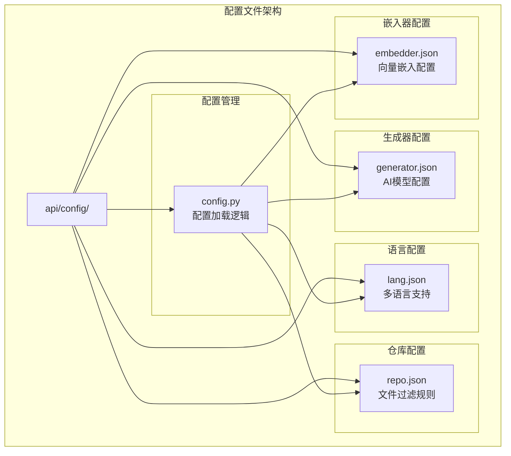
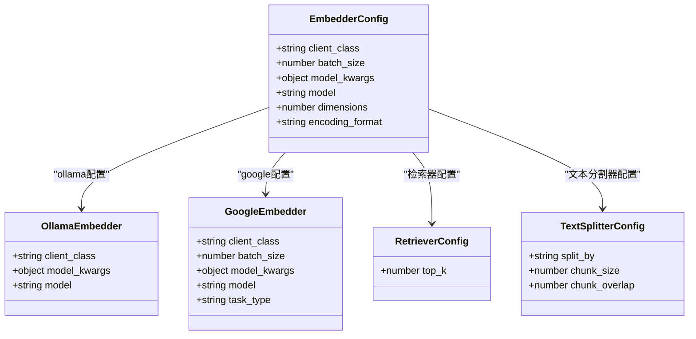
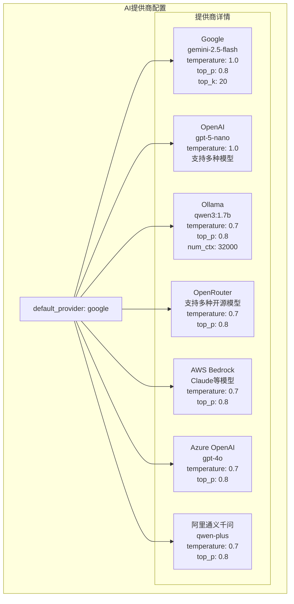
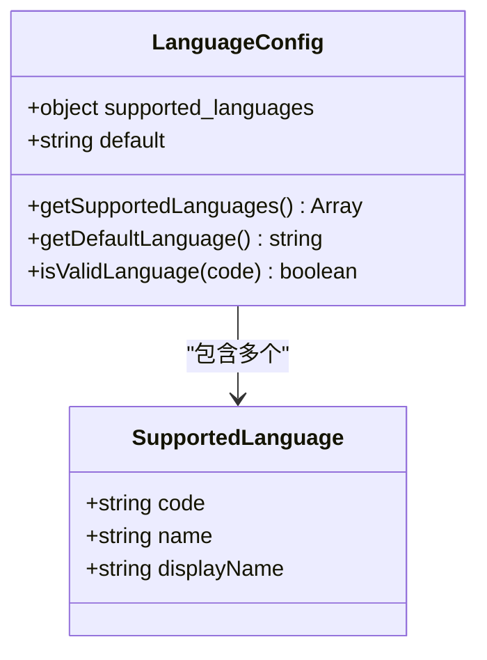
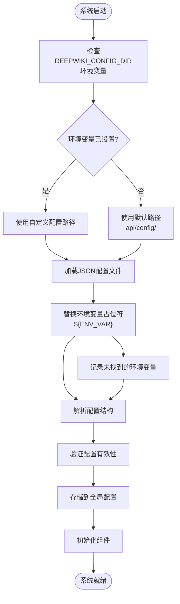
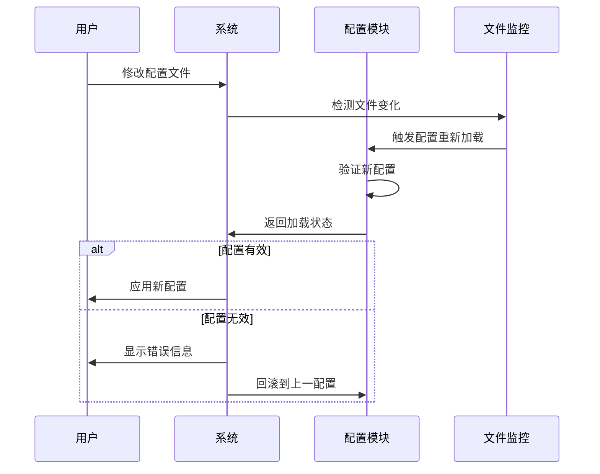

# 自定义配置文件

<cite>
**本文档中引用的文件**
- [api/config/embedder.json](file://api/config/embedder.json)
- [api/config/generator.json](file://api/config/generator.json)
- [api/config/lang.json](file://api/config/lang.json)
- [api/config/repo.json](file://api/config/repo.json)
- [api/config.py](file://api/config.py)
- [api/openai_client.py](file://api/openai_client.py)
- [api/ollama_patch.py](file://api/ollama_patch.py)
- [api/main.py](file://api/main.py)
- [api/rag.py](file://api/rag.py)
- [src/components/ConfigurationModal.tsx](file://src/components/ConfigurationModal.tsx)
- [src/components/ModelSelectionModal.tsx](file://src/components/ModelSelectionModal.tsx)
</cite>

## 目录
1. [简介](#简介)
2. [配置文件架构概览](#配置文件架构概览)
3. [embedder.json 配置详解](#embedderjson-配置详解)
4. [generator.json 配置详解](#generatorjson-配置详解)
5. [lang.json 多语言配置](#langjson-多语言配置)
6. [repo.json 仓库分析规则](#repojson-仓库分析规则)
7. [配置文件加载机制](#配置文件加载机制)
8. [配置修改示例](#配置修改示例)
9. [配置热重载与重启行为](#配置热重载与重启行为)
10. [最佳实践建议](#最佳实践建议)

## 简介

DeepWiki Open 是一个基于 RAG（检索增强生成）技术的智能知识库系统，其核心功能依赖于四个关键配置文件来定义系统的运行参数。这些配置文件位于 `api/config/` 目录下，采用 JSON 格式存储，为系统提供了灵活且可定制的配置能力。

本文档将深入解析每个配置文件的结构、参数含义及其对系统性能的影响，帮助用户理解如何根据实际需求进行配置优化。

## 配置文件架构概览

系统配置采用模块化设计，每个配置文件负责特定的功能领域：



**图表来源**
- [api/config.py](file://api/config.py#L96-L118)
- [api/config/embedder.json](file://api/config/embedder.json#L1-L34)
- [api/config/generator.json](file://api/config/generator.json#L1-L200)

**章节来源**
- [api/config.py](file://api/config.py#L1-L388)

## embedder.json 配置详解

`embedder.json` 文件定义了系统的向量嵌入器配置，支持多种嵌入器类型，包括 OpenAI、Ollama 和 Google 等。

### 嵌入器配置结构



**图表来源**
- [api/config/embedder.json](file://api/config/embedder.json#L1-L34)

### 主要配置参数

#### 1. OpenAI 嵌入器配置

| 参数名 | 类型 | 默认值 | 描述 | 性能影响 |
|--------|------|--------|------|----------|
| `client_class` | string | "OpenAIClient" | 客户端类名 | 决定使用哪个AI服务提供商 |
| `batch_size` | number | 500 | 批处理大小 | 影响内存使用和处理速度 |
| `model` | string | "text-embedding-3-small" | 嵌入模型名称 | 直接影响向量质量 |
| `dimensions` | number | 256 | 向量维度 | 影响相似度计算精度 |
| `encoding_format` | string | "float" | 编码格式 | 影响存储空间和计算效率 |

#### 2. Ollama 嵌入器配置

| 参数名 | 类型 | 默认值 | 描述 | 本地部署优势 |
|--------|------|--------|------|--------------|
| `client_class` | string | "OllamaClient" | Ollama客户端类 | 支持本地模型推理 |
| `model` | string | "nomic-embed-text" | 本地模型名称 | 无需网络连接，保护隐私 |
| **支持的模型** | - | - | - | qwen3:1.7b, llama3:8b, qwen3:8b |

#### 3. Google 嵌入器配置

| 参数名 | 类型 | 默认值 | 描述 | 特殊功能 |
|--------|------|--------|------|----------|
| `client_class` | string | "GoogleEmbedderClient" | Google客户端类 | 支持语义相似度任务 |
| `batch_size` | number | 100 | 批处理大小 | 平衡性能和资源使用 |
| `model` | string | "text-embedding-004" | Google Embedding模型 | 高质量语义表示 |
| `task_type` | string | "SEMANTIC_SIMILARITY" | 任务类型 | 优化相似度计算 |

#### 4. 检索器配置

| 参数名 | 类型 | 默认值 | 描述 | 检索效果 |
|--------|------|--------|------|----------|
| `top_k` | number | 20 | 返回相关文档数量 | 影响结果质量和响应时间 |

#### 5. 文本分割器配置

| 参数名 | 类型 | 默认值 | 描述 | 分割质量 |
|--------|------|--------|------|----------|
| `split_by` | string | "word" | 分割依据 | word 或 char |
| `chunk_size` | number | 350 | 块大小 | 影响上下文连续性 |
| `chunk_overlap` | number | 100 | 块重叠 | 保持上下文连贯性 |

**章节来源**
- [api/config/embedder.json](file://api/config/embedder.json#L1-L34)

## generator.json 配置详解

`generator.json` 文件是系统的核心配置文件，定义了多个AI提供商的模型选择、默认模型设置以及生成参数调优策略。

### AI提供商架构



**图表来源**
- [api/config/generator.json](file://api/config/generator.json#L1-L200)

### 生成参数详解

#### 温度参数（Temperature）

温度参数控制输出的随机性和创造性：

| 温度范围 | 效果描述 | 适用场景 | 推荐模型 |
|----------|----------|----------|----------|
| 0.0 - 0.3 | 极度确定性 | 事实性回答、代码生成 | gpt-4o, gemini-2.5-pro |
| 0.4 - 0.7 | 平衡创造性和准确性 | 一般对话、问答 | gpt-5-nano, qwen-plus |
| 0.8 - 1.0 | 高度创造性 | 创意写作、头脑风暴 | o1, o3, gemini-2.5-flash |

#### Top-P 参数（核采样）

Top-P 控制候选词的概率分布：

| Top-P 值 | 采样策略 | 质量特点 | 使用建议 |
|----------|----------|----------|----------|
| 0.1 - 0.3 | 严格采样 | 输出稳定，重复少 | 技术文档、正式回答 |
| 0.4 - 0.7 | 平衡采样 | 质量和多样性兼顾 | 一般对话场景 |
| 0.8 - 1.0 | 宽松采样 | 高度多样化 | 创意生成、头脑风暴 |

#### Top-K 参数

Top-K 限制候选词的数量：

| Top-K 值 | 计算复杂度 | 输出质量 | 性能影响 |
|----------|------------|----------|----------|
| 10-50 | 低 | 基础质量 | 快速响应 |
| 50-100 | 中等 | 良好质量 | 平衡性能 |
| 100+ | 高 | 最高质量 | 较慢响应 |

### 具体提供商配置

#### OpenAI 配置特点

```json
{
  "openai": {
    "default_model": "gpt-5-nano",
    "supportsCustomModel": true,
    "models": {
      "gpt-4o": {
        "temperature": 0.7,
        "top_p": 0.8
      },
      "o1": {
        "temperature": 0.7,
        "top_p": 0.8
      }
    }
  }
}
```

#### Ollama 配置特点

```json
{
  "ollama": {
    "default_model": "qwen3:1.7b",
    "supportsCustomModel": true,
    "models": {
      "qwen3:1.7b": {
        "options": {
          "temperature": 0.7,
          "top_p": 0.8,
          "num_ctx": 32000
        }
      }
    }
  }
}
```

**章节来源**
- [api/config/generator.json](file://api/config/generator.json#L1-L200)

## lang.json 多语言配置

`lang.json` 文件定义了系统的多语言支持机制，允许用户选择界面语言和内容语言。

### 支持的语言列表

| 语言代码 | 语言名称 | 本地化程度 | 用户群体 |
|----------|----------|------------|----------|
| en | English | 完整 | 英语用户 |
| ja | Japanese (日本語) | 完整 | 日语用户 |
| zh | Mandarin Chinese (中文) | 完整 | 简体中文用户 |
| zh-tw | Traditional Chinese (繁體中文) | 完整 | 繁体中文用户 |
| es | Spanish (Español) | 完整 | 西班牙语用户 |
| kr | Korean (한국어) | 完整 | 韩语用户 |
| vi | Vietnamese (Tiếng Việt) | 完整 | 越南语用户 |
| pt-br | Brazilian Portuguese (Português Brasileiro) | 完整 | 巴西葡萄牙语用户 |
| fr | Français (French) | 完整 | 法语用户 |
| ru | Russian (Русский) | 完整 | 俄语用户 |

### 配置结构



**图表来源**
- [api/config/lang.json](file://api/config/lang.json#L1-L16)

**章节来源**
- [api/config/lang.json](file://api/config/lang.json#L1-L16)

## repo.json 仓库分析规则

`repo.json` 文件定义了仓库分析过程中的文件过滤规则，确保只处理有意义的源代码文件。

### 文件过滤规则

#### 排除目录规则

| 排除模式 | 包含内容 | 用途 |
|----------|----------|------|
| `./.venv/` | Python虚拟环境 | 开发环境隔离 |
| `./venv/` | Python虚拟环境 | 开发环境隔离 |
| `./env/` | Python虚拟环境 | 开发环境隔离 |
| `./virtualenv/` | Python虚拟环境 | 开发环境隔离 |
| `./node_modules/` | JavaScript包 | 依赖管理 |
| `./bower_components/` | 前端包 | 组件管理 |
| `./jspm_packages/` | JavaScript包 | 模块管理 |

#### 排除文件规则

| 排除模式 | 文件类型 | 用途 |
|----------|----------|------|
| `yarn.lock` | 锁定文件 | 包版本锁定 |
| `pnpm-lock.yaml` | 锁定文件 | 包版本锁定 |
| `npm-shrinkwrap.json` | 锁定文件 | 包版本锁定 |
| `poetry.lock` | 锁定文件 | Python包锁定 |
| `*.lock` | 锁定文件 | 版本锁定 |
| `*.min.js` | 压缩文件 | 生产构建 |
| `*.min.css` | 压缩文件 | 样式压缩 |
| `*.map` | 源映射 | 调试信息 |
| `*.gz` | 压缩文件 | 存储优化 |

### 仓库配置参数

| 参数名 | 类型 | 默认值 | 描述 | 限制原因 |
|--------|------|--------|------|----------|
| `max_size_mb` | number | 50000 | 最大仓库大小（MB） | 防止内存溢出 |
| `excluded_dirs` | array | 预定义列表 | 排除目录模式 | 减少扫描开销 |
| `excluded_files` | array | 预定义列表 | 排除文件模式 | 提高处理效率 |

**章节来源**
- [api/config/repo.json](file://api/config/repo.json#L1-L129)

## 配置文件加载机制

系统采用统一的配置加载机制，支持环境变量替换和动态配置更新。

### 加载流程图



**图表来源**
- [api/config.py](file://api/config.py#L96-L118)
- [api/config.py](file://api/config.py#L66-L95)

### 环境变量替换机制

系统支持在配置文件中使用环境变量占位符：

```json
{
  "api_key": "${OPENAI_API_KEY}",
  "base_url": "${CUSTOM_BASE_URL:-https://api.openai.com}"
}
```

支持的语法：
- `${VAR_NAME}`：直接替换环境变量
- `${VAR_NAME:-default}`：如果环境变量不存在则使用默认值
- `${VAR_NAME:+value}`：如果环境变量存在则替换为指定值

**章节来源**
- [api/config.py](file://api/config.py#L66-L95)

## 配置修改示例

### 示例1：从 OpenAI 切换到 Ollama 模型

#### 修改步骤

1. **修改嵌入器配置**（`embedder.json`）
```json
{
  "embedder": {
    "client_class": "OllamaClient",
    "model_kwargs": {
      "model": "nomic-embed-text"
    }
  }
}
```

2. **修改生成器配置**（`generator.json`）
```json
{
  "default_provider": "ollama",
  "providers": {
    "ollama": {
      "default_model": "qwen3:1.7b",
      "supportsCustomModel": true,
      "models": {
        "qwen3:1.7b": {
          "options": {
            "temperature": 0.7,
            "top_p": 0.8,
            "num_ctx": 32000
          }
        }
      }
    }
  }
}
```

3. **设置环境变量**
```bash
export DEEPWIKI_EMBEDDER_TYPE=ollama
export OLLAMA_HOST=http://localhost:11434
```

4. **验证模型可用性**
```bash
ollama pull nomic-embed-text
ollama pull qwen3:1.7b
```

### 示例2：调整生成参数优化性能

#### 降低延迟配置
```json
{
  "providers": {
    "google": {
      "default_model": "gemini-2.5-flash-lite",
      "models": {
        "gemini-2.5-flash-lite": {
          "temperature": 0.5,
          "top_p": 0.7,
          "top_k": 50
        }
      }
    }
  }
}
```

#### 提高创造性配置
```json
{
  "providers": {
    "openai": {
      "default_model": "o1",
      "models": {
        "o1": {
          "temperature": 0.9,
          "top_p": 0.9
        }
      }
    }
  }
}
```

**章节来源**
- [api/config.py](file://api/config.py#L160-L194)
- [api/ollama_patch.py](file://api/ollama_patch.py#L21-L60)

## 配置热重载与重启行为

### 热重载机制

系统支持开发环境下的配置热重载，无需完全重启应用即可应用新的配置。

#### 开发环境配置

```python
# 在 main.py 中启用热重载
uvicorn.run(
    "api.api:app",
    host="0.0.0.0",
    port=port,
    reload=True,  # 启用热重载
    reload_excludes=["**/logs/*", "**/__pycache__/*", "**/*.pyc"]  # 排除文件
)
```

#### 热重载触发条件

| 触发事件 | 重载范围 | 响应时间 | 注意事项 |
|----------|----------|----------|----------|
| 配置文件修改 | 单个配置文件 | 2-5秒 | 只影响被修改的配置 |
| Python代码修改 | 整个应用 | 5-10秒 | 影响所有功能 |
| 静态文件修改 | 前端资源 | 实时 | 不影响后端逻辑 |

### 重启某些关键配置，需要完全重启应用才能生效：

#### 需要重启的配置

1. **嵌入器类型切换**
   - OpenAI ↔ Ollama
   - Google Embedding ↔ OpenAI Embedding

2. **模型客户端变更**
   - 更改API密钥
   - 更改基础URL

3. **环境变量变更**
   - 新增或删除环境变量
   - 修改敏感配置

#### 重启检测机制



**图表来源**
- [api/main.py](file://api/main.py#L76-L77)

**章节来源**
- [api/main.py](file://api/main.py#L70-L80)

## 最佳实践建议

### 性能优化建议

#### 1. 嵌入器选择策略

| 场景 | 推荐配置 | 性能特点 | 成本考虑 |
|------|----------|----------|----------|
| 小规模项目 | OpenAI small模型 | 快速响应，成本适中 | API费用 |
| 大规模部署 | Ollama本地模型 | 零API费用，本地处理 | 硬件成本 |
| 高质量要求 | Google Embedding | 最高质量，平衡性能 | API费用 |

#### 2. 生成器参数调优

```json
{
  "providers": {
    "google": {
      "models": {
        "gemini-2.5-flash": {
          "temperature": 0.7,  /* 平衡创造性和准确性 */
          "top_p": 0.8,        /* 控制词汇多样性 */
          "top_k": 20          /* 限制候选词数量 */
        }
      }
    }
  }
}
```

#### 3. 文件过滤优化

```json
{
  "file_filters": {
    "excluded_dirs": [
      "./dist/",           /* 构建输出目录 */
      "./build/",          /* 构建临时目录 */
      "./target/",         /* Java编译目录 */
      "./out/"             /* C++编译目录 */
    ],
    "excluded_files": [
      "*.min.js",          /* 压缩JavaScript */
      "*.min.css",         /* 压缩CSS */
      "*.map",             /* 源映射文件 */
      "*.gz",              /* 压缩文件 */
      "*.zip",             /* 压缩包 */
      "*.png",             /* 图片文件 */
      "*.jpg",             /* 图片文件 */
      "*.svg"              /* 图标文件 */
    ]
  }
}
```

### 安全配置建议

#### 1. API密钥管理

```bash
# 使用环境变量而非硬编码
export OPENAI_API_KEY="sk-..."
export GOOGLE_API_KEY="AIza..."
export OLLAMA_HOST="http://localhost:11434"
```

#### 2. 访问控制

```json
{
  "auth": {
    "mode": "required",
    "code": "${DEEPWIKI_AUTH_CODE}"
  }
}
```

### 监控和调试

#### 1. 日志配置

```python
# 在 config.py 中添加日志配置
import logging
logging.basicConfig(
    level=logging.INFO,
    format='%(asctime)s - %(name)s - %(levelname)s - %(message)s'
)
```

#### 2. 性能监控

```python
# 监控嵌入器性能
import time
start_time = time.time()
embeddings = embedder.embed_documents(texts)
processing_time = time.time() - start_time
logger.info(f"Embedding processing time: {processing_time:.2f}s")
```

通过合理配置这些参数，用户可以根据具体需求优化系统性能，在质量和成本之间找到最佳平衡点。