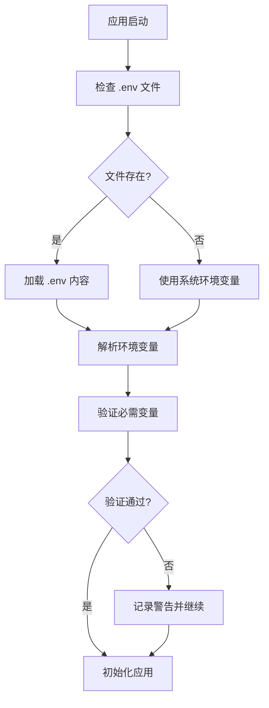
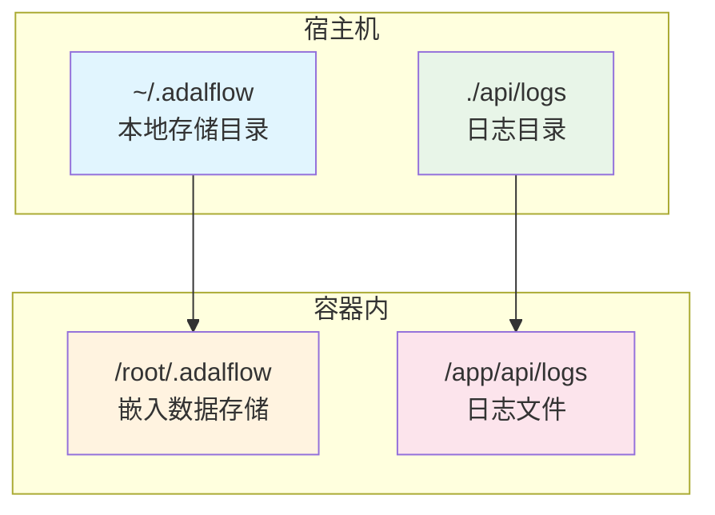
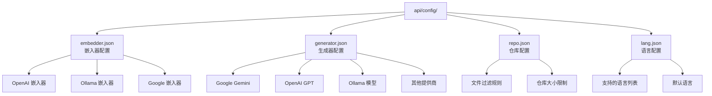
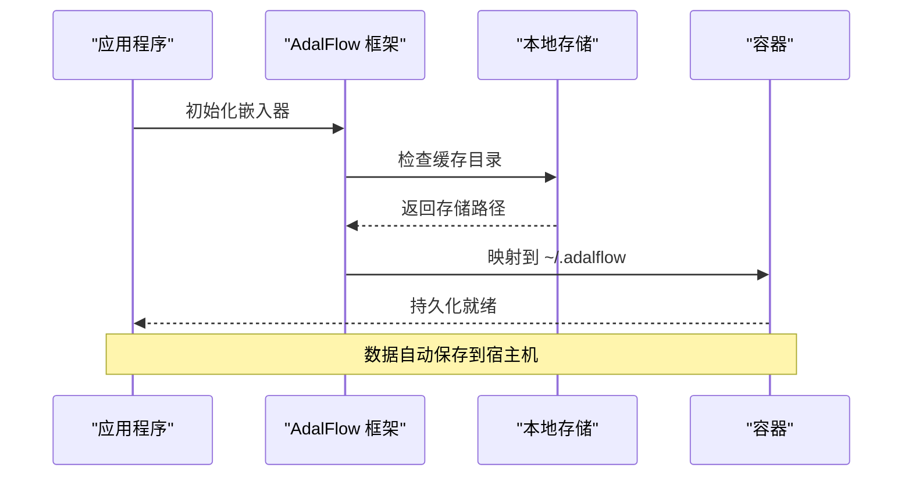
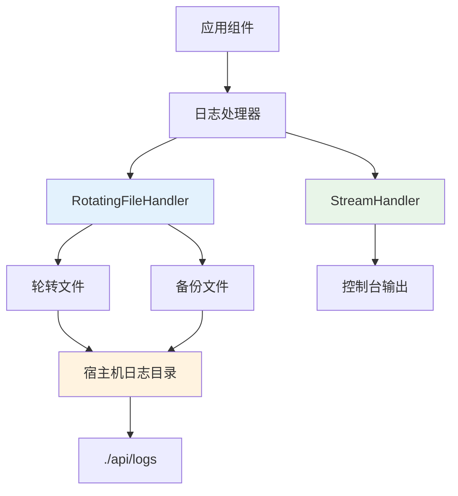
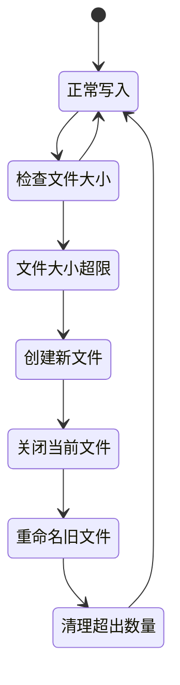

# 配置与持久化

<cite>
**本文档中引用的文件**
- [docker-compose.yml](file://docker-compose.yml)
- [Dockerfile](file://Dockerfile)
- [api/config.py](file://api/config.py)
- [api/config/embedder.json](file://api/config/embedder.json)
- [api/config/generator.json](file://api/config/generator.json)
- [api/config/repo.json](file://api/config/repo.json)
- [api/config/lang.json](file://api/config/lang.json)
- [api/main.py](file://api/main.py)
- [api/logging_config.py](file://api/logging_config.py)
- [api/ollama_patch.py](file://api/ollama_patch.py)
- [run.sh](file://run.sh)
</cite>

## 目录
1. [简介](#简介)
2. [环境变量配置](#环境变量配置)
3. [.env 文件管理](#.env-文件管理)
4. [Docker Compose 持久化配置](#docker-compose-持久化配置)
5. [配置文件系统](#配置文件系统)
6. [数据持久化机制](#数据持久化机制)
7. [日志配置与持久化](#日志配置与持久化)
8. [生产环境最佳实践](#生产环境最佳实践)
9. [故障排除指南](#故障排除指南)

## 简介

DeepWiki-Open 是一个基于容器化的知识管理系统，支持多种 AI 模型提供商。为了确保系统的稳定运行和数据的安全保存，项目采用了多层次的配置管理和持久化策略。本文档详细介绍了如何通过环境变量、配置文件和文件挂载实现系统的配置持久化和数据保存。

## 环境变量配置

### 核心环境变量

DeepWiki-Open 支持以下关键环境变量来控制系统行为：

| 变量名 | 默认值 | 必需 | 描述 |
|--------|--------|------|------|
| `PORT` | 8001 | 否 | API 服务端口 |
| `NODE_ENV` | production | 否 | Node.js 运行环境 |
| `SERVER_BASE_URL` | http://localhost:8001 | 否 | 服务器基础 URL |
| `LOG_LEVEL` | INFO | 否 | 日志级别 |
| `LOG_FILE_PATH` | api/logs/application.log | 否 | 日志文件路径 |
| `DEEPWIKI_EMBEDDER_TYPE` | openai | 否 | 嵌入器类型 |
| `DEEPWIKI_CONFIG_DIR` | - | 否 | 自定义配置目录 |

### AI 模型提供商 API 密钥

| 变量名 | 必需 | 描述 |
|--------|------|------|
| `OPENAI_API_KEY` | 是 | OpenAI API 密钥 |
| `GOOGLE_API_KEY` | 是 | Google API 密钥 |
| `OPENROUTER_API_KEY` | 否 | OpenRouter API 密钥 |
| `AWS_ACCESS_KEY_ID` | 否 | AWS 访问密钥 ID |
| `AWS_SECRET_ACCESS_KEY` | 否 | AWS 秘密访问密钥 |
| `AWS_REGION` | 否 | AWS 区域 |
| `AWS_ROLE_ARN` | 否 | AWS 角色 ARN |

### Ollama 配置

| 变量名 | 默认值 | 描述 |
|--------|--------|------|
| `OLLAMA_HOST` | http://localhost:11434 | Ollama 服务地址 |

### 认证配置

| 变量名 | 默认值 | 描述 |
|--------|--------|------|
| `DEEPWIKI_AUTH_MODE` | False | 是否启用认证模式 |
| `DEEPWIKI_AUTH_CODE` | - | 认证码 |

**节源**
- [api/config.py](file://api/config.py#L17-L41)
- [api/main.py](file://api/main.py#L47-L52)

## .env 文件管理

### 环境变量加载机制

项目采用分层的环境变量加载策略：



**图表源**
- [api/main.py](file://api/main.py#L6-L8)
- [Dockerfile](file://Dockerfile#L85-L86)

### 环境变量优先级

1. **Docker Compose 定义** - 最高优先级
2. **.env 文件** - 中等优先级  
3. **系统环境变量** - 最低优先级

### 示例 .env 文件内容

```bash
# 基础配置
PORT=8001
NODE_ENV=production
SERVER_BASE_URL=http://localhost:8001
LOG_LEVEL=INFO
LOG_FILE_PATH=./api/logs/application.log

# AI 模型提供商
OPENAI_API_KEY=your_openai_api_key_here
GOOGLE_API_KEY=your_google_api_key_here
OPENROUTER_API_KEY=your_openrouter_api_key_here

# Ollama 配置
OLLAMA_HOST=http://localhost:11434

# 认证配置
DEEPWIKI_AUTH_MODE=False
DEEPWIKI_AUTH_CODE=

# 资源限制
LOG_MAX_SIZE=10
LOG_BACKUP_COUNT=5
```

**节源**
- [docker-compose.yml](file://docker-compose.yml#L9-L17)
- [Dockerfile](file://Dockerfile#L85-L86)

## Docker Compose 持久化配置

### 卷挂载配置

Docker Compose 文件定义了两个关键的卷挂载点：



**图表源**
- [docker-compose.yml](file://docker-compose.yml#L17-L19)

### 卷配置详解

| 卷类型 | 宿主机路径 | 容器路径 | 用途 |
|--------|------------|----------|------|
| 数据卷 | `~/.adalflow` | `/root/.adalflow` | 持久化仓库和嵌入数据 |
| 日志卷 | `./api/logs` | `/app/api/logs` | 保留日志文件跨重启 |

### 资源限制配置

```yaml
# 内存限制
mem_limit: 6g
mem_reservation: 2g

# 健康检查
healthcheck:
  test: ["CMD", "curl", "-f", "http://localhost:${PORT:-8001}/health"]
  interval: 60s
  timeout: 10s
  retries: 3
  start_period: 30s
```

**节源**
- [docker-compose.yml](file://docker-compose.yml#L17-L29)

## 配置文件系统

### 配置文件架构



**图表源**
- [api/config/embedder.json](file://api/config/embedder.json#L1-L34)
- [api/config/generator.json](file://api/config/generator.json#L1-L200)
- [api/config/repo.json](file://api/config/repo.json#L1-L129)
- [api/config/lang.json](file://api/config/lang.json#L1-L16)

### 嵌入器配置 (embedder.json)

嵌入器配置支持三种主要提供商：

#### OpenAI 嵌入器
- **模型**: `text-embedding-3-small`
- **维度**: 256
- **批处理大小**: 500

#### Ollama 嵌入器  
- **模型**: `nomic-embed-text`
- **批处理大小**: 默认

#### Google 嵌入器
- **模型**: `text-embedding-004`
- **任务类型**: `SEMANTIC_SIMILARITY`
- **批处理大小**: 100

### 生成器配置 (generator.json)

生成器配置定义了多个 AI 提供商及其模型参数：

#### Google Gemini
- **默认模型**: `gemini-2.5-flash`
- **温度**: 1.0
- **top_p**: 0.8
- **top_k**: 20

#### OpenAI
- **默认模型**: `gpt-5-nano`
- **温度**: 1.0
- **支持自定义模型**

#### Ollama
- **默认模型**: `qwen3:1.7b`
- **温度**: 0.7
- **上下文长度**: 32000

### 仓库配置 (repo.json)

#### 文件过滤规则

**排除的目录**:
- 虚拟环境: `.venv/`, `venv/`, `node_modules/`
- 版本控制: `.git/`, `.svn/`, `.hg/`
- 缓存文件: `__pycache__/`, `logs/`, `tmp/`
- 构建输出: `dist/`, `build/`, `target/`

**排除的文件**:
- 锁文件: `yarn.lock`, `poetry.lock`, `Cargo.lock`
- 配置文件: `.env*`, `.gitignore`, `*.json`
- 临时文件: `*.pyc`, `*.o`, `*.class`
- 压缩文件: `*.zip`, `*.tar`, `*.gz`

#### 仓库限制
- **最大大小**: 50000 MB (50 GB)

### 语言配置 (lang.json)

支持的语言列表：

| 语言代码 | 语言名称 |
|----------|----------|
| `en` | English |
| `ja` | Japanese (日本語) |
| `zh` | Mandarin Chinese (中文) |
| `zh-tw` | Traditional Chinese (繁體中文) |
| `es` | Spanish (Español) |
| `kr` | Korean (한국어) |
| `vi` | Vietnamese (Tiếng Việt) |
| `pt-br` | Brazilian Portuguese (Português Brasileiro) |
| `fr` | Français (French) |
| `ru` | Русский (Russian) |

**节源**
- [api/config/embedder.json](file://api/config/embedder.json#L1-L34)
- [api/config/generator.json](file://api/config/generator.json#L1-L200)
- [api/config/repo.json](file://api/config/repo.json#L1-L129)
- [api/config/lang.json](file://api/config/lang.json#L1-L16)

## 数据持久化机制

### 嵌入数据持久化

AdalFlow 框架负责管理嵌入数据的持久化：



**图表源**
- [docker-compose.yml](file://docker-compose.yml#L18)

### 存储位置映射

- **容器内路径**: `/root/.adalflow`
- **宿主机路径**: `~/.adalflow`
- **存储内容**: 
  - 文档嵌入向量
  - 向量数据库索引
  - 元数据缓存

### 数据恢复机制

当容器重启时，系统会自动：
1. 检查 `~/.adalflow` 目录是否存在
2. 加载已存在的嵌入数据
3. 继续之前的处理状态
4. 不需要重新索引整个仓库

**节源**
- [docker-compose.yml](file://docker-compose.yml#L18)

## 日志配置与持久化

### 日志系统架构



**图表源**
- [api/logging_config.py](file://api/logging_config.py#L64-L70)

### 日志配置参数

| 参数 | 默认值 | 描述 |
|------|--------|------|
| `LOG_LEVEL` | INFO | 日志级别 |
| `LOG_FILE_PATH` | logs/application.log | 日志文件路径 |
| `LOG_MAX_SIZE` | 10MB | 单个日志文件最大大小 |
| `LOG_BACKUP_COUNT` | 5 | 备份文件数量 |

### 日志持久化配置

#### Docker Compose 卷配置
```yaml
volumes:
  - ./api/logs:/app/api/logs
```

#### 安全路径检查
日志系统实现了路径安全检查，防止路径遍历攻击：
- 确保日志文件只能在 `logs/` 目录内创建
- 验证路径解析后的安全性
- 防止写入系统敏感目录

### 日志轮转机制



**图表源**
- [api/logging_config.py](file://api/logging_config.py#L48-L58)

**节源**
- [api/logging_config.py](file://api/logging_config.py#L12-L86)
- [docker-compose.yml](file://docker-compose.yml#L19)

## 生产环境最佳实践

### 配置管理策略

1. **环境隔离**
   - 开发环境: 使用 `.env.development`
   - 测试环境: 使用 `.env.test`
   - 生产环境: 使用 `.env.production`

2. **敏感信息保护**
   ```bash
   # 推荐的 .env.production 文件权限
   chmod 600 .env.production
   
   # 排除配置文件到 .gitignore
   echo ".env*" >> .gitignore
   ```

3. **配置验证**
   ```bash
   # 启动前验证配置
   docker-compose config
   
   # 检查环境变量
   docker-compose exec deepwiki env | grep -E "(API_KEY|HOST|PORT)"
   ```

### 性能优化配置

#### 内存配置
```yaml
# 生产环境推荐配置
mem_limit: 8g
mem_reservation: 4g
```

#### 并发处理
- **嵌入器批处理**: 根据内存调整 `batch_size`
- **并发连接数**: 配置适当的连接池大小
- **超时设置**: 设置合理的请求超时时间

### 监控和维护

#### 健康检查配置
```yaml
healthcheck:
  test: ["CMD", "curl", "-f", "http://localhost:8001/health"]
  interval: 30s
  timeout: 10s
  retries: 3
```

#### 定期维护脚本
```bash
#!/bin/bash
# 日志清理脚本
find ./api/logs -name "*.log" -mtime +30 -delete

# 配置备份
cp .env.production .env.production.backup.$(date +%Y%m%d)
```

## 故障排除指南

### 常见配置问题

#### 1. 环境变量未生效
**症状**: 应用启动但功能异常
**解决方案**:
```bash
# 检查环境变量
docker-compose exec deepwiki env | grep -E "(OPENAI|GOOGLE)"

# 验证 .env 文件格式
cat .env | grep -v '^#' | grep '='
```

#### 2. 数据持久化失败
**症状**: 容器重启后数据丢失
**解决方案**:
```bash
# 检查卷挂载
docker-compose exec deepwiki ls -la /root/.adalflow

# 验证权限
ls -la ~/.adalflow
chmod 755 ~/.adalflow
```

#### 3. 日志文件无法写入
**症状**: 应用正常运行但无日志输出
**解决方案**:
```bash
# 检查日志目录权限
ls -la ./api/logs
chmod 755 ./api/logs

# 验证磁盘空间
df -h ./api/logs
```

### 配置调试工具

#### 配置验证脚本
```bash
#!/bin/bash
echo "=== DeepWiki 配置验证 ==="
echo "环境变量检查:"
echo "PORT: ${PORT:-8001}"
echo "API 密钥状态:"
echo "OPENAI_API_KEY: ${OPENAI_API_KEY:+已设置}"
echo "GOOGLE_API_KEY: ${GOOGLE_API_KEY:+已设置}"

echo "=== 卷挂载检查 ==="
docker-compose exec deepwiki ls -la /root/.adalflow 2>/dev/null || echo "/root/.adalflow 不存在"
docker-compose exec deepwiki ls -la /app/api/logs 2>/dev/null || echo "/app/api/logs 不存在"
```

#### 日志分析工具
```bash
#!/bin/bash
# 分析最近的日志错误
tail -100 ./api/logs/application.log | grep ERROR

# 统计日志文件大小
du -sh ./api/logs/*

# 检查日志轮转状态
ls -la ./api/logs/*.log
```

**节源**
- [api/main.py](file://api/main.py#L47-L52)
- [api/logging_config.py](file://api/logging_config.py#L38-L43)

## 结论

DeepWiki-Open 通过多层次的配置管理和持久化机制，确保了系统的稳定性和数据的安全性。关键特性包括：

1. **灵活的环境变量配置** - 支持多层级配置覆盖
2. **可靠的文件挂载机制** - 实现数据持久化和配置共享
3. **完善的配置文件系统** - 支持多种 AI 模型提供商
4. **安全的日志管理** - 包含路径安全检查和轮转机制
5. **生产就绪的最佳实践** - 提供监控、维护和故障排除指导

通过正确配置这些机制，可以确保 DeepWiki-Open 在各种环境中稳定运行，并为用户提供可靠的知识管理服务。