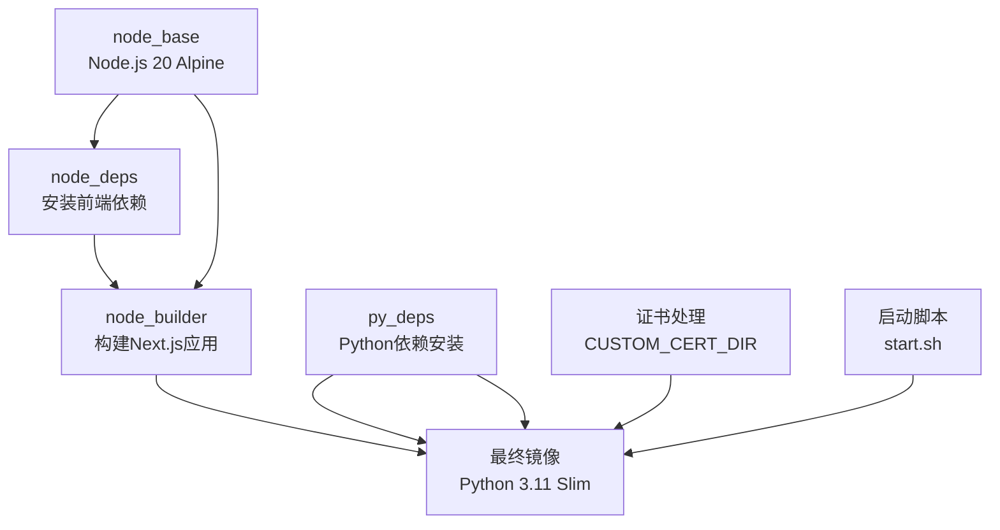
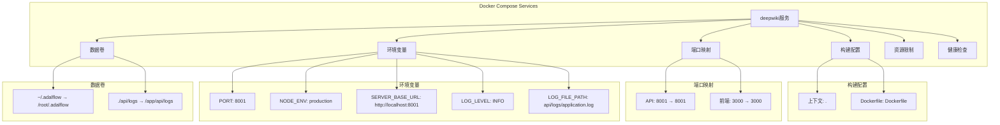
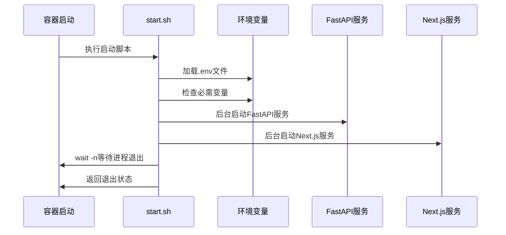
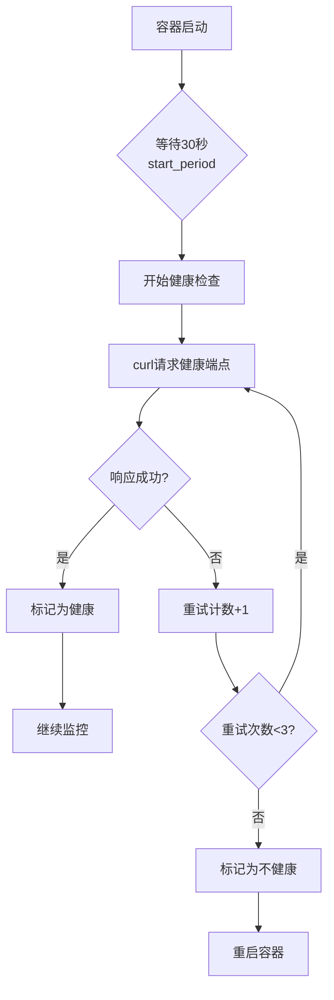

# 容器化部署配置

<cite>
**本文档中引用的文件**
- [Dockerfile](file://Dockerfile)
- [docker-compose.yml](file://docker-compose.yml)
- [run.sh](file://run.sh)
- [package.json](file://package.json)
- [api/pyproject.toml](file://api/pyproject.toml)
- [next.config.ts](file://next.config.ts)
- [api/main.py](file://api/main.py)
- [Dockerfile-ollama-local](file://Dockerfile-ollama-local)
</cite>

## 目录
1. [项目概述](#项目概述)
2. [Dockerfile多阶段构建分析](#dockerfile多阶段构建分析)
3. [docker-compose服务配置](#docker-compose服务配置)
4. [启动脚本与进程管理](#启动脚本与进程管理)
5. [环境变量与配置](#环境变量与配置)
6. [健康检查与监控](#健康检查与监控)
7. [自定义构建示例](#自定义构建示例)
8. [最佳实践建议](#最佳实践建议)

## 项目概述

DeepWiki是一个基于Next.js的前端和FastAPI的后端架构的应用程序，提供了智能代码分析和AI驱动的文档生成功能。该项目采用容器化部署方式，通过Docker多阶段构建实现高效的镜像管理和资源优化。

### 核心组件
- **前端**: Next.js 15.3.1，使用TypeScript开发
- **后端**: FastAPI 0.95.0，Python 3.11
- **AI服务**: 支持OpenAI、Google、Azure等多种AI提供商
- **数据库**: 使用FAISS进行向量搜索，Adalflow存储知识库

## Dockerfile多阶段构建分析

### 构建阶段概览



**图表来源**
- [Dockerfile](file://Dockerfile#L6-L112)

### 阶段1: 前端依赖安装 (node_deps)

该阶段负责安装前端项目的依赖包：

- **基础镜像**: `node:20-alpine3.22`
- **工作目录**: `/app`
- **依赖安装**: 使用`npm ci --legacy-peer-deps`确保确定性安装
- **优化策略**: 只复制必要的文件到镜像中

**节来源**
- [Dockerfile](file://Dockerfile#L6-L11)

### 阶段2: Next.js应用构建 (node_builder)

此阶段执行前端应用的构建过程：

- **内存优化**: 设置`NODE_OPTIONS="--max-old-space-size=4096"`避免构建时内存不足
- **遥测禁用**: 通过`NEXT_TELEMETRY_DISABLED=1`禁用Next.js遥测
- **构建环境**: 在生产环境下运行`npm run build`
- **文件选择**: 只复制构建所需的源码文件，减少镜像大小

**节来源**
- [Dockerfile](file://Dockerfile#L13-L23)

### 阶段3: Python依赖安装 (py_deps)

Python后端依赖的安装配置：

- **工具版本**: Poetry 2.0.1，确保依赖管理一致性
- **虚拟环境**: 在项目内创建虚拟环境，便于隔离
- **并发控制**: 设置`POETRY_MAX_WORKERS=10`加速依赖安装
- **缓存清理**: 构建完成后清理Poetry缓存

**节来源**
- [Dockerfile](file://Dockerfile#L25-L34)

### 阶段4: 最终镜像构建

最终镜像包含所有组件并进行优化：

- **基础镜像**: `python:3.11-slim`保持轻量化
- **Node.js集成**: 手动安装Node.js和npm
- **证书处理**: 支持自定义CA证书目录
- **文件合并**: 合并前后端构建产物

**节来源**
- [Dockerfile](file://Dockerfile#L36-L78)

### 关键指令详解

#### EXPOSE端口暴露
```dockerfile
EXPOSE ${PORT:-8001} 3000
```
- **API端口**: 默认8001，可通过环境变量自定义
- **前端端口**: 固定3000，用于Next.js开发服务器

#### VOLUME数据卷声明
虽然Dockerfile中没有直接声明VOLUME，但docker-compose配置中包含了重要的数据持久化卷：

- `~/.adalflow:/root/.adalflow`: 持久化仓库结构和嵌入数据
- `./api/logs:/app/api/logs`: 日志文件持久化

#### ENV环境变量设置
```dockerfile
ENV PORT=8001
ENV NODE_ENV=production
ENV SERVER_BASE_URL=http://localhost:${PORT:-8001}
```
- **默认端口**: API服务默认监听8001端口
- **生产环境**: 设置Node.js为生产模式
- **服务URL**: 配置后端API的基础URL

## docker-compose服务配置

### 服务定义结构



**图表来源**
- [docker-compose.yml](file://docker-compose.yml#L1-L30)

### 端口映射配置

| 端口类型 | 映射规则 | 用途 |
|---------|---------|------|
| API端口 | `${PORT:-8001}:${PORT:-8001}` | FastAPI后端服务 |
| 前端端口 | `3000:3000` | Next.js开发服务器 |

- **可配置性**: API端口支持环境变量覆盖，默认8001
- **本地访问**: 前端端口固定映射，便于开发调试

### 环境变量注入

docker-compose通过多种方式注入环境变量：

1. **env_file**: 加载`.env`文件中的变量
2. **environment**: 直接在compose文件中定义
3. **默认值**: 为关键变量提供默认配置

**节来源**
- [docker-compose.yml](file://docker-compose.yml#L9-L17)

### 数据持久化策略

#### 主要持久化卷

| 卷路径 | 挂载位置 | 用途 |
|-------|---------|------|
| `~/.adalflow` | `/root/.adalflow` | 仓库结构和嵌入数据 |
| `./api/logs` | `/app/api/logs` | 应用日志文件 |

- **数据安全**: 确保重要数据不会因容器重启而丢失
- **路径映射**: 使用绝对路径保证跨平台兼容性

### 资源限制配置

```yaml
mem_limit: 6g
mem_reservation: 2g
```

- **最大内存**: 限制容器最多使用6GB内存
- **预留内存**: 至少保留2GB内存给容器使用
- **性能影响**: 这些限制有助于防止内存泄漏导致的服务崩溃

**节来源**
- [docker-compose.yml](file://docker-compose.yml#L20-L22)

## 启动脚本与进程管理

### start.sh脚本架构



**图表来源**
- [Dockerfile](file://Dockerfile#L83-L110)

### 并行进程管理

启动脚本实现了优雅的进程管理：

1. **环境变量加载**: 优先从`.env`文件加载配置
2. **必需变量检查**: 验证OpenAI和Google API密钥
3. **后台服务启动**: FastAPI和Next.js同时运行
4. **进程监控**: 使用`wait -n`监控子进程状态

### 错误处理机制

- **警告提示**: 当缺少必要环境变量时显示警告
- **优雅降级**: 即使某些功能缺失，核心服务仍可运行
- **状态返回**: 正确的退出状态码便于容器编排

**节来源**
- [Dockerfile](file://Dockerfile#L83-L110)

## 环境变量与配置

### 必需环境变量

| 变量名 | 用途 | 示例值 |
|-------|------|--------|
| `OPENAI_API_KEY` | OpenAI API访问密钥 | sk-xxx |
| `GOOGLE_API_KEY` | Google API访问密钥 | AIzaSyxxx |

### 可选环境变量

| 变量名 | 默认值 | 用途 |
|-------|--------|------|
| `PORT` | 8001 | API服务端口 |
| `NODE_ENV` | production | Node.js环境 |
| `LOG_LEVEL` | INFO | 日志级别 |
| `LOG_FILE_PATH` | api/logs/application.log | 日志文件路径 |

### 配置文件优先级

1. **命令行参数**: 最高优先级
2. **环境变量**: 中等优先级
3. **默认值**: 最低优先级

**节来源**
- [api/main.py](file://api/main.py#L48-L52)
- [Dockerfile](file://Dockerfile#L90-L94)

## 健康检查与监控

### 健康检查配置

```yaml
healthcheck:
  test: ["CMD", "curl", "-f", "http://localhost:${PORT:-8001}/health"]
  interval: 60s
  timeout: 10s
  retries: 3
  start_period: 30s
```

### 健康检查机制分析



**图表来源**
- [docker-compose.yml](file://docker-compose.yml#L24-L29)

### 监控指标

- **响应时间**: 健康检查超时设置为10秒
- **重试策略**: 最多重试3次，间隔60秒
- **启动延迟**: 30秒的启动期避免过早检查

**节来源**
- [docker-compose.yml](file://docker-compose.yml#L24-L29)

## 自定义构建示例

### 修改基础镜像

#### 使用Alpine Linux变体

```dockerfile
# 替换Python基础镜像
FROM python:3.11-alpine3.20 AS py_deps

# 添加Alpine包
RUN apk add --no-cache \
    gcc \
    musl-dev \
    linux-headers \
    && pip install poetry==2.0.1
```

#### 使用Debian基础镜像

```dockerfile
# Debian基础镜像
FROM node:20-bullseye AS node_base
FROM python:3.11-bullseye AS py_deps
```

### 调整资源限制

#### 内存优化配置

```yaml
services:
  deepwiki:
    mem_limit: 4g      # 减少内存上限
    mem_reservation: 1g  # 减少预留内存
    shm_size: 256m     # 减少共享内存
```

#### CPU限制配置

```yaml
services:
  deepwiki:
    cpus: 2.0          # 限制CPU使用
    cpu_quota: 100000  # 设置CPU配额
```

### 添加自定义证书支持

#### 构建时添加证书

```dockerfile
# 复制自定义证书目录
COPY certs/ /tmp/certs/

# 在构建过程中安装证书
RUN if [ -d "/tmp/certs" ]; then \
    mkdir -p /usr/local/share/ca-certificates && \
    cp -r /tmp/certs/* /usr/local/share/ca-certificates/ && \
    update-ca-certificates; \
fi
```

#### 运行时证书挂载

```yaml
services:
  deepwiki:
    volumes:
      - ./custom-certs:/app/certs:ro
    environment:
      - CUSTOM_CERT_DIR=/app/certs
```

### Ollama本地部署配置

项目提供了专门的Ollama本地部署Dockerfile：

**节来源**
- [Dockerfile-ollama-local](file://Dockerfile-ollama-local#L1-L121)

#### 特殊特性

1. **架构检测**: 自动检测目标架构(ARM64/AMD64)
2. **预装模型**: 自动下载Nomic Embed和Qwen模型
3. **本地服务**: 集成Ollama本地AI服务

#### 构建命令

```bash
# 构建ARM64版本
docker build -f Dockerfile-ollama-local -t deepwiki-ollama:arm64 .

# 构建AMD64版本  
docker build -f Dockerfile-ollama-local -t deepwiki-ollama:amd64 --build-arg TARGETARCH=amd64 .
```

## 最佳实践建议

### 性能优化

1. **镜像层优化**
   - 将经常变化的文件放在构建层底部
   - 使用`.dockerignore`排除不必要的文件

2. **内存管理**
   - 根据实际需求调整`NODE_OPTIONS`内存限制
   - 监控容器内存使用情况，避免OOM

3. **网络优化**
   - 使用内部网络隔离服务
   - 配置适当的DNS解析

### 安全考虑

1. **最小权限原则**
   - 使用非root用户运行应用
   - 移除不必要的系统工具

2. **密钥管理**
   - 使用Docker Secrets或外部密钥管理服务
   - 定期轮换API密钥

3. **网络安全**
   - 限制容器间通信
   - 使用网络策略隔离服务

### 监控与维护

1. **日志管理**
   - 配置集中式日志收集
   - 设置日志轮转策略

2. **健康监控**
   - 实施主动健康检查
   - 设置告警机制

3. **备份策略**
   - 定期备份重要数据卷
   - 测试恢复流程

### 扩展性设计

1. **水平扩展**
   - 设计无状态服务
   - 使用负载均衡器

2. **存储分离**
   - 使用外部数据库
   - 分离静态资源存储

3. **缓存优化**
   - 实施多级缓存策略
   - 优化数据库查询

通过遵循这些最佳实践，可以确保DeepWiki应用在容器环境中稳定、高效地运行，同时具备良好的可维护性和扩展性。