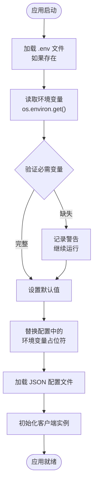
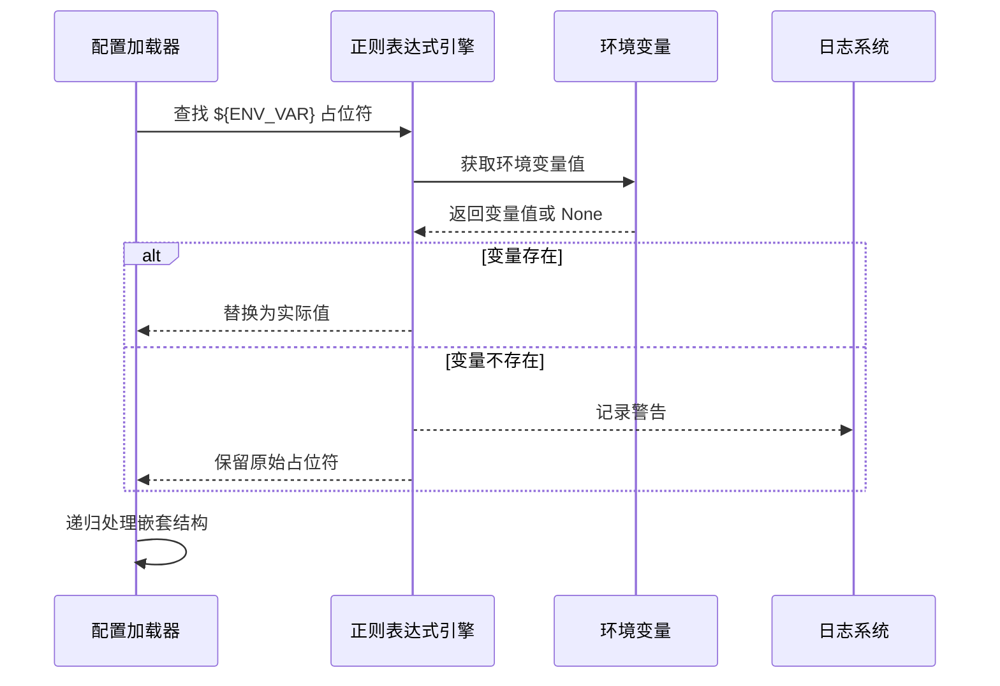

# 环境变量配置

<cite>
**本文档中引用的文件**
- [api/config.py](file://api/config.py)
- [docker-compose.yml](file://docker-compose.yml)
- [Dockerfile](file://Dockerfile)
- [api/main.py](file://api/main.py)
- [api/logging_config.py](file://api/logging_config.py)
- [api/config/embedder.json](file://api/config/embedder.json)
- [api/config/generator.json](file://api/config/generator.json)
- [tests/integration/test_full_integration.py](file://tests/integration/test_full_integration.py)
</cite>

## 目录
1. [简介](#简介)
2. [核心环境变量](#核心环境变量)
3. [配置加载机制](#配置加载机制)
4. [Docker部署配置](#docker部署配置)
5. [安全实践](#安全实践)
6. [故障排除](#故障排除)
7. [最佳实践](#最佳实践)

## 简介

DeepWiki-Open 通过环境变量实现灵活的运行时配置，支持多种 AI 服务提供商、认证模式和部署场景。该系统采用分层配置架构，允许用户通过环境变量覆盖默认配置，同时提供安全的密钥管理和配置验证机制。

## 核心环境变量

### 维基访问认证配置

#### DEEPWIKI_AUTH_MODE
- **用途**: 控制维基访问认证模式
- **默认值**: `'False'`
- **取值**: `'True'`, `'1'`, `'t'` 表示启用认证，其他值表示禁用
- **作用**: 启用或禁用对维基内容的访问控制

#### DEEPWIKI_AUTH_CODE
- **用途**: 设置访问认证码
- **默认值**: `''`（空字符串）
- **作用**: 当认证模式启用时，客户端需要提供此认证码才能访问受保护的维基内容

### 嵌入模型配置

#### DEEPWIKI_EMBEDDER_TYPE
- **用途**: 指定嵌入模型类型
- **默认值**: `'openai'`
- **可选值**: `'openai'`, `'google'`, `'ollama'`
- **作用**: 决定使用哪种 AI 服务提供商的嵌入模型

### AI 服务 API 密钥

#### OPENAI_API_KEY
- **用途**: OpenAI API 访问密钥
- **必需**: 是（用于 OpenAI 模型和嵌入）
- **来源**: [OpenAI 平台](https://platform.openai.com/api-keys)

#### GOOGLE_API_KEY
- **用途**: Google AI Studio API 密钥
- **必需**: 是（用于 Google Gemini 模型和嵌入）
- **来源**: [Google AI Studio](https://makersuite.google.com/app/apikey)

#### OPENROUTER_API_KEY
- **用途**: OpenRouter API 访问密钥
- **必需**: 否（仅当使用 OpenRouter 提供的模型时需要）
- **来源**: [OpenRouter](https://openrouter.ai/keys)

### AWS 配置

#### AWS_ACCESS_KEY_ID
- **用途**: AWS 访问密钥 ID
- **必需**: 否（仅当使用 AWS Bedrock 时需要）

#### AWS_SECRET_ACCESS_KEY
- **用途**: AWS 秘密访问密钥
- **必需**: 否（仅当使用 AWS Bedrock 时需要）

#### AWS_REGION
- **用途**: AWS 区域
- **默认值**: `'us-east-1'`
- **必需**: 否（仅当使用 AWS Bedrock 时需要）

#### AWS_ROLE_ARN
- **用途**: AWS IAM 角色 ARN
- **必需**: 否（仅当使用基于角色的身份验证时需要）

### 服务器配置

#### PORT
- **用途**: API 服务端口号
- **默认值**: `8001`
- **范围**: 1-65535
- **作用**: 指定 FastAPI 应用程序监听的端口

### 日志配置

#### LOG_LEVEL
- **用途**: 日志输出级别
- **默认值**: `'INFO'`
- **可选值**: `'DEBUG'`, `'INFO'`, `'WARNING'`, `'ERROR'`, `'CRITICAL'`
- **作用**: 控制应用程序的日志详细程度

#### LOG_FILE_PATH
- **用途**: 日志文件路径
- **默认值**: `'api/logs/application.log'`
- **作用**: 指定日志文件的存储位置

#### LOG_MAX_SIZE
- **用途**: 单个日志文件最大大小（MB）
- **默认值**: `10`
- **作用**: 配置日志轮转阈值

#### LOG_BACKUP_COUNT
- **用途**: 保留的日志文件备份数量
- **默认值**: `5`
- **作用**: 控制日志文件轮转时保留的旧文件数量

### 高级配置

#### DEEPWIKI_CONFIG_DIR
- **用途**: 自定义配置目录路径
- **默认值**: `None`（使用默认配置目录）
- **作用**: 指定自定义配置文件的位置

## 配置加载机制

### 环境变量加载流程



**图表来源**
- [api/config.py](file://api/config.py#L18-L47)
- [api/main.py](file://api/main.py#L6-L8)

### 环境变量处理函数

系统提供了强大的环境变量替换功能，支持在 JSON 配置文件中使用 `${ENV_VAR}` 占位符：



**图表来源**
- [api/config.py](file://api/config.py#L66-L95)

**章节来源**
- [api/config.py](file://api/config.py#L18-L47)
- [api/config.py](file://api/config.py#L66-L95)

## Docker部署配置

### docker-compose.yml 配置

Docker Compose 提供了灵活的环境变量注入机制：

```yaml
services:
  deepwiki:
    build:
      context: .
      dockerfile: Dockerfile
    ports:
      - "${PORT:-8001}:${PORT:-8001}"  # API 端口
      - "3000:3000"  # Next.js 端口
    env_file:
      - .env  # 从 .env 文件加载变量
    environment:
      - PORT=${PORT:-8001}
      - NODE_ENV=production
      - SERVER_BASE_URL=http://localhost:${PORT:-8001}
      - LOG_LEVEL=${LOG_LEVEL:-INFO}
      - LOG_FILE_PATH=${LOG_FILE_PATH:-api/logs/application.log}
    volumes:
      - ~/.adalflow:/root/.adalflow      # 持久化仓库和嵌入数据
      - ./api/logs:/app/api/logs         # 持久化日志文件
```

**图表来源**
- [docker-compose.yml](file://docker-compose.yml#L1-L30)

### Dockerfile 中的变量处理

#### ARG 和 ENV 的区别
- **ARG**: 构建时参数，不传递到最终镜像
- **ENV**: 运行时环境变量，传递到容器内

#### 容器启动脚本中的变量处理

```bash
#!/bin/bash
# 加载 .env 文件中的环境变量
if [ -f .env ]; then
  export $(grep -v "^#" .env | xargs -r)
fi

# 检查必需的环境变量
if [ -z "$OPENAI_API_KEY" ] || [ -z "$GOOGLE_API_KEY" ]; then
  echo "Warning: OPENAI_API_KEY and/or GOOGLE_API_KEY environment variables are not set."
  echo "These are required for DeepWiki to function properly."
fi

# 启动 API 服务器
python -m api.main --port ${PORT:-8001} &
PORT=3000 HOSTNAME=0.0.0.0 node server.js &
wait -n
exit $?
```

**图表来源**
- [Dockerfile](file://Dockerfile#L82-L111)

**章节来源**
- [docker-compose.yml](file://docker-compose.yml#L1-L30)
- [Dockerfile](file://Dockerfile#L82-L111)

## 安全实践

### 密钥管理最佳实践

#### 1. 避免硬编码密钥
```python
# ❌ 不推荐：硬编码密钥
OPENAI_API_KEY = "sk-1234567890abcdef"

# ✅ 推荐：使用环境变量
OPENAI_API_KEY = os.environ.get('OPENAI_API_KEY')
```

#### 2. 使用 .env 文件进行本地开发
创建项目根目录下的 `.env` 文件：
```env
# 必需的 API 密钥
GOOGLE_API_KEY=your_google_api_key
OPENAI_API_KEY=your_openai_api_key

# 可选的 API 密钥
OPENROUTER_API_KEY=your_openrouter_api_key

# AWS 配置
AWS_ACCESS_KEY_ID=your_aws_access_key_id
AWS_SECRET_ACCESS_KEY=your_aws_secret_key
AWS_REGION=us-east-1
AWS_ROLE_ARN=your_aws_role_arn

# 服务器配置
PORT=8001
LOG_LEVEL=INFO
```

#### 3. 生产环境密钥管理
- 使用 Kubernetes Secrets 或 Docker Secrets
- 配置 AWS Secrets Manager 或 Azure Key Vault
- 实施密钥轮换策略
- 限制密钥访问权限

### 网络安全配置

#### 1. 端口绑定安全
```yaml
# docker-compose.yml
ports:
  - "127.0.0.1:8001:8001"  # 仅本地访问
  # 或者
  - "${PORT:-8001}:${PORT:-8001}"  # 动态端口映射
```

#### 2. 认证配置
```python
# 启用认证
DEEPWIKI_AUTH_MODE = 'True'
DEEPWIKI_AUTH_CODE = 'your_secure_auth_code'
```

**章节来源**
- [api/config.py](file://api/config.py#L18-L47)
- [api/main.py](file://api/main.py#L47-L53)

## 故障排除

### 常见问题及解决方案

#### 1. API 密钥未找到错误
**症状**: 应用启动时显示密钥相关的警告
**解决方案**:
```bash
# 检查环境变量是否正确设置
echo $OPENAI_API_KEY
echo $GOOGLE_API_KEY

# 验证 .env 文件格式
cat .env | grep -E "(^#|^$)" -v
```

#### 2. 端口冲突
**症状**: 应用无法绑定到指定端口
**解决方案**:
```bash
# 检查端口占用
netstat -tulpn | grep :8001
lsof -i :8001

# 修改端口配置
export PORT=8002
```

#### 3. 日志文件权限问题
**症状**: 无法写入日志文件
**解决方案**:
```bash
# 检查日志目录权限
ls -la api/logs/

# 创建日志目录（如果不存在）
mkdir -p api/logs
chmod 755 api/logs
```

### 调试配置

#### 启用调试模式
```bash
# 设置调试级别
export LOG_LEVEL=DEBUG

# 查看详细日志
tail -f api/logs/application.log
```

#### 验证配置加载
```python
# 在代码中添加调试输出
import os
print(f"Loaded OPENAI_API_KEY: {'***' if os.environ.get('OPENAI_API_KEY') else 'MISSING'}")
print(f"Embedder type: {os.environ.get('DEEPWIKI_EMBEDDER_TYPE', 'default: openai')}")
```

**章节来源**
- [api/main.py](file://api/main.py#L47-L53)
- [api/logging_config.py](file://api/logging_config.py#L31-L33)

## 最佳实践

### 开发环境配置

#### 1. 本地开发设置
```bash
# 1. 创建 .env 文件
cp .env.example .env

# 2. 编辑 .env 文件
nano .env

# 3. 启动开发环境
docker-compose up --build
```

#### 2. 多环境配置
```bash
# 开发环境
export NODE_ENV=development
export LOG_LEVEL=DEBUG

# 测试环境  
export NODE_ENV=test
export LOG_LEVEL=INFO

# 生产环境
export NODE_ENV=production
export LOG_LEVEL=WARNING
```

### 生产环境部署

#### 1. 安全配置检查清单
- [ ] 所有敏感密钥都通过环境变量传递
- [ ] 禁用了调试模式 (`LOG_LEVEL=INFO`)
- [ ] 启用了访问认证 (`DEEPWIKI_AUTH_MODE=True`)
- [ ] 使用了强认证码
- [ ] 端口绑定限制在内部网络
- [ ] 定期更新 API 密钥

#### 2. 监控和告警
```yaml
# docker-compose.yml 健康检查配置
healthcheck:
  test: ["CMD", "curl", "-f", "http://localhost:${PORT:-8001}/health"]
  interval: 60s
  timeout: 10s
  retries: 3
  start_period: 30s
```

#### 3. 性能优化配置
```yaml
# docker-compose.yml 资源限制
mem_limit: 6g
mem_reservation: 2g
```

### 配置验证

#### 1. 启动时验证
```python
# api/main.py 中的验证逻辑
required_env_vars = ['GOOGLE_API_KEY', 'OPENAI_API_KEY']
missing_vars = [var for var in required_env_vars if not os.environ.get(var)]
if missing_vars:
    logger.warning(f"Missing environment variables: {', '.join(missing_vars)}")
```

#### 2. 运行时配置检查
```python
# 验证嵌入器类型
embedder_type = os.environ.get('DEEPWIKI_EMBEDDER_TYPE', 'openai')
if embedder_type not in ['openai', 'google', 'ollama']:
    raise ValueError(f"Invalid embedder type: {embedder_type}")
```

**章节来源**
- [api/main.py](file://api/main.py#L47-L53)
- [docker-compose.yml](file://docker-compose.yml#L24-L29)