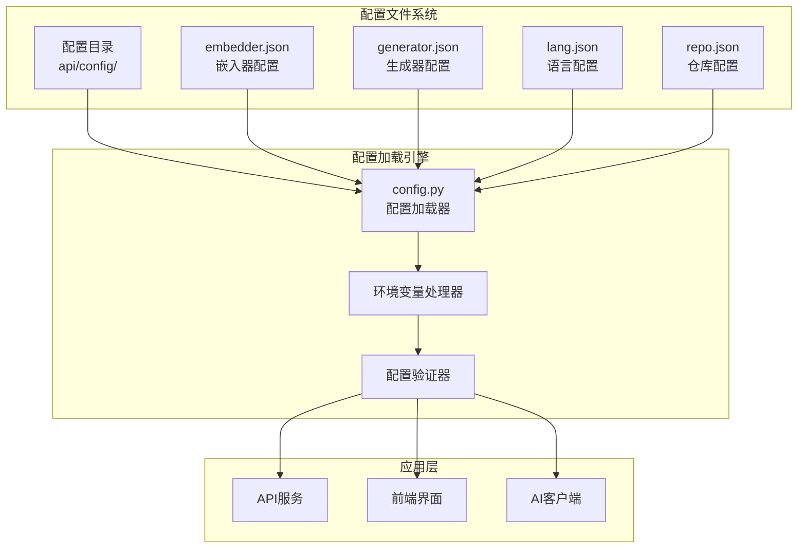
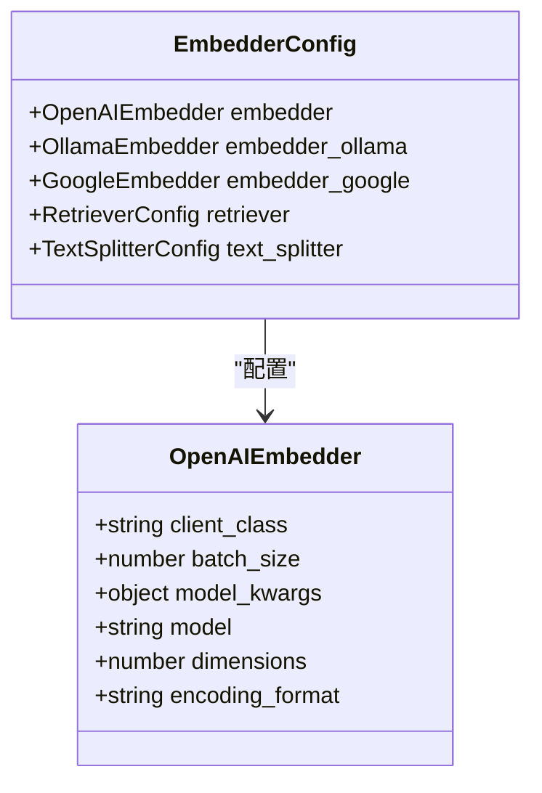
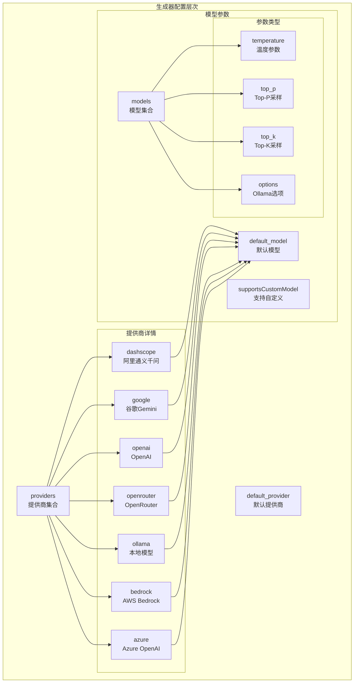
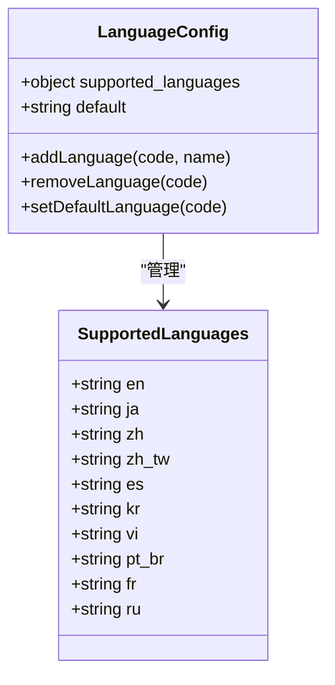
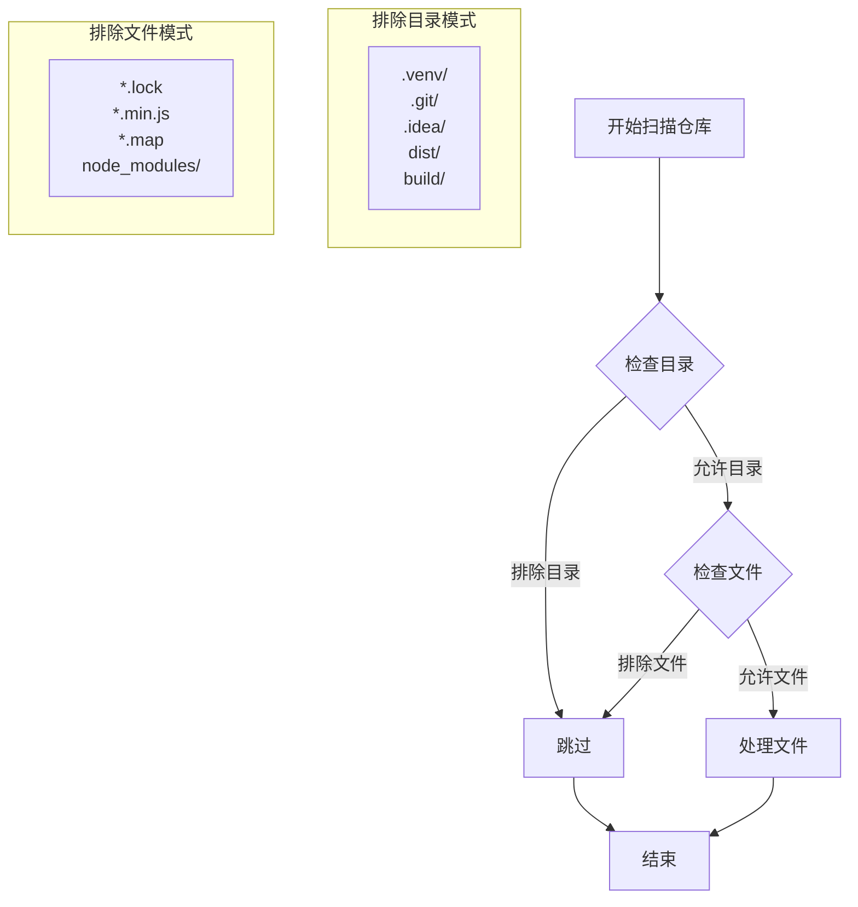
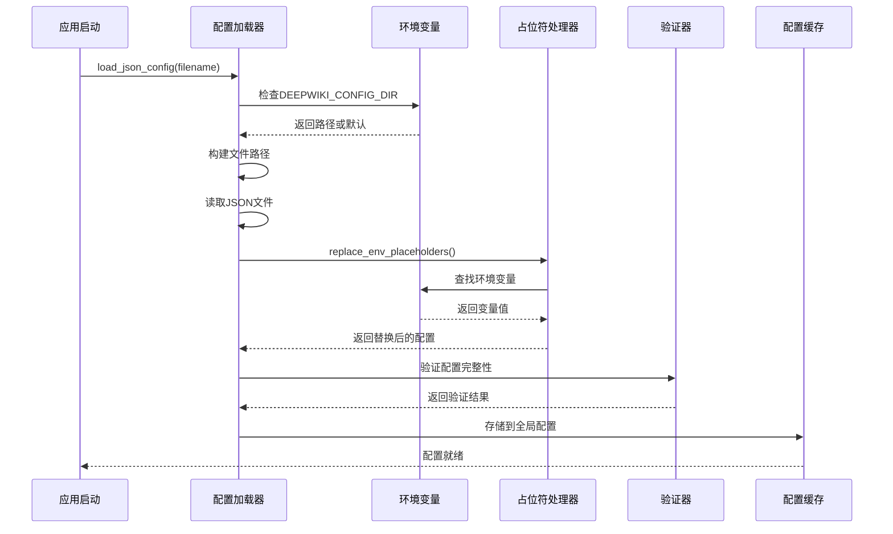
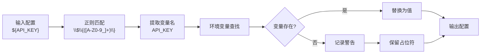

# 配置文件详解

<cite>
**本文档中引用的文件**
- [embedder.json](file://api/config/embedder.json)
- [generator.json](file://api/config/generator.json)
- [lang.json](file://api/config/lang.json)
- [repo.json](file://api/config/repo.json)
- [config.py](file://api/config.py)
- [openai_client.py](file://api/openai_client.py)
- [google_embedder_client.py](file://api/google_embedder_client.py)
- [main.py](file://api/main.py)
- [ConfigurationModal.tsx](file://src/components/ConfigurationModal.tsx)
- [ModelSelectionModal.tsx](file://src/components/ModelSelectionModal.tsx)
</cite>

## 目录
1. [简介](#简介)
2. [项目配置架构](#项目配置架构)
3. [嵌入器配置文件详解](#嵌入器配置文件详解)
4. [生成器配置文件详解](#生成器配置文件详解)
5. [语言配置文件详解](#语言配置文件详解)
6. [仓库配置文件详解](#仓库配置文件详解)
7. [配置加载机制](#配置加载机制)
8. [环境变量占位符系统](#环境变量占位符系统)
9. [配置文件使用示例](#配置文件使用示例)
10. [故障排除指南](#故障排除指南)
11. [总结](#总结)

## 简介

deepwiki-open是一个基于AI的代码知识库生成系统，其核心功能依赖于四个关键的JSON配置文件来定义系统的各种行为参数。这些配置文件涵盖了嵌入模型、生成模型、语言支持和仓库分析范围等重要方面，为系统提供了灵活且可定制的配置能力。

本文档将深入解析这四个核心配置文件的结构、参数含义以及它们在系统中的具体作用，并结合实际使用场景提供配置示例和最佳实践建议。

## 项目配置架构

deepwiki-open采用模块化的配置架构，每个配置文件负责特定的功能领域：



**图表来源**
- [config.py](file://api/config.py#L96-L118)
- [embedder.json](file://api/config/embedder.json#L1-L34)
- [generator.json](file://api/config/generator.json#L1-L200)

**章节来源**
- [config.py](file://api/config.py#L1-L388)

## 嵌入器配置文件详解

### 配置文件结构概述

embedder.json文件定义了系统使用的嵌入模型配置，支持多种AI提供商的嵌入服务。该文件包含三个主要的嵌入器配置和相关参数设置。

### 核心配置参数

#### OpenAI嵌入器配置



**图表来源**
- [embedder.json](file://api/config/embedder.json#L2-L10)

#### Ollama嵌入器配置

Ollama配置支持本地部署的开源嵌入模型，特别适合隐私敏感或离线环境：

- **client_class**: 使用OllamaClient类
- **model_kwargs**: 包含模型名称"nomic-embed-text"
- **特点**: 支持自定义模型，适用于本地部署

#### Google嵌入器配置

Google配置利用Google的Gemini AI服务，提供高质量的语义嵌入：

- **client_class**: GoogleEmbedderClient
- **batch_size**: 100（批量处理大小）
- **model_kwargs**: 
  - model: "text-embedding-004"
  - task_type: "SEMANTIC_SIMILARITY"

### 文本分割配置

文本分割器负责将源代码文件分割成适合嵌入处理的块：

- **split_by**: "word"（按单词分割）
- **chunk_size**: 350（每个块的大小）
- **chunk_overlap**: 100（块之间的重叠部分）

### 配置应用场景

| 场景 | 推荐配置 | 说明 |
|------|----------|------|
| 生产环境 | OpenAI嵌入器 | 高质量但需要API密钥 |
| 本地开发 | Ollama嵌入器 | 离线可用，性能良好 |
| 隐私敏感 | Google嵌入器 | 谷歌服务，数据安全 |
| 快速原型 | 默认配置 | 开箱即用 |

**章节来源**
- [embedder.json](file://api/config/embedder.json#L1-L34)

## 生成器配置文件详解

### 提供商配置架构

generator.json是系统中最复杂的配置文件，定义了多个AI提供商的模型配置。该文件采用分层结构，支持默认提供商和自定义模型参数。



**图表来源**
- [generator.json](file://api/config/generator.json#L2-L198)

### 主要提供商配置

#### OpenAI配置

OpenAI提供最丰富的模型选择，支持最新的GPT系列模型：

- **default_model**: "gpt-5-nano"（轻量级模型）
- **temperature**: 大部分模型使用0.7的标准值
- **支持的模型**: gpt-5、gpt-4o、o1系列等

#### Google Gemini配置

Google的Gemini模型配置强调语义相似性任务：

- **default_model**: "gemini-2.5-flash"
- **temperature**: 1.0（较高创造性）
- **top_k**: 20（候选词数量）

#### Ollama本地配置

Ollama支持多种本地部署的开源模型：

- **default_model**: "qwen3:1.7b"（通义千问1.7B参数）
- **options**: 包含temperature、top_p、num_ctx等参数
- **num_ctx**: 上下文长度设置

### 模型参数详解

#### 温度参数（Temperature）

温度参数控制生成内容的随机性和创造性：

- **低值（0.3-0.7）**: 更加保守和一致
- **高值（0.7-1.0）**: 更加创造性和多样化

#### Top-P采样（Top-P）

Top-P采样在生成过程中动态调整候选词池：

- **常用值**: 0.8（平衡创造性和准确性）
- **影响**: 控制词汇选择的概率分布

#### Top-K采样（Top-K）

Top-K采样限制候选词的数量：

- **常用值**: 20-50
- **优势**: 计算效率更高

**章节来源**
- [generator.json](file://api/config/generator.json#L1-L200)

## 语言配置文件详解

### 语言支持体系

lang.json文件定义了系统支持的语言集合和默认语言设置，为多语言用户提供本地化体验。



**图表来源**
- [lang.json](file://api/config/lang.json#L2-L15)

### 支持的语言列表

| 语言代码 | 完整名称 | 用途 |
|----------|----------|------|
| en | English | 英语，默认语言 |
| ja | Japanese (日本語) | 日语支持 |
| zh | Mandarin Chinese (中文) | 简体中文 |
| zh-tw | Traditional Chinese (繁體中文) | 繁体中文 |
| es | Spanish (Español) | 西班牙语 |
| kr | Korean (한국어) | 韩语 |
| vi | Vietnamese (Tiếng Việt) | 越南语 |
| pt-br | Brazilian Portuguese (Português Brasileiro) | 巴西葡萄牙语 |
| fr | Français (French) | 法语 |
| ru | Русский (Russian) | 俄语 |

### 默认语言设置

系统使用英语作为默认语言，确保新用户能够无障碍使用：

- **default**: "en"（英语）
- **回退机制**: 当用户选择的语言不可用时自动回退到英语

### 本地化集成

语言配置与前端界面紧密集成，支持：

- 动态语言切换
- 国际化消息显示
- 本地化格式化

**章节来源**
- [lang.json](file://api/config/lang.json#L1-L16)

## 仓库配置文件详解

### 文件过滤系统

repo.json文件实现了智能的文件过滤机制，帮助系统专注于重要的代码文件，同时忽略构建产物和临时文件。



**图表来源**
- [repo.json](file://api/config/repo.json#L3-L124)

### 排除规则配置

#### 排除目录（excluded_dirs）

系统自动排除以下类型的目录：

- **虚拟环境**: .venv/, venv/, env/, virtualenv/
- **包管理器**: node_modules/, bower_components/, jspm_packages/
- **版本控制**: .git/, .svn/, .hg/, .bzr/
- **构建输出**: dist/, build/, out/, target/, bin/

#### 排除文件（excluded_files）

系统排除大量文件类型以提高处理效率：

- **锁定文件**: yarn.lock, pnpm-lock.yaml, requirements.txt等
- **编译文件**: *.min.js, *.min.css, *.map
- **系统文件**: .DS_Store, Thumbs.db, desktop.ini
- **配置文件**: .env*, *.cfg, *.ini
- **缓存文件**: __pycache__, .pytest_cache等

### 仓库限制配置

#### 最大文件大小限制

- **max_size_mb**: 50000MB（50GB）
- **目的**: 防止处理超大仓库导致系统资源耗尽
- **阈值**: 基于实际使用经验设定的合理上限

### 自定义过滤规则

开发者可以通过修改配置文件添加自定义过滤规则：

```json
{
  "file_filters": {
    "excluded_dirs": [
      "./custom/exclude/dir/"
    ],
    "excluded_files": [
      "*.customext"
    ]
  }
}
```

**章节来源**
- [repo.json](file://api/config/repo.json#L1-L129)

## 配置加载机制

### 加载流程架构

config.py文件实现了完整的配置加载和处理机制，支持环境变量注入和配置合并。



**图表来源**
- [config.py](file://api/config.py#L96-L118)

### 核心加载函数

#### load_json_config函数

这是配置加载的核心函数，负责：

1. **路径解析**: 支持自定义配置目录
2. **文件读取**: UTF-8编码的JSON文件
3. **错误处理**: 优雅处理文件不存在或格式错误
4. **日志记录**: 详细的加载过程跟踪

#### 配置合并策略

系统采用分层合并策略：

1. **生成器配置**: 设置默认提供商和模型客户端
2. **嵌入器配置**: 注册不同提供商的客户端类
3. **仓库配置**: 合并文件过滤和大小限制
4. **语言配置**: 更新支持的语言列表

### 错误处理机制

配置加载过程包含完善的错误处理：

- **文件不存在**: 返回空字典，使用默认配置
- **JSON解析错误**: 记录错误并返回空配置
- **环境变量缺失**: 记录警告但继续执行
- **配置格式错误**: 使用默认配置回退

**章节来源**
- [config.py](file://api/config.py#L96-L118)

## 环境变量占位符系统

### 占位符语法

系统支持`${ENV_VAR}`语法的环境变量占位符替换，为配置提供了动态注入能力。



**图表来源**
- [config.py](file://api/config.py#L66-L95)

### 占位符处理机制

#### 正则表达式匹配

系统使用精确的正则表达式匹配环境变量占位符：

- **模式**: `\$\{([A-Z0-9_]+)\}`
- **要求**: 变量名必须是大写字母、数字和下划线的组合
- **安全性**: 防止意外的字符串替换

#### 递归处理

占位符处理支持嵌套结构：

- **字典**: 递归处理所有值
- **列表**: 递归处理所有元素
- **字符串**: 直接替换匹配的占位符
- **其他类型**: 原样返回

#### 错误处理策略

当环境变量不存在时：

1. **记录警告**: 在日志中记录缺失的变量
2. **保持原样**: 将占位符字符串保留在最终配置中
3. **不影响运行**: 系统继续正常工作

### 实际应用场景

#### API密钥注入

```json
{
  "providers": {
    "openai": {
      "api_key": "${OPENAI_API_KEY}",
      "base_url": "${OPENAI_BASE_URL}"
    }
  }
}
```

#### 服务端点配置

```json
{
  "embedder": {
    "model_kwargs": {
      "api_endpoint": "${EMBEDDING_SERVICE_URL}"
    }
  }
}
```

#### 条件配置

```json
{
  "retriever": {
    "top_k": "${RETRIEVER_TOP_K:-20}"
  }
}
```

**章节来源**
- [config.py](file://api/config.py#L66-L95)

## 配置文件使用示例

### 切换AI提供商示例

#### 从OpenAI切换到Google

```json
{
  "default_provider": "google",
  "providers": {
    "google": {
      "default_model": "gemini-2.5-flash",
      "supportsCustomModel": true,
      "models": {
        "gemini-2.5-flash": {
          "temperature": 1.0,
          "top_p": 0.8,
          "top_k": 20
        }
      }
    }
  }
}
```

#### 添加自定义Ollama模型

```json
{
  "providers": {
    "ollama": {
      "default_model": "custom-model:7b",
      "supportsCustomModel": true,
      "models": {
        "custom-model:7b": {
          "options": {
            "temperature": 0.8,
            "top_p": 0.9,
            "num_ctx": 4096
          }
        }
      }
    }
  }
}
```

### 调整语言支持示例

#### 添加新的语言支持

```json
{
  "supported_languages": {
    "en": "English",
    "ja": "Japanese (日本語)",
    "zh": "Mandarin Chinese (中文)",
    "de": "German (Deutsch)"
  },
  "default": "en"
}
```

#### 移除不常用语言

```json
{
  "supported_languages": {
    "en": "English",
    "ja": "Japanese (日本語)",
    "zh": "Mandarin Chinese (中文)"
  },
  "default": "en"
}
```

### 定制仓库分析范围示例

#### 扩展文件过滤规则

```json
{
  "file_filters": {
    "excluded_dirs": [
      "./.venv/",
      "./node_modules/",
      "./custom/build/"
    ],
    "excluded_files": [
      "yarn.lock",
      "package-lock.json",
      "*.custom-ext"
    ]
  },
  "repository": {
    "max_size_mb": 100000
  }
}
```

#### 限制分析范围

```json
{
  "file_filters": {
    "included_dirs": [
      "./src/",
      "./lib/"
    ],
    "excluded_dirs": [
      "./test/",
      "./docs/"
    ]
  }
}
```

### 环境变量配置示例

#### 开发环境配置

```bash
# .env文件内容
DEEPWIKI_CONFIG_DIR=./config/dev/
OPENAI_API_KEY=sk-dev-your-key-here
GOOGLE_API_KEY=your-google-key
DEEPWIKI_EMBEDDER_TYPE=openai
```

#### 生产环境配置

```bash
# .env文件内容
DEEPWIKI_CONFIG_DIR=/etc/deepwiki/
OPENAI_API_KEY=${OPENAI_API_KEY}
GOOGLE_API_KEY=${GOOGLE_API_KEY}
AWS_ACCESS_KEY_ID=${AWS_ACCESS_KEY_ID}
AWS_SECRET_ACCESS_KEY=${AWS_SECRET_ACCESS_KEY}
```

## 故障排除指南

### 常见配置问题

#### 配置文件加载失败

**症状**: 系统使用默认配置而非自定义配置

**排查步骤**:
1. 检查配置文件路径是否正确
2. 验证JSON语法是否正确
3. 确认文件权限设置
4. 查看日志中的加载信息

**解决方案**:
```python
# 检查配置加载状态
from api.config import configs
print("配置加载状态:", configs)
```

#### 环境变量未生效

**症状**: 占位符仍然保留原始字符串

**排查步骤**:
1. 确认环境变量已正确设置
2. 检查变量名拼写是否正确
3. 验证变量名符合命名规范

**解决方案**:
```bash
# 设置环境变量
export OPENAI_API_KEY="your-key-here"
echo $OPENAI_API_KEY  # 验证设置
```

#### 模型配置错误

**症状**: 无法找到指定的模型或提供商

**排查步骤**:
1. 检查提供商名称拼写
2. 验证模型名称是否存在
3. 确认API密钥配置正确

**解决方案**:
```json
{
  "default_provider": "google",
  "providers": {
    "google": {
      "default_model": "gemini-2.5-flash",  // 确保模型存在
      "supportsCustomModel": true
    }
  }
}
```

### 性能优化建议

#### 嵌入器优化

1. **选择合适的批处理大小**: 根据内存容量调整batch_size
2. **考虑模型复杂度**: 平衡质量和性能需求
3. **监控API调用频率**: 避免超出配额限制

#### 仓库分析优化

1. **合理设置文件过滤**: 减少不必要的文件处理
2. **调整最大文件大小**: 根据实际需求设置
3. **使用增量分析**: 对大型仓库实施分批处理

### 调试工具

#### 配置验证脚本

```python
#!/usr/bin/env python3
"""
配置验证工具
"""
import json
from pathlib import Path
from api.config import load_json_config, replace_env_placeholders

def validate_config(filename):
    """验证配置文件"""
    config = load_json_config(filename)
    if not config:
        print(f"❌ 配置文件 {filename} 加载失败")
        return False
    
    print(f"✅ 配置文件 {filename} 加载成功")
    print(f"   - 配置项数量: {len(config)}")
    return True

if __name__ == "__main__":
    configs = ["embedder.json", "generator.json", "lang.json", "repo.json"]
    for config_file in configs:
        validate_config(config_file)
```

#### 环境变量检查

```python
import os
from api.config import replace_env_placeholders

def check_environment_variables():
    """检查环境变量配置"""
    required_vars = ["OPENAI_API_KEY", "GOOGLE_API_KEY"]
    missing_vars = [var for var in required_vars if not os.environ.get(var)]
    
    if missing_vars:
        print(f"⚠️ 缺失必需的环境变量: {', '.join(missing_vars)}")
    else:
        print("✅ 所有必需的环境变量均已设置")
    
    # 测试占位符替换
    test_config = {"test": "${TEST_VAR}"}
    result = replace_env_placeholders(test_config)
    print(f"占位符测试: {result}")

check_environment_variables()
```

## 总结

deepwiki-open的四个核心配置文件构成了一个完整而灵活的配置系统，为AI驱动的知识库生成提供了强大的定制能力。

### 关键特性总结

1. **模块化设计**: 每个配置文件专注于特定功能领域
2. **多提供商支持**: 统一接口支持OpenAI、Google、Ollama等多种服务
3. **环境变量集成**: 灵活的占位符系统支持动态配置注入
4. **错误恢复机制**: 完善的默认配置和错误处理
5. **性能优化**: 智能的文件过滤和资源配置

### 最佳实践建议

1. **配置分离**: 将生产配置与开发配置分开管理
2. **版本控制**: 对配置文件进行版本控制，便于追踪变更
3. **环境隔离**: 使用不同的配置文件适应不同环境
4. **定期审查**: 定期检查和更新配置以适应新的需求
5. **文档维护**: 保持配置文档的及时更新

通过深入理解和正确使用这些配置文件，开发者可以充分发挥deepwiki-open系统的潜力，构建高质量的代码知识库解决方案。