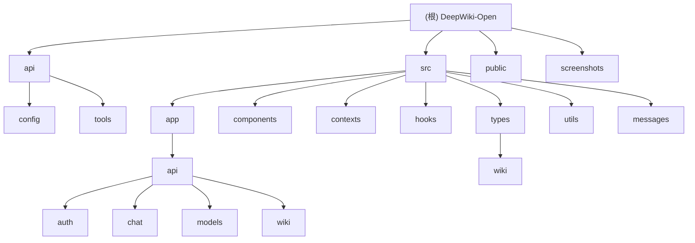

# DeepWiki-Open 项目文档

## 变更记录 (Changelog)

- 2025-11-19 13:38:12 - 初始化架构师分析，生成根级文档和模块索引

## 项目愿景

DeepWiki-Open 是一个智能的代码仓库文档生成工具，能够自动分析 GitHub、GitLab 和 BitBucket 仓库，生成美观的交互式 Wiki 文档，包含架构图、组件关系和数据流图。

## 架构总览

本项目采用前后端分离架构：
- **前端**: Next.js + React + TypeScript 实现的 Web 界面
- **后端**: FastAPI + Python 提供的 API 服务
- **AI 集成**: 支持多家 LLM 提供商（Google Gemini、OpenAI、OpenRouter、Azure、Ollama 等）
- **嵌入服务**: 支持 OpenAI、Google AI、Ollama 等多种嵌入模型

### 模块结构图



## 模块索引

| 模块路径 | 负责描述 | 入口文件 | 主要技术 | 配置文件 |
|---------|----------|----------|----------|----------|
| `api/` | 后端 API 服务 | `main.py` | FastAPI + Python | `pyproject.toml` |
| `src/` | 前端 Web 应用 | `app/page.tsx` | Next.js + React | `package.json` |
| `public/` | 静态资源 | - | - | - |
| `screenshots/` | 项目截图 | - | - | - |

### API 模块详情

| 子模块 | 文件数量 | 主要功能 |
|-------|----------|----------|
| `api/config/` | 5 | 模型配置、嵌入配置、仓库配置 |
| `api/tools/` | 1 | 嵌入工具 |

### 前端模块详情

| 子模块 | 文件数量 | 主要功能 |
|-------|----------|----------|
| `src/app/api/` | 6 | API 路由（认证、聊天、模型、Wiki） |
| `src/components/` | 12 | React 组件（问答、配置、Markdown、Mermaid 等） |
| `src/types/` | 3 | TypeScript 类型定义 |
| `src/utils/` | 3 | 工具函数 |
| `src/messages/` | 10 | 国际化消息文件 |

## 运行与开发

### 环境要求

- **后端**: Python 3.11+、Poetry
- **前端**: Node.js 18+、npm/yarn
- **AI 服务**: Google API Key、OpenAI API Key（必需）

### 启动命令

```bash
# 启动后端 API 服务
cd api
poetry install
python -m api.main

# 启动前端开发服务器
npm install
npm run dev
```

### Docker 部署

```bash
# 使用 Docker Compose
docker-compose up

# 或直接运行容器
docker run -p 8001:8001 -p 3000:3000 \
  -e GOOGLE_API_KEY=your_google_api_key \
  -e OPENAI_API_KEY=your_openai_api_key \
  ghcr.io/asyncfuncai/deepwiki-open:latest
```

## 测试策略

### 后端测试
- 使用 pytest 进行单元测试
- 配置文件：`pytest.ini`
- 测试覆盖范围：API 端点、数据处理、AI 客户端

### 前端测试
- ESLint 配置：`eslint.config.mjs`
- TypeScript 严格模式
- 组件测试（需要添加）

## 编码规范

### 后端规范
- Python 3.11+ 语法
- 使用 Poetry 进行依赖管理
- 遵循 PEP 8 代码风格
- 使用类型提示

### 前端规范
- TypeScript 严格模式
- React 函数组件 + Hooks
- ESLint 代码检查
- Tailwind CSS 样式
- 国际化支持（next-intl）

## AI 使用指引

### 支持的模型提供商

1. **Google Gemini** (默认)
   - 模型：`gemini-2.5-flash`, `gemini-2.5-pro`, `gemini-2.5-flash-lite`
   - API Key：`GOOGLE_API_KEY`

2. **OpenAI**
   - 模型：`gpt-5-nano`, `gpt-4o`, `o1` 等
   - API Key：`OPENAI_API_KEY`

3. **OpenRouter**
   - 模型：多厂商模型访问
   - API Key：`OPENROUTER_API_KEY`

4. **Azure OpenAI**
   - API Key + Endpoint + Version
   - 模型：`gpt-4o`, `gpt-4` 等

5. **Ollama** (本地)
   - 模型：`qwen3:1.7b`, `llama3:8b` 等
   - 默认地址：`http://localhost:11434`

### 嵌入模型

- **OpenAI**: `text-embedding-3-small`
- **Google AI**: `text-embedding-004`
- **Ollama**: `nomic-embed-text`

### 配置方式

1. **环境变量**: 设置 `.env` 文件
2. **配置文件**: `api/config/` 目录下的 JSON 文件
3. **运行时切换**: 前端界面提供模型选择

## 核心功能

### 1. Wiki 生成
- 自动克隆和分析代码仓库
- 生成架构图和文档
- 支持私有仓库访问

### 2. Ask 功能 (RAG)
- 基于仓库内容的智能问答
- 实时流式响应
- 支持深度研究模式

### 3. 多语言支持
- 支持 10 种语言界面
- 自动语言检测

### 4. 可视化图表
- Mermaid 图表渲染
- 支持缩放和交互
- 日本美学风格

## 项目结构概览

```
deepwiki-open/
├── api/                    # 后端 API 服务
│   ├── main.py            # API 入口点
│   ├── api.py             # FastAPI 路由定义
│   ├── config/            # 配置文件目录
│   ├── tools/             # 工具模块
│   └── pyproject.toml     # Python 依赖配置
├── src/                   # 前端 Next.js 应用
│   ├── app/               # Next.js App Router
│   ├── components/        # React 组件
│   ├── contexts/          # React Contexts
│   ├── types/             # TypeScript 类型
│   ├── utils/             # 工具函数
│   └── messages/          # 国际化消息
├── public/                # 静态资源
├── screenshots/           # 项目截图
├── package.json           # Node.js 依赖配置
├── docker-compose.yml     # Docker 编排配置
└── README.md             # 项目说明
```

## 技术栈总结

### 后端
- **框架**: FastAPI
- **语言**: Python 3.11+
- **AI 集成**: Google Generative AI, OpenAI, OpenRouter, Azure, Ollama
- **向量搜索**: FAISS
- **依赖管理**: Poetry

### 前端
- **框架**: Next.js 15.3.1
- **语言**: TypeScript
- **样式**: Tailwind CSS 4
- **图表**: Mermaid
- **国际化**: next-intl
- **主题**: next-themes

### 开发工具
- **代码检查**: ESLint
- **容器化**: Docker & Docker Compose
- **版本控制**: Git