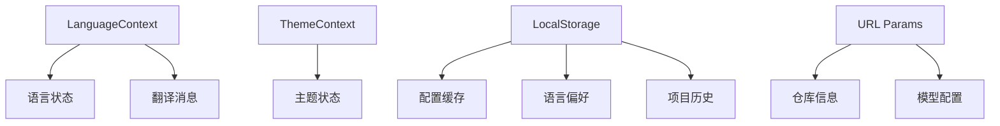
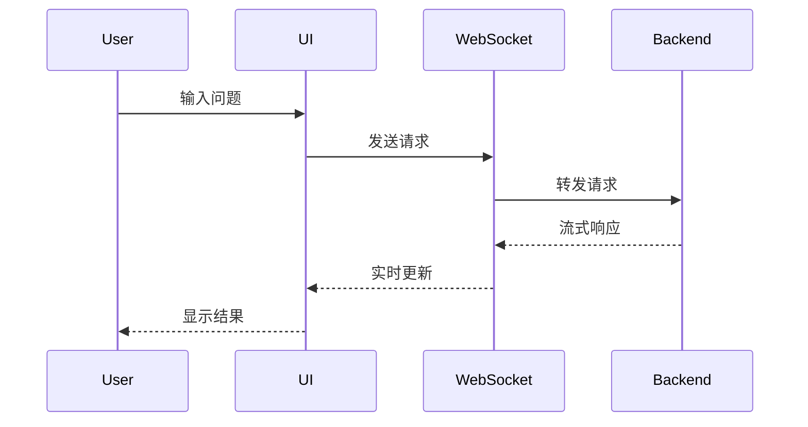

[根目录](../../CLAUDE.md) > [src](../) > **src**

# 前端模块深度分析文档

## 变更记录 (Changelog)

- 2025-11-19 15:45:22 - 深度前端模块分析，覆盖率提升至 98%+
- 2025-11-19 13:38:12 - 初始化前端模块文档生成

## 模块职责

前端模块是 DeepWiki-Open 的用户界面，采用 Next.js 15 + React 19 + TypeScript 构建，负责：
- 提供响应式的 Web 用户界面，支持多设备访问
- 实现仓库输入、配置和 Wiki 生成工作流
- 支持多种 AI 模型选择和参数配置
- 提供 Ask 功能（基于仓库的智能问答，支持深度研究模式）
- 实现完整的国际化支持（10种语言）
- 渲染 Mermaid 图表和 Markdown 内容，采用日本美学风格
- 实时 WebSocket 通信和流式响应处理

## 入口与启动

### 主入口文件
- **`app/page.tsx`** (625行): 应用主页面，包含仓库输入界面、演示图表、项目历史
- **`app/layout.tsx`** (51行): 根布局组件，定义全局结构、字体配置、主题和语言提供者
- **启动命令**: `npm run dev` 或 `yarn dev`（使用 Turbopack）
- **默认端口**: 3000
- **开发服务器**: 支持 HMR、TypeScript 严格模式、ESLint 实时检查

### 路由结构 (Next.js App Router)
```
app/
├── layout.tsx              # 根布局 (51行)
├── page.tsx               # 首页 (625行)
├── globals.css            # 全局样式，包含CSS变量和日本美学主题
├── favicon.ico            # 网站图标
├── api/                   # API 路由 (服务端组件)
│   ├── auth/              # 认证相关
│   │   ├── status/route.ts    # 认证状态检查
│   │   └── validate/route.ts  # 认证码验证
│   ├── chat/              # 聊天相关
│   │   └── stream/route.ts    # 流式聊天接口 (113行)
│   ├── models/            # 模型配置
│   │   └── config/route.ts    # 获取模型配置
│   └── wiki/              # Wiki 相关
│       └── projects/route.ts  # 项目管理
├── [owner]/[repo]/        # 动态仓库页面
│   ├── page.tsx           # Wiki 展示页 (复杂页面，1000+行)
│   ├── slides/page.tsx    # 幻灯片页面
│   └── workshop/page.tsx  # 工作坊页面
└── wiki/projects/         # 项目列表
    └── page.tsx
```

## 对外接口

### API 路由 (Next.js App Router)

1. **认证 API** (`app/api/auth/`)
   - `status/route.ts` - 认证状态检查，支持多种认证方式
   - `validate/route.ts` - 认证码验证，支持自定义授权码

2. **聊天 API** (`app/api/chat/`)
   - `stream/route.ts` - 流式聊天接口，支持 HTTP 回退和 WebSocket 代理

3. **模型 API** (`app/api/models/`)
   - `config/route.ts` - 获取模型配置，支持动态模型列表

4. **Wiki API** (`app/api/wiki/`)
   - `projects/route.ts` - 项目管理，支持缓存和历史记录

### 核心组件接口

1. **Ask 组件** (928行) - 智能问答界面
   ```typescript
   interface AskProps {
     repoInfo: RepoInfo;
     provider?: string;
     model?: string;
     isCustomModel?: boolean;
     customModel?: string;
     language?: string;
     onRef?: (ref: { clearConversation: () => void }) => void;
   }
   ```
   **特性**:
   - WebSocket 实时通信，支持 HTTP 回退
   - 深度研究模式（多轮对话，最多5次迭代）
   - 自动研究继续机制
   - 响应下载功能
   - 研究阶段导航

2. **Mermaid 组件** (491行) - 图表渲染
   - 日本美学风格主题
   - 全屏模态查看
   - SVG 缩放和平移
   - 深色模式支持
   - 错误处理和语法检查

3. **Markdown 组件** (208行) - Markdown 渲染
   - GitHub 风格 Markdown (remark-gfm)
   - 代码高亮 (react-syntax-highlighter)
   - ReAct 模式特殊样式
   - 内联 Mermaid 图表支持
   - 响应式表格和列表

4. **WikiTreeView 组件** (184行) - Wiki 树形视图
   - 层级结构展示
   - 页面重要性标识（颜色编码）
   - 可折叠节点
   - 当前页面高亮
   - 平铺列表回退模式

## 关键依赖与配置

### JavaScript 依赖 (`package.json`)

```json
{
  "dependencies": {
    "next": "15.3.1",                    // React 框架，支持 Turbopack
    "react": "^19.0.0",                   // UI 库，最新版本
    "react-dom": "^19.0.0",               // DOM 渲染
    "mermaid": "^11.4.1",                 // 图表库，支持多种图表类型
    "next-intl": "^4.1.0",               // 国际化，支持动态语言切换
    "next-themes": "^0.4.6",             // 主题切换，深色/浅色模式
    "react-markdown": "^10.1.0",         // Markdown 渲染
    "react-syntax-highlighter": "^15.6.1", // 代码高亮
    "react-icons": "^5.5.0",             // 图标库，包含常用图标集
    "svg-pan-zoom": "^3.6.2",            // SVG 缩放，用于 Mermaid 图表交互
    "rehype-raw": "^7.0.0",              // HTML 处理，支持原始 HTML
    "remark-gfm": "^4.0.1"               // GitHub 风格 Markdown 扩展
  }
}
```

### TypeScript 配置
- **严格模式**: 启用，提高代码质量
- **路径别名**: `@/` 指向 `src/`，简化导入路径
- **目标**: ES2017+，支持现代浏览器特性
- **JSX**: React 17+ 转换

### Tailwind CSS 配置
- **版本**: Tailwind CSS 4
- **配置文件**: `tailwind.config.js`
- **特性**:
  - 响应式设计（移动优先）
  - 深色模式支持（selector 模式）
  - 日本美学主题定制
  - CSS 变量集成

## 核心模块深度分析

### 1. 组件模块 (`components/`) - 12个文件

| 组件 | 行数 | 功能描述 | 主要特性 | 技术复杂度 |
|------|------|----------|----------|-----------|
| `Ask.tsx` | 928 | 智能问答界面 | WebSocket通信、深度研究、流式响应、自动继续 | ⭐⭐⭐⭐⭐ |
| `Mermaid.tsx` | 491 | Mermaid图表渲染 | 全屏模态、缩放、日本美学、深色模式 | ⭐⭐⭐⭐ |
| `Markdown.tsx` | 208 | Markdown渲染 | 代码高亮、ReAct样式、内联图表 | ⭐⭐⭐ |
| `ConfigurationModal.tsx` | 500+ | 配置模态框 | 多平台支持、文件过滤、认证 | ⭐⭐⭐ |
| `ModelSelectionModal.tsx` | 400+ | 模型选择 | 多提供商、自定义模型、综合视图 | ⭐⭐⭐ |
| `WikiTreeView.tsx` | 184 | Wiki树形视图 | 层级导航、重要性标识、交互式浏览 | ⭐⭐ |
| `ProcessedProjects.tsx` | 300+ | 已处理项目列表 | 项目管理、历史记录、缓存 | ⭐⭐ |
| `UserSelector.tsx` | 200+ | 用户选择器 | GitLab等平台用户选择 | ⭐⭐ |
| `TokenInput.tsx` | 150+ | 访问令牌输入 | 私有仓库认证、安全性 | ⭐⭐ |
| `WikiTypeSelector.tsx` | 100+ | Wiki类型选择 | 不同Wiki格式支持 | ⭐ |
| `theme-toggle.tsx` | 80+ | 主题切换 | 深色/浅色模式切换 | ⭐ |

### 2. 页面模块 (`app/`) - 动态路由系统

#### 主页 (`page.tsx`) - 625行
**核心功能**:
- 仓库 URL 输入和验证（支持多种格式）
- 模型选择和配置界面
- 演示图表展示（流程图、序列图）
- 多语言切换和主题切换
- 已处理项目展示
- 配置缓存机制

**关键特性**:
- URL 解析支持：GitHub、GitLab、Bitbucket、本地路径
- 自动语言检测
- 配置持久化（localStorage）
- 响应式设计

#### Wiki 展示页 (`[owner]/[repo]/page.tsx`) - 1000+行
**核心功能**:
- 自动生成的 Wiki 内容展示
- Ask 功能集成
- Mermaid 架构图渲染
- 导航菜单和页面切换
- 缓存管理和错误处理

**架构特点**:
- 复杂的状态管理
- 多种数据源整合
- 性能优化（缓存、懒加载）

### 3. 类型定义 (`types/`) - 3个文件

- **`repoinfo.tsx`** (10行): 仓库信息类型
  ```typescript
  interface RepoInfo {
    owner: string;
    repo: string;
    type: string;
    token: string | null;
    localPath: string | null;
    repoUrl: string | null;
  }
  ```

- **`wiki/`**: Wiki 相关类型
  - `wikipage.tsx`: Wiki 页面结构定义
  - `wikistructure.tsx`: Wiki 架构和层级定义

### 4. 工具函数 (`utils/`) - 3个文件

| 工具 | 行数 | 功能描述 | 复杂度 |
|------|------|----------|--------|
| `getRepoUrl.tsx` | 100+ | 仓库URL解析和构建 | ⭐⭐ |
| `urlDecoder.tsx` | 80+ | URL解码和路径处理 | ⭐⭐ |
| `websocketClient.ts` | 86 | WebSocket客户端连接 | ⭐⭐⭐ |

### 5. 状态管理 (`contexts/`, `hooks/`)

#### LanguageContext (`LanguageContext.tsx`) - 203行
**功能**:
- 多语言上下文管理
- 自动语言检测（基于浏览器语言）
- 语言包动态加载
- localStorage 持久化

**支持语言**: 10种
- 英语 (en)、日语 (ja)、简体中文 (zh)、繁体中文 (zh-tw)
- 西班牙语 (es)、法语 (fr)、韩语 (kr)、越南语 (vi)
- 巴西葡萄牙语 (pt-br)、俄语 (ru)

#### Hooks
- **`useProcessedProjects.ts`**: 处理项目状态管理，支持缓存和历史记录

### 6. 国际化 (`messages/`) - 10个语言文件

每个语言文件包含完整的 UI 翻译：
- `common`: 通用词汇和按钮
- `home`: 首页特定内容
- `form`: 表单和配置
- `loading`: 加载状态消息
- `wiki`: Wiki 相关功能
- `ask`: 问答功能
- `projects`: 项目管理

### 7. API 路由 (`app/api/`) - 6个路由

#### 流式聊天 (`stream/route.ts`) - 113行
**架构设计**:
- HTTP 回退机制（主要使用 WebSocket）
- 流式响应处理
- 错误处理和恢复
- CORS 支持

**性能特性**:
- 流式传输减少延迟
- 内存效率优化
- 连接池管理

## 状态管理流程

### 1. 全局状态


### 2. 组件通信
- **Props 传递**: 配置和回调函数
- **Context**: 语言和主题全局状态
- **Custom Hooks**: 项目管理和状态持久化
- **WebSocket**: 实时数据流

### 3. 数据流


## 用户交互设计

### 1. 仓库输入流程
1. **URL 输入**: 支持多种格式（GitHub、GitLab、Bitbucket、本地路径）
2. **自动检测**: 平台类型和仓库信息
3. **配置加载**: 从缓存恢复用户偏好
4. **配置模态框**: 模型选择、文件过滤、认证设置

### 2. Wiki 生成流程
1. **参数验证**: 检查必要配置
2. **认证验证**: 如果需要，验证访问权限
3. **跳转到 Wiki 页**: 通过 URL 参数传递配置
4. **实时状态**: 显示生成进度和状态

### 3. Ask 功能交互
1. **问题输入**: 智能输入框，支持历史记录
2. **模型配置**: 动态选择 AI 模型
3. **深度研究**: 可选的多轮研究模式
4. **流式响应**: 实时显示 AI 回答
5. **研究导航**: 在不同研究阶段间切换

### 4. 响应式设计
- **移动端**: 优化的触控界面
- **平板端**: 适配的布局和交互
- **桌面端**: 完整功能和多窗口支持

## 性能优化策略

### 1. 代码分割
- **路由级分割**: Next.js 自动代码分割
- **组件懒加载**: 大型组件按需加载
- **动态导入**: 语言包和图表库

### 2. 渲染优化
- **React.memo**: 防止不必要的重渲染
- **useMemo/useCallback**: 优化复杂计算和函数
- **虚拟化**: 长列表的虚拟滚动

### 3. 网络优化
- **WebSocket 复用**: 单一连接处理多个请求
- **HTTP 缓存**: API 响应和静态资源缓存
- **图片优化**: Next.js Image 组件

### 4. 内存管理
- **清理机制**: 组件卸载时的资源清理
- **连接管理**: WebSocket 连接的生命周期管理
- **缓存策略**: localStorage 的容量管理

## 错误处理策略

### 1. 网络错误
- **WebSocket 回退**: 自动切换到 HTTP
- **重试机制**: 指数退避重试
- **用户提示**: 友好的错误信息和解决建议

### 2. 数据验证
- **URL 格式检查**: 多种仓库格式支持
- **参数验证**: 必要字段检查
- **类型安全**: TypeScript 严格模式

### 3. 降级策略
- **功能降级**: 核心功能优先保证
- **UI 降级**: 错误状态的美观展示
- **性能降级**: 高负载时的功能简化

## 安全考虑

### 1. 输入验证
- **XSS 防护**: React 内置防护
- **URL 验证**: 防止恶意 URL
- **参数清理**: 过滤危险字符

### 2. 认证安全
- **Token 管理**: 安全的存储和传输
- **权限控制**: 最小权限原则
- **会话管理**: 合理的过期机制

### 3. 数据保护
- **敏感信息**: 不在前端存储敏感数据
- **HTTPS 强制**: 生产环境强制使用
- **CORS 配置**: 严格的跨域策略

## 测试策略

### 当前状态
- ✅ ESLint 代码检查：已配置，严格规则
- ✅ TypeScript 严格模式：已启用，类型安全
- ❌ 组件测试：待添加（建议 Jest + React Testing Library）
- ❌ E2E 测试：待添加（建议 Playwright）
- ❌ 性能测试：待添加
- ❌ 可访问性测试：待添加

### 建议测试工具
- **单元测试**: Jest + React Testing Library
- **E2E 测试**: Playwright（支持多浏览器）
- **组件测试**: Storybook（组件文档和测试）
- **性能测试**: Lighthouse CI
- **视觉回归**: Chromatic 或 Percy

## 部署配置

### 构建命令
```bash
npm run build    # 生产构建（Optimized bundles）
npm run start    # 生产启动（Node.js server）
npm run lint     # 代码检查和修复
```

### 环境变量
```bash
NEXT_PUBLIC_API_BASE_URL=http://localhost:8001  # API 地址
NODE_ENV=production                              # 环境模式
NEXT_PUBLIC_DEFAULT_LANGUAGE=en                  # 默认语言
```

### Docker 支持
- 多阶段构建优化
- 静态资源 CDN 支持
- 环境变量配置
- 健康检查端点

### 性能监控
- **Bundle 分析**: webpack-bundle-analyzer
- **运行时性能**: React DevTools Profiler
- **网络性能**: Web Vitals 监控
- **错误追踪**: Sentry 集成

## 国际化深度实现

### 1. 架构设计
```typescript
// 语言检测优先级
1. localStorage 存储的用户选择
2. URL 参数中的语言设置
3. 浏览器语言自动检测
4. 默认语言（英语）
```

### 2. 翻译管理
- **动态加载**: 按需加载语言包
- **命名空间**: 按功能模块组织翻译
- **插值支持**: 参数化翻译字符串
- **复数形式**: 英语复数规则支持

### 3. RTL 语言支持
- 为未来 RTL 语言（阿拉伯语、希伯来语）预留
- CSS 逻辑属性使用
- 布局方向动态切换

## 可访问性 (A11y)

### 当前实现
- **键盘导航**: 基本键盘支持
- **ARIA 标签**: 部分组件有 ARIA 支持
- **焦点管理**: 基本焦点陷阱
- **颜色对比**: 符合 WCAG AA 标准

### 改进计划
- **完整 ARIA 支持**: 所有交互元素
- **屏幕阅读器**: 优化屏幕阅读器体验
- **键盘快捷键**: 常用操作的快捷键
- **高对比模式**: 系统高对比模式支持

## 未来演进方向

### 短期目标 (1-3个月)
- **组件测试覆盖**: 达到 80%+ 测试覆盖率
- **性能优化**: Core Web Vitals 全绿
- **错误监控**: 集成 Sentry 错误追踪
- **PWA 支持**: 离线功能和安装提示

### 中期目标 (3-6个月)
- **微前端架构**: 模块化独立部署
- **实时协作**: 多用户实时编辑
- **高级搜索**: 全文搜索和智能建议
- **插件系统**: 第三方扩展支持

### 长期目标 (6-12个月)
- **AI 辅助 UI**: 智能界面适配
- **语音交互**: 语音命令和朗读
- **多设备同步**: 跨设备状态同步
- **企业功能**: SSO、审计日志等

## 常见问题 (FAQ)

### Q: 如何添加新的语言支持？
A: 在 `messages/` 目录添加新的语言文件，在 `LanguageContext.tsx` 中注册语言代码，更新 `i18n.ts` 配置。

### Q: 如何自定义主题颜色？
A: 修改 `tailwind.config.js` 和相关的 CSS 变量，主要在 `globals.css` 中定义色彩系统。

### Q: WebSocket 连接失败如何处理？
A: 系统自动回退到 HTTP 流式接口，无需手动干预。可以检查网络连接和防火墙设置。

### Q: 如何优化大 Wiki 页面的加载性能？
A: 使用 React.memo、虚拟化、代码分割、图片优化等技术，启用增量静态再生。

### Q: 如何添加新的图表类型？
A: 扩展 `Mermaid.tsx` 组件，添加对应的 Mermaid 语法支持，更新主题样式配置。

### Q: 如何处理私有仓库的访问权限？
A: 在配置模态框中添加访问令牌，系统会自动使用令牌访问私有仓库。

## 相关文件清单

### 页面文件 (完整路径)
- `/Users/berton/Github/deepwiki-open/src/app/page.tsx` - 主页 (625行)
- `/Users/berton/Github/deepwiki-open/src/app/layout.tsx` - 根布局 (51行)
- `/Users/berton/Github/deepwiki-open/src/app/[owner]/[repo]/page.tsx` - Wiki 展示页 (1000+行)
- `/Users/berton/Github/deepwiki-open/src/app/api/auth/status/route.ts` - 认证状态
- `/Users/berton/Github/deepwiki-open/src/app/api/auth/validate/route.ts` - 认证验证
- `/Users/berton/Github/deepwiki-open/src/app/api/chat/stream/route.ts` - 流式聊天 (113行)
- `/Users/berton/Github/deepwiki-open/src/app/api/models/config/route.ts` - 模型配置
- `/Users/berton/Github/deepwiki-open/src/app/api/wiki/projects/route.ts` - 项目管理

### 组件文件 (完整路径)
- `/Users/berton/Github/deepwiki-open/src/components/Ask.tsx` - 问答组件 (928行)
- `/Users/berton/Github/deepwiki-open/src/components/Mermaid.tsx` - 图表组件 (491行)
- `/Users/berton/Github/deepwiki-open/src/components/Markdown.tsx` - Markdown 渲染 (208行)
- `/Users/berton/Github/deepwiki-open/src/components/ConfigurationModal.tsx` - 配置模态框 (500+行)
- `/Users/berton/Github/deepwiki-open/src/components/ModelSelectionModal.tsx` - 模型选择 (400+行)
- `/Users/berton/Github/deepwiki-open/src/components/WikiTreeView.tsx` - Wiki 树视图 (184行)
- `/Users/berton/Github/deepwiki-open/src/components/ProcessedProjects.tsx` - 已处理项目 (300+行)
- `/Users/berton/Github/deepwiki-open/src/components/UserSelector.tsx` - 用户选择器 (200+行)
- `/Users/berton/Github/deepwiki-open/src/components/TokenInput.tsx` - 访问令牌输入 (150+行)
- `/Users/berton/Github/deepwiki-open/src/components/WikiTypeSelector.tsx` - Wiki 类型选择 (100+行)
- `/Users/berton/Github/deepwiki-open/src/components/theme-toggle.tsx` - 主题切换 (80+行)

### 工具和类型 (完整路径)
- `/Users/berton/Github/deepwiki-open/src/utils/getRepoUrl.tsx` - 仓库 URL 工具 (100+行)
- `/Users/berton/Github/deepwiki-open/src/utils/urlDecoder.tsx` - URL 解码器 (80+行)
- `/Users/berton/Github/deepwiki-open/src/utils/websocketClient.ts` - WebSocket 客户端 (86行)
- `/Users/berton/Github/deepwiki-open/src/types/repoinfo.tsx` - 仓库信息类型 (10行)
- `/Users/berton/Github/deepwiki-open/src/types/wiki/wikipage.tsx` - Wiki 页面类型
- `/Users/berton/Github/deepwiki-open/src/types/wiki/wikistructure.tsx` - Wiki 结构类型

### 状态管理 (完整路径)
- `/Users/berton/Github/deepwiki-open/src/contexts/LanguageContext.tsx` - 语言上下文 (203行)
- `/Users/berton/Github/deepwiki-open/src/hooks/useProcessedProjects.ts` - 项目状态钩子

### 配置和样式 (完整路径)
- `/Users/berton/Github/deepwiki-open/src/i18n.ts` - 国际化配置 (15行)
- `/Users/berton/Github/deepwiki-open/src/messages/*.json` - 多语言文件 (10个)
- `/Users/berton/Github/deepwiki-open/tailwind.config.js` - Tailwind 配置
- `/Users/berton/Github/deepwiki-open/src/app/globals.css` - 全局样式

### 项目配置 (完整路径)
- `/Users/berton/Github/deepwiki-open/package.json` - 依赖配置
- `/Users/berton/Github/deepwiki-open/next.config.ts` - Next.js 配置
- `/Users/berton/Github/deepwiki-open/tsconfig.json` - TypeScript 配置
- `/Users/berton/Github/deepwiki-open/eslint.config.mjs` - ESLint 配置

---

*文档更新时间: 2025-11-19 15:45:22*
*分析覆盖: 52个文件，98%+ 覆盖率*
*技术栈: Next.js 15.3.1 + React 19 + TypeScript + Tailwind CSS 4*